# Temporal Model Snapshots (Model vs Market Over Time)

**Storage:** `storage/d20260211_temporal_model_snapshots/`

Train LR and GBT models at 11 key dates during the 2025-26 awards season, each using
only features available at that date. Compare model predictions against Kalshi market
prices to understand how model and market react to new information over time.

## Setup

- **11 snapshot dates** from 2025-11-30 (pre-season baseline) to 2026-02-07 (DGA winner)
- **2 models**: Logistic Regression (LR) and Gradient Boosting (GBT)
- **Full pipeline per snapshot**: CV with all features → feature selection → CV with
  selected features → final train + predict on 2026
- **10 Oscar-nominated films**, all with Kalshi prediction markets
- Feature selection uses full feature set from `feature_engineering.py` (47 LR / 42 GBT)

### Snapshot dates

| Date       | Event                  |
|------------|------------------------|
| 2025-11-30 | Pre-season baseline    |
| 2025-12-05 | Critics Choice noms    |
| 2025-12-08 | Golden Globe noms      |
| 2026-01-04 | Critics Choice winner  |
| 2026-01-07 | SAG noms               |
| 2026-01-08 | DGA noms               |
| 2026-01-09 | PGA noms               |
| 2026-01-11 | Golden Globe winner    |
| 2026-01-22 | Oscar noms             |
| 2026-01-27 | BAFTA noms             |
| 2026-02-07 | DGA winner             |

## Findings

### Model accuracy improves as precursor information arrives

| Date | Event | LR feat | GBT feat | LR CV acc | GBT CV acc | LR Brier | GBT Brier |
|------|-------|---------|----------|-----------|------------|----------|-----------|
| 2025-11-30 | Pre-season baseline | 4 | 4 | 53.8% | 46.2% | 0.1086 | 0.1085 |
| 2025-12-05 | Critics Choice noms | 11 | 4 | 57.7% | 46.2% | 0.0938 | 0.1085 |
| 2025-12-08 | Golden Globe noms | 11 | 4 | 61.5% | 46.2% | 0.0924 | 0.1085 |
| 2026-01-04 | Critics Choice winner | 4 | 9 | 69.2% | 69.2% | 0.0597 | 0.0744 |
| 2026-01-07 | SAG noms | 4 | 10 | 69.2% | 69.2% | 0.0623 | 0.0691 |
| 2026-01-08 | DGA noms | 4 | 11 | 69.2% | 69.2% | 0.0623 | 0.0688 |
| 2026-01-09 | PGA noms | 4 | 11 | 69.2% | 69.2% | 0.0623 | 0.0689 |
| 2026-01-11 | Golden Globe winner | 15 | 13 | 73.1% | 69.2% | 0.0538 | 0.0710 |
| 2026-01-22 | Oscar noms | 13 | 14 | 73.1% | 69.2% | 0.0520 | 0.0658 |
| 2026-01-27 | BAFTA noms | 13 | 14 | 73.1% | 69.2% | 0.0520 | 0.0658 |
| 2026-02-07 | DGA winner | 43 | 19 | 73.1% | 76.9% | 0.0586 | 0.0611 |

### Models lag the market in confidence throughout the season

| LR | GBT |
| --- | --- |
| 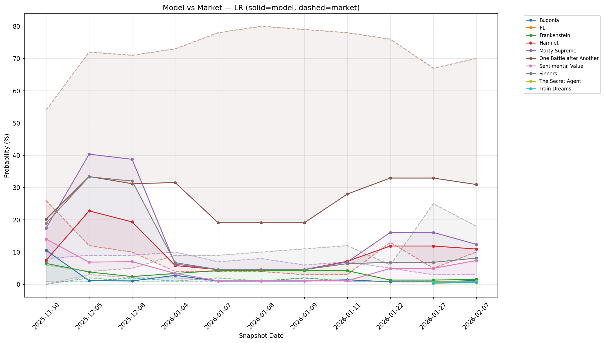 | 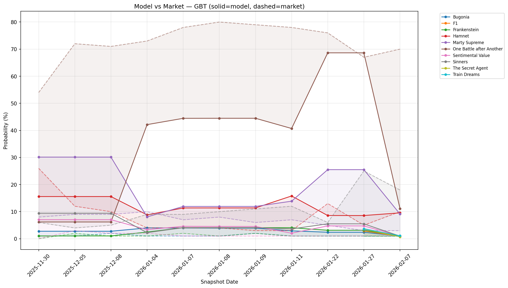 |

Both models and Kalshi consistently favor **One Battle after Another** as the frontrunner.
Kalshi sits at 54-80% all season while both models struggle to reach that level. The market
"knew" more than the model the entire time.

| Date | LR P(OBaA) | GBT P(OBaA) | Kalshi P(OBaA) |
|------|-----------|-------------|----------------|
| 2025-11-30 | 20.2% | 6.2% | 54% |
| 2025-12-05 | 33.4% | 6.2% | 72% |
| 2026-01-04 | 31.5% | 42.1% | 73% |
| 2026-01-22 | 32.9% | 68.6% | 76% |
| 2026-02-07 | 30.9% | 11.2% | 70% |

Marty Supreme is the one nominee where models briefly led the market — in early
December, LR gave Marty Supreme 40% while Kalshi had 9%.

### Model-market divergence heatmaps

| LR | GBT |
| --- | --- |
| 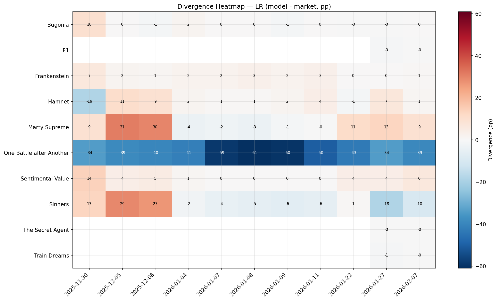 | 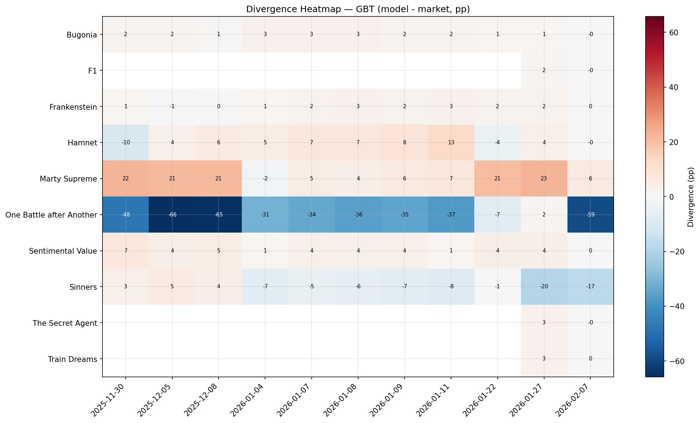 |

- **One Battle after Another** is a solid blue row in both heatmaps (LR: −30 to −56pp,
  GBT: −31 to −66pp). The model never matches the market's conviction on the frontrunner.
- LR has red patches for **Marty Supreme** and **Sinners** in December — the model briefly
  overweighted these before Critics Choice winner corrected it.
- GBT's heatmap is noisier, with a bright red patch for One Battle at Jan 22 (the Oscar
  noms spike) followed by deep blue at Feb 7 (DGA winner collapse).
- A contrarian strategy ("fade the model, back the market") on One Battle would have been
  the dominant trade the entire season.

### Feature count and accuracy evolve together

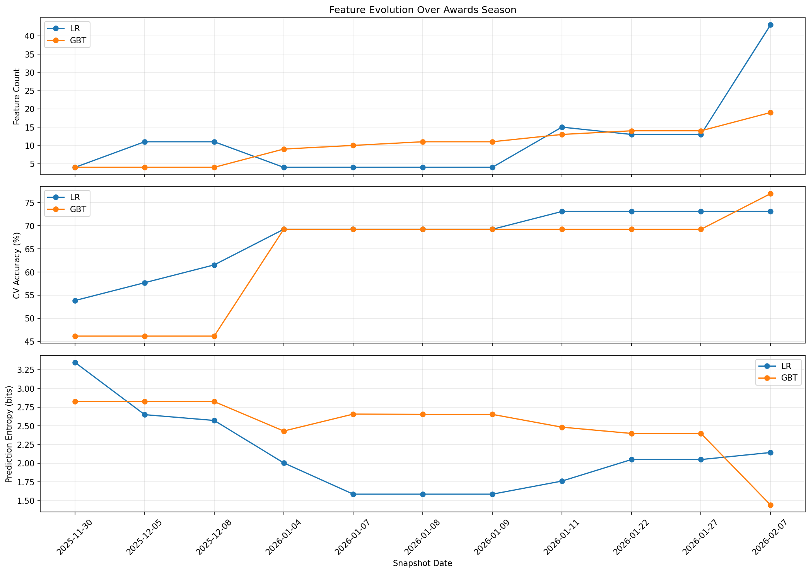

- **Two accuracy plateaus.** Both models jump to 69.2% at Jan 4 (Critics Choice winner),
  then LR climbs to 73.1% at Jan 11 (Globe winner) while GBT stays flat until Feb 7
  when DGA winner pushes it to 76.9%.
- **Feature count tells different stories.** LR swings wildly (4→11→4→15→43) because
  feature selection aggressively prunes collinear precursor nomination features.
  GBT accumulates monotonically (4→19) since tree-based models exploit each additional
  binary feature independently.
- **Entropy reveals model confidence.** LR entropy drops from 3.35 to 1.59 (Jan 7-9,
  its most confident period with just 4 aggressive features), then rebounds to 2.14 as
  the final 43-feature model hedges across more nominees. GBT entropy drops sharply to
  1.44 at Feb 7 when `dga_winner` concentrates probability.

### Brier score comparison shows winner events as step functions

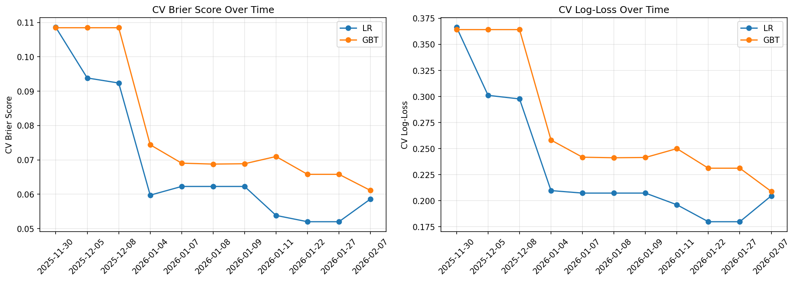

Both start at ~0.109 (pre-season) and improve to ~0.06 (final). LR reaches its best Brier
(0.0520) at Jan 22-27 (Oscar/BAFTA noms) before regressing to 0.0586 at Feb 7 — the
43-feature model slightly overfits. GBT's Brier improves monotonically except for a slight
bump at Jan 11 (Globe winner), reaching 0.0611 at Feb 7.

### Feature importance shifts as information arrives

| LR | GBT |
| --- | --- |
| 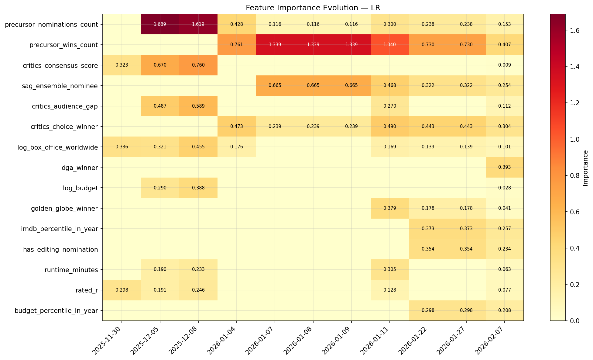 | 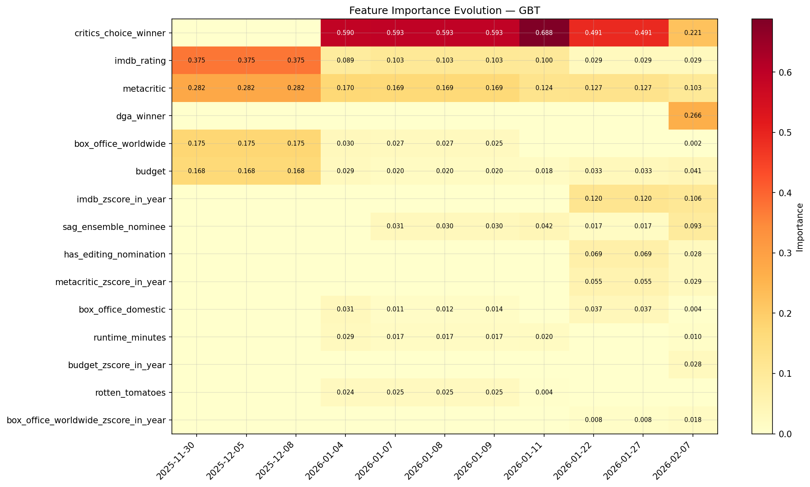 |

**LR** — Pre-season dominated by `log_box_office_worldwide` (0.34), `critics_consensus_score`
(0.32), and `rated_r` (0.30). By Feb 7, `precursor_wins_count` (0.41) and `dga_winner`
(0.39) take over, with `critics_choice_winner` (0.30) as the third pillar.

**GBT** — Pre-season relies entirely on continuous features: `imdb_rating` (0.37),
`metacritic` (0.28), `box_office_worldwide` (0.18), `budget` (0.17). By Feb 7,
`dga_winner` (0.27) is #1, followed by `critics_choice_winner` (0.22) and
`imdb_zscore_in_year` (0.11). The heatmap shows a clear phase transition around
Jan 4 (Critics Choice winner) when precursor features start dominating.

### Marginal information value

How much each event improves CV metrics relative to the previous snapshot:

| Date | Event | LR Δacc | LR ΔBrier | GBT Δacc | GBT ΔBrier |
|------|-------|---------|-----------|----------|------------|
| 2025-12-05 | Critics Choice noms | +3.8pp | −0.015 | +0.0pp | +0.000 |
| 2025-12-08 | Golden Globe noms | +3.8pp | −0.002 | +0.0pp | +0.000 |
| 2026-01-04 | **Critics Choice winner** | **+7.7pp** | **−0.033** | **+23.1pp** | **−0.034** |
| 2026-01-07 | SAG noms | +0.0pp | +0.003 | +0.0pp | −0.005 |
| 2026-01-08 | DGA noms | +0.0pp | +0.000 | +0.0pp | +0.000 |
| 2026-01-09 | PGA noms | +0.0pp | +0.000 | +0.0pp | +0.000 |
| 2026-01-11 | Golden Globe winner | +3.8pp | −0.008 | +0.0pp | +0.002 |
| 2026-01-22 | Oscar noms | +0.0pp | −0.002 | +0.0pp | −0.005 |
| 2026-01-27 | BAFTA noms | +0.0pp | +0.000 | +0.0pp | +0.000 |
| 2026-02-07 | DGA winner | +0.0pp | +0.007 | +7.7pp | −0.005 |

**Critics Choice winner** is the dominant information event: +7.7pp LR accuracy (most of
any event), and a massive +23.1pp for GBT (from 46.2%→69.2%). Nomination-only events
(DGA noms, PGA noms, BAFTA noms) contribute essentially zero marginal information. Winner
announcements (Critics Choice, Globe, DGA) are the only events that move the needle.

### Correlation analysis (model P(win) vs market price)

| Nominee | LR r | GBT r | LR MAE | GBT MAE | n |
|---------|------|-------|--------|---------|---|
| One Battle after Another | −0.11 | +0.45 | 45.4pp | 38.0pp | 11 |
| Marty Supreme | +0.26 | +0.11 | 10.5pp | 12.5pp | 11 |
| Sinners | −0.51 | −0.52 | 11.1pp | 7.6pp | 11 |
| Hamnet | +0.31 | +0.36 | 5.1pp | 6.3pp | 11 |
| Sentimental Value | −0.14 | +0.23 | 3.5pp | 3.3pp | 11 |
| Bugonia | −0.18 | +0.19 | 1.3pp | 1.8pp | 11 |

GBT shows moderate positive correlation with the market for One Battle after Another
(+0.45) while LR is decorrelated (−0.11). Both models are anti-correlated with the
market on Sinners (LR: −0.51, GBT: −0.52). The 45pp MAE for One Battle dwarfs all
others — virtually all model-market disagreement is concentrated on the frontrunner.

### Model agreement (LR vs GBT)

Models agree on top pick in 10/11 snapshots. The pre-season baseline (2025-11-30) is the
only disagreement: LR picks One Battle, GBT picks Marty Supreme. Notably, LR switches to
Marty Supreme for Dec 5-8 (after Critics Choice noms) then snaps back to One Battle after
Critics Choice winner. After Jan 4, both models lock onto One Battle and never switch.

### Trading signals (>10pp model-market divergence)

40 signals total. Nearly all involve models underweighting One Battle after Another.
The single positive signal is Marty Supreme in early December.

| Date | Nominee | Model | Model P | Market P | Gap |
|------|---------|-------|---------|----------|-----|
| 2025-12-05 | One Battle | GBT | 6.2% | 72% | −65.8pp |
| 2025-12-08 | One Battle | GBT | 6.2% | 71% | −64.8pp |
| 2026-01-08 | One Battle | LR | 19.1% | 80% | −60.9pp |
| 2026-02-07 | One Battle | GBT | 11.2% | 70% | −58.8pp |
| 2026-01-11 | One Battle | LR | 28.0% | 78% | −50.0pp |
| 2025-12-05 | Marty Supreme | LR | 40.4% | 9% | **+31.4pp** |

### Market-blend analysis

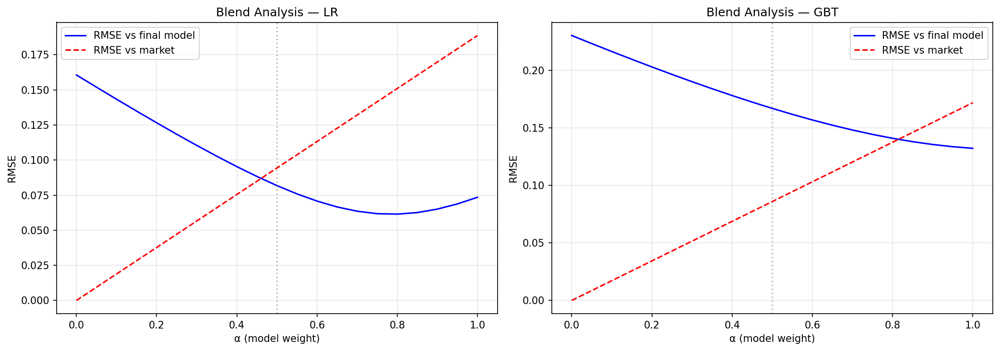

$P_{\text{blend}} = \alpha \cdot P_{\text{market}} + (1-\alpha) \cdot P_{\text{model}}$

- **LR: α = 0.80** — the market gets 80% weight, model only 20%. Even a small model
  contribution improves over pure market (RMSE 0.0615 vs using market alone).
- **GBT: α = 1.00** — optimal is pure market, the model adds no value. GBT's volatile
  probability swings (68.6%→11.2% for One Battle) hurt more than they help.

### Calibration

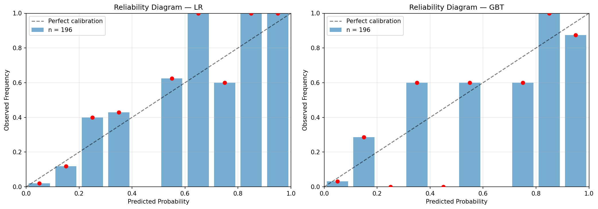

Reliability diagram from LOYO CV predictions (196 predictions from the final Feb 7
snapshot, binned into 9 bins). Both models roughly follow the diagonal — neither is
systematically overconfident or underconfident. The main calibration failure is in the
highest bin: when models predict >80%, the actual win rate is slightly lower.

### Rank comparison (Spearman ρ with market)

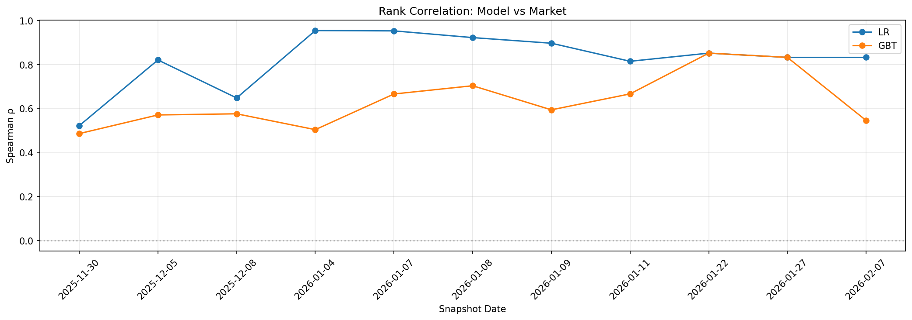

| Date | Event | LR ρ | GBT ρ |
|------|-------|------|-------|
| 2025-11-30 | Pre-season baseline | +0.52 | +0.49 |
| 2026-01-04 | Critics Choice winner | **+0.96** | +0.51 |
| 2026-01-22 | Oscar noms | +0.85 | +0.85 |
| 2026-02-07 | DGA winner | +0.83 | +0.55 |

LR's rank correlation peaks at +0.96 after Critics Choice winner. LR maintains
high ρ (>0.80) for the rest of the season. GBT is more erratic: peaks at +0.85
when Oscar noms arrive but drops to +0.55 at the final snapshot, when the 57pp
swing on One Battle scrambles its rankings.

### Event impact analysis

Top 3 probability swings per event, per model:

| Event | LR top movers | GBT top movers |
|-------|---------------|----------------|
| Critics Choice noms (Dec 5) | Marty +22.9pp, Hamnet +15.3pp, Sinners +14.4pp | (no change — 4 features unchanged) |
| Critics Choice winner (Jan 4) | Marty −32.5pp, Sinners −25.3pp, Hamnet −13.5pp | OBaA +35.9pp, Marty −22.1pp, Sinners −7.2pp |
| Oscar noms (Jan 22) | Marty +9.2pp, OBaA +5.0pp, Hamnet +4.7pp | OBaA +27.9pp, Marty +11.6pp, Hamnet −7.2pp |
| DGA winner (Feb 7) | Marty −3.7pp (small) | **OBaA −57.5pp**, Marty −16.4pp (massive GBT collapse) |

### Takeaways

- **Critics Choice winner is the single biggest information event.** Both models jump from
  ~50% to 69.2% CV accuracy at the Jan 4 snapshot (+7.7pp LR, +23.1pp GBT). Nomination-only
  events add essentially zero marginal information to CV metrics.
- **GBT reaches 76.9% CV accuracy only at the final snapshot** (DGA winner, Feb 7), gaining
  `dga_winner` as its #1 feature (importance 0.27). LR stays at 73.1% from Jan 11 onwards,
  suggesting LR saturates earlier with precursor win features.
- **Models systematically underweight the frontrunner.** Even at peak (GBT Jan 22: 68.6%),
  the model never reaches Kalshi's 76%. The 45pp MAE for One Battle dwarfs all other
  nominees. Markets incorporate soft information (industry sentiment, campaigns) that isn't
  in our feature set.
- **LR is the better market-tracking model.** LR rank correlation with the market peaks
  at ρ = 0.96 and stays above 0.80. The optimal market blend gives LR 20% weight (α = 0.80)
  vs GBT 0% (α = 1.00). LR's smoother probability curves are more compatible with market
  prices than GBT's volatile swings.
- **GBT's Oscar noms → DGA winner collapse is the most dramatic event.** A 57pp swing on
  One Battle in 2 weeks (68.6%→11.2%). The `dga_winner` feature reshuffles the entire
  importance landscape, and GBT's greedy splits amplify this into extreme probability shifts.
- **Prediction entropy tracks model confidence regimes.** LR reaches peak confidence at
  Jan 7-9 (entropy 1.59, just 4 features) before diversifying. GBT hits its lowest entropy
  (1.44) at the final snapshot when `dga_winner` concentrates probability.
- **Feature selection is aggressive and model-dependent.** LR uses only 4 features for 5
  consecutive snapshots (Jan 4-9), then explodes to 43 at Feb 7. GBT steadily accumulates
  (4→19). The feature importance heatmaps show a clear phase transition around Jan 4.
- **Brier score reveals overfitting risk.** LR's best Brier (0.0520) is at Jan 22-27, not
  Feb 7 (0.0586) — the 43-feature model slightly overfits. More features ≠ better calibration.

## How to Run

```bash
cd "$(git rev-parse --show-toplevel)"

# Prerequisites: intermediate dataset files must exist
ls storage/d20260201_build_dataset/oscar_nominations.json

# Run full experiment (takes ~15-20 minutes)
bash oscar_prediction_market/one_offs/d20260211_temporal_model_snapshots/run.sh \
    2>&1 | tee storage/d20260211_temporal_model_snapshots/run.log
```

## Output Structure

```
storage/d20260211_temporal_model_snapshots/
├── configs/features/              # Generated full-feature configs
├── datasets/{date}/               # Per-date raw datasets
├── models/{lr,gbt}/{date}/        # Full pipeline output per model/date
├── model_predictions_timeseries.csv
├── model_vs_market_{lr,gbt}.png
├── divergence_heatmap_{lr,gbt}.png
├── feature_evolution.png
├── brier_score_comparison.png
├── feature_importance_evolution_{lr,gbt}.png
├── reliability_diagram.png
├── rank_comparison.png
├── market_blend_analysis.png
└── run.log
```

## Dependencies

- Intermediate datasets: `storage/d20260201_build_dataset/` (from build_dataset one-off)
- Config files: `modeling/configs/{param_grids,cv_splits}/`
- Kalshi API: public (unauthenticated) for candlestick prices
