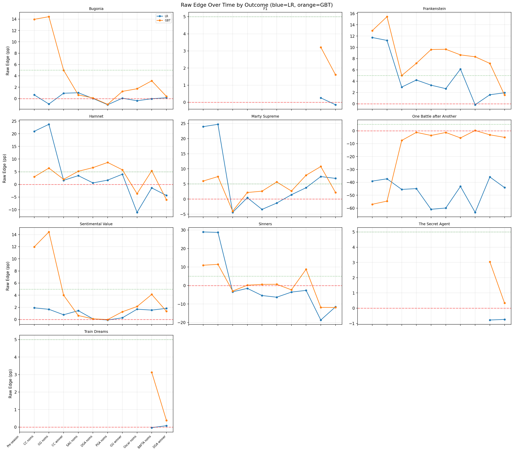

# Ablation Improvements — Implementation Plan

**Branch:** `feature/d20260217_ablation_improvements`
**Worktree:** `.worktrees/feature/d20260217_ablation_improvements/`
**Storage:** `storage/d20260217_ablation_improvements/` (for α-blend ablation results only)

Follow-up to `d20260214_trade_signal_ablation`: README improvements, new plots,
and α-blend ablation experiment.

All file paths below are relative to the worktree root unless stated otherwise.
Abbreviation: `ONE_OFFS` = `oscar_prediction_market/one_offs`

---

## Conventions

- **α convention (IMPORTANT):** Throughout all code and READMEs, α = market weight.
  Formula: `P_blend = α * P_market + (1-α) * P_model`.
  α=0 → pure model; α=1 → pure market.
- Run all commands from the worktree root via `cd "$(git rev-parse --show-toplevel)"`.
- Use `uv run python -m ...` for all Python commands.
- All edits happen in the worktree, not the main workspace.

---

## Task 1: README Text Updates

**File:** `ONE_OFFS/d20260214_trade_signal_ablation/README.md`

### 1a. Grid parameter table — add descriptions

**Location:** Lines 32–42 (the "Grid Parameters" table).

Replace the current 3-column table with a 4-column version:

```markdown
| Parameter | Levels | Values | Description |
|-----------|--------|--------|-------------|
| `model_type` | 4 | lr, gbt, avg (50/50 LR+GBT), market_blend (1/3 each LR+GBT+market) | Which probability model drives trade signals. |
| `kelly_fraction` | 3 | 0.10, 0.15, 0.25 | Fraction of Kelly-optimal bet size. Lower = less volatile. |
| `min_edge` | 4 | 0.05, 0.08, 0.10, 0.15 | Minimum net edge required to BUY. Higher = fewer, pickier trades. |
| `sell_edge_threshold` | 3 | -0.03, -0.05, -0.10 | Edge below which a held position triggers SELL. Negative to absorb round-trip costs. |
| `min_price_cents` | 3 | 0, 10, 20 | Skip contracts priced below this. Prevents fee drag on cheap contracts. |
| `fee_type` | 2 | taker (7%), maker (1.75%) | Fee schedule. Taker = market orders. Maker = limit orders. |
```

Note: the existing table has `sell_threshold_edge` — rename to `sell_edge_threshold`
(matches the actual field name in `BacktestConfig`).

### 1b. Use exact field names everywhere

Find-and-replace these shorthand references:

| Location | Old text | New text |
|----------|----------|----------|
| Grid table, line 38 | `sell_threshold_edge` | `sell_edge_threshold` |
| Best Config, line 69 | `kelly=0.10, min_edge=0.05, sell_threshold=-0.03, floor=0c` | `kelly_fraction=0.10, min_edge=0.05, sell_edge_threshold=-0.03, min_price_cents=0` |
| Sensitivity item 1, lines 84–86 | `Floor=0:`, `Floor=10:`, `Floor=20:` | `min_price_cents=0:`, `min_price_cents=10:`, `min_price_cents=20:` |
| Sensitivity item 5, line 102 | `sell_threshold_edge` | `sell_edge_threshold` |
| Interaction text, line 118 | `sell_threshold` | `sell_edge_threshold` |
| Top 10 text, line 126 | `floor=0` | `min_price_cents=0` |
| Top 10 text, line 130 | `floor=0` | `min_price_cents=0` |
| Top 10 text, line 131 | `sell_threshold and kelly_fraction` | `sell_edge_threshold and kelly_fraction` |

**Do NOT change:**
- The prose words "price floor" or "floor" used in natural English sentences
  (lines 262–283). Those are fine as descriptive English.
- File/image names containing `floor0` (e.g., `deep_dive_..._floor0_...`).
- The config ID string `gbt_kelly0.10_edge0.05_sell0.03_floor0_maker`
  (line 210) — that's a literal file/config name.

### 1c. Parameter sensitivity methodology

**Location:** After the heading `### Parameter Sensitivity` (line 80), before
the bold text `**Most impactful → least impactful:**` (line 82).

Insert:

```markdown
Each value below is the **marginal mean return**: the average `total_return_pct`
across all configs sharing that parameter level, regardless of other parameters.
For example, "min_price_cents=0: avg +1.7%" averages the 288 configs (864 / 3
levels) where `min_price_cents=0`. Parameters are ranked by the **range** of
their marginal means across levels (largest spread = most impactful).
```

### 1d. Interaction heatmap reading guide

**Location:** After the interaction heatmap image link (line 113), before the
paragraph starting "The interaction heatmaps reveal..." (line 115).

Insert:

```markdown
**How to read:** Each cell shows the mean return (%) for all configs with that
(row, column) combination, averaged over all other parameters. Green = positive,
red = negative. An **interaction** exists when the pattern changes across rows
(i.e., the column parameter's effect depends on the row parameter). If all rows
show the same pattern (just shifted up/down), the parameters are independent.
```

### 1e. α-blend explanation

**Location:** In the section "New GBT model is a genuine market competitor
(α-blend)" (line 433), after the formula line `$P_{\text{blend}} = ...$`
(line 436) and before the bullet list starting `- **LR: α = 0.85**` (line 438).

Insert:

```markdown
**How to interpret α:** α=0 means pure model (market ignored). α=1 means pure
market (model adds nothing). The optimal α minimizes RMSE of blended predictions
vs the most-informed (final snapshot) estimates. A model with low optimal α
provides genuine information the market doesn't have — its edge signals reflect
real mispricings, not noise.
```

---

## Task 2: Plotting Improvements

### 2a. Edge over time — all outcomes

**File:** `ONE_OFFS/d20260214_trade_signal_ablation/analyze_deep_dive.py`

**New function:** Add `plot_edge_over_time_all_outcomes()` after `analyze_gbt_vs_lr()`
(which ends ~line 740).

```python
def plot_edge_over_time_all_outcomes(
    models_dir: Path,
    daily_prices: pd.DataFrame,
    output_dir: Path,
) -> None:
    """Subplot grid: raw edge over time for every nominee, LR vs GBT."""
```

**Logic:**
1. For each date in `SNAPSHOT_DATES`, call `get_market_prices_on_date(daily_prices, date)`
   and `load_snapshot_predictions(models_dir, model_type, date)` for `["lr", "gbt"]`.
2. Compute raw edge = `model_prob - market_price_cents / 100` per nominee/date/model.
3. Collect all unique nominee names across all snapshots.
4. Create subplot grid: `ncols=3`, `nrows=ceil(len(nominees)/3)`.
   Figure size: `(18, 4*nrows)`.
5. Per nominee subplot:
   - LR edge as blue `o-` line, GBT edge as orange `o-` line.
   - `axhline(y=0, color="red", linestyle="--")` — breakeven line.
   - `axhline(y=0.05, color="green", linestyle=":", alpha=0.5)` — min_edge threshold.
   - X-axis: event abbreviations from `EVENT_NAMES`.
   - Y-axis label: "Raw Edge" (only on leftmost column).
   - Subplot title: nominee name (truncate >25 chars with "...").
   - Add legend only on first subplot.
6. `fig.suptitle("Raw Edge Over Time by Outcome (blue=LR, orange=GBT)")`.
7. Hide unused axes. `plt.tight_layout()`.
8. Save as `output_dir / "edge_over_time_all_outcomes.png"`.

**Call site in `main()`:** After `analyze_gbt_vs_lr(...)` (~line 1043), before
`compare_old_vs_new(...)`:
```python
plot_edge_over_time_all_outcomes(models_dir, daily_prices, output_dir)
```

**README update:** Add after the `gbt_vs_lr_analysis.png` reference (around
line 170 in the "GBT vs LR" section):
```markdown
### Edge Over Time by Outcome


```

### 2b. Position evolution — buy/sell markers

**File:** `ONE_OFFS/d20260214_trade_signal_ablation/analyze_deep_dive.py`

**Function to modify:** `plot_config_deep_dive()`, Panel 2 (lines ~389–404).

**Current code (Panel 2):** Draws stacked bars via a loop over
`active_outcomes_sorted`. The bars are drawn using `ax.bar()` with a
`bottom` array that accumulates per-outcome.

**Changes:**
1. During the bar-drawing loop, save a dict `bar_tops: dict[str, list[float]]`
   mapping each nominee to its bar-top position (bottom + contracts) at each
   snapshot index.
2. After the bar loop, iterate over `trades` (from `result["trade_log"]`):
   ```python
   for t in trades:
       if t["date"] not in dates:
           continue
       idx = dates.index(t["date"])
       nom = t["nominee"]
       is_buy = t["action"] == "BUY"
       marker = "^" if is_buy else "v"
       color = "green" if is_buy else "red"
       y_pos = bar_tops.get(nom, [0] * len(dates))[idx]
       offset = 50 if is_buy else -50  # small offset for visibility
       delta_str = f"+{t['contracts']}" if is_buy else str(t['contracts'])
       ax.scatter([idx], [y_pos + offset], marker=marker, color=color,
                  s=60, zorder=5, edgecolors="black", linewidths=0.5)
       ax.annotate(delta_str, xy=(idx, y_pos + offset),
                   xytext=(0, 8 if is_buy else -8), textcoords="offset points",
                   fontsize=5, color=color, ha="center",
                   va="bottom" if is_buy else "top")
   ```
3. This overlays buy (green ▲) and sell (red ▼) markers on the position bars
   with contract delta labels, making it clear when trades happened.

### 2c. Model vs market — subplots per nominee

**File:** `ONE_OFFS/d20260211_temporal_model_snapshots/analysis.py`

**Function:** `plot_model_vs_market()` (lines 900–937).

**Current implementation:** Single `fig, ax = plt.subplots(figsize=(14, 8))`
per model type with all nominees overlaid on one axis.

**Replace with:**
```python
def plot_model_vs_market(mm_df: pd.DataFrame, output_dir: Path) -> None:
    """Subplot grid: model P vs market P per nominee, one subplot per nominee."""
    valid = mm_df.dropna(subset=["market_prob"])
    if valid.empty:
        return

    for model in ["lr", "gbt"]:
        model_data = valid[valid["model_type"] == model]
        nominees = sorted(model_data["title"].unique())
        ncols = 3
        nrows = math.ceil(len(nominees) / ncols)

        fig, axes = plt.subplots(nrows, ncols, figsize=(18, 4 * nrows), sharex=True)
        axes_flat = axes.flatten() if nrows > 1 else (axes if ncols > 1 else [axes])
        cmap = matplotlib.colormaps["tab10"]

        for i, nominee in enumerate(nominees):
            ax = axes_flat[i]
            nom_data = model_data[model_data["title"] == nominee].sort_values("snapshot_date")
            dates = [str(d) for d in nom_data["snapshot_date"]]
            model_probs = nom_data["model_prob"].values * 100
            market_probs = nom_data["market_prob"].values * 100

            ax.plot(dates, model_probs, "-o", color=cmap(i / max(1, len(nominees) - 1)),
                    markersize=4, label="Model")
            ax.plot(dates, market_probs, "--", color="gray", alpha=0.7, label="Market")
            ax.fill_between(dates, model_probs, market_probs, alpha=0.10,
                            color=cmap(i / max(1, len(nominees) - 1)))

            nom_short = nominee[:25] + "..." if len(nominee) > 25 else nominee
            ax.set_title(nom_short, fontsize=9)
            ax.tick_params(axis="x", rotation=45, labelsize=7)
            if i % ncols == 0:
                ax.set_ylabel("Probability (%)")
            if i == 0:
                ax.legend(fontsize=7)

        # Hide unused axes
        for j in range(len(nominees), len(axes_flat)):
            axes_flat[j].set_visible(False)

        fig.suptitle(f"Model vs Market — {model.upper()} (solid=model, dashed=market)",
                     fontsize=13)
        plt.tight_layout()
        fname = f"model_vs_market_{model}.png"
        plt.savefig(output_dir / fname, bbox_inches="tight")
        plt.close()
        print(f"Saved: {output_dir / fname}")
```

**Need to add `import math`** at the top of the file if not already imported.

---

## Task 3: α-blend Docstring + Convention Fix

**File:** `ONE_OFFS/d20260211_temporal_model_snapshots/analysis.py`
**Function:** `analyze_market_blend()` (lines 692–765)

### 3a. Fix α convention in code

The code currently uses `blend_p = a * model_p + (1 - a) * market_p`
(α = model weight). Our convention is α = market weight.

**Changes:**
1. **Docstring** (line 693): Change to
   `"""Sweep α for P_blend = α * P_market + (1-α) * P_model.`
   (plus expanded explanation — see 3b below).
2. **Blend formula** (line 740): Change
   `blend_p = a * model_p + (1 - a) * market_p`
   → `blend_p = a * market_p + (1 - a) * model_p`
3. **X-axis label** (line 752): Change
   `"α (model weight)"` → `"α (market weight)"`

**Effect on output:** The optimal α values will flip. The code will now
directly report α = 0.85 for LR (85% market weight) and α = 0.15 for GBT
(15% market weight), which **matches what the READMEs already say**.
No README text changes needed for the numeric α values.

### 3b. Expanded docstring

Replace the docstring with:
```python
"""Sweep α for P_blend = α * P_market + (1-α) * P_model.

Alpha-blending combines model predictions with market prices to find the
optimal weighting. α=0 trusts the model fully; α=1 trusts the market
fully. The optimal α minimizes RMSE of blended predictions vs the final
snapshot's most-informed estimate.

Interpretation:
  - Low optimal α → model adds genuine information beyond market prices.
  - High optimal α → market is more accurate; model adds noise.
"""
```

---

## Task 4: α-Blend Ablation Experiment

### 4a. Add `market_blend_alpha` field to `BacktestConfig`

**File:** `ONE_OFFS/d20260214_trade_signal_backtest/generate_signals.py`

**Location:** Inside `class BacktestConfig(BaseModel):` (line 125), after the
`min_price_cents` field (line 161). Add:

```python
    market_blend_alpha: float | None = Field(
        default=None,
        ge=0,
        le=1,
        description=(
            "If set, blend model predictions with market prices: "
            "P_blend = α * P_market + (1-α) * P_model. "
            "α=0 is pure model, α=1 is pure market."
        ),
    )
```

Default `None` means no blending — fully backward compatible with all 864
existing config JSONs (which don't have this field, so it defaults to None).

### 4b. Extend `load_weighted_predictions()` to support α-blend

**File:** `ONE_OFFS/d20260214_trade_signal_ablation/run_ablation.py`

**Function:** `load_weighted_predictions()` (line 68)

**Add new parameter:** `market_blend_alpha: float | None = None`

**Updated signature:**
```python
def load_weighted_predictions(
    models_dir: Path,
    snapshot_date: str,
    model_type: str,
    market_prices: dict[str, float] | None = None,
    market_blend_alpha: float | None = None,
) -> dict[str, float]:
```

**Add logic** at the top of the function body, before existing `if model_type
in ("lr", "gbt"):` check:

```python
    if market_blend_alpha is not None and market_prices is not None:
        # α-blend: P = α * P_market + (1-α) * P_model
        # model_type must be a base model ("lr" or "gbt")
        preds = load_snapshot_predictions(models_dir, model_type, snapshot_date)
        if not preds:
            return {}
        blended: dict[str, float] = {}
        for nominee, model_p in preds.items():
            market_p_cents = market_prices.get(nominee)
            if market_p_cents is not None:
                blended[nominee] = (
                    market_blend_alpha * (market_p_cents / 100)
                    + (1 - market_blend_alpha) * model_p
                )
            else:
                blended[nominee] = model_p
        return blended
```

**Update docstring** to document the new parameter.

**Update call site in `run_single_config()`** (same file, ~line 151):
Change:
```python
predictions = load_weighted_predictions(models_dir, snap_date, model_type, market_prices)
```
To:
```python
predictions = load_weighted_predictions(
    models_dir, snap_date, model_type, market_prices,
    market_blend_alpha=config.market_blend_alpha,
)
```

**Update call site in `analyze_deep_dive.py`**, `run_detailed_backtest()`
(~line 141). Same pattern: pass `market_blend_alpha=config.market_blend_alpha`.

### 4c. Generate α-blend configs

**New file:** `ONE_OFFS/d20260217_ablation_improvements/generate_alpha_configs.py`

```python
"""Generate α-blend ablation configs.

Sweeps market_blend_alpha ∈ {0.0, 0.15, 0.30, 0.50, 0.85, 1.0} for both
LR and GBT, with all other params fixed at best-known values from the
d20260214 ablation.

Total: 2 base models × 6 α values = 12 configs.

Usage:
    cd "$(git rev-parse --show-toplevel)"
    uv run python -m oscar_prediction_market.one_offs.\
d20260217_ablation_improvements.generate_alpha_configs \
        --output-dir storage/d20260217_ablation_improvements/configs
"""

import argparse
import json
import logging
from pathlib import Path

logger = logging.getLogger(__name__)

BASE_MODELS = ["lr", "gbt"]
ALPHA_VALUES = [0.0, 0.15, 0.30, 0.50, 0.85, 1.0]

FIXED = {
    "kelly_fraction": 0.10,
    "min_edge": 0.05,
    "sell_edge_threshold": -0.03,
    "min_price_cents": 0,
    "fee_type": "maker",
    "bankroll_dollars": 1000,
    "max_position_per_nominee_dollars": 250,
    "max_total_exposure_dollars": 500,
    "spread_penalty_mode": "trade_data",
    "fixed_spread_penalty_cents": 2.0,
    "price_start_date": "2025-12-01",
    "price_end_date": "2026-02-15",
    "bankroll_mode": "dynamic",
}


def generate_configs(output_dir: Path) -> int:
    output_dir.mkdir(parents=True, exist_ok=True)
    count = 0

    for base_model in BASE_MODELS:
        for alpha in ALPHA_VALUES:
            config = {**FIXED}
            config["model_types"] = [base_model]
            config["market_blend_alpha"] = alpha

            config_id = (
                f"{base_model}_alpha{alpha:.2f}"
                f"_kelly0.10_edge0.05_sell0.03_floor0_maker"
            )
            config_path = output_dir / f"{config_id}.json"
            with open(config_path, "w") as f:
                json.dump(config, f, indent=2)
            count += 1

    logger.info("Generated %d α-blend configs in %s", count, output_dir)
    return count


def main() -> None:
    logging.basicConfig(level=logging.INFO, format="%(levelname)s: %(message)s")
    parser = argparse.ArgumentParser(description="Generate α-blend ablation configs")
    parser.add_argument("--output-dir", type=str, required=True)
    args = parser.parse_args()

    n = generate_configs(Path(args.output_dir))
    expected = len(BASE_MODELS) * len(ALPHA_VALUES)
    assert n == expected, f"Generated {n}, expected {expected}"
    print(f"Generated {n} configs ({len(BASE_MODELS)} models × {len(ALPHA_VALUES)} α values)")


if __name__ == "__main__":
    main()
```

### 4d. Run α-blend ablation

```bash
cd "$(git rev-parse --show-toplevel)"

# Generate configs
uv run python -m oscar_prediction_market.one_offs.\
d20260217_ablation_improvements.generate_alpha_configs \
    --output-dir storage/d20260217_ablation_improvements/configs

# Run ablation (reuses existing runner)
uv run python -m oscar_prediction_market.one_offs.\
d20260214_trade_signal_ablation.run_ablation \
    --configs-dir storage/d20260217_ablation_improvements/configs \
    --output-dir storage/d20260217_ablation_improvements/results \
    --snapshots-dir storage/d20260214_trade_signal_ablation

# Analyze results
uv run python -m oscar_prediction_market.one_offs.\
d20260214_trade_signal_ablation.analyze_ablation \
    --results-dir storage/d20260217_ablation_improvements/results \
    --output-dir storage/d20260217_ablation_improvements
```

### 4e. Add findings to README

**File:** `ONE_OFFS/d20260214_trade_signal_ablation/README.md`

Add a new dated section before `## Storage Structure`:

```markdown
## 2026-02-17 Follow-up: α-Blend Trading Ablation

Tests whether the optimal blend (GBT: α=0.15, LR: α=0.85) from the
temporal analysis translates to better trading returns.

**Grid:** 2 base models × 6 α values = 12 configs. All other params
fixed at best-known: kelly_fraction=0.10, min_edge=0.05,
sell_edge_threshold=-0.03, min_price_cents=0, fee_type=maker.

### Results

[Table of α vs return for LR and GBT — fill in after running]

### Findings

[Fill in after running — does optimal trading α match diagnostic α?]
```

---

## Task 5: Re-run Analyses and Update Assets

### 5a. Re-run temporal analysis (updates model_vs_market + α-blend plots)

```bash
cd "$(git rev-parse --show-toplevel)"
bash oscar_prediction_market/one_offs/\
    d20260214_trade_signal_ablation/analyze_temporal.sh
```

This calls `d20260211/.../analysis.py` which now has:
- Updated `plot_model_vs_market()` with subplots
- Fixed `analyze_market_blend()` with correct α convention

Output goes to `storage/d20260214_trade_signal_ablation/`.

### 5b. Re-run deep dive analysis (updates deep_dive plots + new edge plot)

```bash
cd "$(git rev-parse --show-toplevel)"
uv run python -m oscar_prediction_market.one_offs.\
d20260214_trade_signal_ablation.analyze_deep_dive \
    --results-dir storage/d20260214_trade_signal_ablation/results \
    --models-dir storage/d20260214_trade_signal_ablation/models \
    --output-dir storage/d20260214_trade_signal_ablation \
    --old-predictions storage/d20260211_temporal_model_snapshots/model_predictions_timeseries.csv
```

### 5c. Sync assets

```bash
cd "$(git rev-parse --show-toplevel)"
bash oscar_prediction_market/one_offs/sync_assets.sh
```

---

## Execution Order

1. **Task 1** (README text edits) — no code deps
2. **Task 3** (α-blend docstring + convention fix in d20260211 analysis.py)
3. **Task 2c** (model vs market subplot refactor in d20260211 analysis.py)
4. **Task 2a** (edge over time function in d20260214 analyze_deep_dive.py)
5. **Task 2b** (position evolution markers in d20260214 analyze_deep_dive.py)
6. **Task 4a** (add `market_blend_alpha` to `BacktestConfig`)
7. **Task 4b** (extend `load_weighted_predictions` + update 2 call sites)
8. **Task 4c** (create `generate_alpha_configs.py`)
9. `make dev` — verify lint/typecheck/tests pass
10. **Task 5a** (re-run temporal analysis → updated plots)
11. **Task 5b** (re-run deep dive → updated plots + new edge plot)
12. **Task 4d** (run α-blend ablation → results)
13. **Task 5c** (sync assets to one-off assets/ dirs)
14. **Task 4e** + README plot references (final README updates with results)
15. `make all` — final validation
16. Commit

