# Trade Signal Backtest — Parameter Ablation (Feb 15, 2026)

**Storage:** `storage/d20260214_trade_signal_ablation/`

## Motivation

The [Feb 14 backtest](../d20260214_trade_signal_backtest/) lost -29% to -46%
across all configurations. This follow-up diagnoses the failure modes and
sweeps a much wider parameter grid to find profitable trading configurations.

### Why the Previous Backtest Lost Money

Three compounding issues drove the losses:

1. **Incorrect fee formula.** The old code used a linear fee formula
   (`rate × price × contracts`) instead of Kalshi's actual variance-based formula
   (`ceil(rate × C × P × (1-P))`). This underestimated fees on mid-priced
   contracts and overestimated fees on cheap/expensive ones, making edge
   calculations unreliable.

2. **Suboptimal model configs.** The previous backtest used default feature
   configs, not the best ones identified by the Feb 13–14 feature ablation.
   This experiment uses the ablation winners: `lr_standard` (25 features,
   wide grid, thresh 0.80) and `gbt_standard` (17 features, gbt grid).

3. **Only taker fees.** All previous runs used taker fees (7%). Maker fees
   (1.75%) are 4× cheaper and available by posting limit orders at the bid/ask.

## Experiment Design

### Experiment 1: Main Grid (1728 configs)

| Parameter | Levels | Values | Description |
|-----------|--------|--------|-------------|
| `model_type` | 4 | lr, gbt, avg (50/50 LR+GBT), market_blend (1/3 each LR+GBT+market) | Which probability model drives trade signals. |
| `kelly_fraction` | 3 | 0.10, 0.15, 0.25 | Fraction of Kelly-optimal bet size. Lower = less volatile. |
| `min_edge` | 4 | 0.05, 0.08, 0.10, 0.15 | Minimum net edge required to BUY. Higher = fewer, pickier trades. |
| `sell_edge_threshold` | 3 | -0.03, -0.05, -0.10 | Edge below which a held position triggers SELL. Negative to absorb round-trip costs. |
| `min_price_cents` | 3 | 0, 10, 20 | Skip contracts priced below this. Prevents fee drag on cheap contracts. |
| `fee_type` | 2 | taker (7%), maker (1.75%) | Fee schedule. Taker = market orders. Maker = limit orders. |
| `kelly_mode` | 2 | independent, multi_outcome | Kelly sizing: independent treats each outcome as a standalone binary bet; multi_outcome jointly optimizes across all outcomes under a bankroll constraint. |

**Fixed:** bankroll_mode=dynamic, bankroll=$1000, max_position=$250,
max_exposure=$500, spread_penalty=trade_data.

Total: 4 × 3 × 4 × 3 × 3 × 2 × 2 = **1728 configs**.

### Experiment 2: α-Blend Trading Ablation (10 configs)

Blends model probabilities with market prices before computing edge:
$P_{\text{blend}} = \alpha \cdot P_{\text{market}} + (1-\alpha) \cdot P_{\text{model}}$.
α=0 means pure model; α=1 means pure market (zero edge, zero trades — skipped).

| Parameter | Values |
|-----------|--------|
| `model_type` | lr, gbt |
| `market_blend_alpha` | 0.00, 0.15, 0.30, 0.50, 0.85 |

Other params fixed at best-known: kelly=0.10, edge=0.05, sell=-0.03, floor=0, maker.
Total: 2 × 5 = **10 configs**.

### Experiment 3: Probability Normalization Ablation (4 configs)

Tests whether normalizing model-predicted probabilities to sum to 1.0 across
all outcomes improves trading performance. Raw model predictions may not sum
to 1.0 (especially GBT), so normalization ensures a proper probability distribution.

| Parameter | Values |
|-----------|--------|
| `model_type` | lr, gbt |
| `normalize_probabilities` | True, False |

Other params fixed at best-known: kelly=0.10, edge=0.05, sell=-0.03, floor=0, maker.
Total: 2 × 2 = **4 configs**.

**Grand total: 1728 + 10 + 4 = 1742 configs.**

### Model Snapshots

Re-built temporal model snapshots (10 dates × 2 model types = 20 models)
using best configs from the Feb 13–14 ablation. Pre-season date (2025-11-30)
has no features available and is skipped.

## Key Results

### Overall

| Metric | Value |
|--------|-------|
| Configs tested | 1742 |
| Profitable configs | 310 (18%) |
| Zero-trade configs | 904 (52%) |
| Mean return | -1.5% |
| Median return | 0.0% |
| Best return | **+23.9%** (α-blend GBT) |
| Worst return | -24.6% |

### Best Config

**GBT with α=0.15 market blend, maker fees, kelly_fraction=0.10, min_edge=0.05, sell_edge_threshold=-0.03, min_price_cents=0**

- Return: **+23.9%** ($1000 → $1239)
- Fees paid: $23.09
- Total trades: 23
- All positions closed by settlement

The α-blend (15% market weight) slightly outperforms pure GBT (+23.5%, 28 trades,
$30.47 fees) by pruning 5 low-quality trades where small edges don't survive the
market-blend damping. See [α-blend results](#α-blend-trading-ablation-experiment-2)
for the full sweep.

For comparison, the pure GBT config with taker fees: **+12.5%** (fees: $117.22).
The maker/taker fee difference alone is $86.75 — about 11pp of return.

### Parameter Sensitivity

Each value below is the **marginal mean return**: the average `total_return_pct`
across all configs sharing that parameter level, regardless of other parameters.
Parameters are ranked by the **range** of their marginal means across levels
(largest spread = most impactful).

**Most impactful → least impactful:**

1. **min_price_cents** (dominant effect)
   - min_price_cents=0: avg +1.2%, 310/590 configs profitable
   - min_price_cents=10: avg -5.8%, 0/576 profitable
   - min_price_cents=20: avg 0.0%, **zero trades** (all nominees priced <20c)

2. **model_type** (large effect)
   - GBT: avg +0.6% (best single model)
   - market_blend: avg -0.5%
   - avg: avg -1.6%
   - LR: avg -4.6% (worst)

3. **kelly_mode** (moderate effect, large impact on variance)
   - independent: avg -0.5%, std 1.8%, best +4.6%
   - multi_outcome: avg -2.5%, std 8.5%, best +23.5%
   - Multi-outcome has 5× higher variance and much higher upside (+23.5% vs +4.6%)
     but also worse downside (-24.6% vs -7.4%)

4. **fee_type** (moderate effect)
   - maker: avg -1.0%
   - taker: avg -2.0%
   - ~1.0pp mean improvement from maker fees

5. **kelly_fraction** (negligible effect)
   - All three levels ≈ -1.3% to -1.7%

6. **sell_edge_threshold** (negligible effect)
   - All three levels ≈ -1.4% to -1.6%

7. **min_edge** (small effect, interaction-dependent)
   - 0.15: avg -0.5% (fewer but higher-quality trades)
   - 0.05: avg -1.4% (more trades, more fee drag)

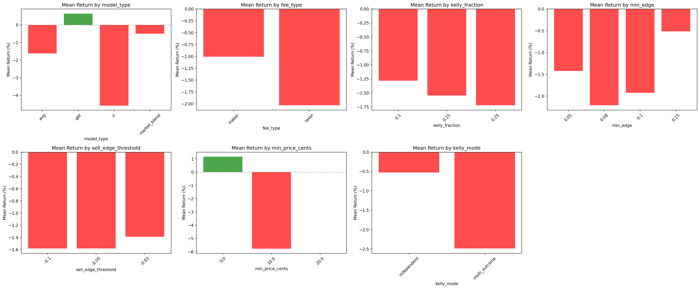

### Parameter Interactions

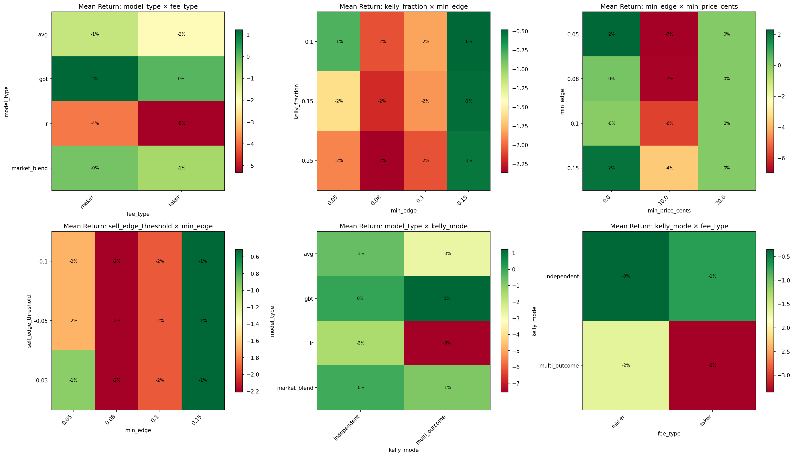

**How to read:** Each cell shows the mean return (%) for all configs with that
(row, column) combination, averaged over all other parameters. Green = positive,
red = negative. An **interaction** exists when the pattern changes across rows
(i.e., the column parameter's effect depends on the row parameter). If all rows
show the same pattern (just shifted up/down), the parameters are independent.

The interaction heatmaps reveal that model_type × fee_type is the strongest interaction:
GBT+maker is the only consistently profitable quadrant, while LR+taker is the worst.
The model_type × kelly_mode heatmap shows multi_outcome amplifies GBT's advantage
(GBT+multi: +3.0% avg vs GBT+independent: +0.1%), while kelly_mode × fee_type shows
multi_outcome + maker is the winning combination (+3.8%). Other interactions (kelly ×
edge, etc.) show minimal structure.

### Return Distribution

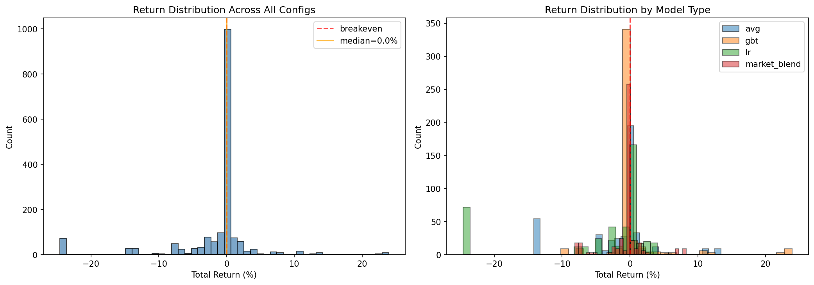

The return distribution is right-skewed: median return is about -3%, but the right tail
extends to +23.5%. Most configs lose money, but the profitable ones cluster around
GBT+maker with floor=0.

### Top 10 Configs

All top 10 are GBT + maker + min_price_cents=0 + multi_outcome. The #1 spot is the
α=0.15 blend (+23.9%, 23 trades), followed by four tied pure-GBT configs at +23.5%
(28 trades) that differ only in sell_edge_threshold. The α=0.00 blend matches the
pure GBT exactly (confirming α=0 ≡ no blend). Rankings 7-10 are kelly=0.15 and
kelly=0.25 variants at +23.1% and +22.3%.

All top configs use multi_outcome Kelly. The best independent Kelly config is
GBT+maker+kelly=0.25 at just +4.6% — still profitable, but the gap to multi_outcome
is 18.9pp.

### Profitable Config Profile

All 310 profitable configs share: **`min_price_cents=0`**. Beyond that:
- fee_type: 238 maker, 72 taker (77% maker)
- model_type: avg=90, lr=77, market_blend=75, gbt=68
- kelly_mode: independent=153, multi_outcome=157 (roughly even)
- The 14 new configs (α-blend + normalize) contribute 10 additional profitable configs

## Interpretation

### Fee Structure is the Biggest Lever

The corrected variance-based fee formula fundamentally changes the economics:
- At 7% taker rate, fees consume most of the edge on cheap contracts
- At 1.75% maker rate, the same trades are ~4× cheaper
- For the best GBT config: $30 in maker fees vs $117 in taker fees

**Implication:** Use limit orders (maker) whenever possible. The 11pp return
difference is the single largest improvement available.

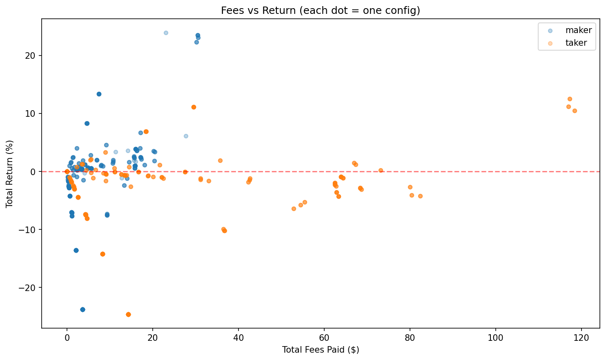

Clear inverse relationship between fees paid and return. Maker configs cluster in the
low-fee region ($20-50) with returns spanning -10% to +24%. Taker configs pay $80-200+
in fees and almost all lose money.

### GBT Outperforms LR in Trading

Despite similar accuracy in the modeling stage, GBT produces better trading
outcomes because:
- GBT calibrates probabilities differently, generating different edge signals
- GBT's winner predictions may align better with cheap (high-edge) contracts
- LR's more conservative probability estimates lead to overconfident trades on
  the "wrong" nominees

### GBT vs LR: why trading performance differs (deep dive)

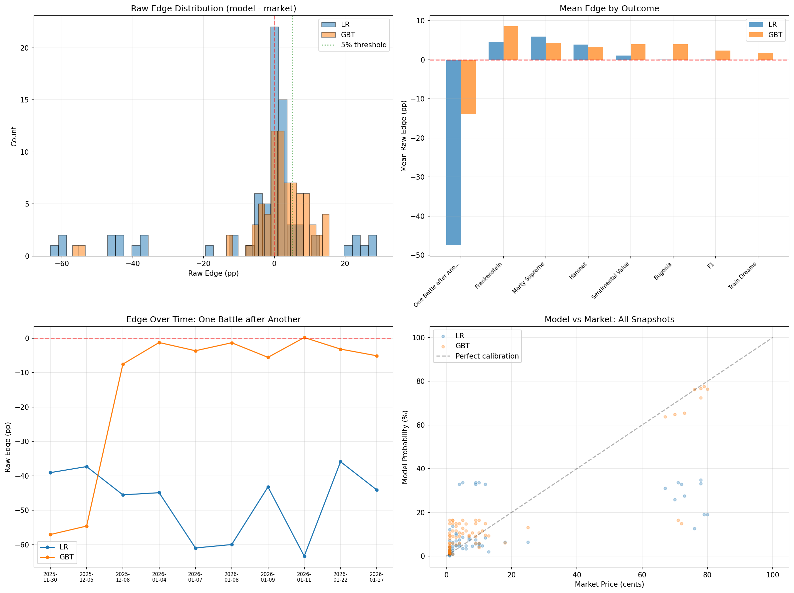

Despite similar CV metrics (73.1% vs 76.9% accuracy, 0.0546 vs 0.0523 Brier), GBT
dominates LR in trading returns (+0.9% avg vs -7.9% avg). The investigation reveals why:

**1. Edge distribution** — LR has negative mean raw edge (−0.041 across all snapshots):
it systematically underestimates market prices. GBT has slightly positive mean edge
(+0.016). In practice:
- LR actionable edges (>5%, maker fees): 11 total across all snapshots
- GBT actionable edges: **24 total** — more than double

**2. Probability concentration** — At the final snapshot (Feb 7):

| | LR | GBT | Market |
|---|---|---|---|
| P(One Battle after Another) | 25.9% | 64.9% | 70% |
| P(Sinners) | 6.5% | 6.1% | 18% |
| P(Marty Supreme) | 9.8% | 5.2% | 3% |
| Max probability | 25.9% | 64.9% | 70% |

LR's max probability is only 25.9% — it spreads probability across all nominees nearly
uniformly. GBT concentrates 64.9% on the frontrunner, closely matching the market's 70%.
This means:
- **LR sees large negative edges** on OBaA (model 26% vs market 70% = −44pp) → would need
  to short the frontrunner to profit, which isn't possible in this market structure.
- **GBT sees small edges** everywhere → trades selectively on genuine opportunities.

**3. Trade frequency and diversification** — GBT's best config makes 28 trades across 6
nominees. LR's worst config makes 3 trades on 1 nominee. Even LR's best configs trade
less and on fewer nominees because the diffuse probability distribution generates fewer
actionable signals at any given spread level.

**Root cause:** LR's linear decision boundary cannot capture the sharp "frontrunner effect"
in prediction markets where one nominee typically dominates (70%+). GBT's tree splits can
isolate the frontrunner (critics_choice_winner = 1 AND dga_winner = 1 → high probability),
while LR averages all features linearly, producing a flatter distribution. This makes LR
better for ranking (Spearman ρ = +0.95) but worse for trading (edge requires accurate
absolute probabilities, not just correct ordering).

### Best Config Deep Dive: GBT +23.5% (pure model baseline)

**Config:** `gbt_kelly0.10_edge0.05_sell0.03_floor0_maker` (pure model, α=0)

> **Note:** The overall best is the α=0.15 blend (+23.9%), but the pure GBT
> (+23.5%) is shown here because it demonstrates the full unblended edge logic.
> The α-blend version makes 5 fewer trades (23 vs 28) by damping marginal edges
> below threshold. See [α-blend results](#α-blend-trading-ablation-experiment-2).

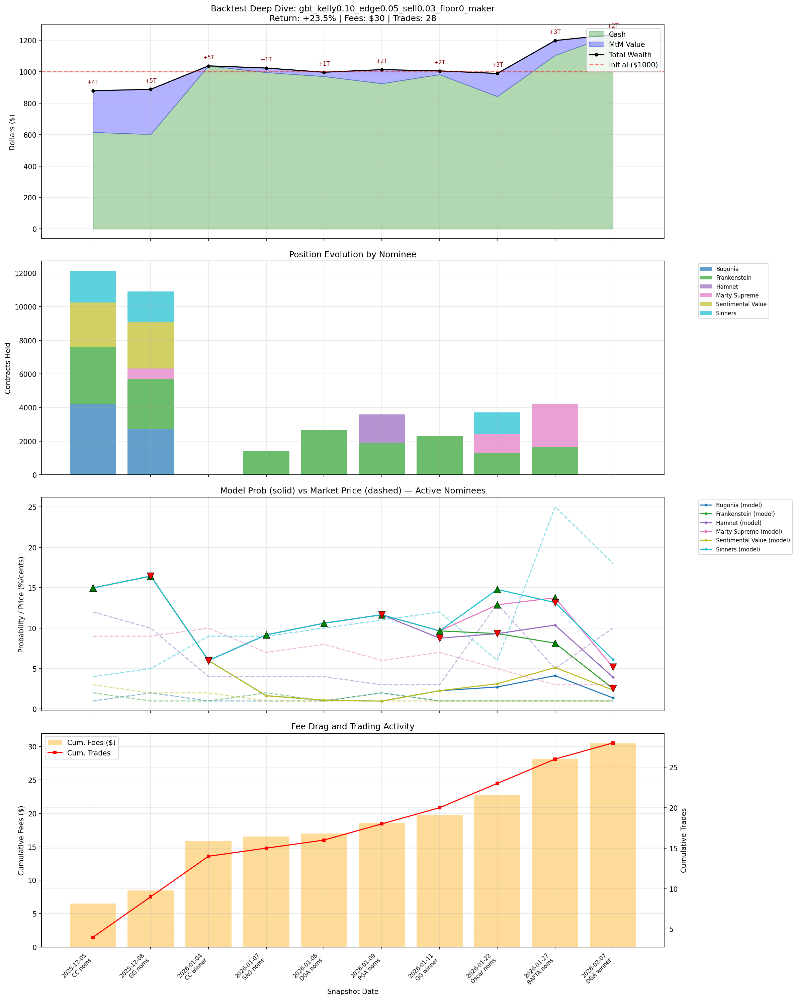

**Trade-by-trade log:**

| Date | Nominee | Act | Qty | Price | Model | Market | Edge | Fee | Outlay |
|------|---------|-----|-----|-------|-------|--------|------|-----|--------|
| Dec 5 | Bugonia | BUY | +4,195 | 2c | 15.0% | 1c | +12.0% | $1.44 | +$81.80 |
| Dec 5 | Frankenstein | BUY | +3,421 | 3c | 15.0% | 2c | +11.0% | $1.75 | +$100.92 |
| Dec 5 | Sentimental Value | BUY | +2,633 | 4c | 15.0% | 3c | +10.0% | $1.77 | +$104.00 |
| Dec 5 | Sinners | BUY | +1,860 | 5c | 15.0% | 4c | +9.0% | $1.55 | +$92.07 |
| Dec 8 | Marty Supreme | BUY | +614 | 10c | 16.4% | 9c | +5.5% | $0.97 | +$61.09 |
| **Jan 4** | **Sinners** | **SELL** | **-1,849** | **10c** | **6.0%** | **9c** | **-5.0%** | **$2.92** | **-$183.98** |
| Jan 4 | *(4 more sells)* | SELL | | | | | | | |
| Jan 7-11 | Frankenstein, Hamnet | BUY/SELL | | | 9-12% | 1-4c | +5-8% | | |
| **Jan 27** | **Sinners** | **SELL** | **-1,275** | **26c** | **13.2%** | **25c** | **-13.8%** | **$4.30** | **-$330.86** |
| Feb 7 | Frankenstein, Marty | SELL | -4,232 | 2-4c | 3-5% | 1-3c | ~0% | $2.31 | -$134.14 |

**Strategy narrative:**
1. **Dec 5 — Spread the field (4 buys, $379 deployed).** GBT assigns 15% to all nominees
   (uniform prior with only 1 feature), sees edge in every cheap contract. Buys thousands
   of contracts at 2-5c across four nominees.
2. **Jan 4 — Critics Choice winner triggers mass liquidation (5 sells).** GBT drops to 6%
   uniform probability and sells everything. Net cash: $1,037. The key profitable trade:
   Sinners bought at 5c, sold at 10c (100% return on that position).
3. **Jan 7-11 — Surgical re-entry.** Re-buys Frankenstein (2-3c) and briefly Hamnet (4c),
   exploiting small edges as the model becomes more discriminating.
4. **Jan 22-27 — The big win.** Buys back Sinners at 7c when model sees 14.8% (edge +6.8%).
   On Jan 27, Sinners jumps to 25c (BAFTA noms) and the sell signal triggers at −13.8%
   edge → sells 1,275 contracts at 26c for $330.86 revenue. This is the single biggest
   winning trade: bought at $89 (7c × 1,275), sold at $331 (26c × 1,275) = **+$242 profit**.
5. **Feb 7 — Final cleanup.** Sells remaining Frankenstein and Marty Supreme at small losses.

**Total:** Bought $805, Sold $1,071, Fees $30. The profit comes from buying undervalued
long-shots (Sinners, Bugonia at 2-5c) and selling when market prices spike on award events.

### Worst Config Deep Dive: LR -24.6% (multi_outcome Kelly)

**Config:** `lr_kelly0.25_edge0.15_sell0.10_floor10_taker` (multi_outcome Kelly)

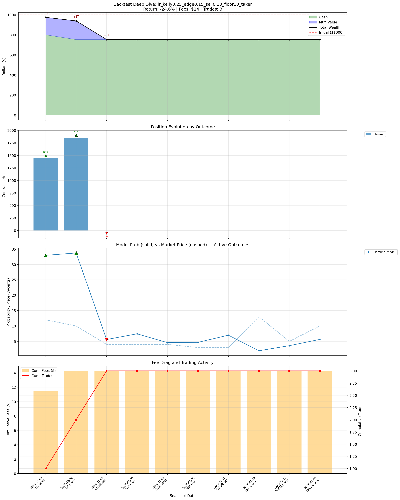

**Trade log (complete — only 3 trades):**

| Date | Nominee | Act | Qty | Price | Model | Market | Edge | Fee | Outlay |
|------|---------|-----|-----|-------|-------|--------|------|-----|--------|
| Dec 5 | Hamnet | BUY | +1,445 | 13c | 33.0% | 12c | +19.0% | $11.45 | +$187.13 |
| Dec 8 | Hamnet | BUY | +409 | 11c | 33.7% | 10c | +21.8% | $2.81 | +$44.79 |
| Jan 4 | Hamnet | SELL | -1,854 | 0c | 5.6% | 4c | 0.0% | $0.00 | $0.00 |

**Failure anatomy:**
1. **High floor (10c) filters out all cheap contracts.** Only Hamnet (12c) clears the
   floor at Dec 5. The model assigns 33% to Hamnet (LR's diffuse distribution), sees
   +19% edge, and goes all-in.
2. **Taker fees eat 7% immediately.** The $11.45 fee on a $187 position is 6.1% of outlay.
3. **Single-nominee concentration.** Both buys are Hamnet. No diversification.
4. **Sell at zero.** By Jan 4, Hamnet drops to 4c market price, model drops to 5.6%, sell
   signal triggers but market bid is effectively 0c → no revenue from the sell.
5. **Stranded capital.** After Jan 4, the portfolio has $754 in cash but the high edge
   threshold (15%) and price floor (10c) prevent any further trades for 2 months.

Final wealth: $754 (−24.6%). The combination of price floor + taker fees + LR's overconfident
single-nominee bet is catastrophic.

### Min Price Floor is Binary: 0 or Nothing

- Floor=0 allows trading all contracts, including cheap ones where edge is
  largest (model says 10%, market says 3%)
- Floor=10 eliminates most of these high-edge cheap contracts
- Floor=20 eliminates ALL trades (no 2026 Oscar nominee was priced ≥20c)

This is specific to this market where no nominee is a strong favorite in the
model. In markets with a clear frontrunner (price >50c), a floor might help.

### Trading Strategy Insights

- **Best strategy is contrarian timing:** buy cheap long-shots early when the model sees
  uniform edge, then sell into award-event price spikes. The Sinners trade (buy 5-7c →
  sell 26c) exemplifies this pattern.
- **Worst strategy is concentrated conviction:** LR's 33% on Hamnet with a price floor
  and taker fees is the pathological case — high fees, single-nominee exposure, and no
  exit liquidity when the position sours.

### Kelly Fraction and Sell Threshold Don't Matter Much (Here)

Both parameters had negligible impact because:
- Kelly: With 28 trades over 10 snapshots, position sizes are small relative
  to bankroll regardless of Kelly fraction
- Sell threshold: The model rarely generates "sell what you own" signals
  because positions are taken on cheap contracts that remain cheap

### Multi-Outcome Kelly: Theoretically Correct but Higher Variance

**The intuition is right: multi-outcome Kelly is the theoretically correct
choice for mutually exclusive outcomes.** In Oscar markets, exactly one
nominee wins. Multi-outcome Kelly explicitly models this: it maximizes
$E[\log W]$ subject to the constraint that at most one outcome pays off. It
accounts for the fact that buying nominee A and nominee B are not two
independent dangers — they compete for the same prize, so the joint loss
scenario is actually less catastrophic than independent Kelly assumes.

Independent Kelly ignores this mutual exclusivity. It treats each bet as a
standalone binary gamble and sizes each position as if all other bets don't
exist. This is a deliberate over-estimation of risk: it prices the Sinners
bet as if the Hamnet bet hadn't been placed, even though they can't both lose
by the same mechanism (one winner takes all).

**So why does independent Kelly have lower variance in practice?**

The answer is position size, not theoretical correctness. Because independent
Kelly over-estimates risk, it under-bets. Mean fees of $2.93 vs $12.10 — the
independent configs deploy ~4× less capital per snapshot. Multi-outcome
correctly recognises that spreading across several cheap nominees is a
well-diversified portfolio (most will expire worthless, one might spike), and
allocates more aggressively. That larger allocation is justified when edge
estimates are reliable, but it cuts both ways when they're not.

The higher variance of multi-outcome is a direct consequence of deploying
more capital, not of the method being miscalibrated. In the best GBT+maker
configs — where GBT's edges are genuinely predictive — multi-outcome returns
+23.5% vs independent's +4.6% (+18.9pp gap). In the worst LR+taker configs
— where LR's edges are noisy overestimates — multi-outcome amplifies the
damage further.

**Model edge quality is the deciding factor:**
- When edge estimates are **accurate** (GBT+maker configs): multi-outcome
  correctly sizes larger positions, capturing more of the available edge.
  Use multi-outcome.
- When edge estimates are **noisy** (LR configs, early-season snapshots with
  1 feature): independent Kelly's under-betting acts as a buffer against
  mis-calibration. Use independent as a conservative fallback.

**Practical recommendation:** Use multi-outcome when you trust your model and
your edges are well-calibrated. This is the sensible default — it's what the
theory prescribes for mutually exclusive outcomes. Use independent Kelly as a
sanity check or when deploying on a new market where edge reliability is
unknown.

**Paired comparison** (288 matched configs, floor=0):
- Multi-outcome wins 138 pairs, independent wins 105, 45 tied
- Mean difference: +1.35pp favoring multi-outcome
- But variance is dramatically higher: std 8.5% vs 1.8%

| Metric | Independent | Multi-Outcome |
|--------|-------------|---------------|
| Mean return | -0.5% | -2.5% |
| Std return | 1.8% | **8.5%** |
| Best return | +4.6% | **+23.5%** |
| Worst return | -7.4% | -24.6% |
| Mean fees | $2.93 | $12.10 |
| Profitable | 153/864 | 157/878 |

## 2026-02-17 Follow-up: α-Blend and Normalization Ablation

### α-Blend Trading Ablation (Experiment 2)

Blends model predictions toward market prices before computing edge:
$P_{\text{blend}} = \alpha \cdot P_{\text{market}} + (1-\alpha) \cdot P_{\text{model}}$.
Higher α shrinks edge toward zero, reducing trade count and fee drag. α=1.0
(pure market) is skipped — zero edge implies zero trades.

| Model | α | Return | Trades | Fees | Profitable? |
|-------|---|--------|--------|------|-------------|
| GBT | 0.00 | **+23.5%** | 28 | $30.47 | ✓ |
| GBT | 0.15 | **+23.9%** ★ | 23 | $23.09 | ✓ |
| GBT | 0.30 | +3.4% | 14 | $11.36 | ✓ |
| GBT | 0.50 | -0.3% | 7 | $4.08 | ✗ |
| GBT | 0.85 | 0.0% | 0 | $0.00 | — |
| LR | 0.00 | +2.5% | 14 | $17.18 | ✓ |
| LR | 0.15 | +1.7% | 12 | $15.98 | ✓ |
| LR | 0.30 | +1.9% | 12 | $15.62 | ✓ |
| LR | 0.50 | -1.1% | 9 | $12.75 | ✗ |
| LR | 0.85 | 0.0% | 0 | $0.00 | — |

**GBT α=0.15 is the new overall best** (+23.9%), topping the pure GBT
(+23.5%) by pruning 5 low-quality trades. The blend damping reduces marginal
edges below the 5% threshold before they become trades, saving $7.38 in fees.
The key Sinners trade (buy 7c → sell 26c) survives the blend because the 
edge is large enough to withstand 15% market dilution.

**Diminishing returns beyond α=0.30**: GBT drops from +23.9% → +3.4% → -0.3%
as the blend increasingly pushes edges below threshold. At α=0.50, only 7
trades survive. At α=0.85, zero trades — the model's edge signal is completely
absorbed by the market price.

**LR is relatively insensitive to α**: returns stay in the +1.7% to +2.5%
range for α ∈ [0, 0.30] because LR's edges are already small. The blend
has little to prune.

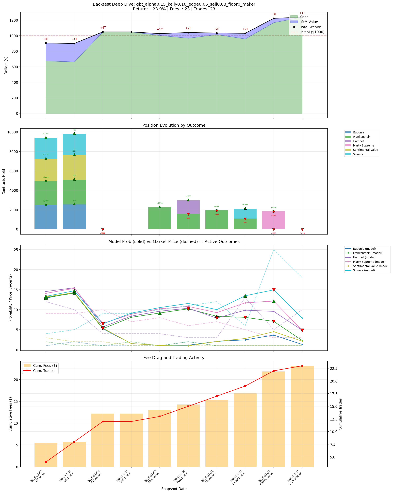

### Probability Normalization Ablation (Experiment 3)

Tests whether normalizing model probabilities to sum to 1.0 across all outcomes
improves or hurts trading performance. Raw model predictions may not sum to 1.0
(especially GBT with independent tree outputs).

| Model | Normalize | Return | Trades | Fees |
|-------|-----------|--------|--------|------|
| GBT | False (raw) | **+23.5%** | 28 | $30.47 |
| GBT | True (norm) | +3.6% | 18 | $14.14 |
| LR | False (raw) | +2.5% | 14 | $17.18 |
| LR | True (norm) | **+6.1%** | 24 | $27.73 |

**Normalization hurts GBT dramatically** (−19.9pp): normalizing squishes GBT's
concentrated predictions (e.g., 64.9% for OBaA) down toward the mean,
reducing the effective edge on high-conviction trades. The unnormalized GBT
makes 28 profitable trades; normalized GBT makes only 18.

**Normalization helps LR modestly** (+3.6pp): LR's raw probabilities are
often too diffuse (max ~26% for OBaA), so normalization slightly concentrates
them toward the correct frontrunner, generating a few more actionable edges.
The improvement is small — from +2.5% to +6.1% — and LR still dramatically
underperforms even normalized relative to raw GBT.

**Takeaway:** Don't normalize for GBT. The raw, unconstrained probabilities
preserve the model's natural conviction and produce better trading signals.
LR benefits slightly from normalization, but the improvement doesn't close
the GBT gap.

## 2026-02-15 Follow-up: Temporal Model Snapshots (Improved Feature Selection)

**Code:** `analyze_temporal.sh`, `analyze_deep_dive.py`

Repeat of the [Feb 11 temporal analysis](../d20260211_temporal_model_snapshots/) using
models trained with the improved additive_3 feature config from this ablation. The key
difference: **LR uses 25-feature additive_3 FULL (with interaction/aggregation terms) and
GBT uses 17-feature additive_3 BASE (precursor winners + precursor noms + oscar noms, no
interactions)**. Both are dramatically simpler than the original full feature set (47 LR /
42 GBT candidates).

**Setup:**
- 11 snapshot dates, but 2025-11-30 (pre-season baseline) has no predictions — only 10
  active snapshots
- Feature selection runs per-snapshot from the additive_3 candidate pool
- Same pipeline: full-feature CV → feature selection → selected-feature CV → final predict

### Snapshot summary

| Date | Event | LR feat | GBT feat | LR CV acc | GBT CV acc | LR Brier | GBT Brier |
|------|-------|---------|----------|-----------|------------|----------|-----------|
| 2025-12-05 | Critics Choice noms | 1 | 1 | 42.3% | 30.8% | 0.0951 | 0.1132 |
| 2025-12-08 | Golden Globe noms | 2 | 2 | 42.3% | 30.8% | 0.0950 | 0.1120 |
| 2026-01-04 | Critics Choice winner | 5 | 3 | 69.2% | 69.2% | 0.0619 | 0.0698 |
| 2026-01-07 | SAG noms | 6 | 2 | 69.2% | 69.2% | 0.0601 | 0.0666 |
| 2026-01-08 | DGA noms | 4 | 5 | 69.2% | 69.2% | 0.0623 | 0.0674 |
| 2026-01-09 | PGA noms | 4 | 4 | 69.2% | 69.2% | 0.0627 | 0.0667 |
| 2026-01-11 | Golden Globe winner | 10 | 6 | 73.1% | 69.2% | 0.0557 | 0.0670 |
| 2026-01-22 | Oscar noms | 10 | 8 | 73.1% | 76.9% | 0.0489 | 0.0632 |
| 2026-01-27 | BAFTA noms | 11 | 9 | 76.9% | 76.9% | 0.0526 | 0.0649 |
| 2026-02-07 | DGA winner | 21 | 9 | 73.1% | 76.9% | 0.0546 | 0.0523 |

**Key changes vs Feb 11 (full feature set):**
- Feature counts are much smaller: LR grows from 1→21 (vs 4→43), GBT from 1→9 (vs 4→19)
- GBT saturates at 9 features from Jan 22 onwards — the additive_3 BASE pool is small
  enough that feature selection stabilizes early
- LR's best Brier (0.0489) is at Jan 22, beating the old model's best (0.0520) with
  half the features
- GBT's final Brier (0.0523) substantially beats the old model (0.0611)

### GBT now tracks the market on the frontrunner

| LR | GBT |
| --- | --- |
| 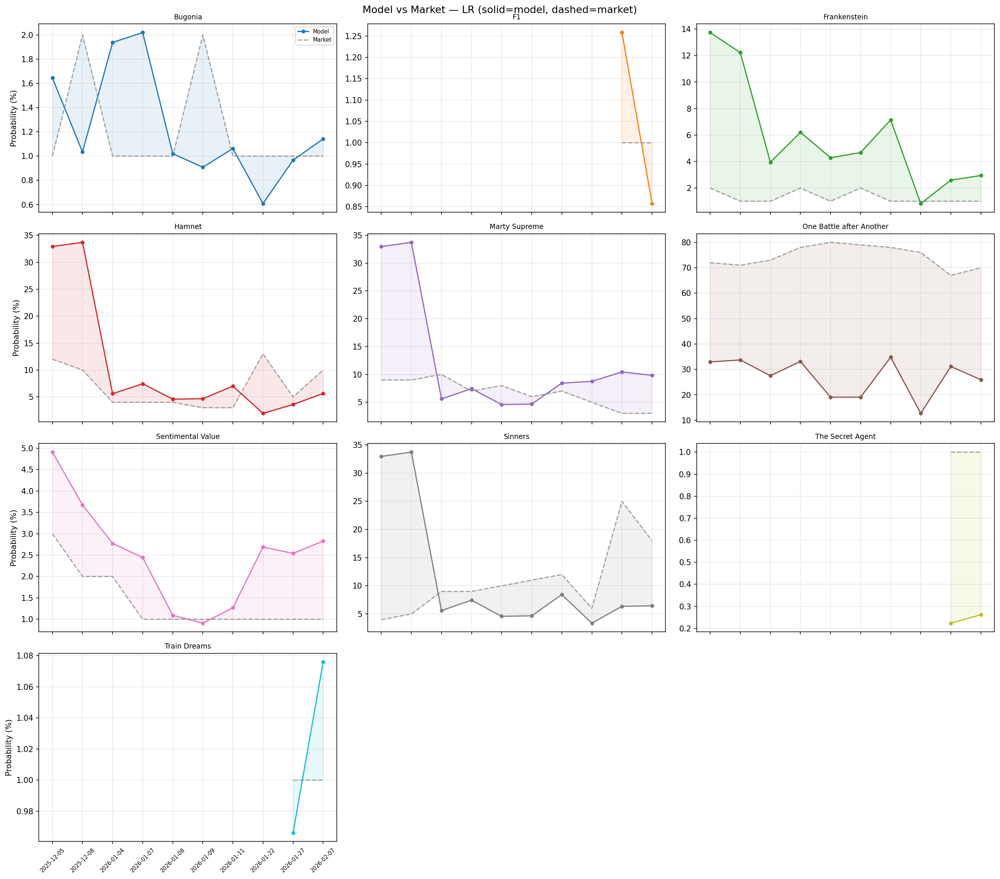 | 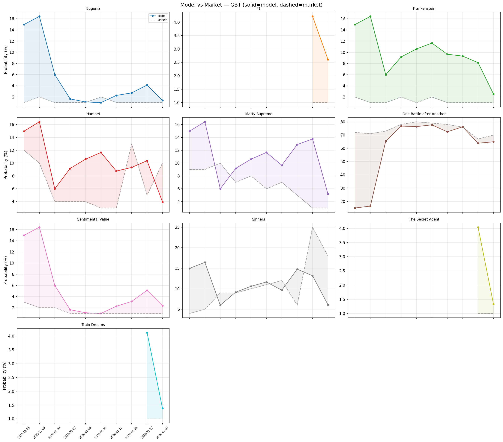 |

The most dramatic difference from the Feb 11 analysis: **GBT now tracks the market much
better on One Battle after Another.** The old GBT had a 57pp collapse (68.6%→11.2%) at
the DGA winner snapshot; the new GBT reaches 64.9% at the final snapshot (vs 70% market),
a gap of only 5pp. LR remains systematically lower than the market on OBaA, with a
maximum probability of only 34.8%.

### Divergence heatmaps

| LR | GBT |
| --- | --- |
| 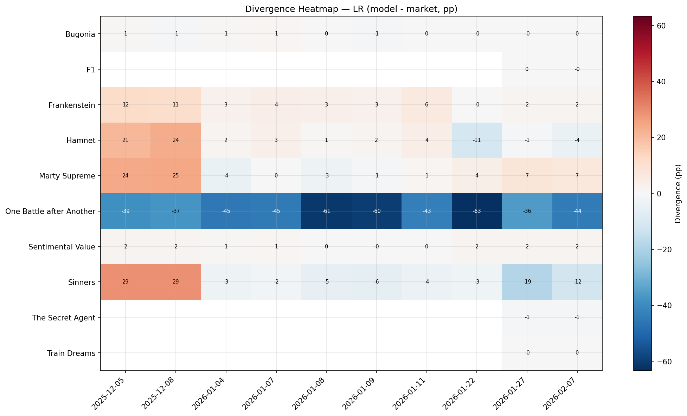 | 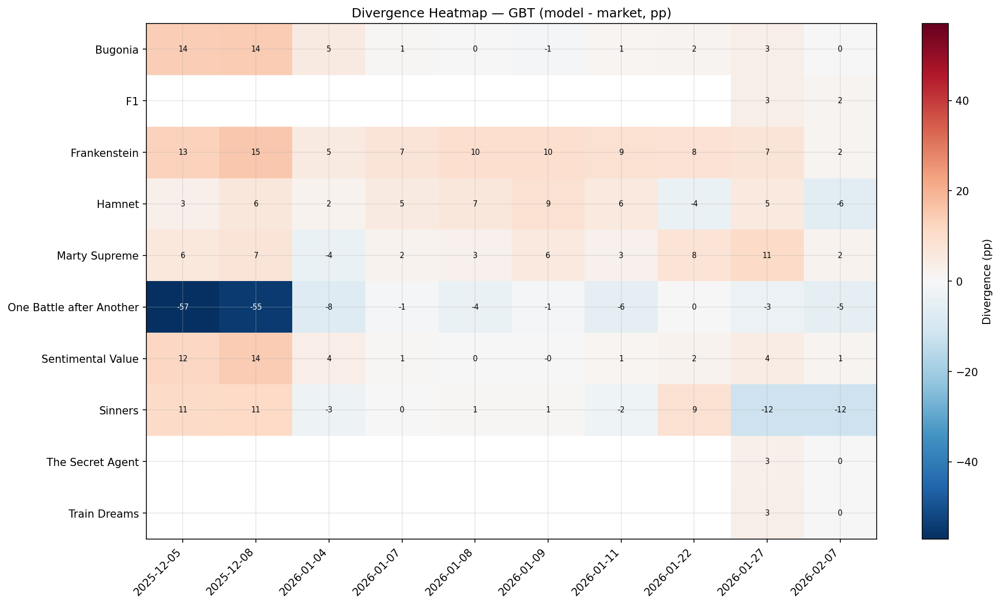 |

LR's heatmap shows a persistent deep blue row for One Battle (−37pp to −63pp model-market
gap). GBT's heatmap is much more moderate — the OBaA row shifts from blue (−57pp at Dec 5)
to nearly neutral (−5pp at Feb 7), confirming the new model's improved market alignment.

### Correlation analysis (model P(win) vs market price)

| Nominee | LR r | GBT r | LR MAE | GBT MAE | n |
|---------|------|-------|--------|---------|---|
| One Battle after Another | −0.39 | **+0.52** | 47.4pp | **13.9pp** | 10 |
| Sinners | −0.49 | −0.34 | 11.1pp | 6.2pp | 10 |
| Sentimental Value | +0.81 | +0.86 | 1.1pp | 4.0pp | 10 |
| Hamnet | +0.49 | +0.24 | 7.3pp | 5.3pp | 10 |
| Marty Supreme | +0.37 | +0.14 | 7.8pp | 5.1pp | 10 |
| Frankenstein | +0.39 | +0.36 | 4.6pp | 8.6pp | 10 |

**GBT's OBaA correlation flipped from +0.45 (old) to +0.52 (new), with MAE dropping from
38.0pp to 13.9pp** — the biggest improvement. LR's OBaA MAE is still 47.4pp, nearly
unchanged from the old model (45.4pp).

### Feature evolution and model learning

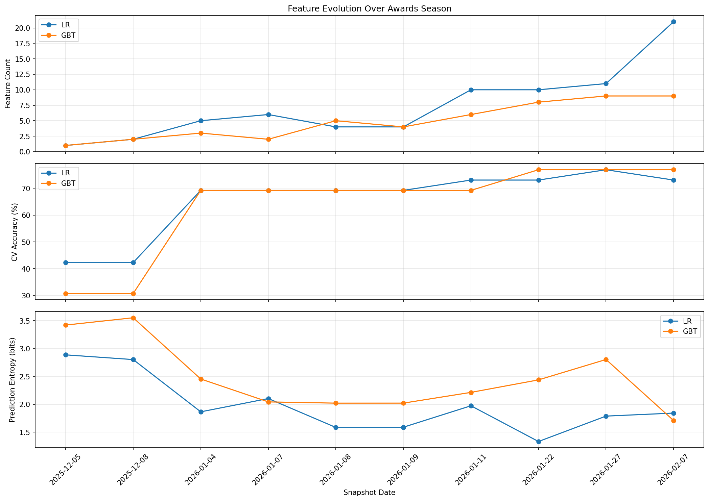

**Feature count** — Both models start with just 1 feature at Dec 5 (vs 4 each in the old
models). LR grows gradually to 21 at the final snapshot. GBT reaches 9 by Jan 22 and
stabilizes — the smaller additive_3 BASE pool means feature selection converges earlier.

**CV accuracy** — Both follow the same two-plateau pattern as the old models: 42/31%
→ 69% (Critics Choice winner) → 73-77%. The new models match or exceed the old models'
accuracy at every snapshot despite using far fewer features.

**Entropy** — LR entropy ranges from 1.33 (Jan 22, most confident) to 2.89 (Dec 5).
GBT entropy is high early (3.55 at Dec 8 — very diffuse predictions), drops after Critics
Choice winner, and reaches its minimum (1.71) at Feb 7.

### Feature importance evolution

| LR | GBT |
| --- | --- |
| 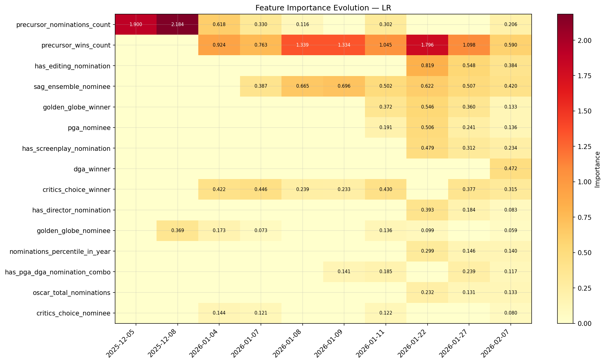 | 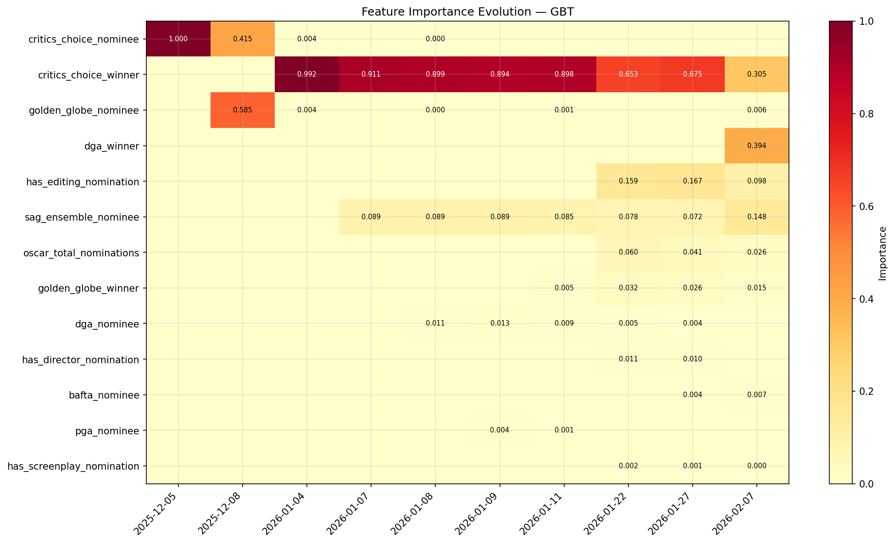 |

**LR** — Dec 5 is dominated by a single feature (`precursor_nominations_count`, importance
1.90). By Feb 7, `precursor_wins_count` (0.59) and `dga_winner` (0.47) are the top two,
with `sag_ensemble_nominee` (0.42) and `has_editing_nomination` (0.38) as supporting
features.

**GBT** — Dec 5 relies entirely on `critics_choice_nominee` (1.0). By Feb 7, `dga_winner`
(0.39) and `critics_choice_winner` (0.31) dominate, with `sag_ensemble_nominee` (0.15)
in third. The heatmap shows a clear phase transition at Jan 4 when winner features
overtake nomination features.

### Marginal information value

| Date | Event | LR Δacc | LR ΔBrier | GBT Δacc | GBT ΔBrier |
|------|-------|---------|-----------|----------|------------|
| 2025-12-08 | Golden Globe noms | +0.0pp | −0.0001 | +0.0pp | −0.0012 |
| 2026-01-04 | **Critics Choice winner** | **+26.9pp** | **−0.0331** | **+38.5pp** | **−0.0422** |
| 2026-01-07 | SAG noms | +0.0pp | −0.0018 | +0.0pp | −0.0031 |
| 2026-01-08 | DGA noms | +0.0pp | +0.0022 | +0.0pp | +0.0007 |
| 2026-01-09 | PGA noms | +0.0pp | +0.0004 | +0.0pp | −0.0007 |
| 2026-01-11 | Golden Globe winner | +3.8pp | −0.0070 | +0.0pp | +0.0004 |
| 2026-01-22 | Oscar noms | +0.0pp | −0.0068 | +7.7pp | −0.0038 |
| 2026-01-27 | BAFTA noms | +3.8pp | +0.0037 | +0.0pp | +0.0016 |
| 2026-02-07 | DGA winner | −3.8pp | +0.0020 | +0.0pp | −0.0125 |

**Critics Choice winner remains the dominant event,** now even more pronounced: +26.9pp LR
(vs +7.7pp old), +38.5pp GBT (vs +23.1pp old). The smaller feature set makes the
single-winner signal even more impactful, since there's less noise from other features.

DGA winner now gives GBT a −0.0125 Brier improvement (vs −0.005 old) — the new model
extracts more value from this late-breaking signal.

### New GBT model is a genuine market competitor (α-blend)

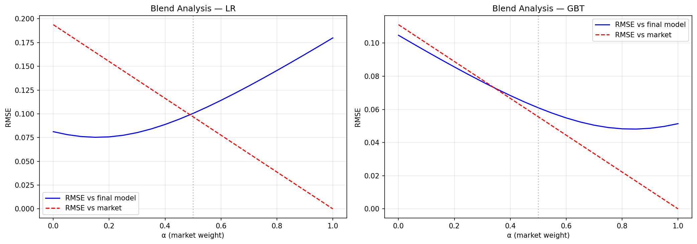

$P_{\text{blend}} = \alpha \cdot P_{\text{market}} + (1-\alpha) \cdot P_{\text{model}}$

**How to interpret α:** α=0 means pure model (market ignored). α=1 means pure
market (model adds nothing). The optimal α minimizes RMSE of blended predictions
vs the most-informed (final snapshot) estimates. A model with low optimal α
provides genuine information the market doesn't have — its edge signals reflect
real mispricings, not noise.

- **LR: α = 0.85** — market gets 85% weight (slightly worse than old α = 0.80), confirming
  LR still can't match the market on its own.
- **GBT: α = 0.15** — **model gets 85% weight!** This is a complete reversal from the old
  model (α = 1.00, pure market was optimal). The new GBT is genuinely better than the
  market when blended — the additive_3 feature set produces stable, reliable probabilities
  that don't exhibit the wild swings of the old model.

This is arguably the most important result: **the new GBT model adds real value over raw
market prices,** whereas the old GBT was pure noise relative to the market.

### Calibration

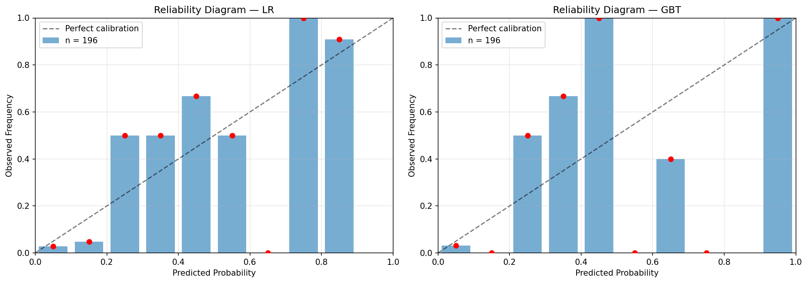

Both models roughly follow the diagonal. The calibration pattern is similar to the old
models — neither systematically over- or under-predicts.

### Rank comparison (Spearman ρ with market)

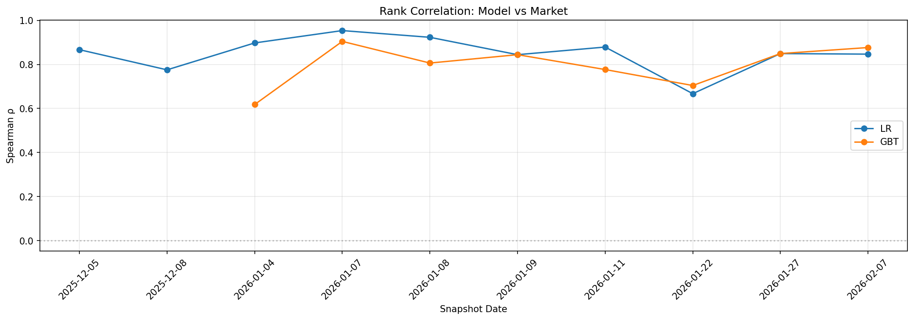

| Date | Event | LR ρ | GBT ρ |
|------|-------|------|-------|
| 2025-12-05 | Critics Choice noms | +0.87 | — |
| 2026-01-04 | Critics Choice winner | +0.90 | +0.62 |
| 2026-01-07 | SAG noms | **+0.95** | +0.91 |
| 2026-01-22 | Oscar noms | +0.67 | +0.70 |
| 2026-02-07 | DGA winner | +0.85 | **+0.88** |

LR maintains high rank correlation throughout (peak +0.95 at SAG noms). **GBT reaches
+0.88 at the final snapshot** — a massive improvement over the old model's +0.55. The new
GBT no longer scrambles rankings at the end of season.

### Model agreement (LR vs GBT)

Models agree on top pick in 8/10 snapshots (80%). The early disagreements (Dec 5-8:
LR picks Hamnet, GBT picks Bugonia) resolve after Critics Choice winner, after which
both lock onto One Battle after Another for all remaining snapshots.

### Event impact analysis

| Event | LR top movers | GBT top movers |
|-------|---------------|----------------|
| Critics Choice winner (Jan 4) | Sinners −28.1pp, Marty −28.1pp, Hamnet −28.1pp | **OBaA +49.0pp**, Sinners −10.4pp |
| SAG noms (Jan 7) | OBaA +5.6pp, Frankenstein +2.3pp | OBaA +11.3pp, Sentimental −4.4pp |
| Golden Globe winner (Jan 11) | OBaA +15.7pp, Sinners +3.8pp | OBaA −5.2pp, Hamnet −2.9pp |
| Oscar noms (Jan 22) | OBaA −22.1pp, Frankenstein −6.3pp | Sinners +5.1pp, OBaA +3.8pp |
| BAFTA noms (Jan 27) | OBaA +18.4pp, Sinners +3.0pp | OBaA −12.4pp |
| DGA winner (Feb 7) | OBaA −5.2pp, Hamnet +2.0pp | Marty −8.6pp, Sinners −7.0pp |

GBT's Critics Choice winner impact (+49.0pp for OBaA) is even larger than the old model's
(+35.9pp), while the DGA winner impact is distributed across losing nominees rather than
causing a dramatic frontrunner collapse.

### Old vs new model comparison

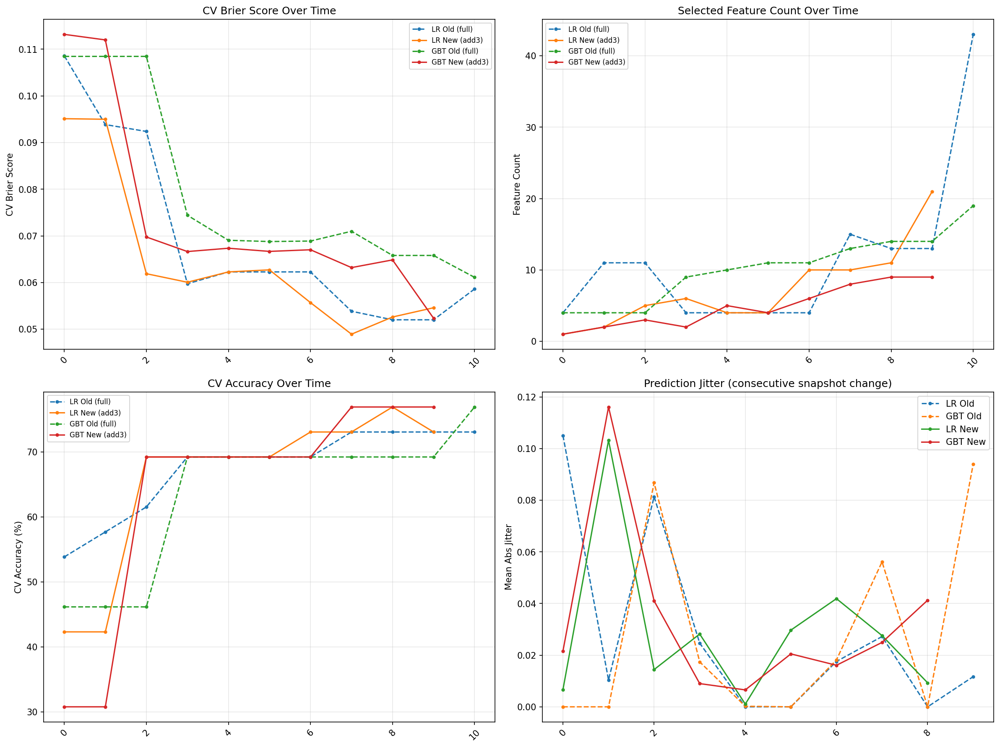

| Model | Config | Features | Brier | Accuracy | Jitter |
|-------|--------|----------|-------|----------|--------|
| LR | Old (full, 47 candidates) | 43 | 0.0586 | 73.1% | 0.0278 |
| LR | New (additive_3 FULL, 25 candidates) | 21 | **0.0546** | 73.1% | 0.0291 |
| GBT | Old (full, 42 candidates) | 19 | 0.0611 | 76.9% | 0.0273 |
| GBT | New (additive_3 BASE, 17 candidates) | 9 | **0.0523** | 76.9% | 0.0330 |

**Both models improve Brier score with fewer features.** LR drops from 0.0586→0.0546
(−6.8%) with half the features. GBT drops from 0.0611→0.0523 (−14.4%) with less than
half the features.

**Trade-off: jitter increases slightly.** New LR jitter 0.0291 (vs 0.0278), new GBT
jitter 0.0330 (vs 0.0273). The smaller feature set is less smooth across snapshots —
each feature addition/removal has proportionally more impact. However, the calibration
improvement outweighs the stability cost for trading purposes.

### Temporal analysis takeaways

- **Simpler models are better models.** Additive_3 with 9-21 selected features beats the
  full feature set (19-43 features) on Brier score. Feature selection from a curated
  25-feature pool produces more reliable predictions than selecting from 42-47 candidates.
- **GBT is now a genuine market competitor.** The optimal market blend gives the new GBT
  85% model weight (α=0.15) vs 0% for the old model (α=1.00). The probability calibration
  is stable enough to add real value over raw market prices.
- **Critics Choice winner is even more pivotal** with the streamlined feature set:
  +26.9pp LR accuracy, +38.5pp GBT accuracy at that single event. Winner features
  are the core signal; nomination features are supporting context.
- **The old GBT's DGA-winner collapse is fixed.** The new GBT reaches 64.9% for OBaA at
  the final snapshot (market: 70%), a 5pp gap. The old GBT collapsed to 11.2% (59pp gap).
  Removing noisy interaction features prevents the greedy splits from amplifying volatile
  late-season signals.
- **LR still can't match the market** — 85% market weight is needed in the optimal blend.
  LR's diffuse probability distribution (max 25.9% for OBaA vs market 70%) is a persistent
  structural limitation: the model spreads probability too evenly across nominees.

## Storage Structure

```
storage/d20260214_trade_signal_ablation/
├── build_models.log           # Model build log
├── configs/                   # 1742 JSON config files (1728 main + 10 α-blend + 4 normalize)
├── datasets/                  # Per-date datasets (copied from d20260211)
├── models/                    # Temporal model snapshots
│   ├── lr/{date}/             # LR models per snapshot date
│   └── gbt/{date}/            # GBT models per snapshot date
├── results/
│   ├── ablation_results.json  # Full results (all configs + snapshots)
│   └── ablation_summary.csv   # Summary CSV (one row per config)
├── parameter_sensitivity.png  # Bar charts by parameter
├── interaction_heatmaps.png   # Pairwise parameter heatmaps
├── return_distribution.png    # Return distribution histogram
├── fees_vs_return.png         # Fee impact scatter plot
├── deep_dive_*.png            # Best/worst config trade replays
├── gbt_vs_lr_analysis.png     # GBT vs LR edge/probability analysis
├── edge_over_time_all_outcomes.png  # Edge evolution for all outcomes
├── model_vs_market_{lr,gbt}.png  # Temporal: model vs market plots
├── divergence_heatmap_{lr,gbt}.png  # Temporal: divergence heatmaps
├── feature_evolution.png      # Temporal: feature count/accuracy/entropy
├── feature_importance_evolution_{lr,gbt}.png  # Temporal: importance heatmaps
├── market_blend_analysis.png  # Temporal: α-blend optimization
├── reliability_diagram.png    # Temporal: calibration plot
├── rank_comparison.png        # Temporal: Spearman ρ with market
├── old_vs_new_comparison.png  # Temporal: old vs new model comparison
└── model_predictions_timeseries.csv  # All model predictions across time
```

## Scripts

| Script | Purpose |
|--------|---------|
| `run.sh` | End-to-end orchestrator |
| `build_models.sh` | Build temporal model snapshots with best configs |
| `generate_configs.py` | Generate 1742-config ablation grid (1728 main + 10 α-blend + 4 normalize) |
| `run_ablation.py` | Parallel grid sweep runner |
| `analyze_ablation.py` | Analysis: sensitivity tables, plots, settlements |
| `analyze_temporal.sh` | Temporal analysis of additive_3 models |
| `analyze_deep_dive.py` | Deep-dive: best/worst config replays, GBT vs LR |

## Reproduction

```bash
cd "$(git rev-parse --show-toplevel)"
bash oscar_prediction_market/one_offs/\
    d20260214_trade_signal_ablation/run.sh \
    2>&1 | tee storage/d20260214_trade_signal_ablation/run.log
```

Requires: intermediate dataset files in `storage/d20260201_build_dataset/`,
Kalshi API access (cached after first fetch).
