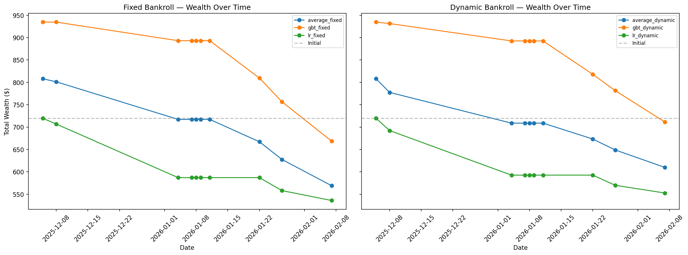
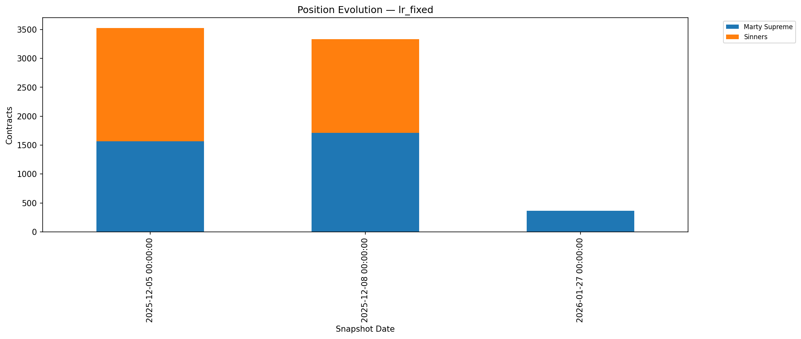
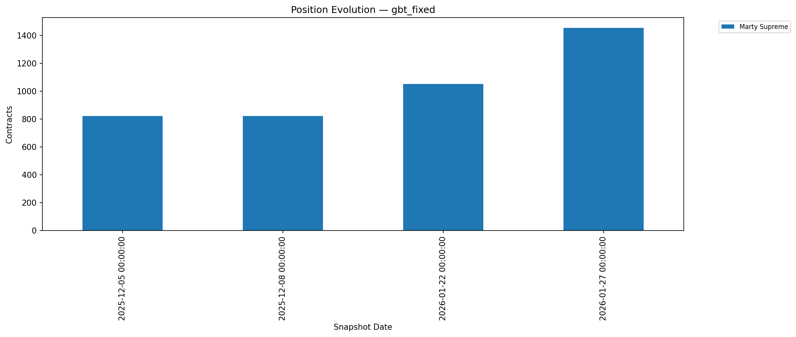

# Trade Signal Backtest

**Storage:** `storage/d20260214_trade_signal_backtest/`

End-to-end backtest of the trade signal pipeline: model predictions → edge computation →
Kelly sizing → simulated execution over 10 temporal snapshots (Dec 2025 – Feb 2026).

## Setup

- $1,000 initial bankroll, 0.25x fractional Kelly
- Min edge threshold: 5%, sell threshold: -3%
- Spread estimated from trade history (median buy/sell price gaps)
- 3 model types (LR, GBT, LR+GBT average) × 2 bankroll modes (fixed $1,000 vs dynamic)

**Pipeline:** `edge.py` computes net edge (model prob − implied prob − fees − spread),
`kelly.py` sizes positions via multi-outcome Kelly (SLSQP optimizer accounting for
mutual exclusivity), `signals.py` generates BUY/SELL/HOLD with position deltas.

## Findings

### All strategies lose money — fees are the dominant driver

| Backtest | Final Wealth | Return | Fees Paid | Trades |
|----------|-------------|--------|-----------|--------|
| lr_fixed | $535.91 | -46.4% | $565.46 | 8 |
| lr_dynamic | $552.58 | -44.7% | $533.82 | 8 |
| gbt_fixed | $668.56 | -33.1% | $318.64 | 5 |
| gbt_dynamic | $711.17 | -28.9% | $277.76 | 6 |
| average_fixed | $568.93 | -43.1% | $473.76 | 9 |
| average_dynamic | $609.91 | -39.0% | $428.12 | 9 |



- **Fees are the dominant loss driver.** LR_fixed paid $565 in fees on a $1,000 bankroll —
  over half the capital lost to transaction costs alone. The 7% taker fee at low price
  levels (5-25c) consumes most of the model's edge.
- **GBT outperforms LR** (-33% vs -46%) by being more conservative: fewer trades (5 vs 8),
  lower fees ($319 vs $565). GBT finds edge less often, which paradoxically helps since
  most trades are losers.
- **Dynamic bankroll slightly outperforms fixed** (+2-4pp) because after early losses,
  smaller bankroll naturally sizes down subsequent bets.
- **Early snapshots bet aggressively on long-shots** (Sinners at 5c, Marty Supreme at 10c)
  where the model sees edge. These positions are subsequently sold at a loss.
- **The pipeline mechanics work correctly** — the issue is the model's probability estimates
  don't beat the market by enough to cover transaction costs.

### Position evolution

| LR | GBT |
| --- | --- |
|  |  |

This backtest motivated the [parameter ablation](../d20260214_trade_signal_ablation/)
which discovered that maker fees and corrected fee formula turn the best GBT config
profitable (+23.5%).

## How to Run

```bash
cd "$(git rev-parse --show-toplevel)"
bash oscar_prediction_market/one_offs/d20260214_trade_signal_backtest/run.sh \
    2>&1 | tee storage/d20260214_trade_signal_backtest/run.log
```

## Output Structure

```
storage/d20260214_trade_signal_backtest/
├── backtest_results.json
├── wealth_curves.png
├── settlement_heatmap.png
├── positions_*.png
├── wealth_timeseries.csv
├── settlement_scenarios.csv
└── position_history.csv
```
