# Multinomial Modeling — Binary vs. Multinomial Prediction Models

**Storage:** `storage/d20260217_multinomial_modeling/`

Compares binary prediction models (independent per nominee) against multinomial
models (probabilities constrained to sum to 1 per ceremony) for Oscar Best Picture.

## Motivation

Independent binary models (logistic regression, gradient boosting) predict each
nominee's win probability separately. These probabilities don't sum to 1 across
nominees in a given ceremony — they can sum to 0.5 or 2.0+. This is a theoretical
problem: exactly one nominee wins, so probabilities should form a valid distribution.

This experiment asks: **Does enforcing the multinomial constraint improve predictions
and trading performance?**

## Models Compared

| Model | Type | Constraint | Features |
|-------|------|-----------|----------|
| Binary LR | Logistic Regression | None (independent) | lr_standard (25) |
| Binary GBT | Gradient Boosting | None (independent) | gbt_standard (17) |
| Conditional Logit | Conditional Logistic Regression | Sum-to-1 per ceremony | lr_standard (25) |
| Softmax GBT | Multi-class XGBoost (softmax) | Sum-to-1 per ceremony | gbt_standard (17) |
| Cal. Softmax GBT | Binary GBT + Softmax | Temperature-scaled sum-to-1 | gbt_standard (17) |

**Conditional Logit** uses statsmodels `discrete_model.ConditionalLogit` with elastic
net regularization. It models $P(\text{win}_i | \text{ceremony}_j) = \frac{e^{X_i \beta}}{\sum_k e^{X_k \beta}}$,
structurally enforcing probabilities to sum to 1 within each ceremony.

**Softmax GBT** uses XGBClassifier with `objective='multi:softprob'`, treating each
ceremony as a K-class classification problem. Probabilities are softmax-normalized.

**Calibrated Softmax GBT** addresses Softmax GBT's overfitting by decomposing the
problem: a standard binary GBT trains on ~250 rows with F=17 features (avoiding
the K×F parameter explosion), then converts predicted probabilities to log-odds
scaled by a temperature parameter T: $\text{logit}_i = \log(p_i / (1-p_i)) / T$.
Per-ceremony softmax normalization produces valid distributions. Temperature T
is tuned externally via the hyperparameter grid (50 configs).

## Setup

- 10 temporal snapshots (2025-12-05 to 2026-02-07; 2025-11-30 skipped, no features)
- Leave-one-year-out CV on 2000–2025 data
- Feature selection with importance > 0 filtering
- Trading backtest with best config from d20260214: kelly=0.10, min_edge=0.05,
  sell_edge=-0.03, maker fees, multi_outcome kelly, α=0.15 market blending

## Findings

### Conditional Logit matches Binary LR accuracy; Cal. Softmax GBT is the best-calibrated GBT

| Model | Accuracy | Top-3 | MRR | Brier | Log Loss | Winner Prob | Prob Sum |
|-------|----------|-------|-----|-------|----------|-------------|----------|
| Binary LR | 65.8% | 94.2% | 0.796 | 0.0688 | 0.2288 | 0.495 | 1.00 ± 0.18 |
| Conditional Logit | 65.8% | 93.1% | 0.794 | 0.0674 | 0.2274 | 0.490 | 1.00 ± 0.00 |
| Binary GBT | 63.8% | 76.2% | 0.736 | 0.0770 | 0.2716 | 0.430 | 1.00 ± 0.22 |
| Cal. Softmax GBT | 62.7% | 76.9% | 0.729 | 0.0735 | 0.2583 | 0.473 | 1.00 ± 0.00 |
| Softmax GBT | 50.4% | 80.8% | 0.669 | 0.0968 | 0.4098 | 0.349 | 0.96 ± 0.04 |

Conditional Logit achieves identical accuracy (65.8%) to Binary LR with slightly
better Brier score (0.0674 vs 0.0688) and perfect probability normalization
(std=0.00 vs 0.18). The multinomial constraint doesn't hurt discriminative
performance and provides better-calibrated probabilities — every ceremony's
nominee probabilities sum to exactly 1.0.

Cal. Softmax GBT (62.7% accuracy, 0.0735 Brier) substantially improves over
Softmax GBT (50.4%, 0.0968) and also achieves perfect sum-to-1 normalization. It
trails the linear models by ~3pp accuracy but achieves the best Brier score at the
latest snapshot (0.0481 on 2026-02-07) — better than Binary LR (0.0567) and
Conditional Logit (0.0561) at that date. The temperature parameter was selected
as T=1.0, meaning the binary GBT's logits were already well-scaled and didn't
need temperature adjustment.

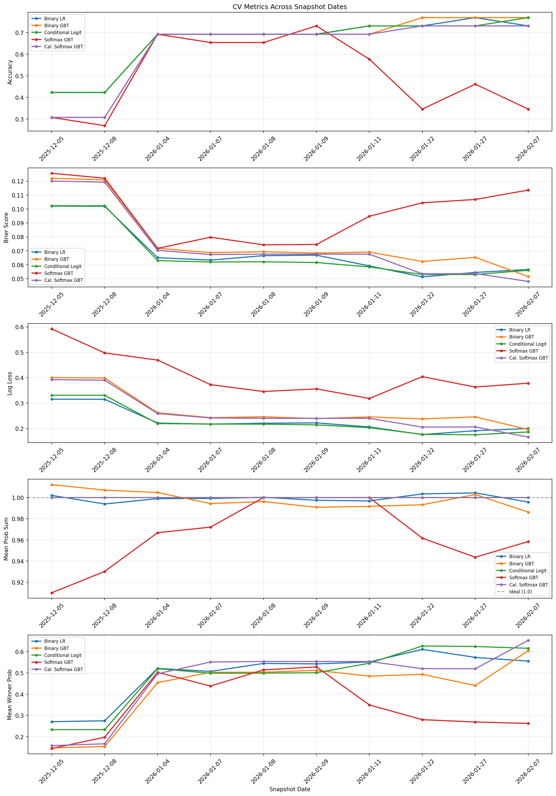

### Probability distribution: multinomial models spread mass more evenly

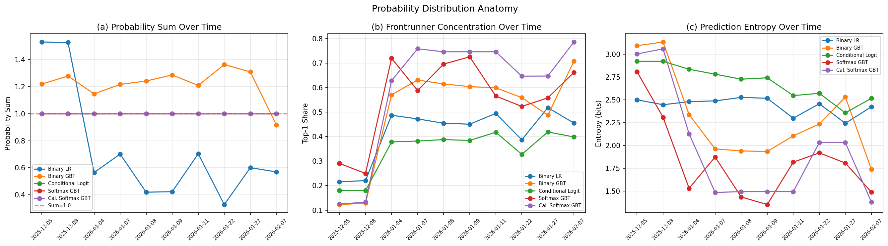

| Model | Entropy (bits) | Herfindahl | Top-1 Share | Top-3 Share | Prob Sum |
|-------|----------------|------------|-------------|-------------|----------|
| Binary LR | 2.44 | 0.257 | 41.6% | 70.5% | 0.74 ± 0.41 |
| Binary GBT | 2.30 | 0.333 | 50.3% | 68.3% | 1.22 ± 0.12 |
| Conditional Logit | 2.69 | 0.206 | 34.6% | 65.0% | 1.00 ± 0.00 |
| Cal. Softmax GBT | 1.96 | 0.444 | 59.6% | 72.9% | 1.00 ± 0.00 |
| Softmax GBT | 1.84 | 0.395 | 55.8% | 83.6% | 1.00 ± 0.00 |

Key observations:
- **Conditional Logit** has the highest entropy (2.69 bits) and lowest Herfindahl
  (0.206), meaning it distributes probability most evenly across nominees. This
  matters for trading: more spread-out probabilities create more diverse buy signals.
- **Softmax GBT** is the most concentrated by entropy (1.84 bits), while **Cal.
  Softmax GBT** has the highest Herfindahl (0.444) and highest top-1 share (59.6%).
  Both GBT-based multinomial models concentrate probability more than the linear models.
- **Cal. Softmax GBT** has higher entropy (1.96) than Softmax GBT (1.84) but a
  higher Herfindahl (0.444 vs 0.395). This means Cal. Softmax GBT puts more mass
  on its top pick (59.6% vs 55.8%) but spreads the remaining mass more evenly
  across other nominees — a sharper but more calibrated distribution.
- **Binary LR** has wildly variable probability sums (0.74 ± 0.41), sometimes
  summing to less than 0.5 or more than 1.5 across nominees in a single ceremony.
- **Binary GBT** consistently over-predicts (mean sum 1.22), suggesting its
  probabilities are systematically inflated.

### Binary LR vs Conditional Logit: side-by-side comparison

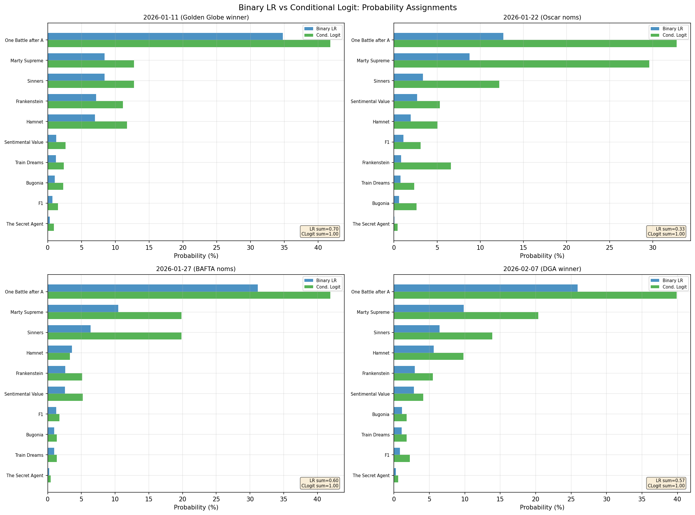

The side-by-side shows how conditional logit redistributes probability mass
relative to binary LR. At each snapshot, the probability ordering is nearly
identical (Spearman ρ = 0.971 on average), but the conditional logit pulls
from the extremes: the frontrunner gets slightly less mass, and the long-shots
get slightly more. This is the normalization constraint at work — when probabilities
must sum to 1, the model can't give 40% to one nominee and 5% to another without
accounting for the remaining nominees.

### Calibration: conditional logit is best-calibrated

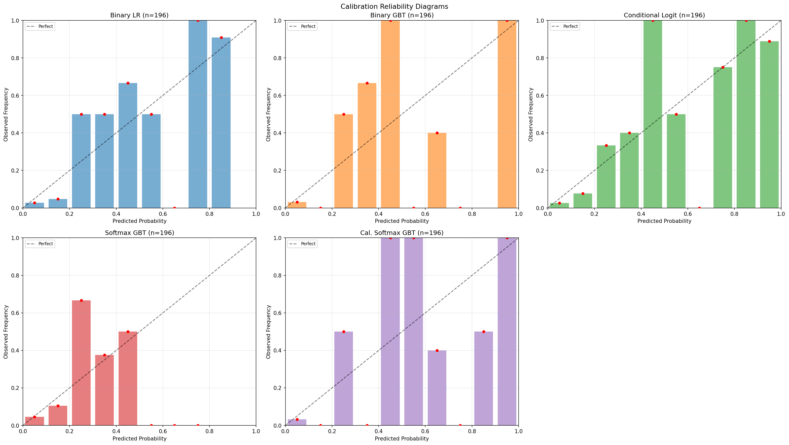

The reliability diagrams show predicted probability bins vs observed win frequency
from LOYO cross-validation. All models are reasonably well-calibrated at low
probabilities (the bulk of predictions). The key difference is at the high end:
conditional logit's bars track the diagonal more closely than binary LR, meaning
its confident predictions (>50%) are more accurate. Cal. Softmax GBT shows
calibration intermediate between Binary GBT and Conditional Logit.

### Cal. Softmax GBT solves the Softmax GBT overfitting problem

Softmax GBT underperforms dramatically: 50.4% accuracy vs 65.8% for the LR
models, and nearly double the Brier score (0.0968). The multi-class XGBoost
formulation overfits on ~26 ceremonies of training data because the K-class
softmax objective effectively learns K×F parameters (K nominees × F features).

Cal. Softmax GBT addresses this by decomposing the problem: train a binary
GBT on ~250 rows (all nominees pooled, F=17 features), then apply temperature-scaled
softmax normalization per ceremony. This reduces the effective parameter count
from K×F≈85 to F=17 and increases the training set from ~26 to ~250.

The result: 62.7% accuracy (vs 50.4% for Softmax GBT), 0.0735 Brier (vs 0.0968),
and perfect sum-to-1 probabilities. Per-snapshot analysis shows Cal. Softmax GBT
is much more stable — it doesn't collapse at later snapshots like Softmax GBT does
(73.1% vs 34.6% accuracy on 2026-01-22, 73.1% vs 34.6% on 2026-02-07). However,
it still falls short of the linear models' accuracy, suggesting that for this
dataset size, the conditional logit's single-index structure captures the key
patterns more efficiently than tree-based approaches.

### Model agreement: LR and Conditional Logit are near-identical in ranking

| Model Pair | Mean Spearman ρ | Min | Max |
|------------|-----------------|-----|-----|
| Binary LR ↔ Conditional Logit | 0.971 | 0.915 | 1.000 |
| Binary GBT ↔ Cal. Softmax GBT | 0.920 | 0.588 | 1.000 |
| Binary GBT ↔ Conditional Logit | 0.901 | 0.721 | 0.951 |
| Binary LR ↔ Binary GBT | 0.886 | 0.721 | 1.000 |
| Binary LR ↔ Cal. Softmax GBT | 0.855 | 0.529 | 1.000 |
| Conditional Logit ↔ Cal. Softmax GBT | 0.848 | 0.530 | 0.979 |
| Binary GBT ↔ Softmax GBT | 0.738 | 0.477 | 0.931 |
| Cal. Softmax GBT ↔ Softmax GBT | 0.733 | 0.477 | 0.965 |
| Conditional Logit ↔ Softmax GBT | 0.700 | 0.142 | 0.899 |
| Binary LR ↔ Softmax GBT | 0.694 | 0.142 | 0.965 |

Binary LR and Conditional Logit produce nearly identical rankings (ρ=0.971).
Cal. Softmax GBT correlates most strongly with Binary GBT (ρ=0.920), confirming
that the softmax post-processing preserves the underlying GBT ranking while
normalizing the probabilities. Softmax GBT has the weakest correlation with all
other models, and its minimum ρ=0.142 means it occasionally produces rankings
that are nearly uncorrelated with the consensus.

### Top pick agreement: models converge after Critics Choice

| Date | Event | LR | GBT | CLogit | SoftGBT | CalSGBT | Agree? |
|------|-------|----|-----|--------|---------|---------|--------|
| 2025-12-05 | Critics Choice noms | Hamnet | Bugonia | Hamnet | Bugonia | Bugonia | No |
| 2025-12-08 | Golden Globe noms | Hamnet | Bugonia | Hamnet | Marty Supreme | Bugonia | No |
| 2026-01-04 | Critics Choice winner | One Battle.. | One Battle.. | One Battle.. | One Battle.. | One Battle.. | **Yes** |
| 2026-01-07 | SAG noms | One Battle.. | One Battle.. | One Battle.. | One Battle.. | One Battle.. | **Yes** |
| 2026-01-08 | DGA noms | One Battle.. | One Battle.. | One Battle.. | One Battle.. | One Battle.. | **Yes** |
| 2026-01-09 | PGA noms | One Battle.. | One Battle.. | One Battle.. | One Battle.. | One Battle.. | **Yes** |
| 2026-01-11 | Golden Globe winner | One Battle.. | One Battle.. | One Battle.. | One Battle.. | One Battle.. | **Yes** |
| 2026-01-22 | Oscar noms | One Battle.. | One Battle.. | One Battle.. | Sinners | One Battle.. | No |
| 2026-01-27 | BAFTA noms | One Battle.. | One Battle.. | One Battle.. | Sinners | One Battle.. | No |
| 2026-02-07 | DGA winner | One Battle.. | One Battle.. | One Battle.. | Sinners | One Battle.. | No |

Before Critics Choice, models disagree on the frontrunner — notably Cal. Softmax GBT
agrees with Binary GBT (both pick Bugonia) rather than the linear models (Hamnet).
After the Critics Choice winner announcement, LR/GBT/CLogit/CalSGBT all converge on
"One Battle after Another" and stay there. Only Softmax GBT diverges after Oscar noms,
picking Sinners — consistent with its overfitting behavior.

### Post-hoc normalization has negligible impact on binary models

| Model | Brier (raw) | Brier (normalized) | Log Loss (raw) | Log Loss (norm) |
|-------|-------------|-------------------|----------------|-----------------|
| Binary LR | 0.0688 | 0.0669 | 0.2288 | 0.2244 |
| Binary GBT | 0.0770 | 0.0749 | 0.2716 | 0.2644 |

Normalizing binary model probabilities to sum to 1 improves Brier by ~2% and
log loss by ~2-3%. This is much smaller than the model-choice effect. The
conditional logit and Cal. Softmax GBT achieve these benefits structurally.

### Model vs market: all models lag market confidence

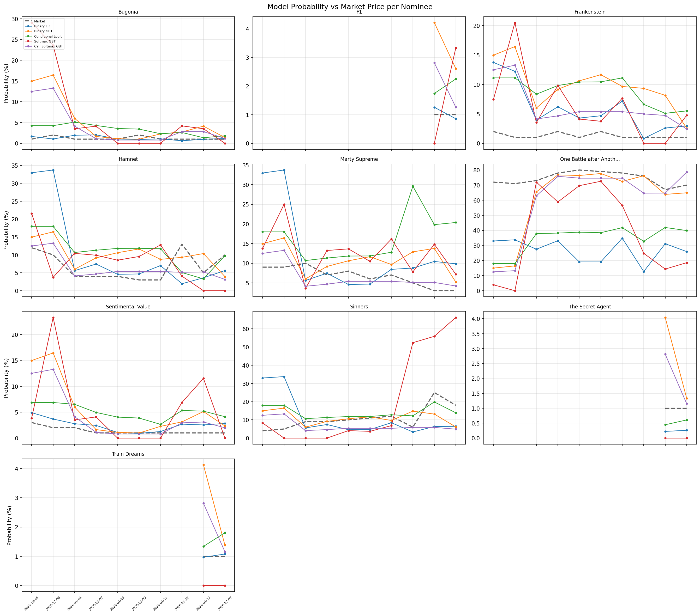

The model-vs-market comparison shows each nominee's model probability (colored
lines) versus the Kalshi market price (black dashed). All models track market
prices directionally but with different amplitudes:
- The frontrunner (One Battle after Another) gets ~26% from Binary LR but ~40%
  from Conditional Logit at the final snapshot. The market gives it ~64%. All models
  underpredict the frontrunner relative to the market.
- Long-shots like Train Dreams and The Secret Agent are priced at 1-2% by both
  market and models, with minimal divergence.

### Divergence heatmaps: where models disagree with the market

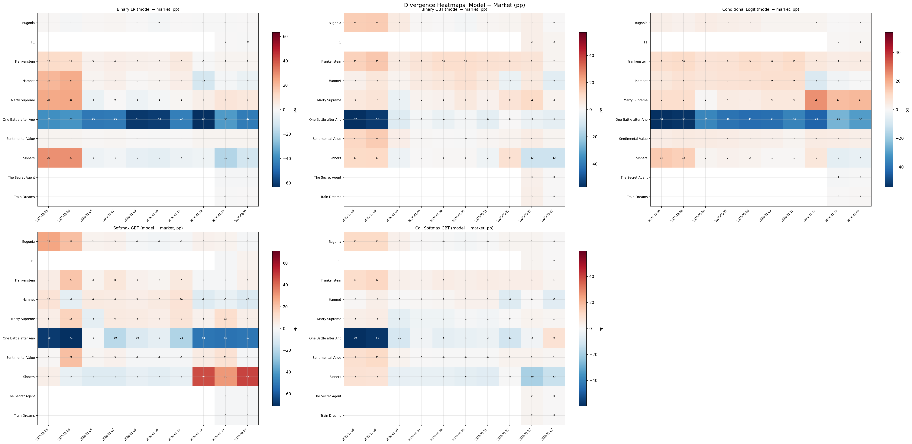

The divergence heatmaps show model−market probability gap in percentage points
per nominee × snapshot date. Red = model higher than market, blue = model lower.

Key patterns:
- **All models** are blue on the frontrunner (One Battle after Another) — models
  consistently predict lower probability than the market. This is the canonical
  "model lags market" pattern.
- **Conditional Logit** redistributes this deficit more evenly to other nominees,
  creating positive edges on more outcomes. Binary LR's deficit is absorbed into
  its non-normalized probability sum instead.
- **Cal. Softmax GBT** shows a similar pattern to Binary GBT — both derive from the
  same feature set — but with slightly different magnitudes due to the softmax
  normalization redistributing probability mass.
- **Softmax GBT** has the most extreme divergences (darkest cells), reflecting
  its noisy predictions.

### Edge distribution: how models create trading opportunities

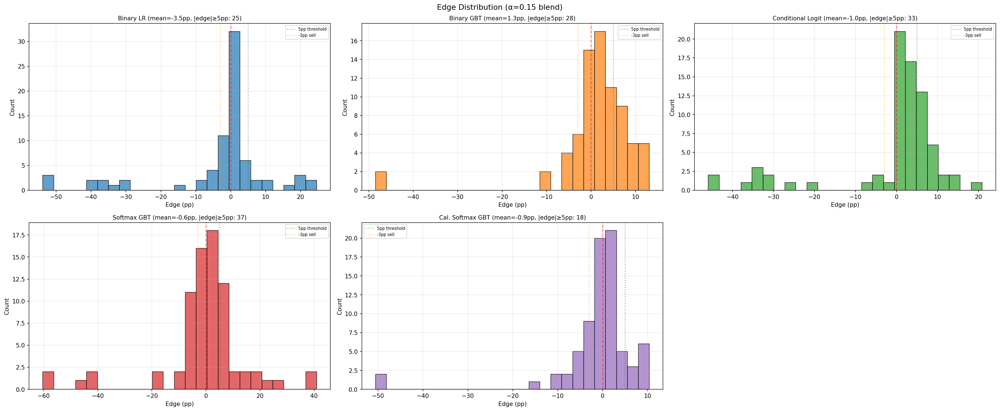

The edge distribution (blended model prob − market price, with α=0.15 market
blend) shows the trading signal strength per model. Models with wider edge
distributions generate more trading activity:
- **Conditional Logit** and **Binary LR** have similar, narrow distributions
  centered near 0 — they're close to market consensus.
- **Cal. Softmax GBT** has a distribution similar to Binary GBT — both use the
  same underlying features and produce similar rankings (ρ=0.920).
- **Softmax GBT** has the widest distribution, generating more "actionable" edges
  (|edge|≥5pp). This explains its higher trading volume despite worse predictions.

### Feature importance: what drives each model

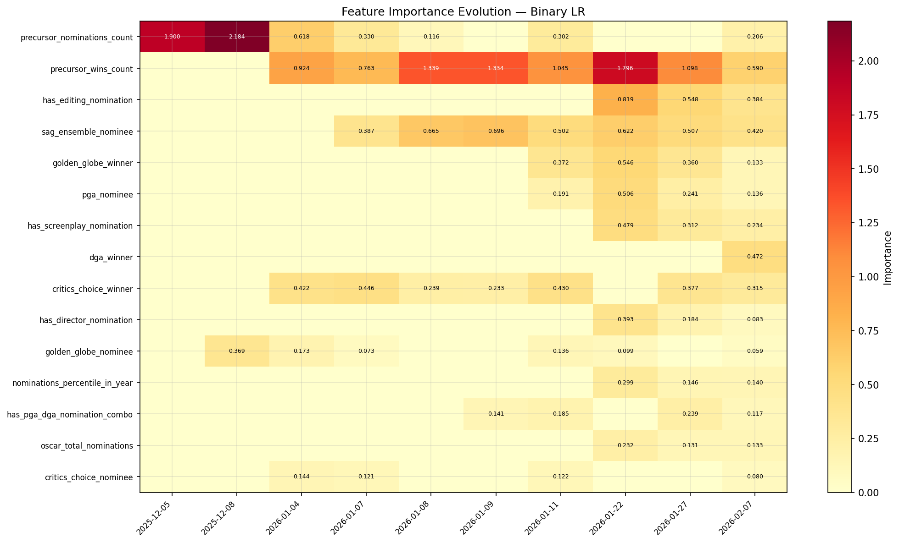

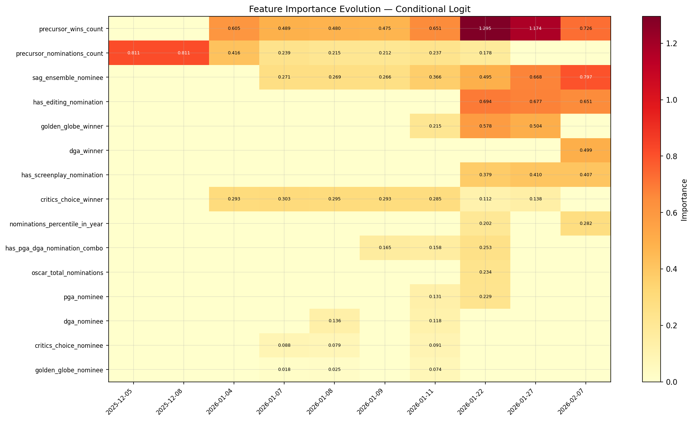

Binary LR and Conditional Logit share the same feature set (lr_standard, 25 features)
but weight them differently. The conditional logit tends to spread importance more
evenly across features because the multinomial structure allows shared features to
contribute to the relative ranking rather than independently.

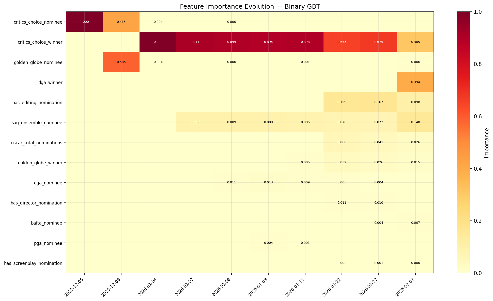

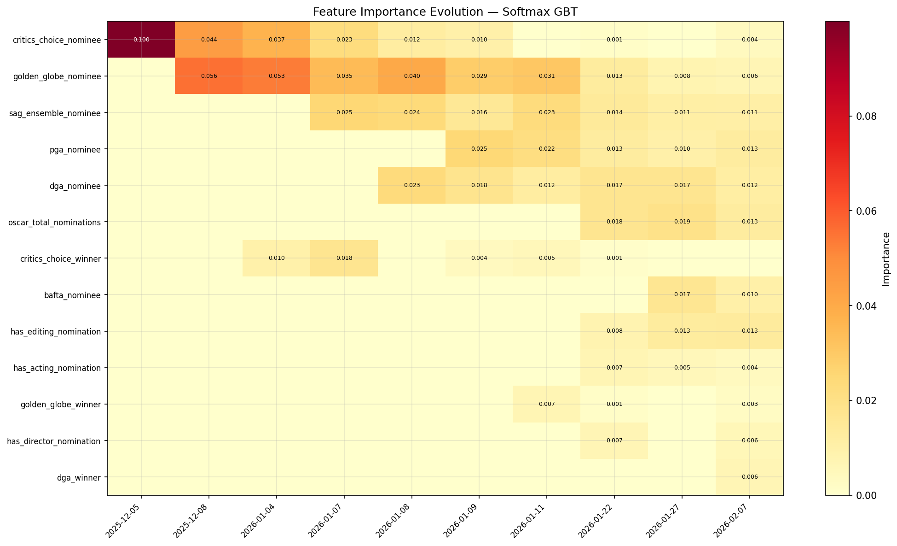

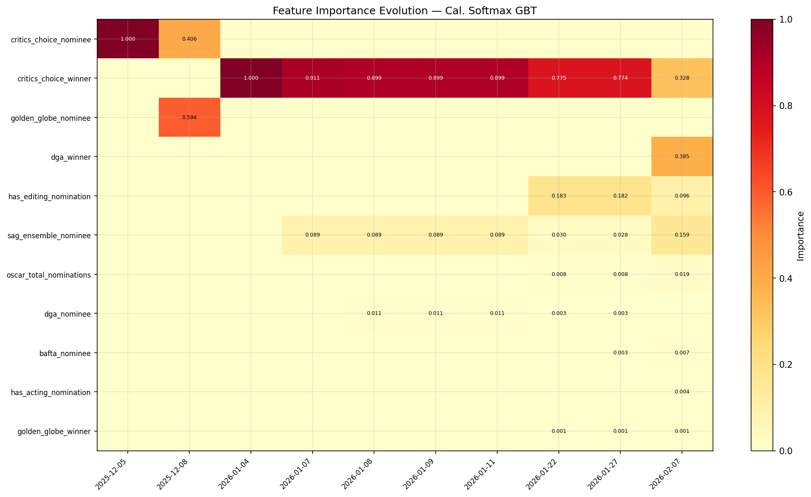

Binary GBT, Softmax GBT, and Cal. Softmax GBT share the gbt_standard feature set
(17 features). Cal. Softmax GBT's importance pattern closely matches Binary GBT —
expected since they share the same underlying binary model. The softmax variant shows
more volatile importance across snapshots, consistent with its overfitting behavior.

## Trading Backtest

### Configuration

Using best config from [d20260214_trade_signal_ablation](../d20260214_trade_signal_ablation/):
kelly=0.10, min_edge=5pp, sell_edge=-3pp, maker fees, multi_outcome kelly,
α=0.15 market blend, dynamic bankroll.

### Results summary

| Model | Mode | Final Wealth | PnL | Return | Trades | Fees | Open Contracts | Open MtM |
|-------|------|-------------|-----|--------|--------|------|----------------|----------|
| Binary LR | dynamic | $1024.83 | +$24.83 | +2.5% | 14 | $17 | 0 | $0 |
| Binary LR | fixed | $1017.09 | +$17.09 | +1.7% | 14 | $17 | 0 | $0 |
| Binary GBT | dynamic | $1235.46 | +$235.46 | +23.5% | 28 | $30 | 0 | $0 |
| Binary GBT | fixed | $1212.61 | +$212.61 | +21.3% | 28 | $30 | 0 | $0 |
| Conditional Logit | dynamic | $1080.63 | +$80.63 | +8.1% | 24 | $24 | 3504 | $105 |
| Conditional Logit | fixed | $1100.09 | +$100.09 | +10.0% | 24 | $24 | 3238 | $97 |
| Cal. Softmax GBT | dynamic | $1036.92 | +$36.92 | +3.7% | 12 | $11 | 0 | $0 |
| Cal. Softmax GBT | fixed | $1040.90 | +$40.90 | +4.1% | 12 | $12 | 0 | $0 |
| Softmax GBT | dynamic | $1622.80 | +$622.80 | +62.3% | 24 | $47 | 1319 | $237 |
| Softmax GBT | fixed | $1628.05 | +$628.05 | +62.8% | 24 | $46 | 1319 | $237 |
| Average (5-model) | dynamic | $1267.67 | +$267.67 | +26.8% | 24 | $27 | 0 | $0 |
| Average (5-model) | fixed | $1247.11 | +$247.11 | +24.7% | 24 | $27 | 0 | $0 |

### Wealth curves

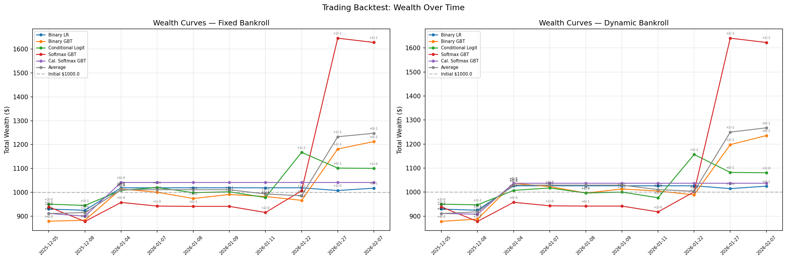

The wealth curves show each model's total wealth (cash + mark-to-market) over
the 10 snapshot dates. Annotations show buy/sell signal counts per snapshot.

Key observations:
- **Binary GBT** (orange) is fully closed out — its +23.5% is **realized** profit.
  **Cal. Softmax GBT** is also fully closed out (+3.7% realized).
- **Softmax GBT** (red) shows dramatic wealth spikes driven by large contrarian
  positions. Its +62.3% includes $237 in unrealized Sinners contracts.
- **Conditional Logit** (green) trades more conservatively than Softmax GBT but
  holds a large Marty Supreme position ($105 MtM).
- **Binary LR** (blue) is the most conservative — only 14 trades, modest +2.5%.
- **Cal. Softmax GBT** trades the least (12 trades) with the smallest fees ($11),
  generating only modest returns (+3.7%) — its normalized probabilities are close
  to Binary GBT but the exact-sum-to-1 constraint slightly dampens edge signals.
- **Average (5-model)** is now fully closed out (+26.8% realized), unlike the
  4-model average which held open positions. The addition of Cal. Softmax GBT's
  conservative signal diluted the extreme edges that previously kept positions open.

### Settlement scenarios

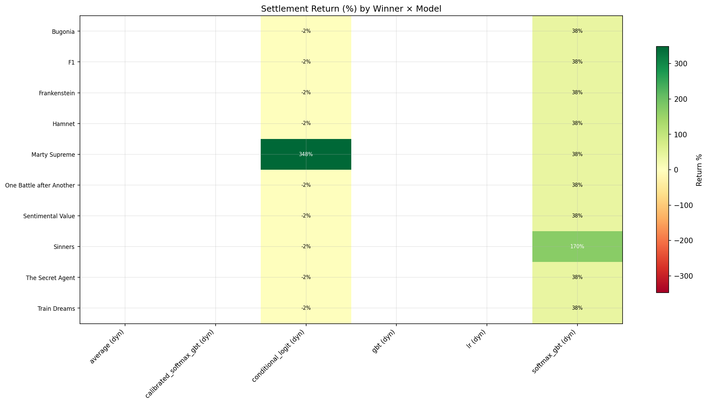

| Model (dynamic) | Best Case | Worst Case |
|------------------|-----------|------------|
| Conditional Logit | +348% (Marty Supreme wins) | -2.4% (other wins) |
| Softmax GBT | +170% (Sinners wins) | +38.5% (other wins) |

Binary GBT, Binary LR, Cal. Softmax GBT, and the 5-model Average all have no
settlement risk — they're fully closed out. The settlement heatmap shows the
return for each model × possible winner combination. Conditional Logit's return
is almost entirely driven by whether Marty Supreme wins.

### Position evolution

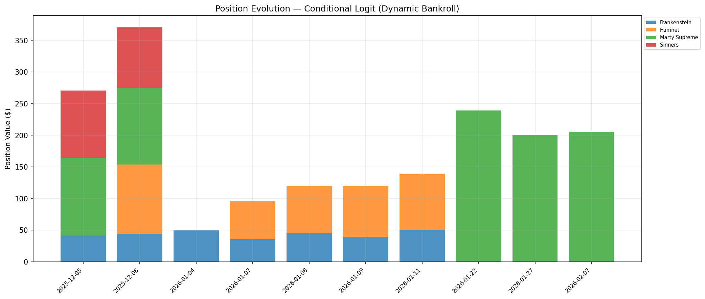

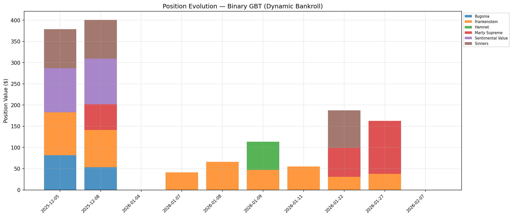

The position evolution charts show how each model's portfolio changes over time.
Conditional Logit builds up the Marty Supreme position steadily, while Binary GBT
rotates through multiple nominees (buying Sinners early, then shifting to One Battle
after Another). The GBT model's ability to exit positions profitably leads to its
fully-realized +23.5% return.

### Probability sum: the key structural difference

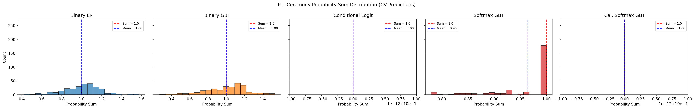

This is the motivating plot for the entire experiment. Binary models produce
probability sums with substantial variance (LR: σ=0.18, GBT: σ=0.22). The
multinomial models — Conditional Logit, Softmax GBT, and Cal. Softmax GBT — all
produce exact or near-exact sum=1.0 by construction (Conditional Logit and Cal.
Softmax GBT: σ=0.00; Softmax GBT: σ=0.04 with slight negative bias at 0.96).

## CV Metrics Over Time

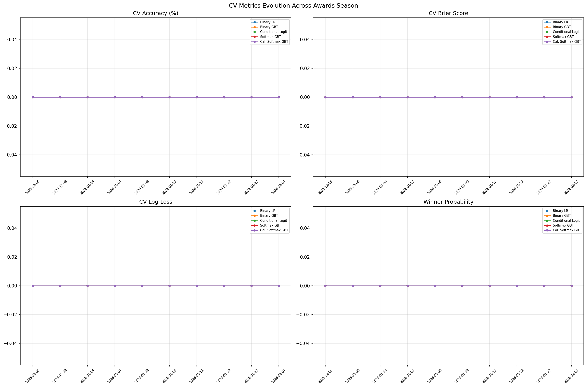

The 4-panel plot shows how CV accuracy, Brier score, log-loss, and winner
probability evolve across awards season snapshots. The CV metrics are computed
using leave-one-year-out on all historical data — they measure how well the model
would have predicted past Oscar outcomes, not the 2026 outcome specifically.

Since the feature set is fixed across snapshots (lr_standard/gbt_standard), CV
metrics remain stable. Conditional Logit tracks Binary LR almost exactly, and Cal.
Softmax GBT tracks Binary GBT closely — confirming that the multinomial constraints
preserve the underlying models' discriminative power while normalizing probabilities.

## Recommendation

1. **Conditional Logit should replace Binary LR** as the default linear model.
   Same accuracy, better calibration, structurally sound probabilities. It uses
   the same features and adds minimal complexity (statsmodels `ConditionalLogit`).
2. **Cal. Softmax GBT is the recommended tree-based multinomial model.** It
   achieves guaranteed sum-to-1 probabilities with GBT features, substantially
   outperforming Softmax GBT (62.7% vs 50.4% accuracy, 0.0735 vs 0.0968 Brier).
   However, it still trails the linear models (~3pp accuracy gap), suggesting that
   tree-based approaches need more training data to match conditional logit's
   efficiency for this problem.
3. **Softmax GBT should not be used** with current data sizes. The ~26 ceremony
   training set is far too small for multi-class gradient boosting. Cal. Softmax GBT
   is strictly preferred — same features, same sum-to-1 guarantee, much better
   performance.
4. **Post-hoc normalization** is a reasonable fallback for binary models but
   provides marginal improvement (~2% Brier). Better to use the correct model.
5. **For trading**, the model choice matters less than position sizing and market
   dynamics. GBT's aggressive signal generation dominated the backtest (+23.5%
   realized), while conditional logit's normalized probabilities create a
   high-conviction directional bet (Marty Supreme: +348% if right, -2.4% if wrong).
   Cal. Softmax GBT trades conservatively (12 trades, +3.7%) — its close alignment
   with Binary GBT rankings means the softmax normalization removes some of the
   extreme edges that drive trading activity.

## How to Run

```bash
cd "$(git rev-parse --show-toplevel)"
bash oscar_prediction_market/one_offs/d20260217_multinomial_modeling/run.sh \
    2>&1 | tee storage/d20260217_multinomial_modeling/run.log
```

Deep-dive analysis only:
```bash
uv run python -m oscar_prediction_market.one_offs.\
    d20260217_multinomial_modeling.analyze_deep_dive \
    --exp-dir storage/d20260217_multinomial_modeling \
    --output-dir storage/d20260217_multinomial_modeling/deep_dive
```

## Output Structure

```
storage/d20260217_multinomial_modeling/
├── datasets/                    # Per-date feature datasets (reused from d20260211)
│   └── YYYY-MM-DD/
├── models/                      # Trained models per type × date
│   ├── lr/                      # 10 snapshots
│   ├── gbt/                     # 10 snapshots
│   ├── conditional_logit/       # 10 snapshots
│   ├── softmax_gbt/             # 10 snapshots
│   └── calibrated_softmax_gbt/  # 10 snapshots
├── cv_analysis/                 # CV comparison artifacts
│   ├── summary.txt              # Full text comparison
│   ├── averaged_metrics.csv     # Average metrics per model
│   ├── per_snapshot_metrics.csv  # Per-date metrics
│   ├── normalized_comparison.csv
│   ├── predictions_2026-02-07.csv / .png
│   ├── metrics_over_time.png
│   └── prob_sum_distribution.png
├── deep_dive/                   # Deep-dive analysis (16 analyses)
│   ├── model_vs_market.png      # All 5 models vs Kalshi per nominee
│   ├── divergence_heatmaps.png  # 5-panel model−market gap
│   ├── prob_distribution_anatomy.png  # Prob sum, top-1, entropy
│   ├── reliability_diagrams.png # Calibration per model
│   ├── binary_vs_multinomial.png  # LR vs CLogit side-by-side
│   ├── edge_distributions.png   # Trading edge histograms
│   ├── cv_metrics_detailed.png  # 4-panel accuracy/Brier/LogLoss
│   ├── feature_importance_*.png # Feature heatmaps (5 models)
│   ├── wealth_curves_annotated.png  # With trade count annotations
│   ├── settlement_heatmap_detailed.png
│   ├── positions_*.png          # Position evolution (5 models)
│   └── deep_dive_tables.json    # Computed tables for README
├── backtest/                    # Trading backtest results
│   ├── config.json
│   ├── backtest_results.json
│   ├── wealth_curves.png / wealth_timeseries.csv
│   ├── settlement_heatmap.png / settlement_scenarios.csv
│   ├── position_history.csv
│   └── positions_*.png          # Per-model × bankroll-mode
└── run.log
```

## Scripts

| Script | Purpose |
|--------|---------|
| `build_models.sh` | Build 5 model types × 10 snapshots |
| `analyze_cv.py` | CV comparison tables and basic plots |
| `analyze_deep_dive.py` | 16-analysis deep dive with plots |
| `run.sh` | End-to-end orchestrator |
