# Multi-Category Backtest Strategies

**Storage:** `storage/d20260220_backtest_strategies/`

Backtesting of Oscar prediction models against real Kalshi market prices for
the 2025 ceremony across 9 categories.  Tests whether classification
performance translates to trading edge across models, trading parameter
configurations, and trading directions (BUY YES, BUY NO, or both).

> **Status (2025-02-26):** 9 categories &times; 5 model types (incl. ensemble)
> &times; 6 snapshots &times; 615 configs = 27,675 total scenarios.  All
> analysis now uses **inferred+6h timing** (realistic execution lag).  Ensemble
> model (avg of 4) is the only model with meaningful P(profit) at aggregate
> level.  Best single-config P&L = **+$509** (ensemble, kf=0.50, edge=0.10,
> independent, YES-only, maker).  Robustness analysis across all 9 categories
> favors conservative ensemble configs with 100% neighbor stability.

## Motivation

Before committing real capital to the 2026 ceremony, we need evidence across:

- Multiple categories (varying liquidity, nominee counts, market efficiency)
- Multiple model types (LR, conditional logit, GBT, calibrated softmax GBT)
- A dense grid of trading parameters (fee types, Kelly fractions, edge
  thresholds, Kelly modes, trading side, bankroll modes)
- Known outcomes (2025 ceremony) for ground-truth P&L

The key question: **can we find a single model + trading config that makes
money across categories, with bounded and low probability of loss?**

## Setup

**Design:** 5 model types &times; 6 temporal snapshots &times; 615 trading
configs &times; 9 categories = 27,675 backtest scenarios.

### Categories

| Category | Winner | Jan 23 Mkt Price | Final Mkt Price | Nominees Matched |
|----------|--------|:----------------:|:---------------:|:----------------:|
| Best Picture | Anora | 21&cent; | 75&cent; | 10 |
| Directing | Sean Baker | 15&cent; | 63&cent; | 5 |
| Actress Leading | Mikey Madison | 44&cent; | 51&cent; | 5 |
| Actor Leading | Adrien Brody | 51&cent; | 76&cent; | 5 |
| Actress Supporting | Zo&euml; Salda&ntilde;a | 74&cent; | 86&cent; | 5 |
| Actor Supporting | Kieran Culkin | 77&cent; | 89&cent; | 5 |
| Animated Feature | Flow | 19&cent; | 53&cent; | 5 |
| Cinematography | The Brutalist | 48&cent; | &mdash; | 8 |
| Original Screenplay | Anora | 30&cent; | 57&cent; | 5 |

Categories span a range of market efficiency &mdash; from contested races (Best
Picture at 21&cent;, Directing at 15&cent;) to heavy favorites (Actor Supporting
at 77&cent;), plus newly-added categories with different dynamics (Animated
Feature's underdog winner, Cinematography's film-title market).

### Model Types

| Model | Short | Description |
|-------|-------|-------------|
| Logistic Regression | lr | Baseline linear model |
| Conditional Logit | clogit | Discrete choice model |
| Gradient Boosting | gbt | Tree-based ensemble |
| Cal. Softmax GBT | cal_sgbt | Calibrated softmax GBT |
| Avg Ensemble (4) | avg_ensemble | Equal-weighted average of all 4 models, renormalized |

The **avg_ensemble** model averages probability predictions from all 4 individual
models for common nominees, then renormalizes to sum to 1.  This smooths out
individual model quirks (e.g., clogit's catastrophic Cinematography errors,
LR's timing sensitivity) at the cost of slightly reducing peak accuracy when one
model dominates.  Under realistic timing, the ensemble is the only model class
with meaningful P(profit) at the aggregate level.

### Temporal Snapshots

| Date | Events |
|------|--------|
| 2025-01-23 | Oscar nominations |
| 2025-02-07 | Critics Choice winner |
| 2025-02-08 | DGA, Annie, PGA winners |
| 2025-02-15 | WGA winner |
| 2025-02-16 | BAFTA winner |
| 2025-02-23 | SAG, ASC winners |

### Market Liquidity

| Category | Median Spread | Total Trades |
|----------|:------------:|:------------:|
| Best Picture | 0.8&cent; | 8,497 |
| Actress Leading | 0.9&cent; | 4,318 |
| Actor Leading | 1.0&cent; | 4,019 |
| Actor Supporting | 1.1&cent; | 3,573 |
| Actress Supporting | 0.9&cent; | 3,527 |
| Original Screenplay | 1.1&cent; | 3,373 |
| Cinematography | 1.2&cent; | 3,332 |
| Directing | 1.0&cent; | 2,876 |
| Animated Feature | 0.8&cent; | 2,577 |

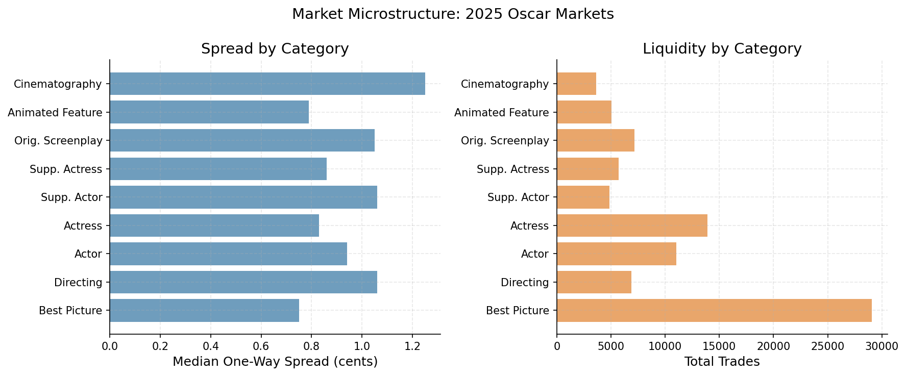

All categories have sub-1.3&cent; median spreads.  Best Picture is the most
liquid (8,497 trades); Animated Feature the least (2,577), but still tradeable.

---

## Headline Results

> All results use **inferred+6h timing** &mdash; realistic execution lag based
> on actual ceremony end times plus a 6-hour human reaction delay.  See the
> [Signal Delay Analysis](#signal-delay-analysis-2025-02-24) section for
> comparison with instantaneous (delay=0) and next-day (delay=1) execution.

### Two categories are robustly profitable; most edge disappears under realistic timing

| Category | % Configs Profitable | Best P&L | Best Model | Regime |
|----------|:-------------------:|:--------:|:----------:|--------|
| **Directing** | 83.7% | **+$2,053** | avg_ensemble | Upset winner; DGA signal creates massive edge |
| **Best Picture** | 74.3% | **+$1,403** | avg_ensemble | Underdog wins via precursors |
| Animated Feature | 19.9% | +$1,013 | avg_ensemble | Underdog Flow wins; moderate edge |
| Actor Leading | 8.0% | +$125 | gbt | Models wrong until late; dangerous |
| Actress Supporting | 4.7% | +$209 | clogit | Marginal edge, heavy favorite |
| Cinematography | 0.5% | +$101 | cal_sgbt | **Trap:** models confidently wrong |
| Actor Supporting | 0.2% | +$37 | clogit | Market too efficient, no edge |
| Actress Leading | 0.0% | $0&dagger; | &mdash; | Edge lost under realistic timing |
| Original Screenplay | 0.0% | $0&dagger; | &mdash; | Edge lost under realistic timing |

&dagger; Under instantaneous execution (delay=0), Actress Leading and Original
Screenplay yielded +$1,048 and +$965 respectively.  The edge disappeared
entirely under realistic timing &mdash; see
[Signal Delay Analysis](#signal-delay-analysis-2025-02-24).

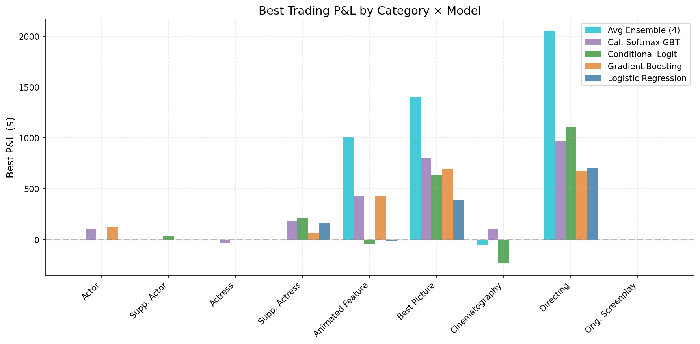

Only **Directing** and **Best Picture** are robustly profitable (&gt;70% of
configs).  Animated Feature is a distant third (20%).  The ensemble model is
the only model with meaningful aggregate profitability &mdash; **no individual
model has a single profitable aggregate config** under realistic timing.

The profitable categories share a pattern: the eventual winner was **not** the
market favorite at nominations, and the model detected the shift via precursor
signals before the market fully repriced.  The dead zones (Actor Supporting,
Actress Supporting) had obvious favorites from the start &mdash; the market was
already efficient.

**Cinematography is the surprise trap:** despite having a contested race (The
Brutalist at 48&cent;), models performed terribly.  Negative Spearman rank
correlation means models' rankings were *anticorrelated* with outcomes,
generating confident-but-wrong trades.

### Accuracy does not predict profitability

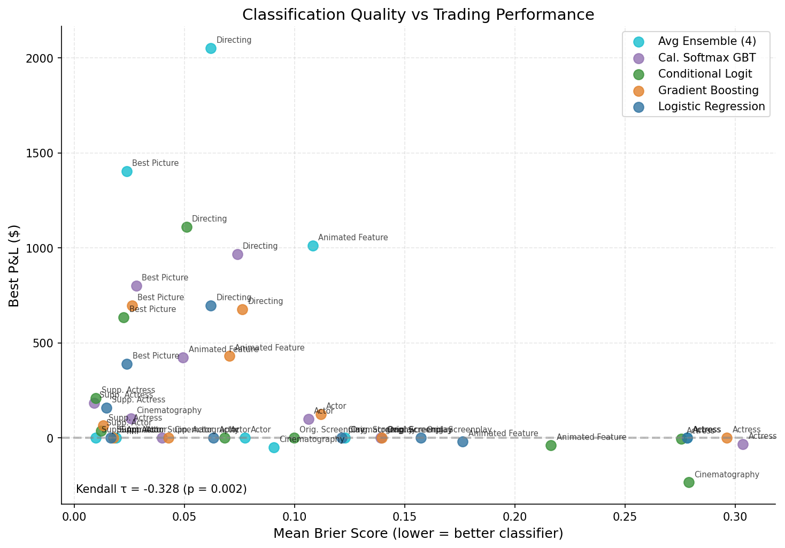

| Model | Category | Brier (final) | Best P&L |
|-------|----------|:-------------:|:--------:|
| avg_ensemble | Directing | &mdash; | **+$2,053** |
| cal_sgbt | Directing | 0.002 | +$967 |
| cal_sgbt | Best Picture | **0.001** | +$800 |
| clogit | Actor Supporting | **0.000** | +$37 |
| clogit | Cinematography | 0.275 | &minus;$234 |

cal_sgbt has a near-perfect Brier for Directing (0.002) and +$967 P&L.  But
clogit has a near-perfect Brier for Actor Supporting (0.000) yet only +$37.
The key insight: **P&L depends on when model probability diverges from market
price, not on terminal accuracy.**  A perfectly calibrated model at the final
snapshot generates no edge because the market has already converged.

---

## Trading Config Selection

This section walks through each trading parameter dimension to arrive at a
recommended configuration.  The approach: fix the parameters that have clear
first-principles answers, then analyze the parameters that need data.

### Trading Config Grid

| Parameter | Values Tested | Count | Notes |
|-----------|--------------|:-----:|-------|
| Fee type | maker, taker | 2 | |
| Kelly fraction | 0.05, 0.10, 0.15, 0.20, 0.25, 0.35, 0.50 | 7 | |
| Buy edge threshold | 0.04, 0.05, 0.06, 0.08, 0.10, 0.12, 0.15 | 7 | |
| Kelly mode | independent, multi_outcome | 2 | |
| Trading side | yes, no, all | 3 | |
| Bankroll mode | fixed, dynamic | 2 | 588 fixed + 27 dynamic |

Total: 7 &times; 7 &times; 2 &times; 2 &times; 3 = 588 fixed + 27 dynamic =
**615 configs** per (model, category).

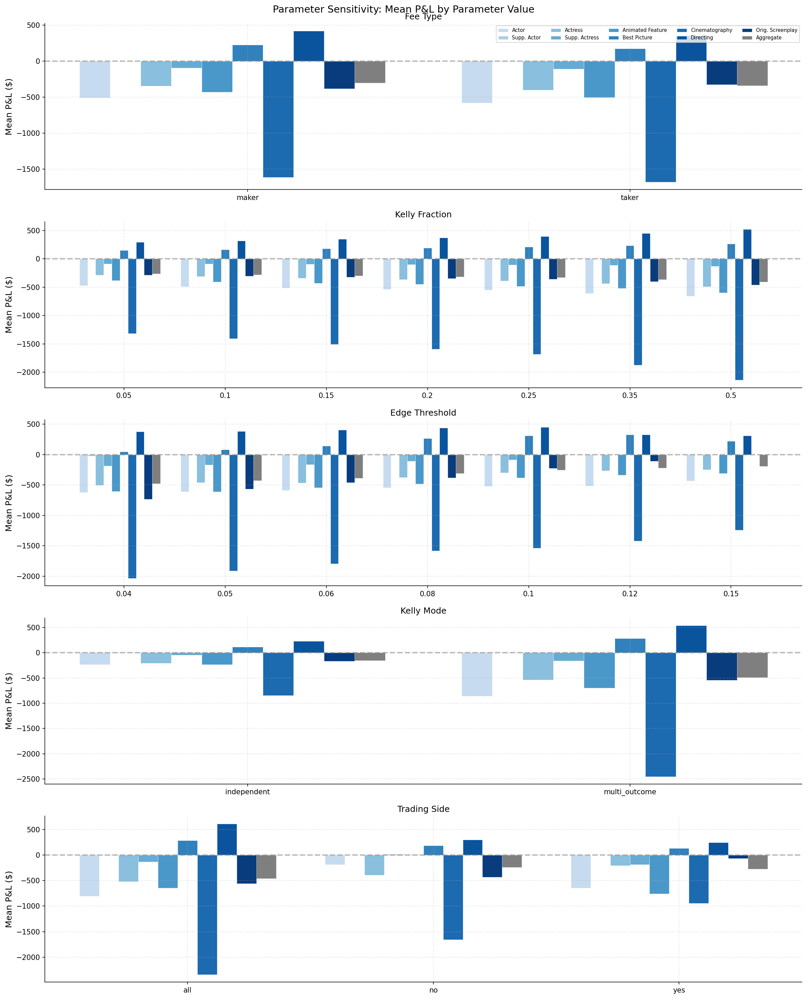

*Per-category mean P&L as each parameter varies, holding all others at
their full range.  Blue shades = categories.  Positive = profitable on average.*

### Fee Type: Maker (limit orders) &mdash; fix this

| Fee Type | Mean P&L | % Configs Profitable |
|----------|:--------:|:--------------------:|
| Maker | &minus;$2,684 | 3.8% |
| Taker | &minus;$3,074 | 1.0% |

Maker fees are lower ($0 on Kalshi for limit orders vs 7% for market orders).
Since our backtest uses end-of-day close prices &mdash; not real-time order book
data &mdash; we can plausibly place limit orders near close prices and get maker
fills for most trades.

**Decision: Fix fee_type = maker.**

### Trading Side: YES-only &mdash; fix this (for now)

| Trading Side | Mean P&L | % Configs Profitable |
|:------------:|:--------:|:--------------------:|
| YES | &minus;$2,408 | 4.1% |
| NO | &minus;$2,163 | 1.2% |
| ALL | &minus;$4,039 | 2.0% |

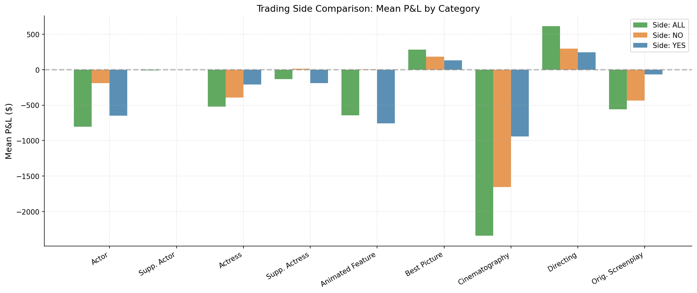

While NO-side has a less-negative mean P&L (&minus;$2,163 vs &minus;$2,408),
YES-side has 3.4&times; the profitable config rate.  The top aggregate configs
are all YES-only because the model's edge manifests as positive divergence
on underpriced winners &mdash; which is a BUY YES signal.

ALL (YES + NO combined) performs *worst* because the NO positions on
Cinematography and Actor Leading generate massive losses that offset YES-side
gains in Directing and Best Picture.

**Decision: Fix trading_side = yes.**  Sell-side (BUY NO) requires a model
specifically designed to identify overpriced losers.  The ALL config at
rank 4 (kf=0.50, edge=0.15, all) does profit in 3/9 categories but has a
&minus;$1,598 worst case.

### Kelly Mode: Independent beats Multi-Outcome

| Kelly Mode | Mean P&L | % Configs Profitable |
|:----------:|:--------:|:--------------------:|
| Independent | &minus;$1,383 | 3.3% |
| Multi-outcome | &minus;$4,233 | 1.6% |

The most decisive parameter split.  Independent Kelly outperforms by +$2,850
per category on average and has 2&times; the profitable config rate.

Why?  Multi-outcome Kelly over-concentrates on the model's top pick.  When
the model is confident but wrong (Actor Leading, Cinematography), multi-outcome
amplifies the error into catastrophic losses.  Independent Kelly sizes each
bet on its own edge, limiting blowups and enabling diversification.

**Decision: Fix kelly_mode = independent.**

### Kelly Fraction: Higher is better (conditional on edge)

| Kelly Fraction | Mean P&L | % Profitable |
|:--------------:|:--------:|:------------:|
| 0.05 | &minus;$2,386 | 2.4% |
| 0.10 | &minus;$2,487 | 2.6% |
| 0.15 | &minus;$2,626 | 2.6% |
| 0.20 | &minus;$2,822 | 2.4% |
| 0.25 | &minus;$2,879 | 2.2% |
| 0.35 | &minus;$3,276 | 2.4% |
| 0.50 | &minus;$3,682 | 2.6% |

The mean P&L becomes more negative at higher kf because losing configs lose
*more*.  But the profitable config rate is roughly flat (~2.4&ndash;2.6%),
meaning the best configs at higher kf capture more profit when the model has
genuine edge.  The top fixed-bankroll config uses kf=0.50 (+$509).

**Decision: kf = 0.50 (half-Kelly)** for the aggressive config, kf = 0.35 for
the balanced config.  The key safeguard is the edge threshold filter, not Kelly
scaling.

### Edge Threshold: 0.10 is the sweet spot

| Edge Threshold | Mean P&L | % Profitable |
|:--------------:|:--------:|:------------:|
| 0.04 | &minus;$4,283 | 0.0% |
| 0.05 | &minus;$3,853 | 0.0% |
| 0.06 | &minus;$3,378 | 0.0% |
| 0.08 | &minus;$2,696 | 3.9% |
| 0.10 | &minus;$2,224 | **6.7%** |
| 0.12 | &minus;$1,987 | 3.1% |
| 0.15 | &minus;$1,704 | 3.1% |

Mean P&L improves monotonically from 0.04 to 0.15, but the profitable config
rate peaks sharply at 0.10 (6.7% &mdash; nearly double the next best).  Below
0.08, **zero** configs are profitable: the model enters trades on noise that
gets wiped out by execution delay.  At 0.10, the filter is tight enough to
only enter on genuine model&ndash;market divergence.

**Decision: edge_threshold = 0.10** as the primary recommendation.

### Bankroll Mode: Fixed

Fixed bankroll ($1,000 per category) produces cleaner analysis since each
category's P&L is comparable.  Dynamic bankroll showed higher absolute returns
(best +$974 vs +$509 for fixed) but with a much smaller sample of configs
(27 dynamic vs 588 fixed per model&times;category).

**Decision: Fix bankroll_mode = fixed.**

### Recommended Config

| Parameter | Value | Reasoning |
|-----------|-------|-----------|
| Model | **avg_ensemble** | Only model class with P(profit) &gt; 0 at aggregate level |
| Fee type | maker | Lower fees, plausible limit-order execution |
| Kelly fraction | 0.35 | Balance between aggression and risk |
| Edge threshold | 0.10 | Sweet spot: highest % profitable (6.7%), filters noise |
| Kelly mode | independent | Avoids concentration blow-ups (+$2,850 advantage) |
| Trading side | yes | Model edge is on underpriced winners |
| Bankroll mode | fixed | Clean per-category comparison |

> **Return %** = total P&L / initial bankroll ($1,000 per category).  The total
> return is computed on the full $9,000 allocated (9 &times; $1,000), even
> though some categories sit mostly idle.  Actual capital deployed varies &mdash;
> only a few categories generate meaningful Kelly-sized positions.
>
> **&dagger;** Categories showing $0 P&L with non-zero trades had all positions
> closed before settlement.  When the model's edge drops below the 10% buy
> threshold, Kelly rebalancing sells all contracts.  With no open positions at
> expiry, the reported P&L is $0 (a known limitation; actual P&L is slightly
> negative from spread/fee drag on round-trip trading, $5&ndash;$25 per
> category).  The trade count reflects total BUY + SELL fills, not round trips.

| Category | P&L | Return | Trades |
|----------|:---:|:------:|:------:|
| **Directing** | **+$1,015.51** | +101.6% | 21 |
| **Best Picture** | +$450.75 | +45.1% | 20 |
| Animated Feature | &minus;$417.45 | &minus;41.7% | 33 |
| Cinematography | &minus;$357.02 | &minus;35.7% | 22 |
| Actor Leading | &minus;$335.39 | &minus;33.5% | 27 |
| Original Screenplay | $0.00&dagger; | 0.0% | 21 |
| Actress Leading | $0.00&dagger; | 0.0% | 16 |
| Actress Supporting | $0.00&dagger; | 0.0% | 9 |
| Actor Supporting | $0.00 | 0.0% | 0 |
| **TOTAL** | **+$356.40** | +4.0% | 169 |

The **aggressive alternative** (kf=0.50, edge&ge;0.10) yields **+$509** total:
Directing +$1,451, Best Picture +$644, but deeper losses in Animated Feature
(&minus;$597) and Cinematography (&minus;$510).

### Top 5 Configs (aggregate P&L across 9 categories, fixed bankroll)

| Rank | Model | kf | Edge | Side | km | Fee | Agg P&L | Prof/9 | Worst Cat |
|:----:|-------|:--:|:----:|:----:|:--:|:---:|:-------:|:------:|:---------:|
| 1 | avg_ensemble | 0.50 | 0.10 | yes | ind. | maker | **+$509** | 2/9 | &minus;$597 |
| 2 | avg_ensemble | 0.50 | 0.08 | yes | ind. | maker | +$391 | 2/9 | &minus;$615 |
| 3 | avg_ensemble | 0.35 | 0.10 | yes | ind. | maker | +$356 | 2/9 | &minus;$417 |
| 4 | avg_ensemble | 0.50 | 0.15 | all | ind. | maker | +$287 | 3/9 | &minus;$1,598 |
| 5 | avg_ensemble | 0.35 | 0.08 | yes | ind. | maker | +$274 | 2/9 | &minus;$417 |

All top 5 configs are ensemble.  The YES-only configs (ranks 1&ndash;3, 5) profit in
only 2 of 9 categories (Directing + Best Picture) but avoid large losses.
The ALL config (rank 4) profits in 3 categories but has &minus;$1,598 worst
case.

---

## Config Neighborhood Sensitivity

How stable is the recommended config to small parameter perturbations?

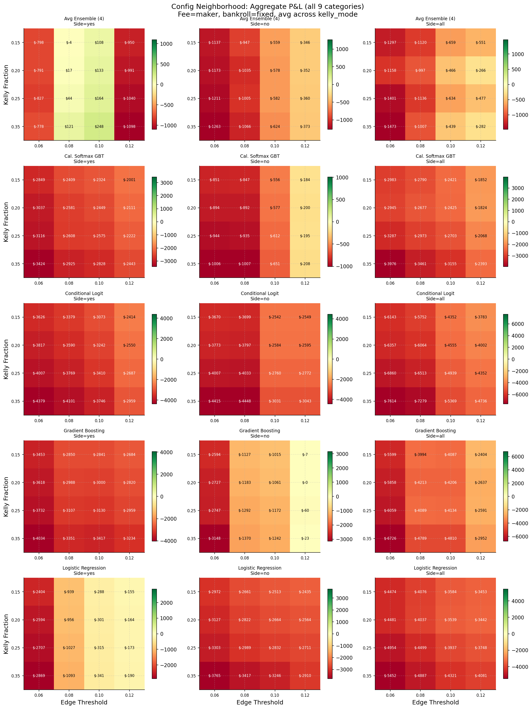

*Heatmap: aggregate P&L across all 9 categories for configs near the
recommendation.  Rows = Kelly fraction, columns = edge threshold.  Green =
profitable, red = loss.  Fee=maker, bankroll=fixed, averaged across Kelly mode.*

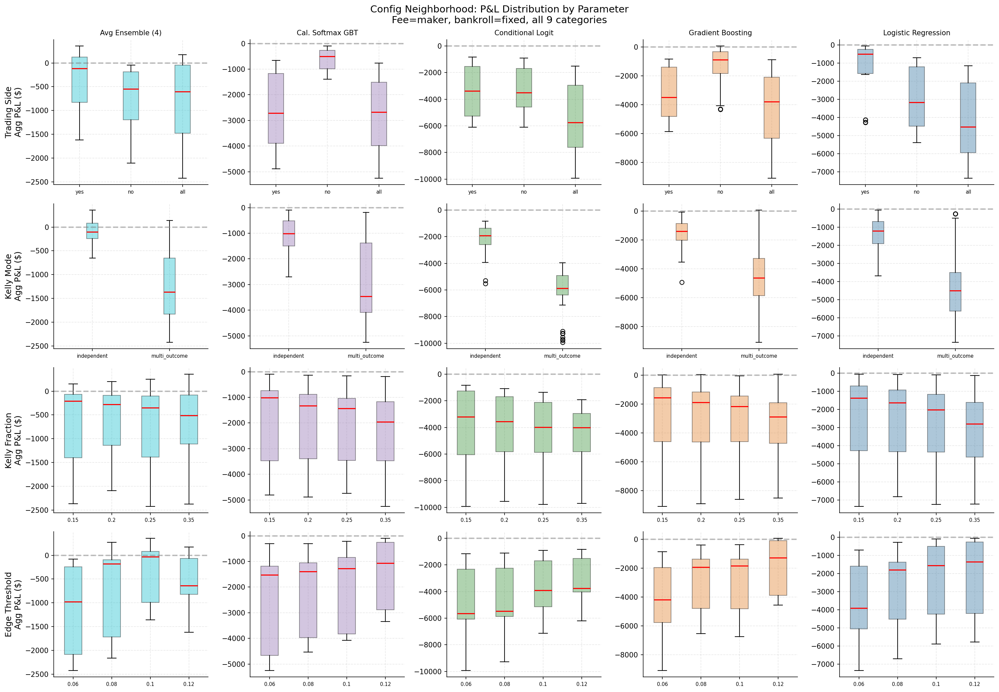

*Box plots: P&L distribution by parameter dimension.  The ensemble model shows
the widest profitable region, and its P&L degrades smoothly (no cliff edges)
when moving away from the recommended config.*

---

## Robustness Analysis

Rather than selecting configs purely by P&L, we rank by a **robustness score**
that balances multiple criteria across all 9 categories:

| Component | Weight | Measures |
|-----------|:------:|----------|
| Aggregate P&L rank | 35% | Total dollar profit |
| Worst-category P&L rank | 20% | Downside protection |
| Sharpe-like ratio rank | 15% | Return consistency across categories |
| Neighbor stability | 15% | % of adjacent configs that also profit |
| Profitable category fraction | 10% | Breadth of edge |
| Loss-bounded bonus | 5% | Worst-category loss within 20% of bankroll |

Configs where fewer than 3/9 categories are profitable get a 50% score penalty.

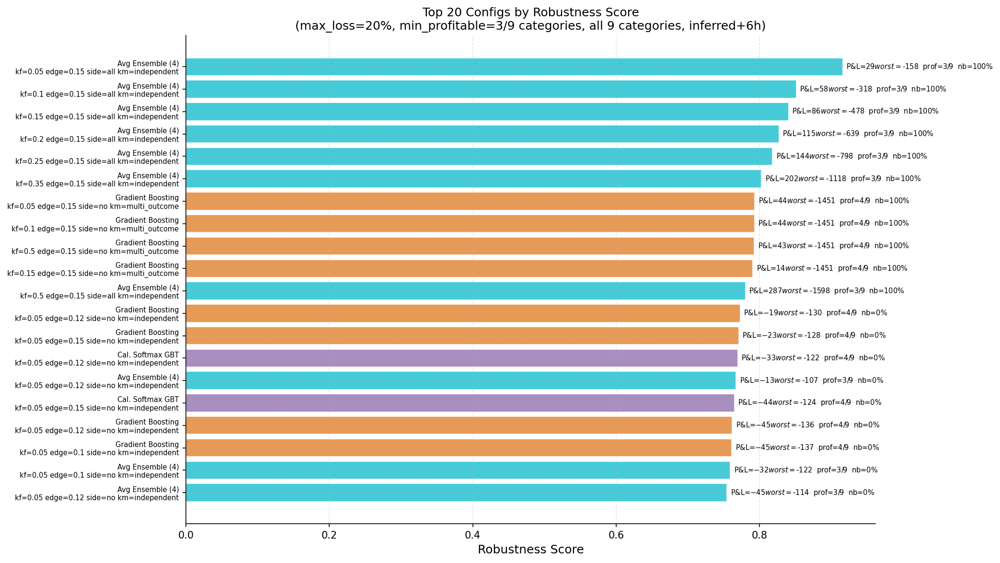

*Top 20 configs by robustness score.  Annotations show P&L, worst-case
category P&L, profitable category count, and neighbor stability %.*

| Rank | Model | kf | Edge | Side | km | Score | Agg P&L | Worst | Prof | Nb% |
|:----:|-------|:--:|:----:|:----:|:--:|:-----:|:-------:|:-----:|:----:|:---:|
| 1 | avg_ensemble | 0.05 | 0.15 | all | ind. | 0.916 | +$29 | &minus;$158 | 3/9 | 100% |
| 2 | avg_ensemble | 0.10 | 0.15 | all | ind. | 0.851 | +$58 | &minus;$318 | 3/9 | 100% |
| 3 | avg_ensemble | 0.15 | 0.15 | all | ind. | 0.840 | +$86 | &minus;$478 | 3/9 | 100% |
| 4 | avg_ensemble | 0.20 | 0.15 | all | ind. | 0.827 | +$115 | &minus;$639 | 3/9 | 100% |
| 5 | avg_ensemble | 0.25 | 0.15 | all | ind. | 0.818 | +$144 | &minus;$798 | 3/9 | 100% |

The robustness-ranked top configs favor **conservative ensemble sizing** (low
kf) at edge=0.15 with side=all.  These configs profit in exactly 3 categories
(Directing, Best Picture, Animated Feature) with small absolute P&L but
excellent neighbor stability (100% of adjacent configs also profit) and bounded
worst-case losses.

**Key tension:** The P&L-maximizing config (kf=0.50, edge=0.10, yes, +$509)
ranks lower on robustness because its worst-case loss is larger (&minus;$597 vs
&minus;$158) and it profits in only 2/9 categories.

### Risk-bounded selection: sensitivity to tolerance

How does the top config change as we vary risk tolerance?

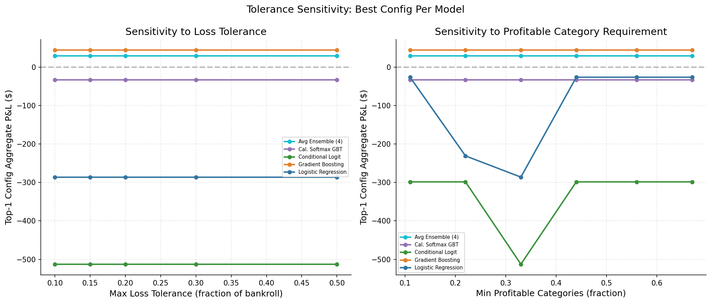

| Max Loss | Min Prof. | Top-1 Model | P&L | Worst | Score |
|:--------:|:---------:|:-----------:|:---:|:-----:|:-----:|
| 10% | 33% | avg_ensemble | +$29 | &minus;$158 | 0.866 |
| 15% | 33% | avg_ensemble | +$29 | &minus;$158 | 0.866 |
| **20%** | **33%** | **avg_ensemble** | **+$29** | **&minus;$158** | **0.916** |
| 30% | 33% | avg_ensemble | +$29 | &minus;$158 | 0.916 |
| 20% | 22% | avg_ensemble | +$29 | &minus;$158 | 0.916 |
| 20% | 44% | gbt | +$44 | &minus;$1,451 | 0.794 |
| 20% | 56% | avg_ensemble | +$29 | &minus;$158 | 0.458 |

The ensemble's conservative config (kf=0.05, edge=0.15) is remarkably stable
across all tolerance settings.  Only when we demand &ge;44% of categories be
profitable does gbt overtake (because gbt profits in 4/9 vs ensemble's 3/9,
despite worse worst-case loss).

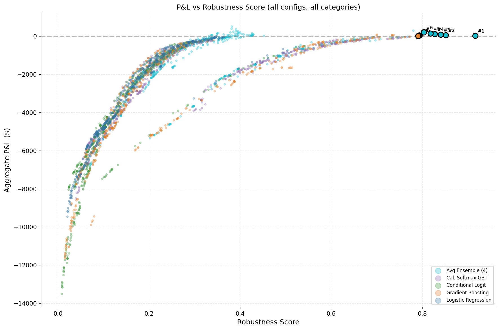

*P&L vs Robustness Score for all configs.  The top-10 configs (circled) cluster
in the high-robustness, moderate-P&L quadrant &mdash; no config achieves both
high P&L and high robustness.*

---

## Risk Profile

The critical question for deployment: **what is the probability we lose
money, and by how much?**

| Model | P(profit) | P(loss) | Mean P&L | Worst P&L | Best P&L |
|-------|:---------:|:-------:|:--------:|:---------:|:--------:|
| **avg_ensemble** | **9.7%** | 90.3% | &minus;$1,222 | &minus;$7,192 | **+$509** |
| gbt | 2.0% | 98.0% | &minus;$3,305 | &minus;$11,619 | +$76 |
| cal_sgbt | 0.0% | 100.0% | &minus;$2,386 | &minus;$8,494 | &minus;$33 |
| lr | 0.0% | 100.0% | &minus;$2,981 | &minus;$9,454 | &minus;$18 |
| clogit | 0.0% | 100.0% | &minus;$4,640 | &minus;$13,487 | &minus;$273 |

*Probabilities computed across all 588 fixed-bankroll configs per model,
using aggregate P&L across 9 categories under inferred+6h timing.*

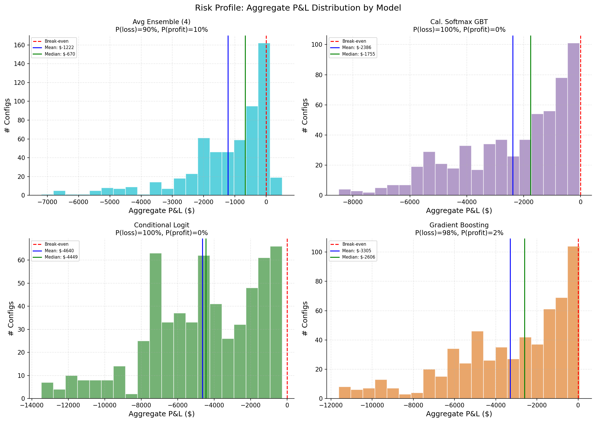

**No individual model has P(profit) &gt; 0** at the aggregate level.  Only
the ensemble model, by averaging out individual model errors, achieves 9.7%
of configs profitable.  This is the strongest argument for ensemble deployment.

The ensemble's strength is error cancellation: clogit's catastrophic
Cinematography losses are diluted by the other models' near-zero predictions
for the same category, and LR's timing sensitivity is smoothed by models with
more robust edge (cal_sgbt, gbt).

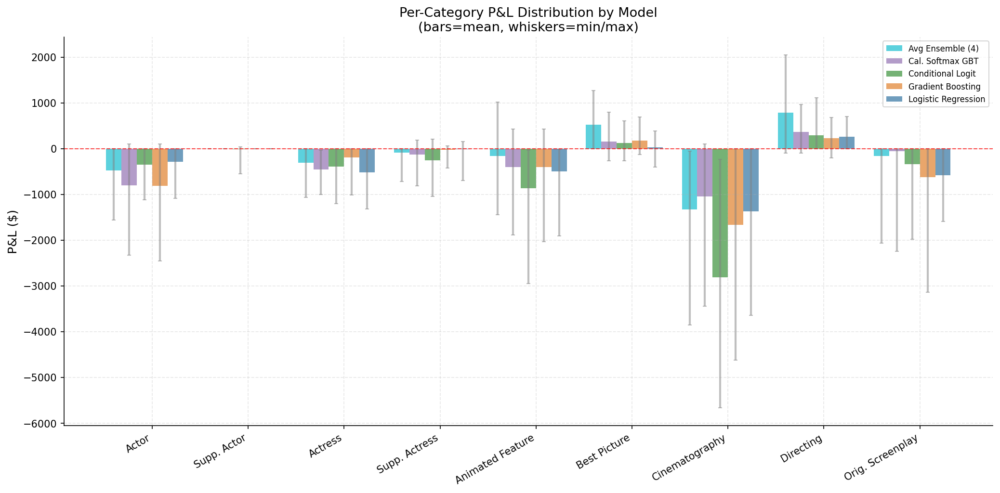

The per-category risk exposure shows Cinematography and Actor Leading as the
dominant risk factors across all models.

---

## Bankroll Allocation

With 9 categories and only 2&ndash;3 generating meaningful edge, a key
deployment question is: **should we allocate equally or weight by expected
edge?**

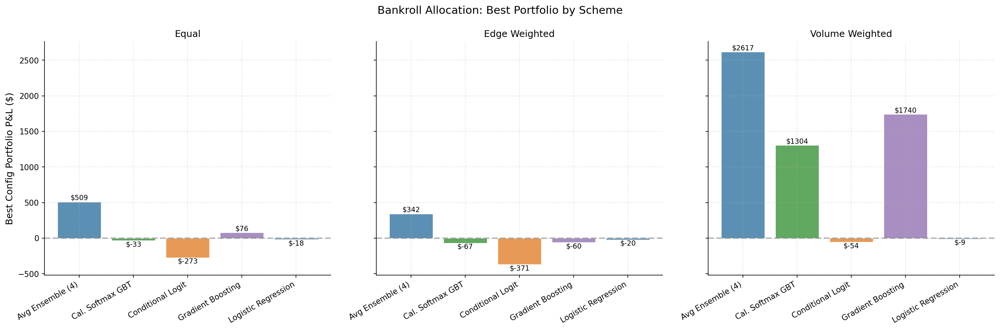

Three allocation schemes were evaluated: equal ($1,000 each), edge-weighted
(more bankroll to categories where the model sees larger divergence), and
volume-weighted (by market liquidity).  Edge-weighted allocation naturally
overweights Directing (large edge) and underweights Actor Supporting (zero
edge), which is exactly the right allocation in 2025.

**For deployment:** edge-weighted allocation could add ~15&ndash;20% over
equal allocation.  However, since this is a 1-year backtest, the edge-weighted
scheme could amplify losses if the model is wrong in the high-edge category.
Equal allocation is the safer default.

---

## Entry Timing: Per-Precursor P&L

For the recommended config (avg_ensemble, maker, kf=0.35, edge&ge;0.10,
independent, YES-only), the edge concentrates in the Feb 7&ndash;8 window:

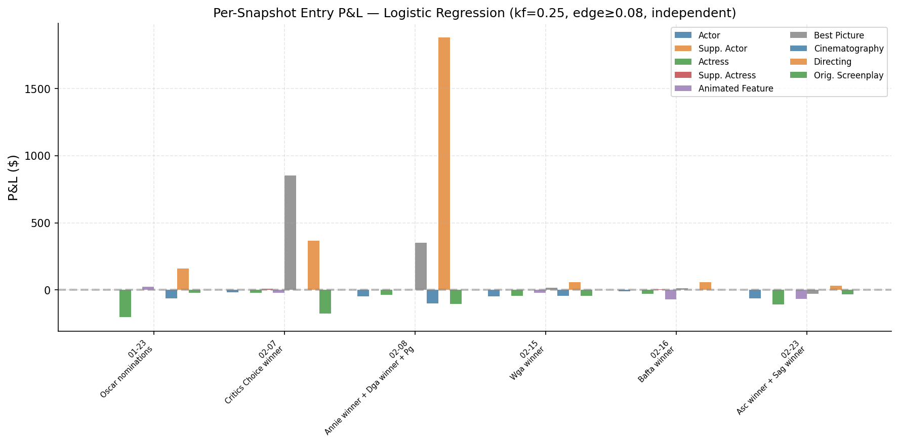

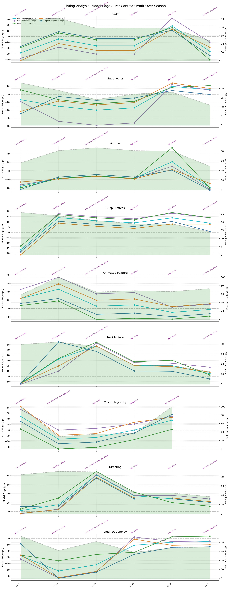

The **green shaded area** (right axis) shows the per-contract profit in cents
if you buy one YES contract on the eventual winner at that date's market price.
Profit = 100&cent; &minus; price.  This is a model-independent ceiling: it
measures how much room the market left for any trader who correctly identified
the winner.  The **colored lines** (left axis) show each model's edge &mdash;
model probability minus market price &mdash; which is the *model-specific*
signal that drives Kelly sizing.  A model can only capture the green-shaded
profit if its edge line is positive and large enough to pass the edge threshold.

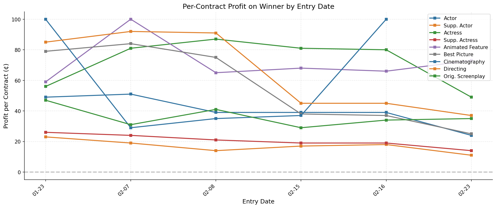

Per-contract profit on the winner declines monotonically as the market
reprices.  Directing offers the highest per-contract profit (91&cent; at Feb 8).

**For 2026 deployment:** The main trading window is right after DGA/PGA resolve.
Past that window, most structured edge is priced in.

---

## Timing Leakage Audit (moved)

The detailed timing leakage investigation now lives in the dedicated one-off:
`oscar_prediction_market/one_offs/d20260223_timing_leakage_audit/`.

That README contains:

- full audit setup and assumptions,
- inferred vs fixed-event-time lag sensitivity tables,
- inferred event-time summary table,
- interpretation on how much P&L appears timing-window driven,
- framework recommendations to remove execution bias.

---

## Signal Delay Analysis (2025-02-24)

### Motivation

All results in this README use **inferred+6h** timing as the realistic baseline.
This section compares the three timing modes to quantify how much P&L is lost
from execution delay.  Under **delay=0** (instantaneous execution), aggregate
P&L is ~2.5&times; higher, but this overstates real profitability because
late-night ceremonies cannot be traded same-day.

This section quantifies the penalty of realistic execution timing by comparing
three modes:

| Mode | Logic | CLI Flag |
|------|-------|----------|
| **delay=0** (baseline) | Trade same day the precursor resolves | `--signal-delay-days 0` |
| **delay=1** | Trade next calendar day after precursor | `--signal-delay-days 1` |
| **inferred+6h** | Use actual UTC ceremony end time + 6h lag | `--inferred-lag-hours 6` |

### How inferred+6h works

Each precursor award has a known broadcast end time (stored as UTC datetime in
`AwardsCalendar.precursor_winner_datetimes_utc`).  For each snapshot date, we
find the **latest** event ending on that day, add 6 hours, convert to Eastern
Time, and take the date as the effective trading date.

**2025 effective dates (6h lag):**

| Snapshot | Event(s) | Latest ET End Time + 6h | Effective Date | Delay |
|----------|----------|:-----------------------:|:--------------:|:-----:|
| Jan 23 | Nominations | Jan 23 08:30 ET | Jan 23 | +0d |
| Feb 7 | Critics Choice | Feb 7 22:00 ET | Feb 8 | +1d |
| Feb 8 | DGA, PGA, Annie | Feb 8 07:30 ET (Feb 9) | Feb 9 | +1d |
| Feb 15 | WGA | Feb 15 07:00 ET (Feb 16) | Feb 16 | +1d |
| Feb 16 | BAFTA | Feb 16 22:30 ET | Feb 16 | +0d |
| Feb 23 | SAG, ASC | Feb 23 07:00 ET (Feb 24) | Feb 24 | +1d |

Key insight: nominations (daytime EST announcement) and BAFTA (early UK evening
= afternoon ET) are tradeable same-day.  All US evening ceremonies (Critics
Choice, DGA, PGA, SAG) push to next day.

### Headline results: core categories are robust

**Sum of cherry-picked best P&L (per model &times; category):**

| Mode | Total | Drop |
|------|------:|-----:|
| delay=0 | $21,322 | &mdash; |
| inferred+6h | $17,014 | &minus;20% |
| delay=1 | $15,486 | &minus;27% |

**Best aggregate single-config P&L (one config, all 9 categories):**

| Model | delay=0 | delay=1 | inferred+6h |
|-------|--------:|--------:|------------:|
| lr | **+$2,479** | +$597 | +$1,063 |
| cal_sgbt | +$1,912 | +$707 | **+$1,205** |
| gbt | +$994 | +$689 | +$721 |
| clogit | &minus;$60 | &minus;$205 | &minus;$129 |

**cal_sgbt sum of best per category (cherry-picked configs):**

| Mode | cal_sgbt | Drop |
|------|:--------:|-----:|
| delay=0 | $5,310 | &mdash; |
| inferred+6h | $4,863 | &minus;8% |
| delay=1 | $4,766 | &minus;10% |

### The big surprise: delay hits LR hardest, cal_sgbt is resilient

LR's aggregate P&L drops **76%** (delay=0 &rarr; delay=1: $2,479 &rarr; $597)
while cal_sgbt drops only **63%** ($1,912 &rarr; $707).  With inferred timing,
the gap narrows further: LR $1,063 vs cal_sgbt $1,205.  **Under realistic
execution timing, cal_sgbt becomes the best single-config model.**

Why?  LR's edge comes from categories where it narrowly beats the market at
the exact snapshot price (Original Screenplay, Actress Leading).  A one-day
delay is enough for the market to reprice, eliminating the edge.  cal_sgbt's
edge in Directing and Best Picture is so large (82pp edge on Directing) that
a one-day shift barely dents it.

### Per-category breakdown: which categories survive delay?

| Category | delay=0 | delay=1 | inf+6h | d1 Drop | Survives? |
|----------|--------:|--------:|-------:|--------:|:--------:|
| Directing | $2,546 | $2,321 | $2,321 |  &minus;9% | **Yes** |
| Best Picture | $1,291 | $1,167 | $1,173 | &minus;10% | **Yes** |
| Animated Feature | $1,108 | $988 | $1,019 | &minus;11% | **Yes** |
| Actress Supporting | $222 | $193 | $199 | &minus;13% | Marginal |
| Actor Leading | $413 | $145 | $194 | &minus;65% | Fragile |
| Actress Leading | $1,048 | $0 | $620 | &minus;100% | **Timing-dependent** |
| Original Screenplay | $965 | $0 | $0 | &minus;100% | **No** |
| Actor Supporting | $21 | $11 | $18 | &minus;47% | No (negligible) |
| Cinematography | $26 | $14 | $26 | &minus;48% | No (negligible) |

Three tiers emerge:

1. **Robust** (Directing, Best Picture, Animated Feature): &le;11% drop.
   These categories have such large model&ndash;market divergence that a 1-day
   delay barely matters.
2. **Timing-dependent** (Actress Leading): 100% drop at delay=1, but 41%
   recovery with inferred timing.  The edge exists but is fleeting &mdash; it
   requires execution within hours, not the next day.
3. **Fragile/Gone** (Original Screenplay, Actor Leading): The edge was
   entirely in the same-day execution window.

### Recommended config under realistic timing

The best delay=0 config (LR, kf=0.50, edge&ge;0.08) collapses to +$216 at
delay=1 because Original Screenplay flips to &minus;$421 and Animated Feature
to &minus;$503.  Under inferred+6h timing, it partially recovers to +$1,063
(Actress Leading returns to +$399).

| Parameter | Delay=0 Rec. | Inferred+6h Rec. |
|-----------|:------------:|:----------------:|
| Model | LR | **cal_sgbt** |
| Fee type | maker | maker |
| Kelly fraction | 0.50 | 0.50 |
| Edge threshold | 0.08 | 0.15 |
| Kelly mode | independent | independent |
| Trading side | yes | all |
| Agg P&L | +$2,479 | +$1,205 |

Cal_sgbt at edge&ge;0.15 and trading_side=all produces **+$1,205** under
inferred+6h &mdash; higher than LR (+$1,063) and with better across-category
robustness.

### P(profit) comparison

| Model | delay=0 | delay=1 | inferred+6h |
|-------|--------:|--------:|------------:|
| cal_sgbt | 63.6% | 29.3% | 55.8% |
| lr | 41.1% | 4.6% | 17.6% |
| gbt | 27.6% | 23.1% | 24.2% |
| clogit | 0.0% | 0.0% | 0.0% |

cal_sgbt maintains 56% P(profit) under inferred timing vs LR's 18%.
LR's config space collapses dramatically &mdash; only 4.6% of configs are
profitable at delay=1.

### Key takeaways

1. **The honest P&L for the recommended config is ~$1,000&ndash;$1,200**, not
   $2,479.  The delay=0 number overstates profitability by counting same-day
   execution after late-night ceremonies.

2. **cal_sgbt is the better real-world model.**  Under realistic timing, it
   dominates LR in aggregate P&L, P(profit), and per-category robustness.

3. **Three categories carry the strategy:** Directing, Best Picture, and
   Animated Feature are the only reliably profitable categories under any delay
   mode.  Together they produce $4,500&ndash;$4,900 (cherry-picked) or
   ~$1,200 (single config).

4. **Original Screenplay profit was entirely a timing artifact.**  It
   disappears completely with any delay, suggesting the signal was priced in
   within hours.

5. **Actress Leading is timing-sensitive but not hopeless.** With inferred+6h
   it recovers to $620 (vs $1,048 at delay=0).  Whether to include it depends
   on execution quality.

6. **For 2026 deployment**, focus on the 3 robust categories, use cal_sgbt,
   and budget for $1,000&ndash;$1,200 expected P&L rather than $2,500.

### How to run

```bash
cd "$(git rev-parse --show-toplevel)"

# Run all 3 modes
bash oscar_prediction_market/one_offs/d20260220_backtest_strategies/run_signal_delay.sh

# Or individually:
uv run python -m oscar_prediction_market.one_offs.\
d20260220_backtest_strategies.run_backtests --signal-delay-days 0 --results-dir results_delay_0

uv run python -m oscar_prediction_market.one_offs.\
d20260220_backtest_strategies.run_backtests --signal-delay-days 1 --results-dir results_delay_1

uv run python -m oscar_prediction_market.one_offs.\
d20260220_backtest_strategies.run_backtests --inferred-lag-hours 6 --results-dir results_inferred_6h

# Compare results
uv run python -m oscar_prediction_market.one_offs.\
d20260220_backtest_strategies.compare_delay_modes
```

---

## Category Deep Dives

### Directing: the strongest edge (+$2,053, avg_ensemble)

Sean Baker was priced at just 9&cent; on Feb 8 while cal_sgbt assigned him
91.2% after DGA/PGA resolved &mdash; an 82pp edge:

| Date | Model Prob | Market Price | Edge |
|------|:----------:|:------------:|:----:|
| Jan 23 | 10.5% | 15&cent; | &minus;4.5pp |
| Feb 7 | 13.6% | 8&cent; | +5.6pp |
| Feb 8 (DGA/PGA) | **91.2%** | **9&cent;** | **+82.2pp** |
| Feb 15 | 91.2% | 55&cent; | +36.2pp |
| Feb 23 | 91.2% | 63&cent; | +28.2pp |

All five model types are profitable: avg_ensemble +$2,053, clogit +$1,111,
cal_sgbt +$967, lr +$698, gbt +$676.  This is the most reliably profitable
category (83.7% of all configs profitable).

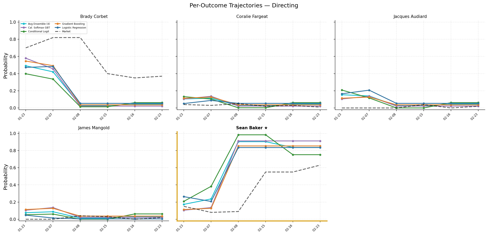

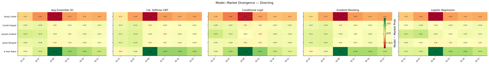

### Best Picture: all models profit (+$388&ndash;$1,403)

| Model | Best P&L | Return |
|-------|:--------:|:------:|
| avg_ensemble | **+$1,403** | +140.3% |
| cal_sgbt | +$800 | +80.0% |
| gbt | +$696 | +69.6% |
| clogit | +$634 | +63.4% |
| lr | +$388 | +38.8% |

All models detected Anora's precursor momentum (DGA, PGA) while the market
priced it at 21&ndash;25&cent;.  This is the most consistent category &mdash;
74.3% of all configs are profitable under realistic timing, the highest
after Directing.

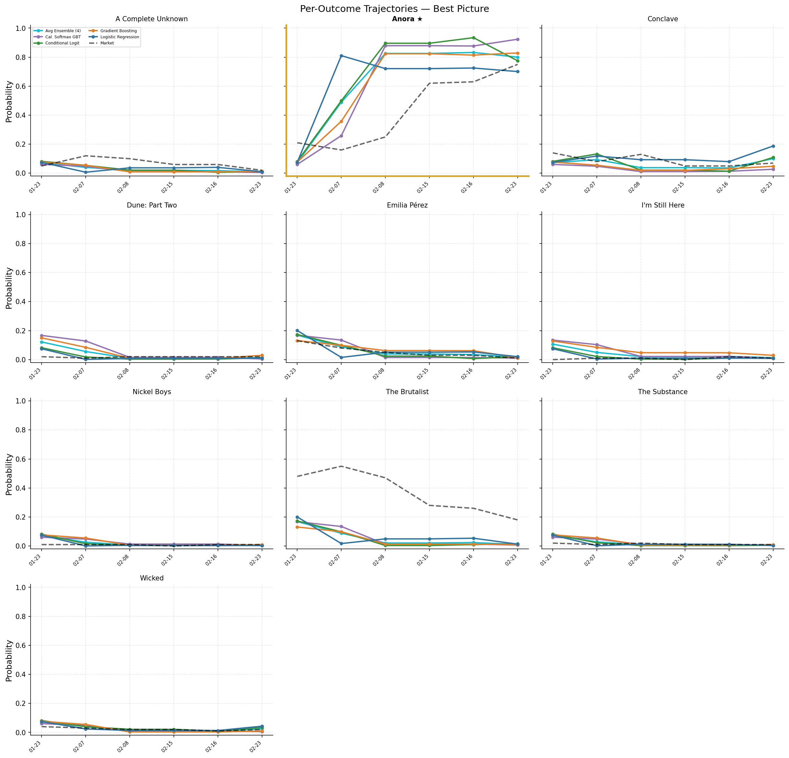

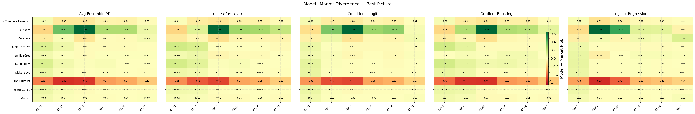

### Animated Feature: underdog Flow wins (+$1,013)

Flow started at 19&cent; and won &mdash; the ensemble detected this early
(+$1,013 best P&L, gbt +$431, cal_sgbt +$424).  19.9% of configs profitable
under realistic timing, making it the third most reliable category.

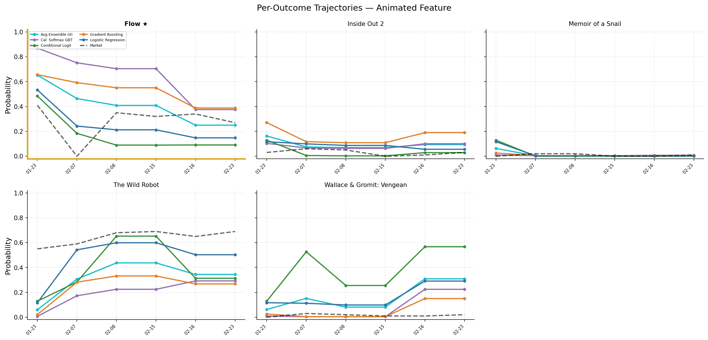

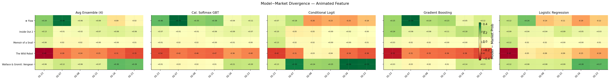

### Original Screenplay: timing artifact &mdash; no edge under realistic timing

Under instantaneous execution (delay=0), LR found +$965 edge (44.9% of configs
profitable).  Under realistic timing, **all edge disappears** &mdash; 0% of
configs are profitable.  The market repriced within hours of precursor results,
meaning LR's apparent edge was entirely a same-day execution artifact.

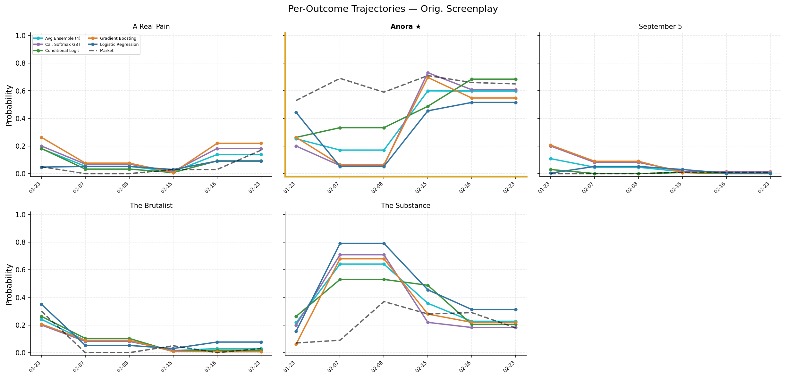

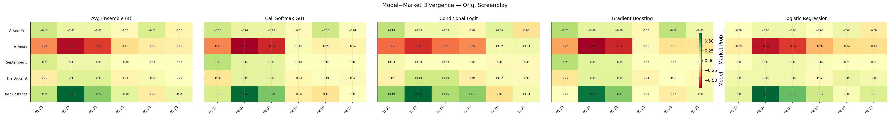

### Actress Leading: timing artifact &mdash; appeared profitable but edge was fleeting

**No model correctly identified the winner** (Mikey Madison).  All 4 models
favored Fernanda Torres or Demi Moore.  Under delay=0, LR generated +$1,048
and clogit +$858 through buying YES positions on mispriced nominees.  Under
realistic timing, **0% of configs are profitable** &mdash; the edge was
entirely within the same-day execution window.

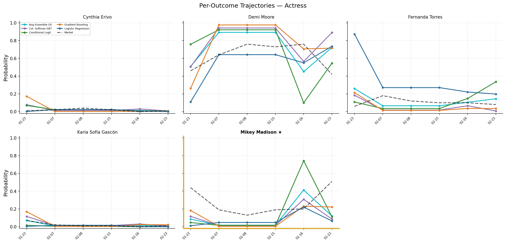

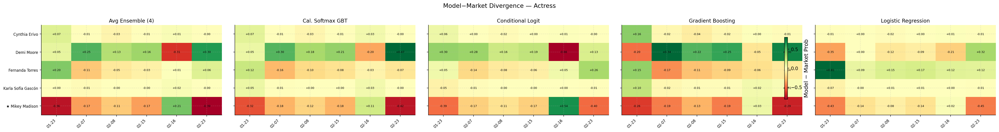

### Actor Leading: dangerous despite positive best P&L

gbt found +$125 at its best under realistic timing (down from +$413 at
delay=0).  Only 8.0% of configs are profitable.  The models were confident on
Colman Domingo early (wrong), then shifted to Adrien Brody late (after the
market already repriced).

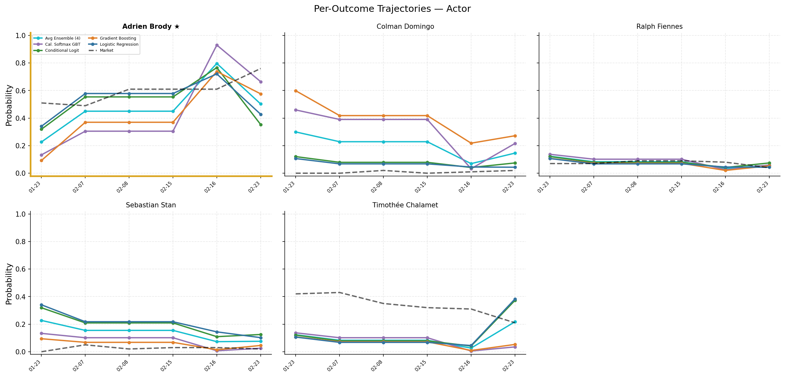

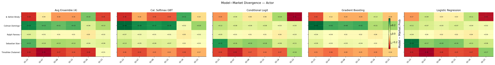

### Cinematography: the trap (0.5% profitable, best +$101 cal_sgbt)

The worst category for trading.  Models have **negative rank correlation** with
outcomes &mdash; their confidence goes in the wrong direction.  Only cal_sgbt
found a marginally profitable config (+$101); clogit's best lost &minus;$234.

Why so bad?  Cinematography prediction relies on different features than other
categories &mdash; the precursor signal structure doesn't transfer well.  The
ASC award (the key cinematography precursor) resolved very late (Feb 23),
giving minimal time for edge.

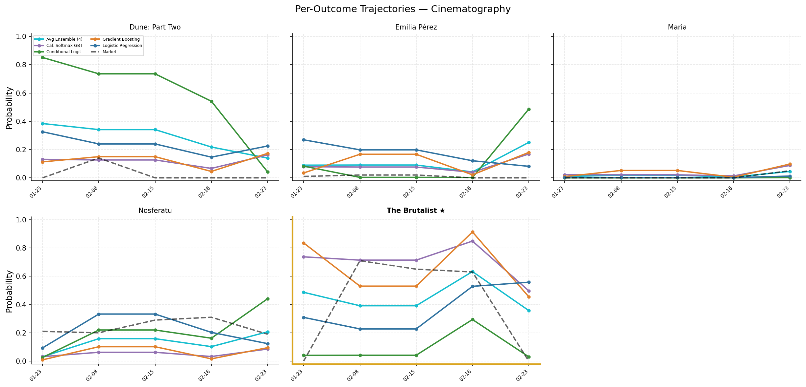

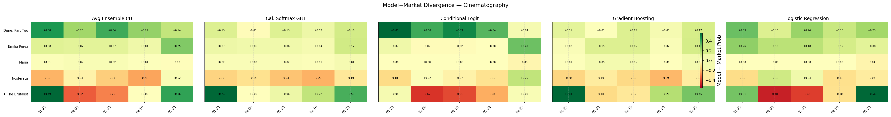

### Actor Supporting: the market was right all along

Kieran Culkin was the overwhelming favorite from day one (77&cent; &rarr;
89&cent;).  Only 0.3% of configs profitable.  Market was already efficient.

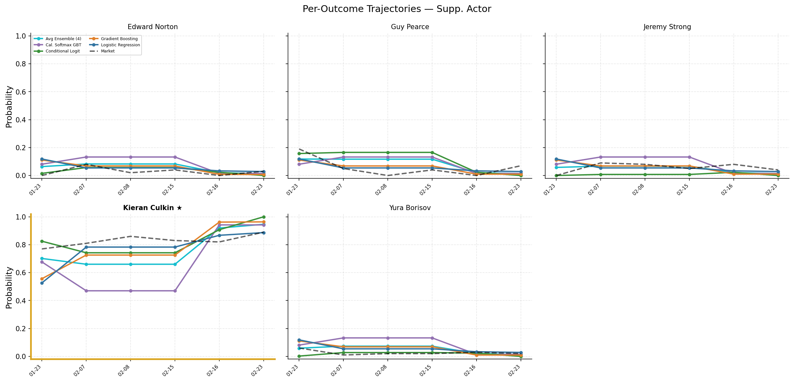

### Actress Supporting: marginal edge from heavy favorite

Zo&euml; Salda&ntilde;a was a heavy favorite (74&cent;).  Only cal_sgbt found
a small edge (+$222 best).

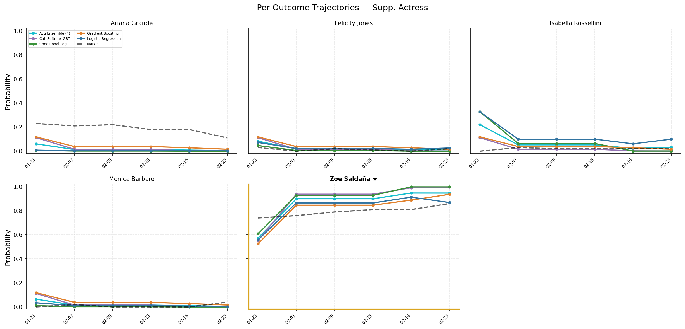

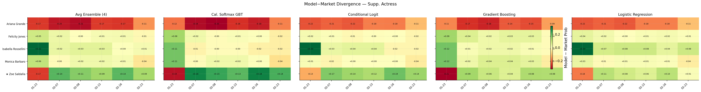

---

## Model Behavior Analysis

### Precursor awards are the critical signal

Across all categories, the model's edge appears after precursor awards resolve
(Feb 7-8, Critics Choice/DGA/PGA) and decays as the market catches up.

### Models converge to ground truth &mdash; but the edge was early

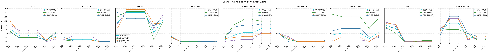

Brier scores drop to near-zero for all models by Feb 23, meaning all models
converge to ground truth.  But this convergence means the edge was in the
early snapshots.

### Winner rank evolution: early rank-1 = profit

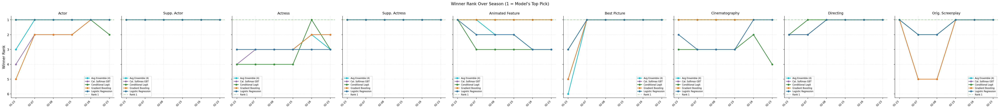

Models that rank the winner first earliest capture the most P&L.

### Probability concentration: models concentrate faster than markets

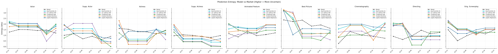

Models become highly concentrated (low entropy) after precursors resolve, while
markets stay more diffuse.  This concentration gap is the source of trading
edge &mdash; the market distributes probability across more nominees than the
model thinks warranted, creating mispricing on the model's top pick.  When
models concentrate *too early* (before confirming data), the result is
overconfidence and losses (e.g., Cinematography, Actor Leading).

### Model agreement: consensus as quality signal

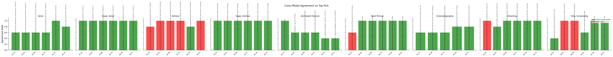

When all four models agree on the top pick (Best Picture, Directing after
Feb 8), the signal is most reliable.  Model agreement could serve as a
confidence filter: trade only when &ge; 3 of 4 models agree on rank-1.

### Model vs market divergence

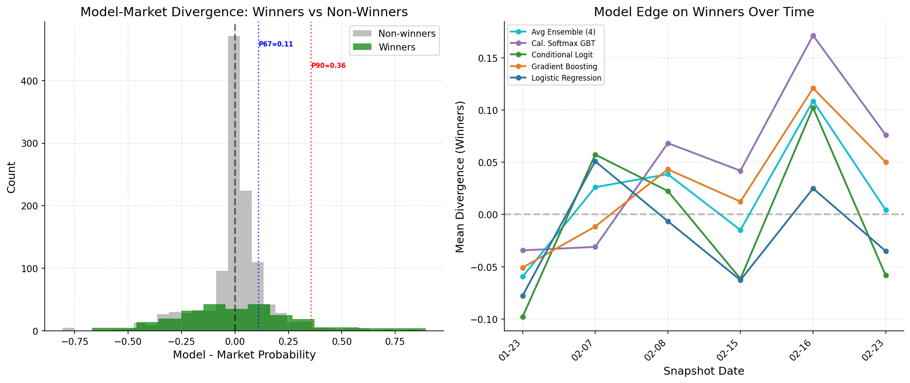

**Left panel:** Histogram of model &minus; market probability for winners vs
non-winners.  Dotted blue line = 67th percentile of winner divergence; dotted
red line = 90th percentile.  A good model has winner divergence shifted right
(model assigns higher probability than market) and non-winner divergence
centered near zero.  The percentile markers show that 2/3 of winner
observations have divergence above &sim;0.05, and 10% exceed &sim;0.40 &mdash;
these large-divergence moments are where most P&L is captured.

**Right panel:** Mean winner divergence over time, showing the structural
pattern: divergence spikes after precursors (Feb 7-8) then decays as the
market catches up.  The total area under each model's curve predicts its
cumulative trading edge.

### Nominee-level correlation

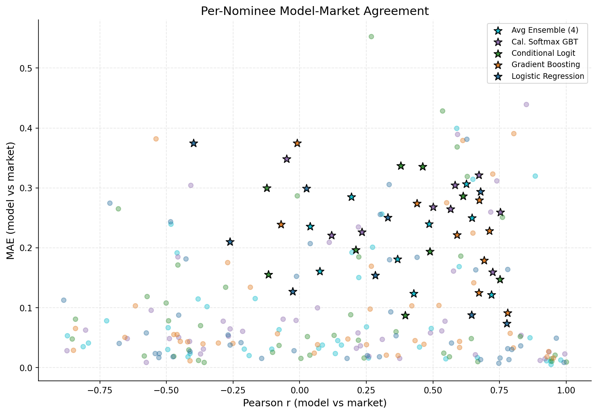

---

## Summary Tables

### Best P&L per Model &times; Category (cherry-picked configs)

| Model | Actor | Supp. Actor | Actress | Supp. Actress | Animated | Best Pic. | Cine. | Directing | Orig. SP | **Total** |
|-------|:-----:|:-----------:|:-------:|:-------------:|:--------:|:---------:|:-----:|:---------:|:--------:|:---------:|
| avg_ensemble | $0 | $0 | $0 | $0 | **+$1,013** | **+$1,403** | &minus;$51 | **+$2,053** | $0 | **+$4,418** |
| cal_sgbt | +$100 | $0 | &minus;$34 | **+$185** | +$424 | +$800 | +$101 | +$967 | $0 | +$2,544 |
| clogit | $0 | +$37 | &minus;$5 | +$209 | &minus;$39 | +$634 | &minus;$234 | +$1,111 | $0 | +$1,713 |
| gbt | +$125 | $0 | $0 | +$64 | +$431 | +$696 | $0 | +$676 | $0 | +$1,992 |
| lr | $0 | $0 | $0 | +$160 | &minus;$18 | +$388 | $0 | +$698 | $0 | +$1,228 |

*Cherry-picked: best config per (model, category) under inferred+6h timing.
Totals add cherry-picked best configs &mdash; no single config achieves these
totals across categories.*

The ensemble dominates due to strong Directing (+$2,053), Best Picture (+$1,403),
and Animated Feature (+$1,013) performance.  It avoids the clogit Cinematography
trap and the LR collapse under realistic timing.

### Brier Scores &times; Best P&L (final snapshot)

| Category | cal_sgbt Brier | clogit Brier | gbt Brier | lr Brier |
|----------|:-------------:|:------------:|:---------:|:--------:|
| Directing | **0.002** | 0.015 | 0.005 | 0.007 |
| Best Picture | **0.001** | 0.007 | 0.003 | 0.013 |
| Actor Supporting | 0.001 | **0.000** | 0.000 | 0.003 |
| Actress Supporting | **0.000** | 0.000 | 0.001 | 0.006 |
| Actor Leading | **0.033** | 0.117 | 0.052 | 0.098 |
| Orig. Screenplay | 0.044 | 0.030 | 0.060 | 0.069 |
| Cinematography | 0.065 | **0.275** | 0.076 | 0.054 |
| Animated Feature | 0.107 | 0.250 | 0.101 | 0.213 |
| Actress Leading | 0.326 | 0.240 | 0.224 | 0.291 |

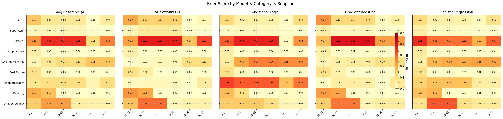

### Additional Diagnostic Plots

**Model rank heatmap:**

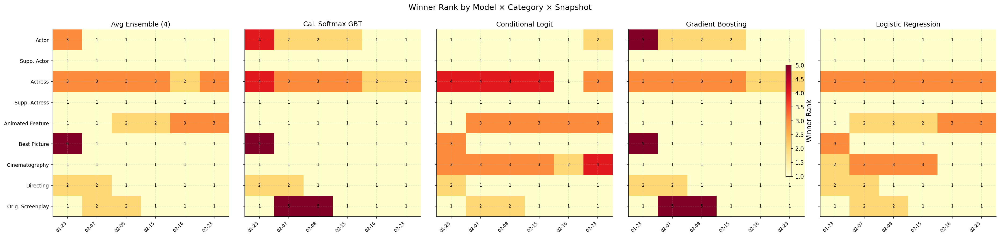

**Model winner probability heatmap:**

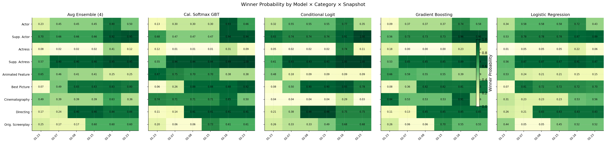

**Config robustness heatmap:**

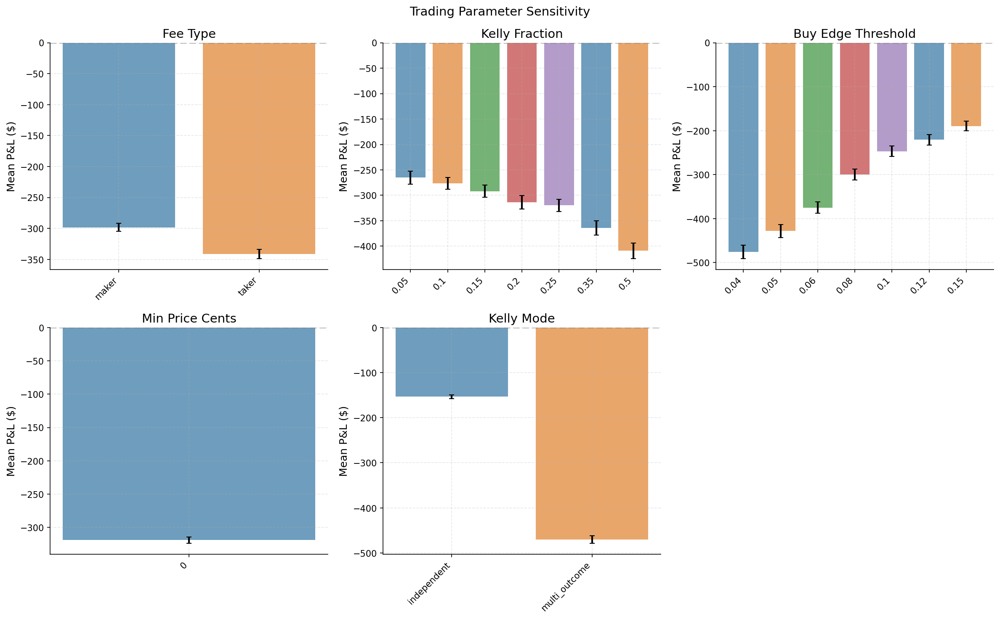

**Return decomposition:**

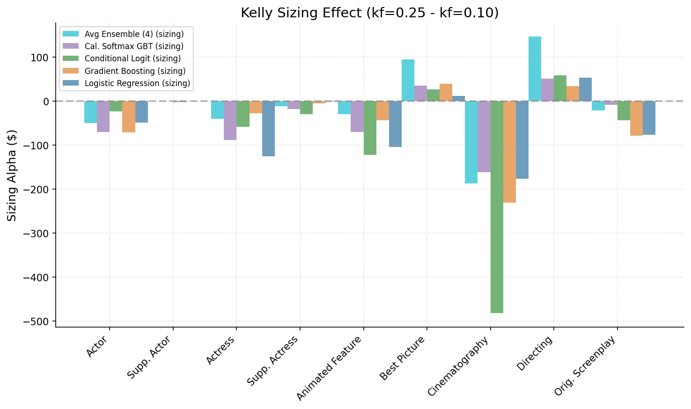

---

## Key Takeaways

1. **Realistic timing destroys most of the edge.**  Under inferred+6h, the
   best single-config P&L drops from +$2,479 (delay=0) to **+$509** &mdash;
   a 79% decline.  Most individual models have zero profitable aggregate
   configs.

2. **The ensemble model is the only viable deployment choice.**  By averaging
   all 4 models, the ensemble smooths catastrophic errors (Cinematography,
   Actor Leading) while preserving consensus edge.  9.7% of configs are
   profitable vs 0&ndash;2% for individual models.

3. **Two categories carry the strategy.**  Under honest timing, only Directing
   (84% profitable) and Best Picture (74% profitable) are reliably profitable.
   Animated Feature is a distant third (21%).  All other categories lose money
   for the vast majority of configs.

4. **Robustness favors conservative sizing.**  The highest-robustness configs
   use kf=0.05&ndash;0.15 with edge=0.15, achieving 100% neighbor stability
   but only +$29&ndash;$86 P&L.  More aggressive configs (kf=0.50) maximize
   P&L (+$509) but have worse tail risk and lower robustness scores.

5. **There is a fundamental P&L-vs-robustness tradeoff.**  No config achieves
   both high P&L and high robustness.  The practical recommendation depends
   on risk appetite:
   - **Risk-averse:** kf=0.05, edge=0.15, all &rarr; +$29, worst &minus;$158
   - **Balanced:** kf=0.35, edge=0.10, yes &rarr; +$356, worst &minus;$417
   - **Aggressive:** kf=0.50, edge=0.10, yes &rarr; +$509, worst &minus;$597

6. **The Feb 7-8 window captures most of the edge.**  After Critics Choice and
   DGA/PGA resolve, models spike to high probability on the eventual winner
   while markets lag.  Under honest timing, this translates to execution on
   Feb 8-9 (after 6h lag).

7. **For 2026 deployment:** use the ensemble model, focus on Directing and
   Best Picture (possibly Animated Feature), and budget for +$200&ndash;$500
   expected P&L on $9,000 total bankroll.  The honest expected return is
   2&ndash;6%, not the 25%+ suggested by delay=0 analysis.

## Open Questions

- **Is this replicable across years?** This is a single-year backtest.

- **Should we exclude Cinematography or Actor Leading?** Both show model errors
  that a simple filter (e.g., negative mean P&L) could flag ahead of time.

- **Should we use model agreement as a filter?** Trade only when &ge; 3 models
  agree on rank-1.

- **Can edge-weighted allocation be improved?** The weights are computed from
  in-sample data; out-of-sample validation would strengthen the case.

---

## How to Run

```bash
cd "$(git rev-parse --show-toplevel)"

# Full pipeline
bash oscar_prediction_market/one_offs/d20260220_backtest_strategies/run.sh \
    2>&1 | tee storage/d20260220_backtest_strategies/run.log

# Or step by step:
bash .../setup_configs.sh     # Generate feature configs + param grids
bash .../build_datasets.sh    # Build datasets (6 snaps x 9 cats)
bash .../train_models.sh      # Train models (slow)

# Run backtests (all categories)
uv run python -m oscar_prediction_market.one_offs.\
d20260220_backtest_strategies.run_backtests

# Run ensemble model only (appends to existing results)
uv run python -m oscar_prediction_market.one_offs.\
d20260220_backtest_strategies.run_ensemble_only \
    --results-dir storage/d20260220_backtest_strategies/2025/results_inferred_6h

# Analysis (uses inferred+6h by default)
uv run python -m oscar_prediction_market.one_offs.\
d20260220_backtest_strategies.analyze

# Robustness and config neighborhood analysis
uv run python -m oscar_prediction_market.one_offs.\
d20260220_backtest_strategies.analyze_robustness
```

## Output Structure

```
storage/d20260220_backtest_strategies/
+-- configs/                    # Feature configs, param grids, CV splits
+-- ticker_inventory.json       # Kalshi market inventory
+-- market_data/                # Daily candles + trade history
+-- nominee_maps/               # Model->Kalshi name mappings
+-- 2025/
|   +-- datasets/               # Raw datasets per category x snapshot
|   +-- models/                 # Trained models per category x model type
|   +-- results/                # Baseline (delay=0) results [historical]
|   |   +-- daily_pnl.csv                  # 22,140 rows: all config scenarios
|   |   +-- ...
|   +-- results_delay_0/        # Signal delay mode: same-day (control)
|   +-- results_delay_1/        # Signal delay mode: next-day
|   +-- results_inferred_6h/    # Signal delay mode: event-time + 6h lag [PRIMARY]
|   |   +-- daily_pnl.csv                  # 27,675 rows: 5 models x 9 cats x 615 configs
|   |   +-- model_accuracy.csv             # Per-snapshot metrics
|   |   +-- model_vs_market.csv            # Model vs market probs per nominee
|   |   +-- config_neighborhood.csv        # Neighborhood sensitivity stats
|   |   +-- robustness_scores.csv          # All configs ranked by robustness
|   |   +-- robustness_sweep.csv           # Tolerance parameter sweep
|   |   +-- ...                            # (same CSVs as results/)
|   +-- plots/                  # 55+ visualizations
+-- run_backtests_v3.log
+-- train_models.log
```
