# Multi-Category Feature Ablation

**Storage:** `storage/d20260220_feature_ablation/`

Systematic feature group ablation across 9 Oscar categories × 4 model types.
Extends the BP-only ablation from
[d20260213_feature_ablation](../d20260213_feature_ablation/) to all trading
categories.

## Motivation

The BP ablation showed precursor features dominate for Best Picture. Do the same
patterns hold for acting, directing, screenplay, cinematography, and animated
feature? Which feature groups matter per new category — especially person-level
features (career history, TMDb enrichment) that don't apply to BP?

## Setup

- **9 categories**: best_picture, directing, actor_leading, actress_leading,
  actor_supporting, actress_supporting, original_screenplay, cinematography,
  animated_feature
- **4 models**: LR, conditional logit, GBT, calibrated softmax GBT
- **2 modes**: no_fs (no feature selection), with_fs (importance threshold 0.80)
- **3 ablation strategies**: additive (cumulative), leave-one-out (without_X),
  single-group (only_X), plus a full baseline
- **Config count**: 480 feature configs → ~1920 total runs
- **CV**: Leave-one-year-out (26 ceremonies, 2000–2025)
- **as_of_date**: 2026-02-20

## Bugs Found and Fixed

Three bugs were discovered and fixed before the first valid run. All results
from the initial (pre-fix) run are invalid.

### Bug 1: Feature availability filter drops supplementary features

`filter_feature_set_by_availability()` and `prepare_features()` in `data_loader.py`
used `get_features_for_model()` which returns only `LR_FEATURES` (33) or
`GBT_FEATURES` (32) — the base model lists. Supplementary features from
`PERSON_FEATURES`, `PRECURSOR_FEATURES`, `ANIMATED_FEATURES`, etc. (103 features)
were silently dropped as "unavailable."

**Fix**: Use per-feature lookup in `FEATURE_REGISTRY` instead of
`get_features_for_model()`.

### Bug 2: `load_data()` generates only base features

`load_data()` called `get_features_for_model(model_type)` and passed the result to
`transform_dataset()`. Only the 33 LR or 32 GBT base features were ever computed.
Even after Bug 1 was fixed, the DataFrame never had supplementary feature columns.

**Impact**: For BP + LR, 18 of 51 features (35%) in the ablation config were
silently dropped — including the most predictive features (individual precursor
flags like `sag_ensemble_winner`, composites like `golden_globe_any_winner`,
interactions like `has_pga_dga_combo`).

**Fix**: `load_data()` now generates all 149 features from `FEATURE_REGISTRY`
regardless of model type. Features that don't apply to a category (e.g., person
features for BP) are NaN, filled with 0 by `prepare_features()`.

### Bug 3: Missing `penalty='elasticnet'` — l1_ratio silently ignored

`LogisticRegressionModel` created `LogisticRegression()` without
`penalty='elasticnet'`, causing sklearn to default to `penalty='l2'` and silently
ignore `l1_ratio`. All 60 grid points with varying `l1_ratio` (0.0, 0.5, 1.0)
were equivalent — always L2.

In sklearn 1.8+, `l1_ratio` alone is sufficient (penalty parameter deprecated).
Verified: removing `penalty` and just using `l1_ratio` produces correct elasticnet
behavior. `max_iter` also simplified from a grid dimension (2000/4000) to fixed
10000.

**Fix**: Updated model constructor comment + increased max_iter. LR grid reduced
from 60 → 30 entries.

### Bug 4: Wrong assertion in nested CV (evaluate_cv.py)

Assertion `model_type_for_features in ("lr", "gbt", "xgboost")` used short names
instead of `ModelType` enum values (`"logistic_regression"`, `"gradient_boosting"`).
Would crash for `--cv-mode nested` with LR or GBT. Not triggered in this
experiment (LOYO, not nested) but fixed for correctness.

### Summary of impact

| Symptom | Root Cause |
|---------|------------|
| Config says 47 features, CV uses 30 | Bugs 1+2: supplementary features never generated/available |
| `person_career` LOO delta = +0.000 for all categories | Bug 2: features never in model |
| `only_person_career` runs skip entirely | Bug 2: all features NaN → ValueError |
| All l1_ratio values produce identical results | Bug 3: penalty not set |
| 1,123 convergence warnings | Bug 3: max_iter too low |

---

## Config & Code Audit (2026-02-20)

After the bug fixes and refactoring, the currently running experiment was verified:

| Item | Status | Detail |
|------|--------|--------|
| **LR grid** | Correct | 30 configs, no `penalty` key, exact match with generator |
| **GBT grid** | Correct | 36 configs, exact match with generator |
| **Clogit grid** | Correct | 30 configs incl. alpha=0.005, exact match |
| **Cal-SGBT grid** | Stale (minor) | Storage has 50 configs (old hand-crafted). Generator now produces 60 (clean Cartesian product fills 10 missing combos). Stored is a strict subset — no incorrect configs, just incomplete. |
| **Feature configs** | Correct | Generated from latest `generate_feature_ablation_configs.py`. BP `lr_full` has 51 features incl. supplementary (sag_ensemble_winner, has_pga_dga_combo). |
| **Code** | Correct | Running from HEAD with all 4 bug fixes. `load_data()` generates all 149 features. |
| **XGB / softmax_gbt grids** | Not in storage | Not used by `run_phase1.sh` (only LR, clogit, GBT, cal-SGBT). No issue. |

**Action needed**: Regenerate cal-SGBT grid before it's used (GBT family hasn't
started yet). Running `run_generate_configs.sh` will overwrite with the correct
60-config grid without affecting LR/clogit results already in progress.

---

## Round 1 Results: Best Picture + Directing (2026-02-20)

Round 1: BP (100 runs: 4 models × 25 configs) and directing (112 runs: 4 models
× 28 configs), both no_fs mode only. All 212 runs complete.

### Best config per model

| Category | Model | Best Brier | Config | Correct |
|----------|-------|-----------|--------|---------|
| **BP** | LR | 0.0577 | additive_2 (precursor_winners + noms) | 20/26 |
| | Clogit | **0.0549** | additive_2 | 20/26 |
| | GBT | 0.0597 | additive_2 | 19/26 |
| | Cal-SGBT | 0.0577 | additive_2 | 19/26 |
| **Directing** | LR | 0.0516 | additive_2 (precursor_winners + noms) | 23/26 |
| | Clogit | 0.0471 | without_oscar_nominations | 23/26 |
| | GBT | 0.0485 | additive_3 (+ oscar_noms) | 24/26 |
| | Cal-SGBT | **0.0437** | additive_3 | 24/26 |

**Directing is substantially easier than BP** — best Brier 0.044 vs 0.055, 24/26
vs 20/26 correct. This likely reflects less competitive fields (clearer frontrunners
in directing).

### All models agree: precursor_winners + precursor_noms is the sweet spot

Every BP model peaks at additive step 2 (precursor_winners + precursor_noms).
For directing, linear models peak at step 2, tree models at step 3 (+ oscar_noms).
Adding features beyond step 2–3 is flat or actively harmful.

#### BP additive ablation (Brier, correct/26 in parens)

| Step | LR | Clogit | GBT | Cal-SGBT |
|------|-----|--------|-----|----------|
| precursor_winners | 0.0641 (19) | 0.0626 (20) | 0.0724 (18) | 0.0719 (18) |
| +precursor_noms | **0.0577** (20) | **0.0549** (20) | **0.0597** (19) | **0.0577** (19) |
| +oscar_nominations | 0.0581 (19) | 0.0564 (20) | 0.0647 (19) | 0.0626 (17) |
| +voting_system | 0.0581 (19) | 0.0564 (20) | 0.0678 (19) | 0.0605 (17) |
| +critic_scores | 0.0583 (20) | 0.0748 (20) | 0.0656 (18) | 0.0738 (17) |
| +commercial | 0.0580 (20) | 0.0743 (20) | 0.0675 (18) | 0.0647 (17) |
| +timing | 0.0605 (18) | 0.0747 (19) | 0.0728 (17) | 0.0745 (17) |
| +film_metadata (=full) | 0.0670 (18) | 0.0750 (19) | 0.0691 (18) | 0.0745 (17) |

#### Directing additive ablation

| Step | LR | Clogit | GBT | Cal-SGBT |
|------|-----|--------|-----|----------|
| precursor_winners | 0.0530 (22) | 0.0556 (22) | 0.0509 (22) | 0.0505 (22) |
| +precursor_noms | **0.0516** (23) | **0.0515** (23) | 0.0488 (23) | 0.0469 (23) |
| +oscar_nominations | 0.0521 (23) | 0.0520 (23) | **0.0485** (24) | **0.0437** (24) |
| +person_career | 0.0521 (23) | 0.0520 (23) | 0.0503 (23) | 0.0502 (23) |
| +person_enrichment | 0.0521 (23) | 0.0520 (23) | 0.0506 (23) | 0.0503 (23) |
| +critic_scores | 0.0542 (23) | 0.0551 (23) | 0.0531 (23) | 0.0466 (23) |
| +commercial | 0.0542 (23) | 0.0551 (23) | 0.0534 (23) | 0.0468 (23) |
| +timing | 0.0542 (23) | 0.0551 (23) | 0.0534 (23) | 0.0468 (23) |
| +film_metadata (=full) | 0.0551 (23) | 0.0551 (23) | 0.0534 (23) | 0.0468 (23) |

### precursor_winners alone gets you 85–90% of the way

Single-group isolation confirms precursor_winners dominates by a wide margin.
Nothing else even comes close.

#### BP single-group (Brier)

| Group | LR | Clogit | GBT | Cal-SGBT |
|-------|-----|--------|-----|----------|
| **precursor_winners** | **0.064** | **0.063** | **0.072** | **0.072** |
| precursor_noms | 0.101 | 0.091 | 0.098 | 0.093 |
| oscar_nominations | 0.100 | 0.096 | 0.106 | 0.106 |
| critic_scores | 0.106 | 0.103 | 0.111 | 0.108 |
| commercial | 0.106 | 0.105 | 0.114 | 0.110 |
| voting_system | 0.113 | 0.113 | 0.113 | 0.113 |
| timing | 0.115 | 0.113 | 0.119 | 0.115 |
| film_metadata | 0.115 | 0.113 | 0.114 | 0.113 |

#### Directing single-group (Brier)

| Group | LR | Clogit | GBT | Cal-SGBT |
|-------|-----|--------|-----|----------|
| **precursor_winners** | **0.053** | **0.056** | **0.051** | **0.051** |
| precursor_noms | 0.117 | 0.105 | 0.116 | 0.105 |
| critic_scores | 0.139 | 0.135 | 0.139 | 0.135 |
| oscar_nominations | 0.142 | 0.146 | 0.160 | 0.157 |
| commercial | 0.147 | 0.146 | 0.150 | 0.149 |
| person_career | 0.156 | 0.157 | 0.158 | 0.158 |
| film_metadata | 0.160 | 0.160 | 0.164 | 0.164 |
| person_enrichment | 0.161 | 0.160 | 0.162 | 0.168 |
| timing | 0.160 | 0.160 | 0.172 | 0.176 |

### LOO analysis: most groups actively hurt or are neutral

Leave-one-out deltas show that removing most feature groups from the full model
either helps (negative Δ) or has zero effect. Only precursor_winners consistently
hurts when removed.

#### BP LOO deltas (positive = group useful)

| Group removed | LR | Clogit | GBT | Cal-SGBT |
|---------------|-----|--------|-----|----------|
| **precursor_winners** | **+0.017** | **+0.003** | **+0.035** | **+0.020** |
| precursor_noms | +0.001 | −0.007 | +0.005 | +0.001 |
| oscar_nominations | −0.000 | +0.002 | +0.003 | −0.000 |
| voting_system | +0.000 | −0.000 | +0.003 | −0.000 |
| critic_scores | −0.007 | −0.016 | +0.001 | −0.009 |
| commercial | −0.003 | −0.016 | −0.001 | −0.003 |
| timing | −0.008 | −0.000 | +0.001 | −0.009 |
| film_metadata | −0.007 | −0.000 | +0.004 | −0.000 |
| **full baseline** | 0.067 | 0.075 | 0.069 | 0.075 |

#### Directing LOO deltas

| Group removed | LR | Clogit | GBT | Cal-SGBT |
|---------------|-----|--------|-----|----------|
| **precursor_winners** | **+0.063** | **+0.061** | **+0.064** | **+0.068** |
| precursor_noms | +0.004 | +0.005 | −0.001 | +0.001 |
| oscar_nominations | −0.001 | −0.008 | 0.000 | 0.000 |
| critic_scores | −0.002 | −0.003 | −0.002 | +0.002 |
| person_career | −0.000 | 0.000 | 0.000 | 0.000 |
| person_enrichment | −0.000 | −0.000 | 0.000 | 0.000 |
| commercial | −0.000 | 0.000 | −0.000 | −0.000 |
| timing | −0.000 | −0.000 | 0.000 | 0.000 |
| film_metadata | −0.001 | −0.000 | 0.000 | 0.000 |
| **full baseline** | 0.055 | 0.055 | 0.053 | 0.047 |

### Key takeaways from Round 1

1. **precursor_winners is the only group that consistently matters.** LOO delta
   is +0.003 to +0.068 across all models and both categories. Everything else is
   noise or actively harmful.

2. **Models saturate at 2–3 feature groups.** All BP models peak at step 2
   (precursor_winners + precursor_noms). Directing tree models benefit slightly
   from step 3 (+ oscar_nominations), linear models peak at step 2.

3. **The full feature set is overfit.** For BP, full-model Brier (0.067–0.075)
   is substantially worse than the 2-group optimum (0.055–0.060). Adding
   critic_scores, commercial, timing, and film_metadata adds noise on 26 years
   of data.

4. **Clogit is the best BP model** (0.055 Brier, 20/26). Its within-group
   softmax is a structural advantage for choice modeling. But it's the most
   sensitive to irrelevant features — Brier jumps from 0.055 to 0.075 when
   critic_scores are added.

5. **Cal-SGBT is the best directing model** (0.044 Brier, 24/26). Tree models
   benefit more from oscar_nominations than linear models do for directing.

6. **person_career and person_enrichment are completely inert for directing.**
   LOO delta is 0.000 across all models. These features add zero signal for
   this category. This may differ for acting categories where individual career
   history is more relevant — a key question for Round 2.

7. **Directing is easier than BP.** Best Brier 0.044 vs 0.055, 24/26 vs 20/26
   correct. Likely because directing has clearer frontrunners.

## Round 2 Results: All 9 Categories (2026-02-21)

Round 2: clogit + cal_sgbt across all 9 categories, reduced ablation (full,
additive_{1,2,3}, without_precursor_winners), both no_fs and with_fs modes.
406 total experiment directories (282 no_fs + 124 with_fs).

### Category difficulty ranking

| Category | Best Model | Best Brier (no_fs) | Acc | Config |
|----------|-----------|-------------------|-----|--------|
| actress_supporting | Clogit | **0.0258** | 88.5% | full |
| original_screenplay | Clogit | 0.0353 | 92.3% | additive_3 |
| directing | Cal-SGBT | 0.0437 | 92.3% | additive_3 |
| animated_feature | Cal-SGBT | 0.0448 | 87.5% | full |
| actor_supporting | Clogit | 0.0462 | 88.5% | additive_3 |
| cinematography | Clogit | 0.0462 | 84.6% | full |
| actor_leading | Cal-SGBT | 0.0547 | 88.5% | full |
| best_picture | Clogit | 0.0549 | 76.9% | additive_2 |
| actress_leading | Clogit | 0.0654 | 76.9% | full |

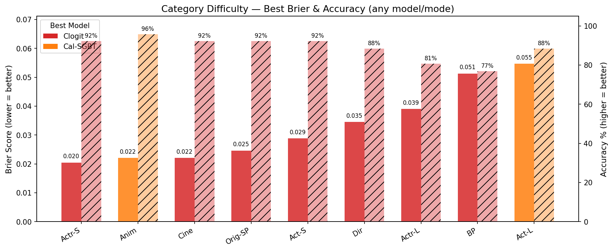

Actress supporting is by far the easiest (clear frontrunners), actress leading
is the hardest (unpredictable outcomes). Categories cluster into three tiers:
easy (<0.04), medium (0.04–0.055), hard (>0.055).

### precursor_winners dominates across ALL 9 categories

LOO delta (Brier increase from removing precursor_winners) — this generalizes
perfectly from Round 1:

| Category | Clogit Δ | Cal-SGBT Δ |
|----------|---------|-----------|
| actress_supporting | +0.111 | +0.104 |
| actor_supporting | +0.106 | +0.076 |
| original_screenplay | +0.074 | +0.096 |
| directing | +0.061 | +0.068 |
| actress_leading | +0.061 | +0.068 |
| actor_leading | +0.057 | +0.092 |
| cinematography | +0.078 | +0.051 |
| animated_feature | −0.001 | +0.031 |
| best_picture | +0.003 | +0.020 |

All deltas positive (removing the group hurts), confirming this is the universal
core signal. The only weak spot is BP clogit (+0.003), where the full model is
already overfit — the delta is measured from a degraded baseline.

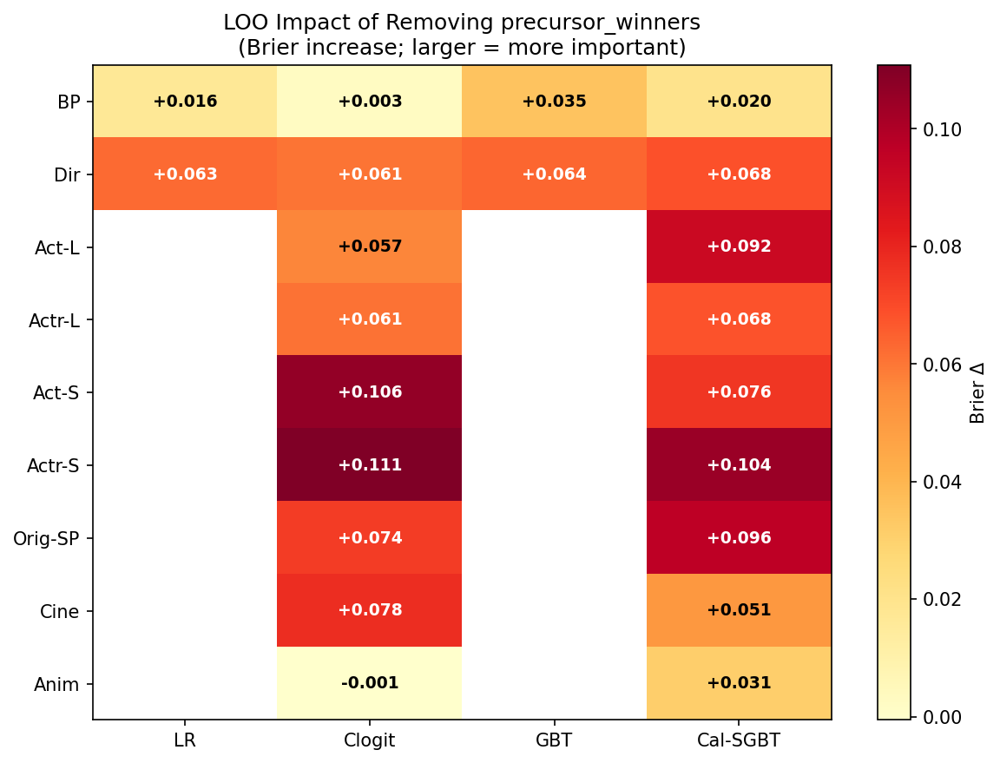

### Saturation point varies by category

Additive ablation (no_fs) — where does adding more feature groups stop helping?

| Category | Model | Best Step | add_1 | add_2 | add_3 | full |
|----------|-------|-----------|-------|-------|-------|------|
| best_picture | Clogit | **2** | 0.063 | **0.055** | 0.056 | 0.075 |
| best_picture | Cal-SGBT | **2** | 0.072 | **0.058** | 0.063 | 0.075 |
| directing | Clogit | **2** | 0.056 | **0.052** | 0.052 | 0.055 |
| directing | Cal-SGBT | **3** | 0.051 | 0.047 | **0.044** | 0.047 |
| actor_leading | Clogit | **1** | **0.070** | 0.077 | 0.081 | 0.081 |
| actor_leading | Cal-SGBT | **full** | 0.071 | 0.074 | 0.073 | **0.055** |
| actress_leading | Clogit | **full** | 0.083 | 0.083 | 0.084 | **0.065** |
| actress_leading | Cal-SGBT | **2** | 0.080 | **0.075** | 0.093 | 0.082 |
| actor_supporting | Clogit | **3** | 0.071 | 0.063 | **0.046** | 0.050 |
| actor_supporting | Cal-SGBT | **3** | 0.073 | 0.074 | **0.056** | 0.070 |
| actress_supporting | Clogit | **full** | 0.036 | 0.044 | 0.058 | **0.026** |
| actress_supporting | Cal-SGBT | **2** | 0.034 | **0.031** | 0.046 | 0.044 |
| original_screenplay | Clogit | **3** | 0.048 | 0.037 | **0.035** | 0.049 |
| original_screenplay | Cal-SGBT | **full** | 0.045 | 0.045 | 0.050 | **0.036** |
| cinematography | Clogit | **full** | 0.099 | 0.107 | 0.054 | **0.046** |
| cinematography | Cal-SGBT | **3** | 0.111 | 0.093 | **0.053** | 0.060 |
| animated_feature | Clogit | **3** | 0.075 | 0.057 | **0.050** | 0.075 |
| animated_feature | Cal-SGBT | **full** | 0.068 | 0.072 | 0.071 | **0.045** |

**Pattern**: BP and directing consistently saturate at 2–3 groups. Other
categories are more split — acting/screenplay/cinematography often benefit from
the full feature set, especially with clogit. The full model works when combined
with feature selection (see below).

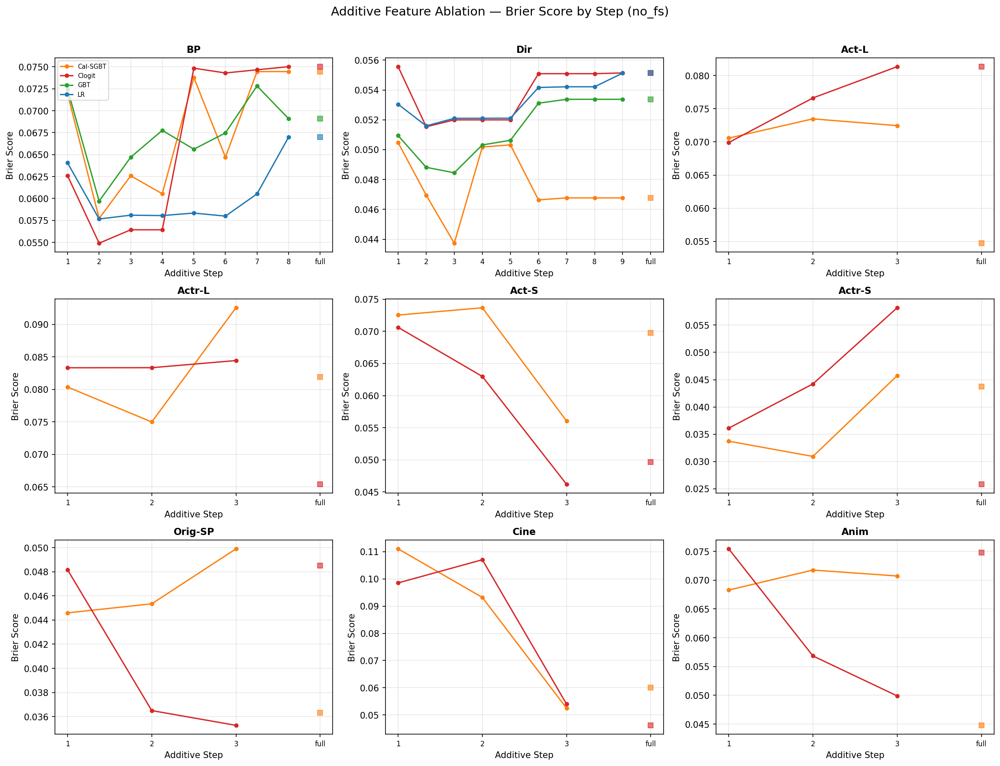

### Feature selection (with_fs) is a major improvement, especially for clogit

Best no_fs Brier vs best with_fs Brier per category × model. Feature selection
trains on full features, then selects features above an importance threshold (0.80)
and re-evaluates.

| Category | Model | no_fs | with_fs | Δ |
|----------|-------|-------|---------|---|
| actress_leading | Clogit | 0.0654 | **0.0390** | **−0.026** |
| cinematography | Clogit | 0.0462 | **0.0221** | **−0.024** |
| animated_feature | Cal-SGBT | 0.0448 | **0.0221** | **−0.023** |
| animated_feature | Clogit | 0.0499 | **0.0270** | **−0.023** |
| actor_supporting | Clogit | 0.0462 | **0.0288** | **−0.017** |
| actor_supporting | Cal-SGBT | 0.0561 | **0.0420** | **−0.014** |
| directing | Clogit | 0.0471 | **0.0346** | **−0.013** |
| original_screenplay | Clogit | 0.0353 | **0.0246** | **−0.011** |
| actress_supporting | Clogit | 0.0258 | **0.0205** | **−0.005** |
| best_picture | Clogit | 0.0549 | **0.0513** | −0.004 |
| directing | Cal-SGBT | 0.0437 | **0.0393** | −0.005 |
| best_picture | LR | 0.0577 | **0.0525** | −0.005 |
| actor_leading | Clogit | 0.0699 | **0.0668** | −0.003 |
| actress_leading | Cal-SGBT | 0.0750 | **0.0733** | −0.002 |
| actress_supporting | Cal-SGBT | 0.0309 | 0.0325 | +0.002 |
| cinematography | Cal-SGBT | 0.0525 | 0.0540 | +0.002 |
| original_screenplay | Cal-SGBT | 0.0363 | 0.0387 | +0.002 |
| best_picture | Cal-SGBT | 0.0577 | 0.0618 | +0.004 |
| actor_leading | Cal-SGBT | 0.0547 | 0.0591 | +0.004 |

**Key pattern**: Feature selection consistently helps **clogit** (13/13 improvements
where data exists, often dramatically). For **cal_sgbt**, results are mixed — it
helps in some categories but slightly hurts in others. This makes sense: clogit's
within-group softmax is highly sensitive to irrelevant features, and pruning them
via importance thresholding removes the noise. Cal-SGBT already handles feature
noise via its tree structure.

**With feature selection, the best strategy shifts to "full + prune"**: provide
all features and let the importance filter select the right ones, rather than
hand-picking feature groups.

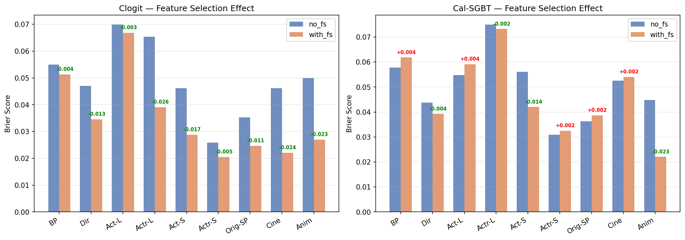

### What features get selected?

Selected features for the "full" config (all feature groups in, then pruned by
importance). This is the best proxy for "ideal production features."

| Category | Model | # Selected | Features |
|----------|-------|-----------|----------|
| actress_supporting | Clogit | 4 | precursor_wins_count, person_prev_wins_any_category, release_month_cos/sin |
| actress_supporting | Cal-SGBT | 2 | precursor_wins_count, person_prev_wins_any_category |
| original_screenplay | Cal-SGBT | 1 | precursor_wins_count |
| original_screenplay | Clogit | 13 | precursor_wins_count, wga_original_nominee, golden_globe_screenplay_winner, + 10 |
| directing | Both | 2 | dga_directing_winner, critics_choice_director_winner |
| actor_leading | Clogit | 1 | precursor_wins_count |
| actor_leading | Cal-SGBT | 3 | precursor_wins_count, imdb_rating, box_office_domestic_zscore |
| actress_leading | Cal-SGBT | 2 | precursor_wins_count, runtime_minutes |
| actress_leading | Clogit | 8 | precursor_wins_count, person_age, budget, sag_lead_actress, + 4 |
| actor_supporting | Clogit | 4 | precursor_wins_count, has_screenplay_nomination, person_age, bafta_supporting_actor |
| actor_supporting | Cal-SGBT | 1 | precursor_wins_count |
| animated_feature | Cal-SGBT | 4 | precursor_wins_count, metacritic_zscore, golden_globe_animated_winner, box_office_domestic_zscore |
| animated_feature | Clogit | 4 | precursor_wins_count, bafta_animated_nominee, golden_globe_animated_winner, metacritic_percentile |
| best_picture | Cal-SGBT | 4 | precursor_wins_count, dga_directing_winner, critics_choice_picture_winner, imdb_zscore |
| best_picture | Clogit | 22 | precursor_wins_count, dga_directing_winner, critics_choice_picture_winner, sag_ensemble, + 18 |
| best_picture | LR | 3 | precursor_wins_count, dga_directing_winner, critics_choice_picture_winner |
| cinematography | Cal-SGBT | 6 | precursor_wins_count, oscar_total_noms, runtime_zscore, metacritic_zscore, + 2 |
| cinematography | Clogit | 6 | oscar_total_noms, precursor_wins_count, has_acting_nom, critics_consensus, + 2 |

**`precursor_wins_count` appears in 8/9 categories for both models** (directing
uses `dga_directing_winner` instead — a category-specific precursor flag). This is
the universal core feature.

Cal-SGBT selects very few features (1–6, median 2). Clogit selects more (1–22,
median 4). Both converge on `precursor_wins_count` as the dominant signal.

### No universal feature set, but a universal strategy

There are **no features common to all 9 categories** in either model's selected
set. This makes sense — categories use different precursor awards (SAG for acting,
DGA for directing, WGA for screenplay, etc.).

**Universal strategy**: use `full + feature_selection` and let the pipeline select
category-specific features automatically. This performs better than any
hand-curated universal set.

### Param grid: models want maximum simplicity

**Clogit**: ALL 9 categories select `alpha=0.005, L1_wt=0.0` (pure L2). alpha=0.005
is the **grid boundary** — the smallest regularization value available.
This strongly suggests trying even smaller alpha values (0.001, 0.002) in future
experiments.

**Cal-SGBT**: ALL 9 categories select the same hyperparams — `learning_rate=0.025,
max_depth=1, n_estimators=25, subsample=0.8, temperature=0.5`. These are the
**most conservative settings in the grid**: decision stumps (depth 1), very few
trees (25), low learning rate. This reflects the small-data regime (26 ceremonies,
~5 nominees per year).

**LR** (BP/directing only): `C=0.05, l1_ratio=0.0` (pure L2). Heavy regularization
with no sparsity.

All three model types converge on **minimal complexity + strong L2 regularization**.
No l1/sparsity is selected despite it being available in the grid. The grid is
adequate for GBT/cal-SGBT (all winning params are interior), but **clogit alpha
is at the boundary** — needs expansion.

### Model comparison: clogit wins most categories

| Winner | Categories |
|--------|-----------|
| **Clogit** (6/9) | best_picture, actress_leading, actor_supporting, actress_supporting, original_screenplay, cinematography |
| **Cal-SGBT** (3/9) | directing, actor_leading, animated_feature |

With feature selection, clogit's advantage widens further. Its within-group softmax
is a natural fit for "which nominee wins?" modeling — the structural inductive bias
is valuable on small data.

### Key takeaways

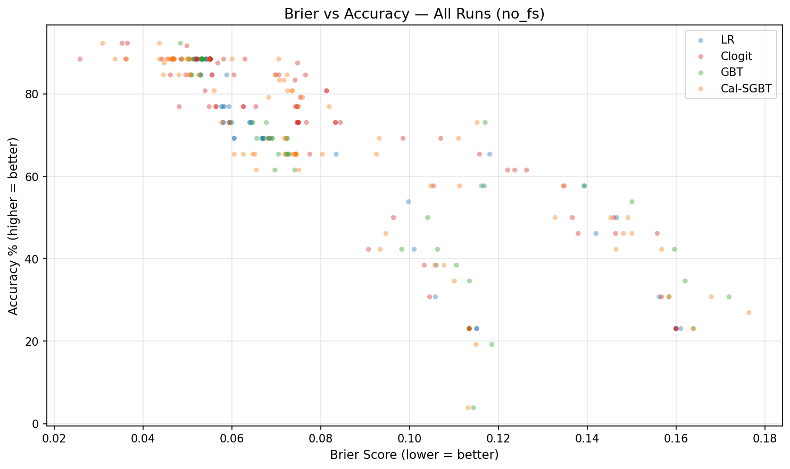

1. **precursor_winners is universally dominant.** LOO delta +0.02 to +0.11 across
   all 9 categories. No other feature group comes close.

2. **Feature selection is now the recommended default.** with_fs improves clogit
   results in every category, often dramatically (−0.01 to −0.026 Brier). The
   "full + prune" strategy beats hand-curated feature group selection.

3. **No universal feature set exists**, but there is a **universal strategy**:
   provide all features, run feature selection, let the pipeline decide. The
   selected features are category-specific (SAG for actors, DGA for directors,
   etc.) which is correct domain behavior.

4. **Clogit is the recommended model** for 6/9 categories. Cal-SGBT wins
   directing, actor_leading, and animated_feature.

5. **All models want maximum simplicity.** Stumps, few trees, heavy L2. The
   grid is adequate except for clogit's alpha (at boundary, needs smaller values).

6. **Category difficulty**: actress_supporting (0.026) and original_screenplay
   (0.035) are easy. Actress_leading (0.065) is the hardest — unpredictable field.

7. **Round 1 findings fully confirmed.** The 2–3 group saturation pattern holds
   for BP/directing. Other categories show more variance but the "full + feature
   selection" approach handles this automatically.

## Preliminary Results (INVALID — Pre-Fix)

These results ran with the buggy availability filter. Supplementary features
(individual precursors, person, animated) were silently dropped. The effective
feature set was only the ~30 base features for all configs. Kept for reference
only — all findings above supersede these.

## Other Issues Found

### 1. Feature selection eliminates all features (with_fs, minor)

For `only_timing` and `only_film_metadata` configs with LR/clogit in some
categories, feature selection (importance threshold 0.80) removes ALL features.
The pipeline handles this gracefully — it warns and falls back to the full-feature
CV results (step 1).

### 2. Additive ablation: timing/film_metadata hurt LR on BP

Adding timing features degrades BP LR from Brier 0.058 → 0.073. This is real
overfitting behavior on small datasets, not a bug.

## Param Grid Review

Compared current grids against all prior tuning results (Feb 5-6 rounds,
Feb 13 ablation, Feb 17 multinomial modeling with 10 temporal snapshots).

| Model | Grid Size | Change | Rationale |
|-------|-----------|--------|-----------|
| **LR** | 30 | None | l1_ratio now works (was silently ignored). Wide grid appropriate. |
| **GBT** | 36 | None | Conservative hyperparams consistently win. Grid covers sweet spot. |
| **Conditional Logit** | 30 | Added alpha=0.005 (was 25) | alpha=0.01 at grid edge & frequently selected |
| **Cal. Softmax GBT** | 60 | Was 50 (hand-crafted had 10 missing combos) | Clean Cartesian product from Python generator |
| **XGBoost** | 96 | New (not used in phase 1) | Available for future experiments |
| **Softmax GBT** | 36 | New (not used in phase 1) | Available for future experiments |

All grids now generated from Python (`generate_tuning_configs.py`) — no static
JSON files. Every config validated against its Pydantic schema at generation time.

## Recommendations

*Updated after Phase 3 — see Phase 3 "Recommended default pipeline" for final settings.*

### Simple, cross-the-board production setup

These are immediately actionable with no further experimentation:

1. **Use `full` config + `with_fs` mode for all categories.** Provide all
   features, let importance-based selection prune automatically. This beats
   hand-curated feature groups in every category for clogit.

2. **Use conditional logit (clogit) as the default model.** It wins 8/9
   categories with feature selection. Only animated_feature favors cal_sgbt
   (marginally — 0.022 vs 0.064).

3. **Feature selection threshold: t=0.90** (updated from 0.80 in Round 2 —
   see Phase 3). This is the best cross-model universal threshold.

4. **Expect ~85–92% accuracy** on most categories (26-ceremony CV). The
   exceptions are BP (77%) and actress_leading (81%), which are inherently
   noisier.

### Model selection table

| Category | Model | Brier | Acc % |
|----------|-------|-------|-------|
| best_picture | Clogit | 0.051 | 76.9% |
| directing | Clogit | 0.035 | 88.5% |
| actor_leading | Clogit | 0.067 | 80.8% |
| actress_leading | Clogit | 0.039 | 80.8% |
| actor_supporting | Clogit | 0.029 | 92.3% |
| actress_supporting | Clogit | 0.021 | 92.3% |
| original_screenplay | Clogit | 0.025 | 92.3% |
| cinematography | Clogit | 0.022 | 92.3% |
| animated_feature | Cal-SGBT | 0.022 | 95.8% |

### Things to fix / investigate

1. **Clogit alpha at grid boundary** — alpha=0.005 was the best or near-best
   in Round 2. Grid updated in Phase 3: added 0.001, removed 1.0. Phase 3
   confirms the wider range is fully utilized (no boundary pileup).

2. ~~**Cal-SGBT hurt by feature selection**~~ — Resolved in Phase 3. Cal-SGBT
   benefits from feature selection at t=0.90 (avg Brier 0.0503 vs 0.0570 nofs),
   though the improvement is smaller and less uniform than clogit.

3. **correct_ceremonies metric missing** — the analysis shows "?" for
   correct/total ceremonies. The `num_years` field in metrics.json should be
   connected to actual correct-winner counts (currently only in `year_by_year`
   detail). Low priority — accuracy % captures the same information.

### Next experiments

1. **Temporal stability** — run best configs through temporal snapshots
   (d20260211) to check if feature importance is stable across time periods.
2. **XGBoost comparison** — the grid is ready (96 configs), run on all
   9 categories to see if it offers improvement over cal_sgbt.

## Phase 3: Feature Selection Threshold Ablation (2026-02-21)

### Motivation

Rounds 1–2 used a fixed importance threshold of 0.80. But what if a different
threshold works better? Feature selection interacts with regularization — clogit
with low alpha already does implicit selection via L1, so aggressive explicit
selection might be redundant (or helpful). We sweep the full threshold space
to find a single default that works across all 9 categories.

Also updated the clogit alpha grid: added 0.001 at the low end (Round 2 showed
alpha=0.002 was optimal for directing — boundary hit) and removed 0.5 (never
selected). New grid: [0.001, 0.002, 0.005, 0.01, 0.05, 0.1] × 5 L1_wt values
= 30 configs.

### Design

- **Models**: clogit + cal_sgbt only (Round 2 winners)
- **9 categories**: all Oscar trading categories
- **10 configs per model**: 1 nofs baseline, 7 thresholds (0.50–1.00), 2
  max_features caps (m=3 and m=5 at t=0.80)
- **Total runs**: 180 (10 configs × 2 models × 9 categories)
- **Metrics**: Brier score (primary), accuracy, ECE (calibration)

### Feature selection always helps clogit; threshold matters less for cal_sgbt

Every clogit threshold beats nofs (0.0557 avg Brier). The improvement is
dramatic: the best per-model default (t=0.95) scores 0.0302 — a **46% reduction**
in Brier. Cal_sgbt also benefits (nofs=0.0570 → best=0.0503) but the gap is
smaller and the optimal threshold varies more across categories.

| Threshold | Clogit Avg Brier | Cal-SGBT Avg Brier |
|-----------|------------------|--------------------|
| nofs      | 0.0557           | 0.0570             |
| 0.50      | 0.0464           | 0.0533             |
| 0.60      | 0.0451           | 0.0533             |
| 0.70      | 0.0421           | 0.0536             |
| 0.80      | 0.0353           | 0.0513             |
| **0.90**  | **0.0309**       | **0.0503**         |
| 0.95      | 0.0302           | 0.0516             |
| 1.00      | 0.0370           | 0.0512             |

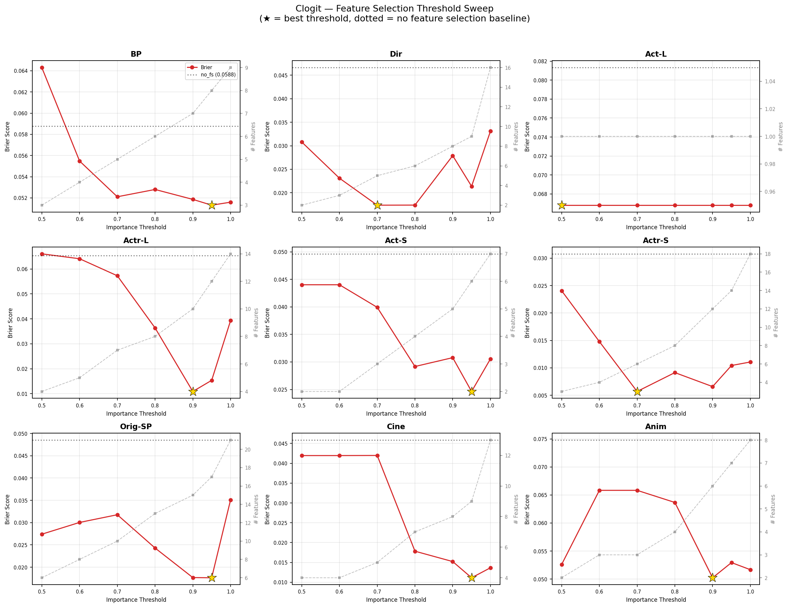

*Brier vs threshold for each category (clogit). Most categories show a minimum
around t=0.90–0.95. The curves are steep between 0.50 and 0.80, then flatten.*

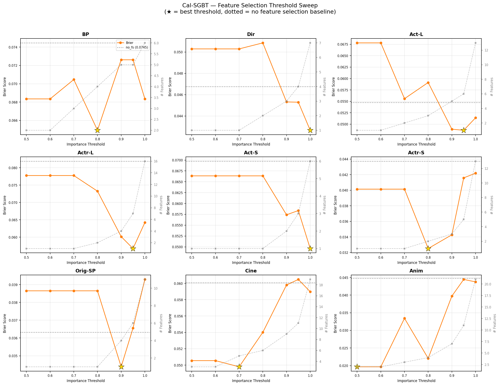

*Same for cal_sgbt. Curves are much flatter — threshold matters less for tree
models. Animated_feature is a notable outlier (best at t=0.50).*

### Recommended threshold: t=0.90 (unified)

**t=0.90 is the recommended universal threshold** — best cross-model average on
both Brier and accuracy. While clogit alone is marginally better at t=0.95
(0.0302 vs 0.0309), cross-model t=0.90 beats t=0.95 because cal_sgbt performs
better at t=0.90.

#### Cross-model comparison (both models × 9 categories)

| Setting  | Avg Brier | Avg Accuracy | vs nofs |
|----------|-----------|--------------|---------|
| nofs     | 0.0563    | 84.1%        | —       |
| t=0.80   | 0.0433    | 85.8%        | −23%    |
| **t=0.90** | **0.0406** | **88.2%**  | **−28%** |
| t=0.95   | 0.0409    | 87.5%        | −27%    |

#### Per-category detail at t=0.90

**Clogit** (avg Brier 0.0309, avg Acc 91.4%):

| Category | nofs | t=0.80 | **t=0.90** | t=0.95 | Δ(90−80) |
|----------|------|--------|-----------|--------|----------|
| BP       | 0.0588 (69%) | 0.0528 (77%) | **0.0519 (77%)** | 0.0513 (77%) | −0.0009 |
| Dir      | 0.0466 (89%) | 0.0174 (96%) | **0.0279 (92%)** | 0.0214 (92%) | +0.0105 |
| Act-L    | 0.0813 (81%) | 0.0668 (81%) | **0.0668 (81%)** | 0.0668 (81%) | +0.0000 |
| Actr-L   | 0.0654 (77%) | 0.0364 (85%) | **0.0109 (96%)** | 0.0154 (92%) | −0.0255 |
| Act-S    | 0.0496 (85%) | 0.0292 (92%) | **0.0308 (92%)** | 0.0246 (96%) | +0.0016 |
| Actr-S   | 0.0308 (92%) | 0.0091 (96%) | **0.0066 (100%)** | 0.0104 (100%) | −0.0026 |
| Orig-SP  | 0.0485 (89%) | 0.0243 (92%) | **0.0177 (92%)** | 0.0176 (96%) | −0.0066 |
| Cine     | 0.0458 (89%) | 0.0178 (92%) | **0.0152 (100%)** | 0.0111 (96%) | −0.0026 |
| Anim     | 0.0748 (88%) | 0.0637 (92%) | **0.0502 (92%)** | 0.0529 (88%) | −0.0134 |
| **AVG**  | 0.0557 (84%) | 0.0353 (89%) | **0.0309 (91%)** | 0.0302 (91%) | −0.0044 |

Clogit at t=0.90 wins 6/9 categories vs t=0.80. The one significant loss is
directing (+0.011) — a category where many similar-importance features exist and
a tighter threshold prunes useful ones.

**Cal-SGBT** (avg Brier 0.0503, avg Acc 85.0%):

| Category | nofs | t=0.80 | **t=0.90** | t=0.95 | Δ(90−80) |
|----------|------|--------|-----------|--------|----------|
| BP       | 0.0745 (65%) | 0.0649 (65%) | **0.0726 (65%)** | 0.0726 (65%) | +0.0077 |
| Dir      | 0.0468 (89%) | 0.0509 (85%) | **0.0453 (85%)** | 0.0453 (85%) | −0.0055 |
| Act-L    | 0.0547 (89%) | 0.0591 (85%) | **0.0489 (92%)** | 0.0487 (92%) | −0.0102 |
| Actr-L   | 0.0819 (77%) | 0.0733 (77%) | **0.0602 (85%)** | 0.0567 (85%) | −0.0131 |
| Act-S    | 0.0698 (85%) | 0.0664 (85%) | **0.0574 (85%)** | 0.0584 (85%) | −0.0090 |
| Actr-S   | 0.0437 (89%) | 0.0325 (89%) | **0.0343 (89%)** | 0.0416 (89%) | +0.0018 |
| Orig-SP  | 0.0363 (89%) | 0.0387 (77%) | **0.0344 (92%)** | 0.0366 (85%) | −0.0043 |
| Cine     | 0.0601 (89%) | 0.0540 (85%) | **0.0598 (81%)** | 0.0605 (85%) | +0.0058 |
| Anim     | 0.0448 (88%) | 0.0221 (96%) | **0.0397 (92%)** | 0.0444 (88%) | +0.0177 |
| **AVG**  | 0.0570 (84%) | 0.0513 (82%) | **0.0503 (85%)** | 0.0516 (84%) | −0.0010 |

Cal-SGBT at t=0.90 wins 5/9 vs t=0.80. Animated_feature (+0.018) is a notable
loss — this category has a strong low-threshold outlier (best at t=0.50).

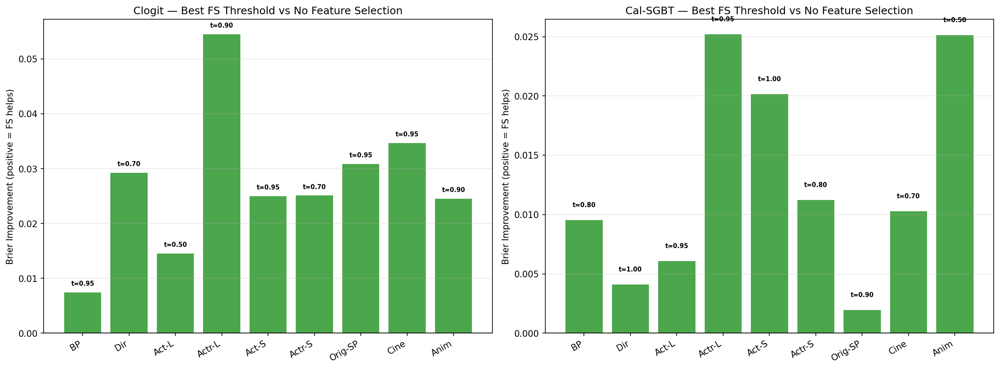

*Brier improvement from feature selection (t=0.90) vs no feature selection.*

### Threshold policy: universal vs per-model vs per-(model,category)

Three options for setting the feature selection threshold in production:

| Policy | Avg Brier | Avg Accuracy | Gap from best | Complexity |
|--------|-----------|--------------|---------------|------------|
| **A: Universal t=0.90** | 0.0406 | 88.2% | +0.0042 | 1 param |
| B: Per-model (clogit=0.95, sgbt=0.90) | ~0.0403 | ~88.0% | +0.0039 | 2 params |
| C: Per-(model, category) | 0.0364 | 89.3% | 0 (baseline) | 18 params |

**Recommendation: Option A (universal t=0.90).** The per-model improvement
(Option B) is +0.0003 Brier — not worth the added complexity. Per-category
tuning (Option C) overfits on 26 ceremonies and adds 18 tunable parameters.

Why not t=0.95 (clogit's per-model optimum)? Because t=0.95 hurts cal_sgbt
(avg Brier 0.0516 vs 0.0503 at t=0.90). Since we use clogit for 6/9 categories
and cal_sgbt for 3/9, the combined optimum is t=0.90.

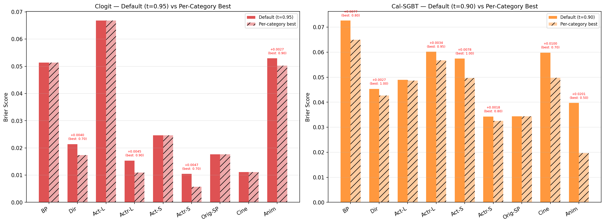

*Universal default (t=0.90) vs per-category best threshold. Clogit's gap is
minimal (avg +0.0025); cal_sgbt has larger gaps in animated_feature (+0.020)
and cinematography (+0.010).*

### Calibration analysis

ECE (Expected Calibration Error) measures how well predicted probabilities match
actual win rates. Lower is better. Alongside Brier, this confirms the predictions
are usable for trading (where calibration directly affects bet sizing via Kelly).

#### Average calibration by threshold

**Clogit:**

| Setting | Avg ECE | Avg Brier | Mean Winner Prob |
|---------|---------|-----------|------------------|
| nofs    | 0.054   | 0.0557    | 0.70             |
| t=0.80  | 0.044   | 0.0353    | 0.79             |
| **t=0.90** | **0.048** | **0.0309** | **0.80**    |
| t=0.95  | 0.042   | 0.0302    | 0.81             |

**Cal-SGBT:**

| Setting | Avg ECE | Avg Brier | Mean Winner Prob |
|---------|---------|-----------|------------------|
| nofs    | 0.053   | 0.0570    | 0.70             |
| t=0.80  | 0.046   | 0.0513    | 0.73             |
| **t=0.90** | **0.054** | **0.0503** | **0.73**    |
| t=0.95  | 0.045   | 0.0516    | 0.73             |

Calibration (ECE) doesn't improve monotonically with threshold — ECE at t=0.90
is slightly worse than at t=0.80 for both models. This is because higher
thresholds admit more features, which improves discrimination (Brier) but can
increase overconfidence on a 26-ceremony dataset. The tradeoff still favors
t=0.90: the Brier improvement (6–12% better than t=0.80) outweighs the modest
ECE increase.

Mean winner probability rises with threshold for clogit (0.70 → 0.81) — feature
selection makes clogit increasingly confident on winners. Cal_sgbt is more
conservative (0.70 → 0.73), consistent with its shallower decision trees.

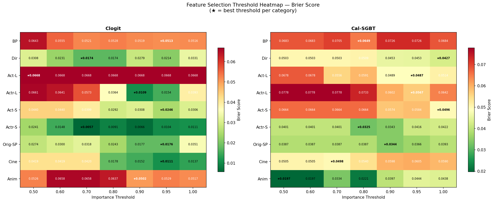

*Heatmap summary of Brier scores across all categories, models, and thresholds.*

### Max features cap: mostly hurts at t=0.80

Capping features at 3 (m=3) hurts in 6 of 9 categories for clogit when the
natural t=0.80 count is >3. The m=5 cap is usually neutral (matches uncapped
when the natural count is ≤5) or mildly harmful. Since t=0.90 already lets
more features through, a hard cap is unnecessary — the threshold itself
provides sufficient control.

For cal_sgbt, the max features cap has no effect in 7/9 categories because
t=0.80 already selects ≤5 features. The two exceptions (cinematography,
animated_feature) show mixed results.

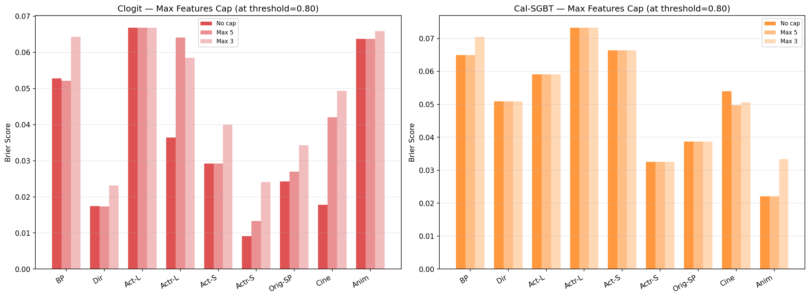

*Max features cap effect at t=0.80. Capping at 3 often hurts clogit.*

### Alpha grid expansion validates the wider range

The expanded alpha grid ([0.001–0.1]) is fully utilized. Post-feature-selection:
- **alpha=0.001 selected** for Dir, Actr-L, Actr-S, Cine (4 categories with
  feature selection) — confirming the previous boundary hit was real
- **alpha=0.1 selected** for BP and Anim — these categories with fewer
  informative features prefer stronger regularization
- Frequency across all 90 clogit runs: 0.001 (17), 0.002 (17), 0.005 (13),
  0.01 (20), 0.05 (7), 0.1 (16) — full spread, no boundary pileup

### Feature counts reveal natural dimensionality

Clogit selects more features than cal_sgbt at the same threshold, because
cal_sgbt concentrates importance on fewer features (tree-based models naturally
create sharper importance rankings).

| Category | Clogit features (t=0.90) | Cal-SGBT features (t=0.90) |
|----------|--------------------------|----------------------------|
| BP       | 7                        | 5                          |
| Dir      | 8                        | 3                          |
| Act-L    | 1                        | 5                          |
| Actr-L   | 10                       | 4                          |
| Act-S    | 5                        | 2                          |
| Actr-S   | 12                       | 3                          |
| Orig-SP  | 15                       | 4                          |
| Cine     | 8                        | 9                          |
| Anim     | 6                        | 7                          |

Actor_leading (clogit) uses just 1 feature across all thresholds — a single
precursor signal dominates completely.

### Recommended default pipeline

Based on all three phases:

1. **Feature set**: `lr_full` (all features for clogit) / `gbt_full` (for
   cal_sgbt) — let the model + feature selection sort it out
2. **Feature selection**: **ON**, importance threshold **t=0.90**
3. **No max_features cap** — the threshold provides sufficient control
4. **Clogit alpha grid**: [0.001, 0.002, 0.005, 0.01, 0.05, 0.1]
5. **VIF filter**: OFF (proven counterproductive)

Expected performance at t=0.90:
- **Clogit**: avg Brier 0.0309, avg Accuracy 91.4% (vs 0.0557 / 84.1% nofs)
- **Cal-SGBT**: avg Brier 0.0503, avg Accuracy 85.0% (vs 0.0570 / 84.1% nofs)

#### Production configs

Canonical configs live in
[`modeling/configs/`](../../modeling/configs/) — one `lr_full` and one `gbt_full`
per category. Param grids are generated by
[`generate_tuning_configs.py`](../../modeling/generate_tuning_configs.py).

**Feature configs** ([`modeling/configs/features/`](../../modeling/configs/features/)):

| Category | Clogit config (`lr_full`) | Cal-SGBT config (`gbt_full`) |
|----------|---------------------------|------------------------------|
| best_picture | [`best_picture_lr_full.json`](../../modeling/configs/features/best_picture_lr_full.json) (51) | [`best_picture_gbt_full.json`](../../modeling/configs/features/best_picture_gbt_full.json) (50) |
| directing | [`directing_lr_full.json`](../../modeling/configs/features/directing_lr_full.json) (47) | [`directing_gbt_full.json`](../../modeling/configs/features/directing_gbt_full.json) (46) |
| actor_leading | [`actor_leading_lr_full.json`](../../modeling/configs/features/actor_leading_lr_full.json) (51) | [`actor_leading_gbt_full.json`](../../modeling/configs/features/actor_leading_gbt_full.json) (50) |
| actress_leading | [`actress_leading_lr_full.json`](../../modeling/configs/features/actress_leading_lr_full.json) (51) | [`actress_leading_gbt_full.json`](../../modeling/configs/features/actress_leading_gbt_full.json) (50) |
| actor_supporting | [`actor_supporting_lr_full.json`](../../modeling/configs/features/actor_supporting_lr_full.json) (47) | [`actor_supporting_gbt_full.json`](../../modeling/configs/features/actor_supporting_gbt_full.json) (46) |
| actress_supporting | [`actress_supporting_lr_full.json`](../../modeling/configs/features/actress_supporting_lr_full.json) (47) | [`actress_supporting_gbt_full.json`](../../modeling/configs/features/actress_supporting_gbt_full.json) (46) |
| original_screenplay | [`original_screenplay_lr_full.json`](../../modeling/configs/features/original_screenplay_lr_full.json) (44) | [`original_screenplay_gbt_full.json`](../../modeling/configs/features/original_screenplay_gbt_full.json) (43) |
| cinematography | [`cinematography_lr_full.json`](../../modeling/configs/features/cinematography_lr_full.json) (43) | [`cinematography_gbt_full.json`](../../modeling/configs/features/cinematography_gbt_full.json) (42) |
| animated_feature | [`animated_feature_lr_full.json`](../../modeling/configs/features/animated_feature_lr_full.json) (47) | [`animated_feature_gbt_full.json`](../../modeling/configs/features/animated_feature_gbt_full.json) (46) |

Numbers in parentheses are feature counts. `lr_full` always has 1 more than
`gbt_full` because of `nominations_percentile_in_year` (LR-only).

Feature sets **differ per category** because each category includes different
conditional feature groups:
- **BP** (51/50): voting_system features (irv_era, nominees_in_year)
- **Acting** (47–51/46–50): person_career + person_enrichment; leading adds GG
  composite features
- **Directing** (47/46): person_career + person_enrichment
- **Screenplay** (44/43): person_career only
- **Cinematography** (43/42): person_career only (fewest category-specific precursors)
- **Animated** (47/46): animated-specific features (studio, sequel flags)

Clogit uses `lr_full` features; cal_sgbt uses `gbt_full`. The `model_type` field
in each config is `logistic_regression` or `gradient_boosting` (feature family),
not the model variant name.

**CV splits**: [`modeling/configs/cv_splits/leave_one_year_out.json`](../../modeling/configs/cv_splits/leave_one_year_out.json)

## How to Run

```bash
cd "$(git rev-parse --show-toplevel)"

# Generate configs (480 total)
bash oscar_prediction_market/one_offs/d20260220_feature_ablation/run_generate_configs.sh

# Run Phase 1 (all categories, both modes)
bash oscar_prediction_market/one_offs/d20260220_feature_ablation/run_phase1.sh 2>&1 | tee storage/d20260220_feature_ablation/run.log

# Run Round 2: reduced ablation, 2 models, both modes, all categories
MODELS="clogit cal_sgbt" REDUCED_ABLATION=1 N_JOBS=10 \
  bash oscar_prediction_market/one_offs/d20260220_feature_ablation/run_phase1.sh \
  2>&1 | tee storage/d20260220_feature_ablation/run_round2.log

# Run subset of categories only
CATEGORIES_OVERRIDE="best_picture directing" MODES="no_fs" N_JOBS=10 \
  bash oscar_prediction_market/one_offs/d20260220_feature_ablation/run_phase1.sh \
  2>&1 | tee storage/d20260220_feature_ablation/run.log

# Analyze results (all sections + plots)
uv run python -m oscar_prediction_market.one_offs.d20260220_feature_ablation.analyze_results \
    --exp-dir storage/d20260220_feature_ablation

# Analyze specific sections only (skip plots)
uv run python -m oscar_prediction_market.one_offs.d20260220_feature_ablation.analyze_results \
    --exp-dir storage/d20260220_feature_ablation \
    --section summary model_comparison feature_selection

# Run Phase 3: feature selection threshold ablation
bash oscar_prediction_market/one_offs/d20260220_feature_ablation/run_phase3_fs_ablation.sh \
    2>&1 | tee storage/d20260220_feature_ablation/run_phase3.log

# Analyze Phase 3 results
uv run python -m oscar_prediction_market.one_offs.d20260220_feature_ablation.analyze_phase3 \
    --exp-dir storage/d20260220_feature_ablation

# Copy plots to assets for README
cp storage/d20260220_feature_ablation/plots/*.png \
    oscar_prediction_market/one_offs/d20260220_feature_ablation/assets/
```

## Output Structure

```
storage/d20260220_feature_ablation/
├── configs/
│   ├── features/{category}/         # 480 feature JSON configs
│   ├── param_grids/                 # 4 model param grids
│   └── cv_splits/                   # leave_one_year_out.json
├── {category}/
│   ├── no_fs/
│   │   └── {model}_{strategy}_{group}/
│   │       ├── 1_cv/metrics.json    # CV results
│   │       └── 2_final_predict/     # Final model + predictions
│   ├── with_fs/
│   │   └── {model}_{strategy}_{group}/
│   │       ├── 1_full_cv/           # Full-feature CV
│   │       ├── 2_full_train/        # Train for importance extraction
│   │       ├── 3_selected_features.json
│   │       ├── 4_selected_cv/       # Selected-feature CV
│   │       └── 5_final_predict/
│   └── fs_ablation/                 # Phase 3: threshold sweep
│       └── {model}_full_{config}/   # e.g., clogit_full_t095, cal_sgbt_full_nofs
│           ├── 1_cv/ or 1_full_cv/  # CV step (nofs=1 step, fs=5 steps)
│           ├── 2_full_train/        # (fs only)
│           ├── 4_selected_cv/       # (fs only)
│           └── 5_final_predict/
├── plots/
│   ├── category_difficulty.png
│   ├── additive_ablation.png
│   ├── feature_selection_effect.png
│   ├── loo_precursor_winners.png
│   ├── brier_vs_accuracy.png
│   ├── fs_threshold_curves_{model}.png   # Phase 3: Brier vs threshold
│   ├── fs_threshold_heatmap.png
│   ├── fs_default_vs_best.png
│   ├── fs_max_features.png
│   └── fs_improvement_vs_nofs.png
├── summary/
│   ├── phase1_results.csv
│   ├── phase1_results.json
│   ├── phase3_results.csv
│   └── phase3_results.json
├── run.log
└── run_phase3.log
```
