# Buy-and-Hold Backtest: Cross-Year Analysis (2024–2025)

**Storage:** `storage/d20260225_buy_hold_backtest/`

Cross-year analysis of buy-and-hold prediction market backtests across two
Oscar ceremony years (2024, 2025). Each config's P&L is the **portfolio-level
sum** across all categories — a config is profitable in a year if its gains in
winning categories outweigh losses in losing categories. We test 588 fixed-
bankroll configs per model across 6 models (3,528 model×config combos per
year) and select configs using a **unified CVaR risk framework**: maximize
expected P&L subject to a constraint on conditional value at risk across all
possible election outcomes. The scoring framework uses **per-entry
normalization** (averaging across entry times) and evaluates risk at multiple
tail levels (α = 0% worst-case, 5%, 10%, 25%) to find the right balance
between conservatism and discrimination.

**Bottom line:** **clogit dominates the entire Pareto frontier** — at every
risk tolerance, from conservative (lose ≤10% of per-entry bankroll) to
aggressive (unconstrained), the config that maximizes expected P&L is always
clogit. Under our recommended **CVaR-5%** risk measure, the moderate config
(L=20%) earns $2,938 avg EV per entry with CVaR-5% bounded to −$1,599
(2024) / −$1,758 (2025), deploying 30–60% of per-entry bankroll at
37–10% ROIC. The conservative config (L=10%) earns $1,408 avg EV per entry
deploying only 7–12% of bankroll. 89.3% of all configs are profitable in
both years. The two years have fundamentally different dynamics: 2025 profits
come from Directing and Best Picture ($152k combined), while 2024 profits
come from Actress Leading and Original Screenplay ($30k combined). Cross-year
robustness comes from models that find *whatever edge exists*, not from
repeating the same trades.

> **Note on dollar amounts:** All EV, risk, and deploy dollar amounts in
> Sections 2 and 7–11 represent **per-entry averages** — the typical P&L from
> deploying once across all categories at a single entry time. This makes
> numbers comparable across years with different numbers of entries (2024 has
> 7, 2025 has 9). Per-entry bankroll is $8,000 for 2024 (8 categories ×
> $1,000) and $9,000 for 2025 (9 categories × $1,000). Actual portfolio P&L
> totals (in the profitability, rank correlation, and model comparison
> sections) remain raw sums across all entries.

## Per-Year READMEs

- [README_2025.md](README_2025.md) — 2025 ceremony (9 categories, 9 entry points)
- [README_2024.md](README_2024.md) — 2024 ceremony (8 categories, 7 entry points)
- [README_bh_vs_rebalancing.md](README_bh_vs_rebalancing.md) — Buy-and-hold vs rebalancing comparison (2025)

## Table of Contents

- [1. Setup](#1-setup)
  - [Year Comparison](#year-comparison)
  - [Config Universe](#config-universe)
- [2. EV Probability Source: Why Blend EV](#2-ev-probability-source-why-blend-ev)
- [3. Monte Carlo Convergence](#3-monte-carlo-convergence)
- [4. Cross-Year Config Profitability](#4-cross-year-config-profitability)
- [5. Cross-Year Rank Correlation](#5-cross-year-rank-correlation)
- [6. Model Comparison Across Years](#6-model-comparison-across-years)
- [7. Unified Risk Framework: CVaR at Multiple α Levels](#7-unified-risk-framework-cvar-at-multiple-α-levels)
  - [7.1 Methodology](#71-methodology)
  - [7.2 Cross-Year Pareto Frontier (α=0, worst-case)](#72-cross-year-pareto-frontier-α0-worst-case)
  - [7.3 CVaR-5% Pareto Frontier](#73-cvar-5-pareto-frontier)
  - [7.4 Choosing α: Sensitivity Analysis](#74-choosing-α-sensitivity-analysis)
  - [7.5 Per-Year Pareto Comparisons](#75-per-year-pareto-comparisons)
- [8. Category Edge: Anti-Correlated Across Years](#8-category-edge-anti-correlated-across-years)
- [9. Entry-Time EV Analysis](#9-entry-time-ev-analysis)
  - [Marginal EV by Entry Point](#marginal-ev-by-entry-point)
  - [Per-Entry P&L Distribution (Monte Carlo)](#per-entry-pl-distribution-monte-carlo)
  - [Key temporal findings](#key-temporal-findings)
- [10. Recommended Config for Live Trading (2026)](#10-recommended-config-for-live-trading-2026)
  - [Risk-Return Comparison Table](#risk-return-comparison-table)
  - [Decision Framework](#decision-framework)
- [11. Edge Threshold as a Single Risk Dial](#11-edge-threshold-as-a-single-risk-dial)
- [12. Key Takeaways](#12-key-takeaways)
- [13. EV Inflation Analysis](#13-ev-inflation-analysis)
- [14. Per-Model Pareto Frontiers](#14-per-model-pareto-frontiers)
- [15. EV vs Actual PnL Correlation](#15-ev-vs-actual-pnl-correlation)
- [16. Bootstrap Rank Stability](#16-bootstrap-rank-stability)
- [17. How to Run](#17-how-to-run)
- [18. Appendix: Bug Fixes Applied (2026-02-28)](#18-appendix-bug-fixes-applied-2026-02-28)
- [19. Output Structure](#19-output-structure)
- [20. Worked Example: $1,500 Single-Entry Bankroll](#20-worked-example-1500-single-entry-bankroll)

---

## 1. Setup

### Year Comparison

| Dimension | 2024 | 2025 |
|-----------|------|------|
| Ceremony date | Mar 10, 2024 | Mar 2, 2025 |
| Categories with Kalshi markets | 8 (no Cinematography) | 9 |
| Post-nomination entry points | 7 | 9 |
| Per-entry bankroll | $8,000 (8 × $1,000) | $9,000 (9 × $1,000) |
| Training data | 2000–2023 | 2000–2024 |
| Dominant narrative | Oppenheimer sweep | Competitive field |
| Best model (total P&L) | clogit (+$3,595) | cal_sgbt (+$35,059) |
| Best robust model | clogit | clogit |
| Best trading side | YES | ALL |
| Best entry timing | Late (ASC, 7d out) | Mid-season (DGA+PGA, 22d out) |
| Models tested | 6 | 6 |
| Configs per model | 588 | 588 |
| Total config×model combos | 3,528 | 3,528 |

### Config Universe

Each model is tested with the same grid of **588 trading configs**:

- **Fee type:** maker, taker (2)
- **Kelly fraction:** 0.05, 0.10, 0.15, 0.20, 0.25, 0.35, 0.50 (7)
- **Edge threshold:** 0.04, 0.05, 0.06, 0.08, 0.10, 0.12, 0.15 (7)
- **Kelly mode:** independent, multi_outcome (2)
- **Allowed directions:** yes, no, all (3)

Total: 2 × 7 × 7 × 2 × 3 = **588 configs per model**.

> **Why `kelly_fraction` is a no-op in `multi_outcome` mode:**
>
> In `independent` mode, KF directly scales each position:
> `contracts = kelly_fraction × full_kelly × bankroll / price`. Doubling KF
> deploys twice the capital — it is the primary size lever.
>
> In `multi_outcome` mode, KF is completely ignored by the optimizer.
> `multi_outcome` formulates a numerical optimization problem:
>
> maximize $E[\log W] = \sum_i q_i \cdot \log(W_{\text{if } i \text{ wins}})$
> subject to $\text{total cost} \leq \text{bankroll}$
>
> `kelly_fraction` appears **only** in the initial guess (`x0`) passed to
> the SLSQP solver — not in the objective function, not in the constraints.
> The solver finds the same mathematical optimum regardless of starting point.
>
> **Toy example** — Best Picture, $1,000 bankroll (ignoring fees):
> - Anora: model 65%, market 45¢ → full-Kelly = 36.4%
> - Conclave: model 25%, market 20¢ → full-Kelly = 6.25%
> - Neither wins: 10%
>
> *Independent mode* (KF scales linearly):
>
> | KF | Anora | Conclave | Total deployed |
> |---:|------:|---------:|---------------:|
> | 0.05 | 40c ($18) | 15c ($3) | $21 |
> | 0.10 | 80c ($36) | 31c ($6) | $42 |
> | 0.25 | 202c ($91) | 78c ($16) | $106 |
> | 0.50 | 404c ($182) | 156c ($31) | $213 |
>
> *Multi-outcome mode* (KF only shifts the optimizer's starting point):
>
> | KF | Starting guess | Optimal: Anora | Conclave | Total deployed |
> |---:|---------------:|---------------:|---------:|---------------:|
> | 0.05 | $21 | 1,158c ($521) | 964c ($193) | $714 |
> | 0.10 | $43 | 1,158c ($521) | 964c ($193) | $714 |
> | 0.25 | $107 | 1,158c ($521) | 964c ($193) | $714 |
> | 0.50 | $213 | 1,158c ($521) | 964c ($193) | $714 |
>
> KF=0.50 deploys 10× more than KF=0.05 in independent mode ($213 vs $21).
> In multi-outcome, all four starting points converge to the same
> Anora=1,158c + Conclave=964c = $714 portfolio. The 588-config grid
> has ~336 functionally distinct strategies; the 7 KF values in
> `multi_outcome` mode are near-duplicates.

With **6 models** (clogit, lr, gbt, cal_sgbt, avg_ens,
clog_sgbt) × 588 configs = **3,528 model×config combos** per year.
Since each combo is tested across all categories and entry points,
the total scenarios are much larger (e.g., 8 categories × 7 entries ×
3,528 = 197,568 rows for 2024; 9 × 9 × 3,528 = 285,768 rows for 2025).

**Config shorthand key:** Tables use the format `model/dir/kelly_mode kf=X e=Y`,
where `dir` is allowed_directions (Y=yes, N=no, A=all), `kelly_mode` is
ind=independent or multi=multi_outcome, kf=kelly_fraction, e=edge_threshold.
All configs use maker fees and fixed $1,000 bankroll per entry per category.

### Temporal Alignment

The two years have different sets of entry points (2024 has 7, 2025 has 9),
with some shared precursor events. For cross-year comparison we use two
alignment approaches:

1. **Days-before-ceremony**: Align by calendar distance to ceremony
2. **Precursor-event-type**: Align by which award show results are available

---

## 2. EV Probability Source: Why Blend EV

The EV scoring framework supports three probability sources for computing
expected P&L:

- **Model EV:** Uses the model's probability estimates (e.g., clogit's
  conditional logit probabilities). Trusts the model fully.
- **Market EV:** Uses implied probabilities from Kalshi market prices.
  Trusts the market fully.
- **Blend EV:** 50/50 average of model and market probabilities.
  Hedges between model confidence and market wisdom.

These three sources produce dramatically different EV estimates. For the
best-EV config at the L=30% worst-case cross-year Pareto frontier
(clogit/Y/multi kf=0.35 e=0.10):

| EV Source | Per-Entry EV 2024 | Per-Entry EV 2025 |
|-----------|------------------:|------------------:|
| Model EV  | ~$4,300           | $12,293           |
| Market EV | ~−$600            | −$191             |
| Blend EV  | ~$1,850           | ~$6,051           |

**Model EV is unrealistically optimistic.** The model assigns high
probabilities to eventual winners (that's what makes it a good model), so
model EV treats every position as if the model's probability is ground truth.
In 2025, clogit gives such high probabilities to Directing and Best Picture
winners that model EV per entry reaches $12,293 — roughly 3× what any config
actually realized.

**Market EV is negative.** If market prices perfectly reflected true
probabilities, there would be zero edge (before fees) and negative EV (after
fees). Market EV being slightly negative confirms that the market is
approximately efficient — the edge comes from the *model* disagreeing with
the market, not from the market being globally mispriced.

**Blend EV is the reasonable middle ground.** By averaging model and market
probabilities, blend EV acknowledges that (a) the model has genuine
predictive edge (otherwise we wouldn't trade) but (b) the model's
probabilities are not perfectly calibrated. Blend EV of ~$1,850 (2024) and
~$6,051 (2025) per entry sits between the extremes and is closer to actual
realized P&L.

All Pareto frontier tables and recommendations in this README use **blend EV**
as the default probability source. Model EV and market EV Pareto frontiers
are available in the output CSVs for reference.

---

## 3. Monte Carlo Convergence

CVaR estimates at α > 0 are computed via **100,000 Monte Carlo simulations**
per config per year. In each simulation, every category's winner is drawn
independently from the blend probability distribution, and the portfolio P&L
is computed. CVaR-α% is then the mean P&L in the worst α% of simulations.

The key question: are 100K simulations enough for stable CVaR estimates?

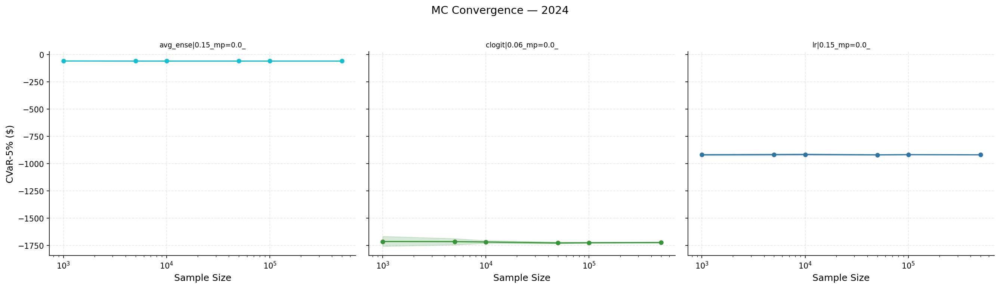

> **2024 Monte Carlo convergence.** CVaR-5% estimates (y-axis) as a function
> of simulation count (x-axis, log scale) for representative configs. Each
> line is one config. Estimates oscillate at low N but stabilize by N=10,000.
> At N=100,000, the standard error is negligible relative to the CVaR
> magnitude. The vertical dashed line marks N=10,000 as the practical
> convergence threshold.


> **2025 Monte Carlo convergence.** Same analysis for 2025. Convergence is
> similarly achieved by N=10,000. The tighter convergence in 2025 reflects
> fewer uncertain categories (Directing and Best Picture were relatively
> predictable, reducing outcome variance). At N=100,000, the CVaR-5%
> estimates are stable to within a few dollars.

**Takeaway:** 100K simulations provide more than sufficient precision for
CVaR estimation at all α levels used in this analysis (5%, 10%, 25%). The
convergence plots confirm that our risk estimates are not artifacts of
simulation noise.

---

## 4. Cross-Year Config Profitability

### 89.3% of configs profit in both years

For each of the 3,528 matched model×config combinations (same model +
same trading parameters across years), we sum P&L across all categories
within each year to get a **portfolio-level P&L** per config per year.

| Outcome | Count | % |
| :--- | ---: | ---: |
| Both years profitable | 3150 | 89.3% |
| 2024 only | 0 | 0.0% |
| 2025 only | 378 | 10.7% |
| Neither | 0 | 0.0% |
| **Total** | 3528 | 100.0% |

**Zero configs are profitable in 2024 but not 2025.** Every config that
generates net-positive P&L when summing across 2024's 8 categories also
generates (larger) net-positive P&L across 2025's 9 categories. The 10.7%
that fail in 2024 are configs that need the broader mispricing landscape
of 2025 to overcome per-category losses.

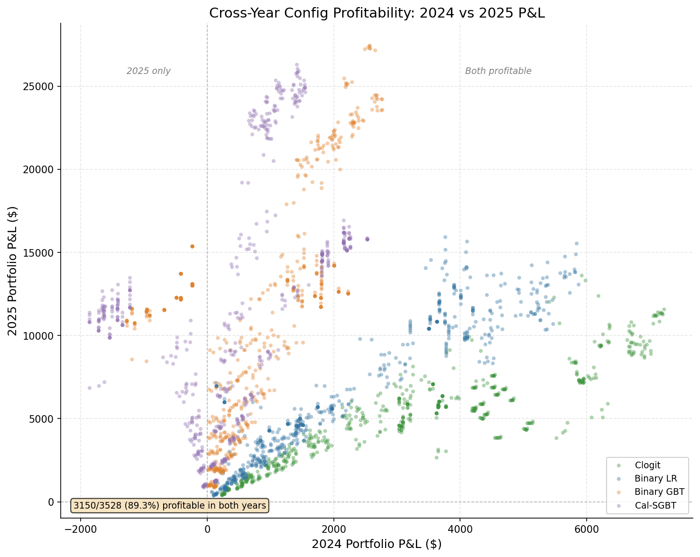

> **Cross-year profitability scatter.** Each point is one of 3,528
> model×config combos. X-axis = 2024 portfolio P&L, y-axis = 2025 portfolio
> P&L. Green points are profitable in both years (89.3%), red points are
> profitable in 2025 only (10.7%). There are no points in the lower-right
> quadrant (profitable in 2024 only) or lower-left (unprofitable in both),
> confirming that 2025's larger mispricing opportunity makes it the easier
> year. The strong positive correlation shows that configs generating more
> P&L in 2024 tend to generate more in 2025 as well.

### Per-Model Breakdown

| Model | #Cfg | Both Prof | Both % | Mean Combined | Median Combined |
| :--- | ---: | ---: | ---: | ---: | ---: |
| avg_ens | 588 | 546 | 92.9% | $11,711.26 | $9,600.94 |
| cal_sgbt | 588 | 392 | 66.7% | $12,111.01 | $10,059.40 |
| clogit | 588 | 588 | 100.0% | $8,395.84 | $8,948.83 |
| clog_sgbt | 588 | 546 | 92.9% | $11,192.02 | $9,514.42 |
| gbt | 588 | 490 | 83.3% | $11,686.61 | $10,734.15 |
| lr | 588 | 588 | 100.0% | $8,832.85 | $6,788.85 |

**clogit and lr both achieve 100% both-year profitability** — every one
of their 588 configs produces positive aggregate P&L in both years. The
avg_ens and clog_sgbt ensembles are close at 92.9% (546/588 each). gbt
trails at 83.3% (490/588) and cal_sgbt at 66.7% (392/588).

> **Per-category vs aggregate profitability:** The "0% profitable in 2024
> only" refers to aggregate (portfolio) P&L. At the per-category level,
> many configs are profitable in some 2024 categories but not overall. In
> 2025, all configs are aggregate-profitable because the Directing and Best
> Picture edges are so large they dominate any per-category losses.

---

## 5. Cross-Year Rank Correlation

We use **Spearman rank correlation** (ρ) to measure whether a config's
relative P&L ranking is preserved across years. ρ = +1 means configs rank
identically in both years; ρ = 0 means no relationship; ρ = −1 means the
rankings completely reverse.

| Model | #Cfg | Spearman ρ | p-value |
| :--- | ---: | ---: | ---: |
| avg_ens | 588 | 0.7895 | 2.32e-126 |
| cal_sgbt | 588 | 0.5860 | 1.62e-55 |
| clogit | 588 | 0.8931 | 1.82e-205 |
| clog_sgbt | 588 | 0.7343 | 1.12e-100 |
| gbt | 588 | 0.6148 | 2.06e-62 |
| lr | 588 | 0.9127 | 5.50e-230 |
| **ALL** | 3528 | 0.4366 | 3.88e-164 |

**lr leads rank correlation at ρ = 0.913**, followed closely by clogit at
ρ = 0.893 — both near-perfect. A config that ranks highly within these
models in one year will almost certainly rank highly in the other. The
ensemble models (avg_ens 0.790, clog_sgbt 0.734) show strong transfer.
The tree-based models (gbt 0.615, cal_sgbt 0.586) show moderate but
significant positive correlation.

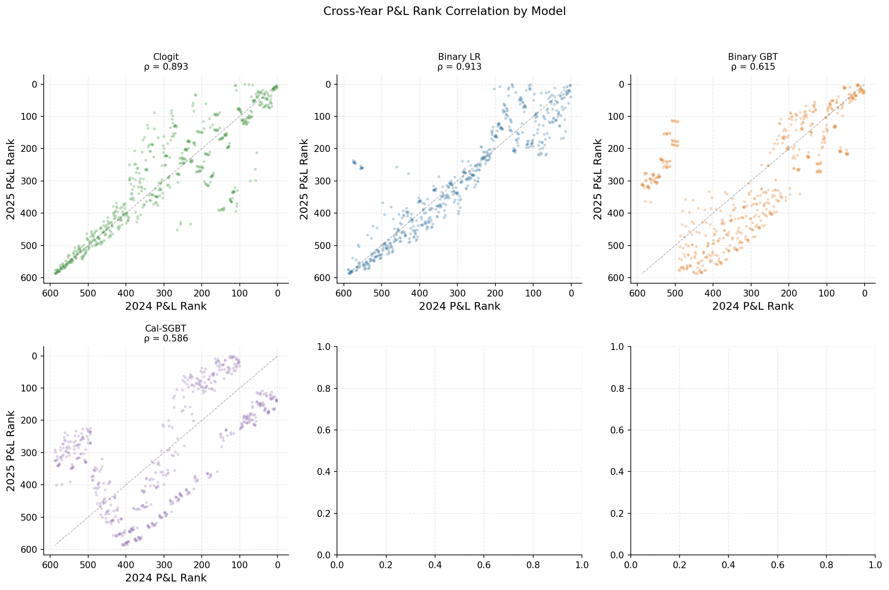

> **Cross-year rank correlation by model.** Each panel shows one model's 588
> configs plotted by 2024 P&L rank (x-axis) vs 2025 P&L rank (y-axis). A
> tight diagonal means high rank stability across years. clogit (ρ=0.893)
> and lr (ρ=0.913) show the tightest diagonals — their config rankings
> transfer almost perfectly. Tree-based models (gbt, cal_sgbt) show
> more scatter, indicating less transferable config rankings.

**Why linear models transfer best:** lr and clogit impose strong structural
assumptions (linear log-odds, within-category competition), which prevent
overfitting to year-specific patterns. Tree-based models (gbt, cal_sgbt)
can overfit to training data patterns that don't transfer across years,
resulting in lower rank correlation. The ensemble models (avg_ens, clog_sgbt)
fall in between, blending structural stability with tree flexibility.

---

## 6. Model Comparison Across Years

| Model | Both % | Mean Combined | Best Combined | Mean 2024 | Mean 2025 | Spearman ρ |
| :--- | ---: | ---: | ---: | ---: | ---: | ---: |
| avg_ens | 92.9% | $11,711.26 | $30,043.16 | $2,230.19 | $9,481.07 | 0.790 |
| cal_sgbt | 66.7% | $12,111.01 | $27,713.26 | $413.22 | $11,697.78 | 0.586 |
| clogit | 100.0% | $8,395.84 | $19,532.67 | $3,289.76 | $5,106.08 | 0.893 |
| clog_sgbt | 92.9% | $11,192.02 | $26,974.04 | $2,354.51 | $8,837.51 | 0.734 |
| gbt | 83.3% | $11,686.61 | $30,003.62 | $776.49 | $10,910.12 | 0.615 |
| lr | 100.0% | $8,832.85 | $21,381.67 | $2,267.21 | $6,565.64 | 0.913 |

> **Column legend:** **Both %** = fraction of configs with positive aggregate
> P&L in both years. **Mean/Best Combined** = sum of 2024 + 2025 portfolio
> P&L (raw totals, not per-entry). **Spearman ρ** = rank correlation of
> per-config aggregate P&L across years.

**clogit** is the most robust model: 100% both-year rate, strong rank
correlation (0.893), and — as shown in the [Pareto analysis](#72-cross-year-pareto-frontier-α0-worst-case)
below — it dominates the entire cross-year Pareto frontier at every risk
tolerance. **avg_ens** maximizes best combined P&L ($30,043 best config)
with 92.9% both-year rate. **cal_sgbt** has the highest mean combined P&L
($12,111) but only 66.7% both-year profitability — it relies heavily on
2025's large Directing/Best Picture edge.

### Why clogit achieves 100% cross-year profitability

This result follows from portfolio diversification across categories. Clogit's
structural model (conditional logit) captures within-category competition
dynamics. In each year, it identifies edge in *different* categories:

- **2024:** Edge concentrated in Actress Leading (Emma Stone upset) and
  Original Screenplay (Anatomy of a Fall underpriced). Gains: ~+$2,600.
  Other categories: small losses averaging −$150 each.
- **2025:** Edge concentrated in Directing (Brady Corbet underpriced) and
  Best Picture. Gains: ~+$12,500. Other categories: mixed.

Even clogit's worst config earns positive P&L in both years. The key insight:
across 8–9 categories, clogit consistently identifies *enough* edge in *some*
categories to overcome losses in others. This is analogous to a diversified
portfolio where individual positions may lose but the aggregate is positive.

The structural advantage: conditional logit explicitly models outcome
competition within categories (probabilities must sum to 1), which prevents
it from making overconfident bets on favorites where the market is already
efficient. Tree-based models (gbt, cal_sgbt) can overfit to patterns in the
training data that produce concentrated, high-variance bets — great when they
hit (2025 Directing), catastrophic when they miss. Clogit's more conservative
probability estimates create a natural hedge.

### clog_sgbt ensemble: bridging robustness and returns

The **clog_sgbt** ensemble (clogit + cal_sgbt blend) achieves 92.9% both-year
profitability with $11,192 mean combined P&L — capturing most of cal_sgbt's
2025 upside while retaining most of clogit's cross-year reliability. It
inherits clogit's 2024 edge categories (actress_leading, original_screenplay)
and cal_sgbt's 2025 edge categories (directing, best_picture). The trade-off:
42 configs that are profitable for clogit become unprofitable for the ensemble
because cal_sgbt's predictions drag down the average in categories where
clogit has edge (reducing the 100% both-year rate to 92.9%).

---

## 7. Unified Risk Framework: CVaR at Multiple α Levels

### 7.1 Methodology

We use **Conditional Value at Risk (CVaR)** as a unified risk framework that
encompasses both worst-case analysis and probabilistic tail risk at multiple
severity levels. The framework answers: *for a given risk tolerance, which
config maximizes expected P&L?*

**CVaR-α% defined:** For a portfolio P&L distribution, CVaR-α% is the
expected P&L in the worst α% of outcomes. Special cases:

- **α = 0% (worst-case):** The single worst possible outcome — every category
  resolves to the worst possible winner for that config's positions.
  Computed analytically by enumerating all possible settlements.
- **α = 5%:** Expected loss in the worst 5% of Monte Carlo outcomes.
  Less conservative: a few categories go wrong, not necessarily all.
- **α = 10%:** Expected loss in the worst 10% of outcomes.
- **α = 25%:** Expected loss in the worst quartile.

As α increases, CVaR becomes less conservative (approaches the mean) and
fewer configs are excluded by a given loss bound.

**Per-entry normalization:** EV, CVaR, and capital deployed are **averaged
across entry times** within each year, giving the "expected P&L from a single
typical entry deployment." This makes numbers comparable across years with
different numbers of entries (2024 has 7 entries, 2025 has 9 entries).

**Per-entry bankroll:** The loss bound $L$ is expressed as a percentage of
per-entry bankroll — the capital deployed across all categories at a single
entry time:

- **2024:** $8,000 = 8 categories × $1,000 per category
- **2025:** $9,000 = 9 categories × $1,000 per category

So L=10% means worst allowable per-entry loss is $800 (2024) or $900 (2025).

**Cross-year scoring:** For configs tested in both 2024 and 2025:

- **EV** = average of per-year per-entry-normalized EVs (both years
  contribute equally)
- **Risk constraint** must pass in **both** years independently — a config
  is feasible at loss bound L only if its CVaR satisfies the bound in
  2024 *and* 2025

We sweep the loss bound $L$ from 10% to 50%+ of per-entry bankroll and find
the **Pareto frontier**: for each $L$, which config maximizes average EV
while keeping CVaR within $L$ in both years?

**EV probability source:** All Pareto tables use **blend EV** (50/50
model + market probabilities). See [Section 2](#2-ev-probability-source-why-blend-ev)
for why blend is the default.

**Config shorthand:** Tables use `model/dir/mode kf=X e=Y` where dir is
Y=yes, N=no, A=all (allowed_directions); mode is ind=independent,
multi=multi_outcome (kelly_mode); kf=kelly_fraction; e=buy_edge_threshold.
All configs use maker fees and fixed $1,000 bankroll.

### 7.2 Cross-Year Pareto Frontier (α=0, worst-case)

The worst-case Pareto frontier treats every category as going wrong
simultaneously — the most conservative possible risk measure.

| L (%) | #Feasible | Avg EV ($) | Worst 2024 ($) | Worst 2025 ($) | Actual 2024 ($) | Actual 2025 ($) | Deploy 2024 | Deploy 2025 | ROIC 2024 | ROIC 2025 | % Profitable | Config |
| ---: | ---: | ---: | ---: | ---: | ---: | ---: | ---: | ---: | ---: | ---: | ---: | :--- |
| 10 | 853 | $1,021.89 | −$439 (−5.5%) | −$851 (−9.5%) | $246 (3.1%) | $445 (4.9%) | $435 (5%) | $841 (9%) | 56.5% | 52.9% | 95.1% | clogit/Y/ind kf=0.25 e=0.1 |
| 20 | 1492 | $2,032.09 | −$879 (−11.0%) | −$1,695 (−18.8%) | $492 (6.2%) | $839 (9.3%) | $870 (11%) | $1,676 (19%) | 56.5% | 50.1% | 95.0% | clogit/Y/ind kf=0.5 e=0.1 |
| 30 | 2146 | $2,847.26 | −$1,312 (−16.4%) | −$2,504 (−27.8%) | $673 (8.4%) | $751 (8.3%) | $1,299 (16%) | $2,475 (28%) | 51.8% | 30.4% | 95.0% | clogit/Y/multi kf=0.35 e=0.1 |
| 40 | 2912 | $2,965.87 | −$1,600 (−20.0%) | −$3,223 (−35.8%) | $725 (9.1%) | $525 (5.8%) | $1,584 (20%) | $3,189 (35%) | 45.8% | 16.5% | 87.1% | clogit/Y/multi kf=0.1 e=0.04 |
| 50 | 3203 | $3,651.33 | −$2,383 (−29.8%) | −$4,484 (−49.8%) | $1,027 (12.8%) | $1,260 (14.0%) | $2,360 (30%) | $4,666 (52%) | 43.5% | 27.0% | 88.2% | clogit/A/multi kf=0.15 e=0.15 |

> **Column legend:** **L (%)** = loss bound as % of per-entry bankroll
> (10% of $8k = $800 for 2024; 10% of $9k = $900 for 2025).
> **#Feasible** = how many of 3,528 model×config combos satisfy the
> worst-case constraint in both years. **Avg EV** = average per-entry
> expected P&L across years (blend probabilities). **Worst** = per-entry
> worst-case P&L (all categories resolve to worst winner). **Actual** =
> realized per-entry P&L. **Deploy** = average capital deployed per entry,
> with % of per-entry bankroll in parentheses. **ROIC** = return on
> invested capital = actual P&L / capital deployed. **% Profitable** = fraction
> of feasible configs profitable in both years. **Config** = Pareto-optimal
> config at that L.

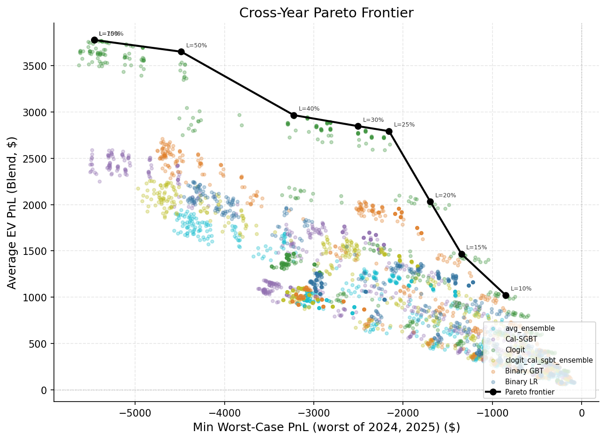

> **Cross-year worst-case Pareto frontier.** X-axis = minimum worst-case P&L
> across both years (more negative = more risk allowed). Y-axis = average
> per-entry blend EV. Each point is labeled with its loss bound percentage.
> The frontier is entirely populated by clogit configs. The steep slope from
> L=10% to L=30% (EV nearly triples) flattens dramatically above L=50%,
> showing diminishing returns to additional risk tolerance.

### Key findings from the worst-case Pareto frontier

**clogit dominates the entire frontier.** At every loss tolerance from 10%
to 50%+, the Pareto-optimal config is always clogit. No other model
(avg_ens, gbt, cal_sgbt, lr, clog_sgbt) appears on the frontier. This is
a much stronger result than "clogit has the highest robustness score" — it
means clogit is the best risk-adjusted choice regardless of your risk
appetite.

**The transition path from conservative to aggressive is clear:**

1. **L ≤ 20%:** independent Kelly, YES-only, edge 0.10. Conservative
   configs that limit position sizes and only take long bets. Avg EV
   $1.0k–$2.0k per entry.
2. **L = 30–40%:** multi_outcome Kelly, YES-only, edge 0.04–0.10. The
   optimizer sizes positions more aggressively within each category. Avg EV
   $2.8k–$3.0k per entry.
3. **L = 50%:** multi_outcome Kelly, side=ALL, edge 0.15. Adding NO
   bets expands the opportunity set. Avg EV $3.7k per entry.

**The L=20% → L=30% transition is the biggest EV jump** ($2,032 → $2,847,
+40%), driven by transitioning from independent to multi_outcome Kelly.
Multi_outcome allocates capital more efficiently within each category.

**Diminishing returns above L=50%.** The frontier flattens — relaxing the
bound further adds minimal EV while substantially increasing worst-case
exposure. L=50% captures 97% of maximum possible EV.

**ROIC declines as L increases.** At L=10%, capital deployed is tiny (5–9%
of bankroll) but ROIC is 53–57%. At L=50%, deployment rises to 30–52% of
bankroll but ROIC drops to 27–44%. The most capital-efficient configs are
the most conservative ones.

### 7.3 CVaR-5% Pareto Frontier

The worst-case constraint assumes Murphy's Law in every category
simultaneously — an extreme scenario that may never occur. **CVaR-5%**
(Conditional Value at Risk at the 5th percentile) provides a less
conservative risk measure: the expected loss in the worst 5% of outcomes,
computed via 100,000 Monte Carlo simulations where each category's winner
is drawn independently from the probability distribution.

CVaR-5% is less conservative than absolute worst-case but still focuses on
the tail — it answers "if things go badly (bottom 5%), how much do I lose
on average?" rather than "what's the single worst possible outcome?"

| L (%) | #Feasible | Avg EV ($) | CVaR-5% 2024 ($) | CVaR-5% 2025 ($) | Actual 2024 ($) | Actual 2025 ($) | Deploy 2024 | Deploy 2025 | ROIC 2024 | ROIC 2025 | % Profitable | Config |
| ---: | ---: | ---: | ---: | ---: | ---: | ---: | ---: | ---: | ---: | ---: | ---: | :--- |
| 10 | 1388 | $1,407.78 | −$521 (−6.5%) | −$874 (−9.7%) | $325 (4.1%) | $668 (7.4%) | $579 (7%) | $1,033 (12%) | 56.2% | 64.7% | 93.9% | clogit/Y/ind kf=0.35 e=0.15 |
| 20 | 2668 | $2,937.98 | −$1,599 (−20.0%) | −$1,758 (−19.5%) | $894 (11.2%) | $564 (6.3%) | $2,415 (30%) | $5,416 (60%) | 37.0% | 10.4% | 85.8% | clogit/A/ind kf=0.5 e=0.05 |
| 30 | 3528 | $3,777.78 | −$1,722 (−21.5%) | −$2,144 (−23.8%) | $1,003 (12.5%) | $988 (11.0%) | $2,876 (36%) | $6,347 (70%) | 34.9% | 15.6% | 89.3% | clogit/A/multi kf=0.05 e=0.04 |
| 40 | 3528 | $3,777.78 | −$1,722 (−21.5%) | −$2,144 (−23.8%) | $1,003 (12.5%) | $988 (11.0%) | $2,876 (36%) | $6,347 (70%) | 34.9% | 15.6% | 89.3% | clogit/A/multi kf=0.05 e=0.04 |
| 50 | 3528 | $3,777.78 | −$1,722 (−21.5%) | −$2,144 (−23.8%) | $1,003 (12.5%) | $988 (11.0%) | $2,876 (36%) | $6,347 (70%) | 34.9% | 15.6% | 89.3% | clogit/A/multi kf=0.05 e=0.04 |

> **Column legend:** Same as worst-case table, except **CVaR-5%** replaces
> **Worst** — the expected per-entry loss in the worst 5% of Monte Carlo
> outcomes (100K simulations per config per year).

**CVaR allows significantly more configs at each risk tolerance** — 1,388
vs 853 at L=10%, 2,668 vs 1,492 at L=20%. Because CVaR-5% is less extreme
than absolute worst-case, configs that were excluded by the worst-case
constraint become feasible. This opens up higher-EV configs: at L=10%,
CVaR-feasible best EV is $1,408 vs $1,022 under worst-case — a 38%
improvement.

**The frontier collapses at L=30%.** Once the loss bound reaches 30% of
per-entry bankroll, all 3,528 configs satisfy the CVaR-5% constraint in
both years. The Pareto-optimal config at L=30% is the same as the
unconstrained maximum: clogit/A/multi kf=0.05 e=0.04 with $3,778 avg EV
per entry. This means CVaR-5% provides meaningful discrimination only at
L=10% and L=20% — above that, the risk constraint is no longer binding.

**clogit still dominates the CVaR frontier** at every risk tolerance.
The transition path is compressed relative to worst-case: at L=10%,
the best config already uses kf=0.35 (vs kf=0.25 under worst-case),
and the L=20% config already uses side=all and kf=0.50.

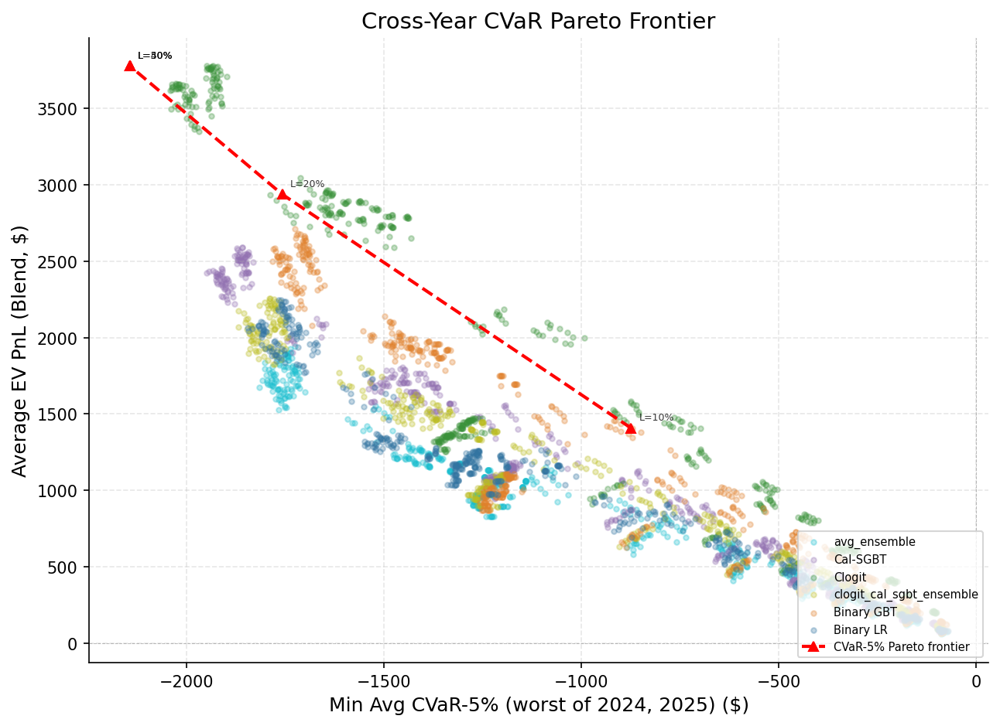

> **CVaR-5% cross-year Pareto frontier.** X-axis = minimum CVaR-5% across
> both years. Y-axis = average per-entry blend EV. Compared to the worst-case
> frontier, the CVaR frontier is shifted right (less extreme risk values) and
> up (higher achievable EV at each risk level). The frontier has only 3
> distinct Pareto points before collapsing — reflecting CVaR-5%'s relatively
> permissive constraint.

### 7.4 Choosing α: Sensitivity Analysis

Different α levels provide different tradeoffs between conservatism and
discriminative power. Here we compare the four α levels evaluated:

| α | L=10% Feasible | L=10% Best EV | L where frontier collapses | Distinct Pareto points |
|---:|---:|---:|:---|---:|
| 0% (worst-case) | 853 | $1,022 | never (5 points at L=10–50%) | 5 |
| 5% | 1,388 | $1,408 | L=30% | 3 |
| 10% | 1,541 | $1,584 | L=20% | 2 |
| 25% | 3,399 | $3,778 | L=10% | 1 |

> **Column legend:** **L=10% Feasible** = number of configs satisfying the
> risk constraint at L=10%. **L=10% Best EV** = avg EV of the Pareto-optimal
> config at L=10%. **L where frontier collapses** = the loss bound at which
> all configs become feasible (frontier degenerates to a single point).
> **Distinct Pareto points** = number of unique configs on the frontier
> across L=10% to L=50%.

**α=0% (worst-case) is too conservative.** It assumes every category goes
wrong simultaneously — practically impossible when 8–9 categories are
resolved independently. The worst-case for a diversified portfolio is almost
never realized because it requires Directing AND Best Picture AND Actress
Leading AND every other category to all resolve to the worst possible winner
at the same time. This overly conservative assumption excludes many
reasonable configs and pushes the entire frontier to lower EV.

**α=25% provides no discrimination.** At L=10%, already 3,399 of 3,528
configs are feasible, and the Pareto-optimal config is the unconstrained
maximum ($3,778). The risk measure is so permissive that it cannot
distinguish between conservative and aggressive configs — the frontier
collapses immediately to a single point.

**α=10% provides minimal discrimination.** Only 2 distinct Pareto points
exist — the frontier collapses at L=20%. Slightly better than α=25% but
still too permissive for practical config selection.

**α=5% is the sweet spot.** It is less conservative than worst-case (more
configs feasible, higher achievable EV) but still focuses on the distributional
tail, with 3 meaningful Pareto points spanning L=10% to L=30%. It captures
the "bad but plausible" scenarios — several categories going wrong but not
necessarily all of them — which is the right level of pessimism for a
diversified prediction market portfolio.

#### Supporting CVaR-10% and CVaR-25% Pareto data

**Cross-Year CVaR-10% Pareto:**

| L (%) | #Feasible | Avg EV ($) | Config |
| ---: | ---: | ---: | :--- |
| 10 | 1541 | $1,584.18 | clogit/A/ind kf=0.25 e=0.04 |
| 20+ | 3528 | $3,777.78 | clogit/A/multi kf=0.05 e=0.04 |

At L=10%, CVaR-10% admits 1,541 configs (vs 1,388 for CVaR-5%), but by
L=20% the frontier has already collapsed to the unconstrained optimum.

**Cross-Year CVaR-25% Pareto:**

| L (%) | #Feasible | Avg EV ($) | Config |
| ---: | ---: | ---: | :--- |
| 10 | 3399 | $3,777.78 | clogit/A/multi kf=0.05 e=0.04 |
| 20+ | 3528 | $3,777.78 | clogit/A/multi kf=0.05 e=0.04 |

Even at L=10%, CVaR-25% is so permissive that the Pareto-optimal config is
already the unconstrained maximum. No useful risk discrimination.

**Recommendation:** We use **α=5% (CVaR-5%)** as the primary risk measure
for all recommendations in Section 10 below. The worst-case (α=0%) tables in
Section 7.2 are provided as a reference for maximum conservatism. In practice,
CVaR-5% provides the best balance: it acknowledges that total portfolio
meltdowns are unlikely (categories are resolved independently) while still
guarding against plausible bad outcomes in the tail.

### 7.5 Per-Year Pareto Comparisons

The per-year plots show how the Pareto frontiers differ between 2024 and
2025, and how worst-case vs CVaR constraints compare within each year.

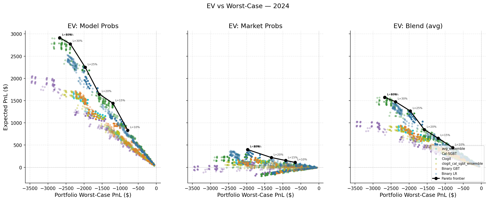

> **2024 Pareto frontier (worst-case).** EV vs worst-case per-entry P&L for
> 2024 alone. The frontier is shallower than 2025 because 2024 had less total
> mispricing (Oppenheimer sweep left fewer categories with exploitable edge).
> Configs at the efficient frontier deploy $400–$2,400 per entry across
> 8 categories.

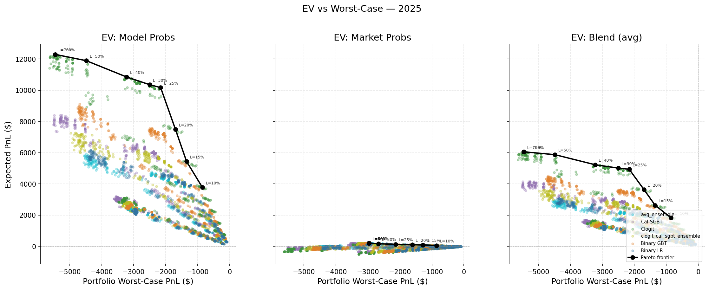

> **2025 Pareto frontier (worst-case).** EV vs worst-case for 2025 alone. The
> steeper frontier reflects 2025's richer mispricing landscape — more
> categories with exploitable edge (especially Directing and Best Picture)
> mean higher achievable EV at each risk level.

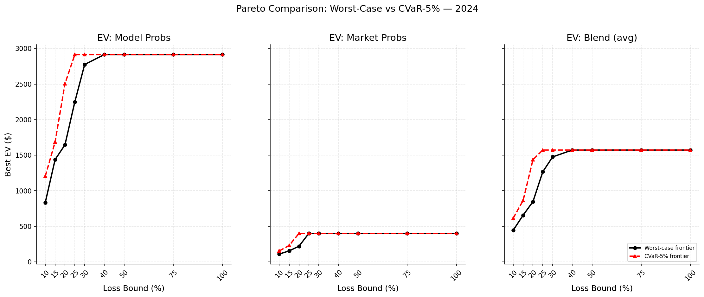

> **2024 worst-case vs CVaR-5% Pareto comparison.** The CVaR-5% frontier
> (dashed) sits above and to the right of the worst-case frontier (solid),
> showing that CVaR's less extreme risk measure unlocks higher EV at each
> risk tolerance. The gap between the two frontiers represents the "cost of
> extreme conservatism."

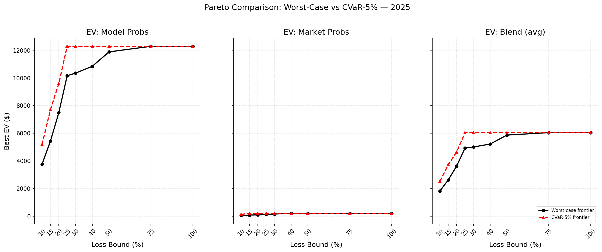

> **2025 worst-case vs CVaR-5% Pareto comparison.** Same pattern as 2024 but
> more pronounced — 2025's larger mispricing means the penalty for
> over-conservatism (worst-case vs CVaR) costs more in forgone EV.

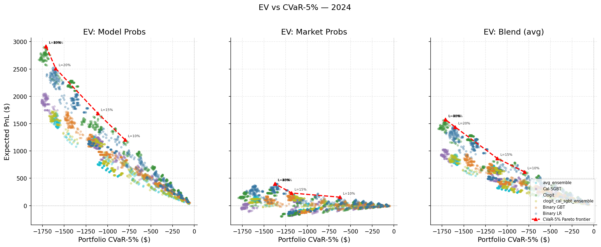

> **2024 CVaR Pareto at multiple α levels.** Shows how the Pareto frontier
> shifts as α increases from 5% to 10% to 25%. Higher α = less conservative =
> more configs feasible at each loss bound. The convergence of the three
> frontiers at high loss bounds confirms that the risk constraint becomes
> non-binding for all α levels.

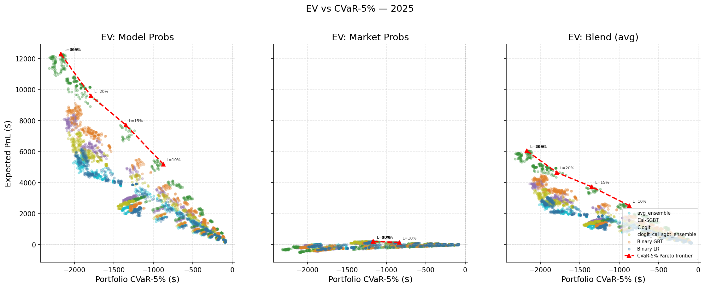

> **2025 CVaR Pareto at multiple α levels.** Same pattern as 2024. In 2025,
> the α=25% frontier collapses to a single point very quickly, while α=5%
> maintains 2–3 distinct Pareto points — further confirming α=5% as the
> right balance for discriminative power.

---

## 8. Category Edge: Anti-Correlated Across Years

The most striking cross-year finding is that **category-level edge is almost
perfectly anti-correlated** between 2024 and 2025:

| Category | 2024 Total P&L | 2025 Total P&L | Pattern |
|----------|------:|------:|---------|
| directing | $0 | $106,958 | 2025 only — Nolan was a certainty in 2024 |
| best_picture | $65 | $44,510 | 2025 only — Oppenheimer was a certainty in 2024 |
| actress_leading | $18,786 | −$294 | 2024 only — Stone surprise upset |
| original_screenplay | $11,426 | −$573 | 2024 only — Anatomy of a Fall underpriced |
| animated_feature | $3,004 | $29,347 | Both years |
| actress_supporting | $106 | $4,051 | Both (small) |
| actor_leading | −$103 | $3,630 | Mixed |
| actor_supporting | $78 | $171 | Both (marginal) |
| cinematography | — | $1,095 | 2025 only |

> **Note:** "Total P&L" = sum across all 3,528 model×config combos for that
> year. This is a raw aggregate measuring the total edge available in each
> category, not normalized per config.

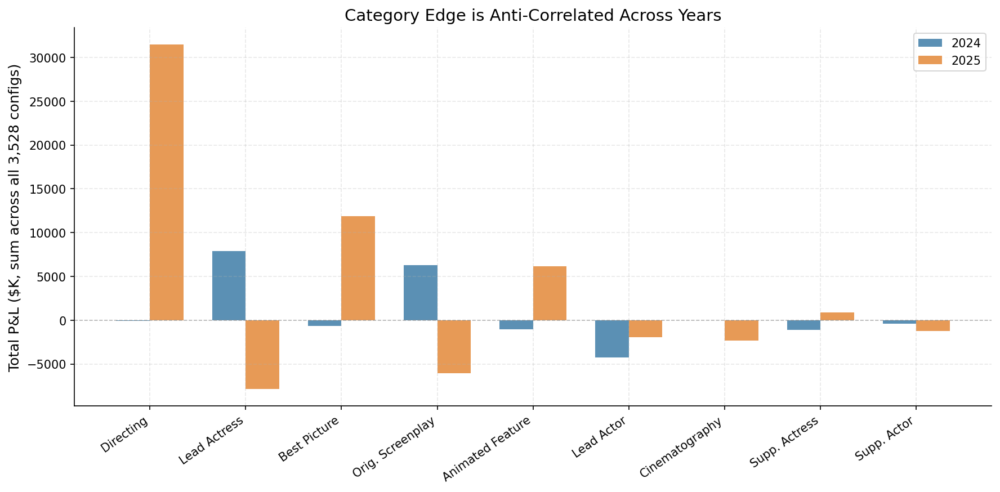

> **Category-level edge across years.** Each bar shows the total P&L
> summed across all 3,528 configs. The striking anti-correlation is visible:
> 2025's dominant categories (Directing at $107k, Best Picture at $45k) had
> zero or near-zero edge in 2024. Conversely, 2024's profitable categories
> (Actress Leading at $19k, Original Screenplay at $11k) are slightly
> negative in 2025. Only Animated Feature shows substantial positive edge in
> both years.

The big-P&L categories are exclusively one-year phenomena:

- **2025 profits** ($188,895 total) are driven by Directing ($106,958, 57%)
  and Best Picture ($44,510, 24%). These categories had locked-in favorites
  in 2024 (Nolan/Oppenheimer), so there was no mispricing to exploit.
- **2024 profits** ($33,362 total) are driven by Actress Leading ($18,786,
  56%) and Original Screenplay ($11,426, 34%). These categories had genuine
  upsets where models identified underpriced contenders. In 2025, these same
  categories produce marginal losses.

**You cannot predict which categories will have edge in a given year.** The
model + config must be flexible enough to capitalize on whatever mispricings
exist. This is why clogit's structural approach — capturing within-category
competition — transfers better than tree-based models that overfit to
particular category patterns.

**animated_feature** is the one category with substantial edge in both years
($3k in 2024, $29k in 2025), making it the most reliably mispriced category.
This likely reflects lower market attention to the category.

---

## 9. Entry-Time EV Analysis

Understanding when to enter is as important as which config to trade. The temporal
EV analysis shows how expected value accumulates across precursor events.

### Marginal EV by Entry Point

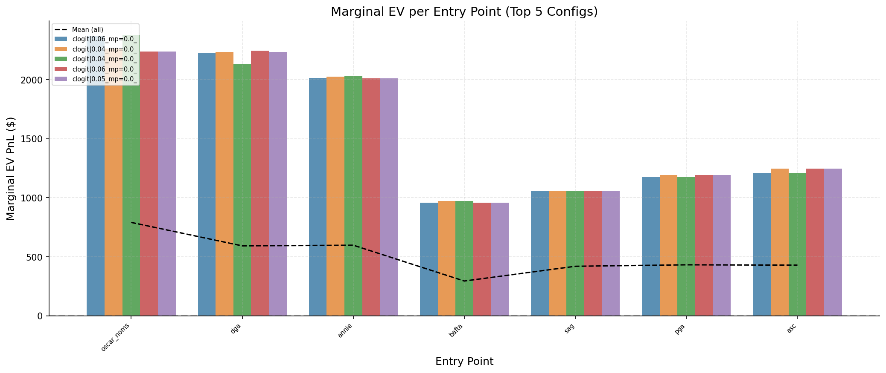

> **2024 marginal EV per entry point.** Each bar shows the EV contribution of
> entering at that specific entry time (not cumulative). In 2024, later entry
> points (post-ASC, ~7 days before ceremony) contribute the highest marginal
> EV, as the American Society of Cinematographers results provide strong
> signal for the remaining uncertain categories. Earlier entries contribute
> less per deployment but still have positive EV.


> **2025 marginal EV per entry point.** The mid-season DGA and PGA entries
> contribute the highest marginal EV — the Directors Guild and Producers
> Guild results dramatically sharpen predictions for Directing and Best
> Picture, where most of 2025's mispricing lives. Later entries have lower
> marginal EV because the market has already incorporated precursor signals
> by then.

### Per-Entry P&L Distribution (Monte Carlo)

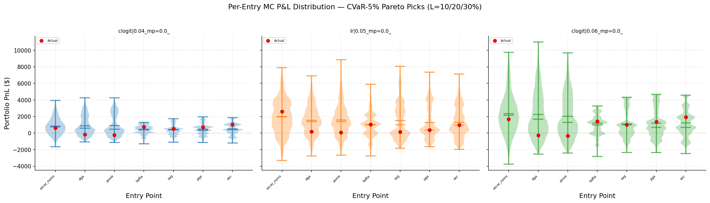

> **2024 per-entry MC P&L distribution.** Violin plots showing the Monte Carlo
> P&L distribution at each entry point for representative Pareto-optimal configs
> at L=10%, L=20%, and L=30% (CVaR-5%). Each violin shows the distribution of
> portfolio P&L across 10,000 MC simulations where category winners are drawn
> from blend probabilities. Red dots mark actual realized P&L.

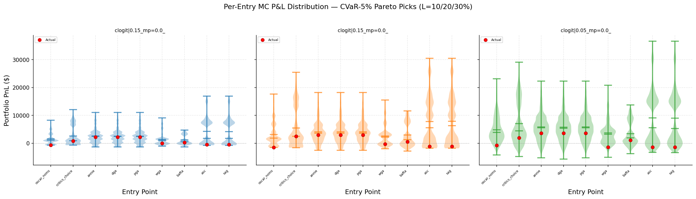

> **2025 per-entry MC P&L distribution.** The mid-season entries (DGA/PGA) show
> wider violin bodies reflecting higher variance from larger position sizes.
> The distribution spread at each entry point reveals how concentrated or
> dispersed the possible outcomes are given the model's blend probabilities.
> Red dots mark actual realized P&L.

### Key temporal findings

- **Later entries are more valuable in 2024**: post-DGA/ASC snapshots capture
  the highest marginal EV, as precursor consensus strengthens model predictions
  in the few remaining uncertain categories.
- **Mid-season entries dominate in 2025**: the DGA and PGA entries contribute
  the highest marginal EV because they sharpen predictions for Directing and
  Best Picture — where most mispricing lives.
- **Early entries still contribute**: Oscar nominations provide meaningful EV
  even with less information, because market inefficiencies are larger early
  in the season.
- **MC spread reveals outcome concentration**: the violin width at each entry
  point shows how dispersed potential outcomes are — narrow violins indicate
  high-confidence entries, wide violins indicate entries with more outcome risk.
- **Optimal timing differs by year**: there is no single "best entry time" —
  the highest-EV entry depends on which categories have edge, which varies
  year to year. Deploying at all entry times (the buy-and-hold strategy)
  captures edge whenever it appears.

---

## 10. Recommended Config for Live Trading (2026)

The CVaR-5% Pareto frontier directly answers "which config should I use?" —
just choose your risk tolerance. All recommendations below use **clogit** +
**maker fees** + **fixed $1,000 bankroll per entry per category**.

### Risk-Return Comparison Table

| | Conservative (L=10%) | Moderate (L=20%) | Aggressive (L=30%+) |
|---|---|---|---|
| **Model** | clogit | clogit | clogit |
| **Kelly mode** | independent | independent | multi_outcome |
| **Edge threshold** | 0.15 | 0.05 | 0.04 |
| **Allowed directions** | yes | all | all |
| **Kelly fraction** | 0.35 | 0.50 | 0.05 |
| **Fee type** | maker | maker | maker |
| **Avg EV / entry** | $1,408 | $2,938 | $3,778 |
| **CVaR-5% 2024** | −$521 (−6.5%) | −$1,599 (−20.0%) | −$1,722 (−21.5%) |
| **CVaR-5% 2025** | −$874 (−9.7%) | −$1,758 (−19.5%) | −$2,144 (−23.8%) |
| **Actual 2024 / entry** | $326 (4.1%) | $894 (11.2%) | $1,003 (12.5%) |
| **Actual 2025 / entry** | $668 (7.4%) | $564 (6.3%) | $988 (11.0%) |
| **Deploy 2024** | $579 (7%) | $2,415 (30%) | $2,876 (36%) |
| **Deploy 2025** | $1,033 (12%) | $5,416 (60%) | $6,347 (70%) |
| **ROIC 2024** | 56.2% | 37.0% | 34.9% |
| **ROIC 2025** | 64.7% | 10.4% | 15.6% |
| **% Profitable** | 93.9% | 85.8% | 89.3% |

> These three configs correspond to the L=10%, L=20%, and L=30% points on
> the **CVaR-5% Pareto frontier** — our recommended risk measure (see
> [Section 7.4](#74-choosing-α-sensitivity-analysis)). All dollar amounts
> are per-entry averages.

#### Conservative (L=10%): `clogit/Y/ind kf=0.35 e=0.15`

```
model:              clogit
kelly_mode:         independent
buy_edge_threshold: 0.15
allowed_directions: yes
kelly_fraction:     0.35
fee_type:           maker
bankroll_mode:      fixed ($1,000 per entry per category)
```

The tightest risk bound. Deploys only 7–12% of per-entry bankroll — takes
only the highest-conviction YES bets where model edge exceeds 15%. With
CVaR-5% bounded to −$521 (2024) / −$874 (2025), the expected loss in a
bad 5th-percentile scenario is modest. ROIC is excellent (56–65%) because
only high-edge positions are taken. 93.9% of configs at this risk level
are profitable in both years.

Best for: small bankrolls, first-time deployment, or when capital
preservation is the priority.

#### Moderate (L=20%): `clogit/A/ind kf=0.5 e=0.05`

```
model:              clogit
kelly_mode:         independent
buy_edge_threshold: 0.05
allowed_directions: all
kelly_fraction:     0.50
fee_type:           maker
bankroll_mode:      fixed ($1,000 per entry per category)
```

**Recommended default.** Roughly doubles the EV of L=10% ($2,938 vs $1,408)
by loosening the edge threshold to 5% and opening NO bets (allowed_directions
= all). Still uses independent Kelly — the most stable sizing method. At
KF=0.50, independent Kelly sizes positions aggressively but proportionally.
Deploys 30–60% of per-entry bankroll. ROIC ranges from 10% (2025) to 37%
(2024). The lower 2025 ROIC reflects larger capital deployment into marginal
positions — the config takes more bets, some of which have smaller edge.

Best for: the default recommendation for a $10k+ bankroll with moderate
risk tolerance.

#### Aggressive (L=30%+): `clogit/A/multi kf=0.05 e=0.04`

```
model:              clogit
kelly_mode:         multi_outcome
buy_edge_threshold: 0.04
allowed_directions: all
kelly_fraction:     0.05
fee_type:           maker
bankroll_mode:      fixed ($1,000 per entry per category)
```

At L=30%, all 3,528 configs are CVaR-5% feasible — this is the
unconstrained maximum EV config. Multi_outcome Kelly optimizes position sizes
jointly within each category, deploying 36–70% of per-entry bankroll. The
low edge threshold (4%) takes positions in nearly every category where
any model-vs-market disagreement exists. KF=0.05 is nominally set but is a
no-op in multi_outcome mode (see [Config Universe](#config-universe)).

Note the CVaR-5% of −$1,722 (2024) / −$2,144 (2025) — in a bad tail scenario,
per-entry losses could be 19–24% of bankroll. In exchange, avg EV reaches
$3,778 per entry, the highest achievable.

Best for: large bankrolls ($20k+) where the trader can tolerate multi-
thousand-dollar swings in exchange for maximum EV.

### Decision Framework

The choice between these three configs depends on:

1. **Bankroll size.** With $5,000 total bankroll, the conservative config
   deploys $350–$600 per entry — a manageable position. The aggressive config
   would deploy $1,400–$3,500, risking a large fraction of the bankroll on
   each entry event.

2. **Number of ceremonies.** A one-year trader should be more conservative
   (single sample from the P&L distribution). A multi-year trader can
   tolerate more variance per year because bad years are offset by good years,
   as demonstrated by the 89% both-year profitability rate.

3. **Risk appetite.** The L parameter directly maps to "how much am I willing
   to lose in a bad (5th percentile) entry deployment?" L=10% means at most
   ~$800–$900 per entry in a bad scenario. L=30% means up to ~$1,700–$2,100.

4. **Capital efficiency preference.** Conservative deploys 7–12% of bankroll
   at 56–65% ROIC. Aggressive deploys 36–70% at 15–35% ROIC. If idle capital
   can be deployed elsewhere, the conservative config's higher ROIC may be
   preferable despite lower absolute EV.

**The L=20% moderate config is the recommended default** because it provides
the best balance: 2× the EV of conservative, still uses the well-understood
independent Kelly sizing, opens the opportunity set to both YES and NO bets,
and keeps CVaR-5% within 20% of per-entry bankroll. In the two historical
years tested, this config earned $894 (2024) and $564 (2025) per entry —
solid positive returns with bounded downside.

---

## 11. Edge Threshold as a Single Risk Dial

The full Pareto search optimizes over 588 configs per model across 5 dimensions
(model, kelly_mode, kelly_fraction, edge_threshold, allowed_directions). But for
a trader who has already identified that **clogit dominates the frontier** (§7),
the search collapses to a much simpler question: just vary the edge threshold.

Fix: model=clogit, fee=maker, bankroll=fixed, kelly_mode=multi_outcome,
allowed_directions=all. This leaves **edge threshold as the single risk dial** —
a 1-dimensional sweep through the 5-dimensional config space.

**Note on Kelly fraction:** KF is nominally required for multi_outcome mode but
is largely a no-op — it only affects the optimizer starting point, causing ~$127
EV variation ($3,651–$3,778) across KF values at any given edge. The table below
picks the best KF per edge to isolate the edge threshold effect.

### Edge Sweep: Best KF per Edge Threshold

| Edge | KF | Avg EV ($) | CVaR-5% 2024 ($) | CVaR-5% 2025 ($) | Actual 2024 ($) | Actual 2025 ($) | Deploy 2024 | Deploy 2025 | ROIC 2024 | ROIC 2025 |
|---:|---:|---:|---:|---:|---:|---:|---:|---:|---:|---:|
| 0.04 | 0.05 | $3,778 | −$1,722 (−21.5%) | −$2,144 (−23.8%) | $1,003 (12.5%) | $988 (11.0%) | $2,876 (36%) | $6,347 (71%) | 34.9% | 15.6% |
| 0.05 | 0.10 | $3,777 | −$1,724 (−21.6%) | −$2,173 (−24.1%) | $988 (12.3%) | $975 (10.8%) | $2,689 (34%) | $6,029 (67%) | 36.7% | 16.2% |
| 0.06 | 0.10 | $3,771 | −$1,728 (−21.6%) | −$2,149 (−23.9%) | $964 (12.1%) | $1,002 (11.1%) | $2,670 (33%) | $5,935 (66%) | 36.1% | 16.9% |
| 0.08 | 0.25 | $3,766 | −$1,738 (−21.7%) | −$2,157 (−24.0%) | $953 (11.9%) | $995 (11.1%) | $2,597 (32%) | $5,847 (65%) | 36.7% | 17.0% |
| 0.10 | 0.25 | $3,735 | −$1,713 (−21.4%) | −$2,155 (−23.9%) | $956 (12.0%) | $1,132 (12.6%) | $2,510 (31%) | $5,483 (61%) | 38.1% | 20.7% |
| 0.12 | 0.15 | $3,699 | −$1,708 (−21.4%) | −$2,153 (−23.9%) | $1,013 (12.7%) | $1,244 (13.8%) | $2,465 (31%) | $5,237 (58%) | 41.1% | 23.7% |
| 0.15 | 0.15 | $3,651 | −$1,687 (−21.1%) | −$2,177 (−24.2%) | $1,027 (12.8%) | $1,260 (14.0%) | $2,360 (30%) | $4,666 (52%) | 43.5% | 27.0% |

> CVaR-5% percentages are relative to per-entry bankroll ($8,000 for 2024,
> $9,000 for 2025). Actual and Deploy percentages likewise. ROIC = Actual / Deploy.

### Pareto Efficiency

The edge=0.04 config is **identical** to the L=30%+ aggressive Pareto optimal
config from §10 (clogit/A/multi kf=0.05 e=0.04). All 7 edge configs lie within
the CVaR-5% feasible region — at L=30%, all 3,528 configs are feasible, so the
CVaR constraint is not binding.

The edge sweep traces a path through the scatter cloud:

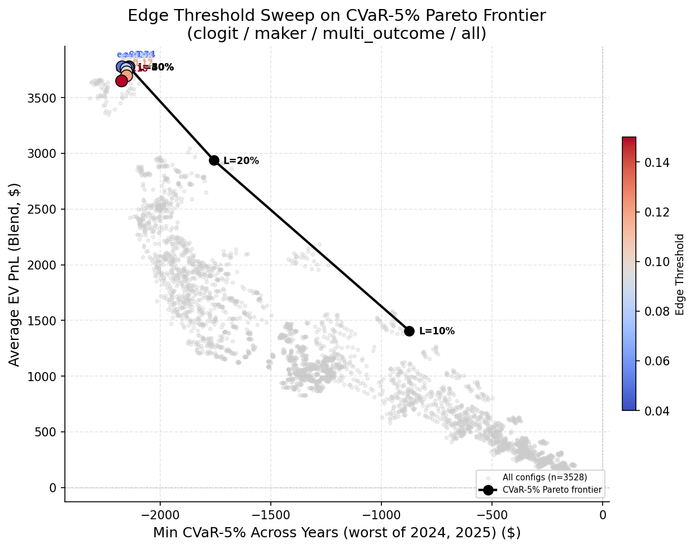

Lower edge (0.04) = more positions → more capital deployed → slightly more EV
but more risk. Higher edge (0.15) = fewer positions → less capital deployed →
slightly less EV but substantially higher ROIC.

### Key Insight: Edge Controls Capital, Not Risk

For a trader who has decided on clogit + multi_outcome + all, the edge threshold
controls **capital deployment and ROIC**, but **not tail risk**:

- **EV variation is modest**: $3,651–$3,778 (3.4% range) across the full edge
  sweep. All 7 configs earn roughly the same expected value.
- **Capital deployment varies substantially**: 30–36% of bankroll (2024) and
  52–71% (2025) between edge=0.15 and edge=0.04.
- **ROIC improves with edge**: 34.9% → 43.5% (2024) and 15.6% → 27.0% (2025)
  as edge rises from 0.04 to 0.15. Higher edge means fewer but higher-conviction
  bets, concentrating capital on the strongest edges.
- **CVaR-5% is nearly flat**: −21.1% to −21.7% of bankroll (2024), −23.8% to
  −24.2% (2025). Tail risk barely moves.

**Why doesn't edge adjust risk?** Because multi_outcome Kelly jointly optimizes
position sizes across all nominees within each category. Positions with small
model-vs-market edge already receive small allocations from the optimizer — so
filtering them out via a higher edge threshold removes positions that were
contributing little to both EV *and* risk. The portfolio's tail risk is dominated
by the large positions in high-edge categories (e.g., Directing and Best Picture
in 2025), and those positions remain regardless of the edge threshold.

**Implication: multi_outcome/all cannot be risk-tuned by edge alone.** To get
meaningfully different risk profiles, you must change **kelly_mode** or
**allowed_directions** — which is exactly what the full Pareto frontier in §10
does. The Conservative → Moderate → Aggressive transition (independent/yes →
independent/all → multi_outcome/all) shifts both EV *and* CVaR-5% substantially,
while edge sweeping within multi_outcome/all shifts only capital deployment. A
trader who wants a lower-risk multi_outcome config should use side=yes (YES-only
bets), which constrains the opportunity set and reduces tail exposure.

---

## 12. Key Takeaways

1. **clogit dominates the entire cross-year Pareto frontier.** At every
   risk tolerance — from "lose ≤10% of bankroll" to unconstrained — the
   config that maximizes expected P&L is always clogit. No other model
   appears on the frontier at any α level.

2. **89.3% of configs are profitable in both years** at the portfolio level.
   Cross-year robustness is broadly achievable — not an artifact of one model
   or one parameter setting.

3. **CVaR-5% is the recommended risk measure.** Worst-case (α=0%) is too
   conservative — it assumes every category goes wrong simultaneously, which
   is practically impossible for a diversified portfolio. CVaR-25% provides
   no discrimination. CVaR-5% hits the sweet spot: 3 meaningful Pareto
   points, acknowledges that bad-but-not-catastrophic outcomes are the right
   planning target.

4. **The conservative→aggressive transition follows a clear path:**
   independent Kelly / YES-only (L ≤ 10%) → independent Kelly / ALL (L = 20%)
   → multi_outcome Kelly / ALL (L ≥ 30%). Each step unlocks more EV while
   accepting larger tail losses.

5. **The L=10% → L=20% transition is the biggest EV jump on the CVaR-5%
   frontier** ($1,408 → $2,938, +109%), driven by loosening the edge
   threshold and opening NO bets. The L=20% moderate config is the
   recommended default.

6. **Blend EV is the right probability source.** Model EV is unrealistically
   optimistic (trusts model probabilities as ground truth); market EV is
   negative (trusts market prices fully, implying no edge). Blend EV
   averages the two, producing realistic estimates that track actual P&L
   more closely.

7. **All models show positive cross-year rank correlation (ρ ≥ 0.59).** Config
   rankings transfer across years. lr leads at ρ = 0.913, followed by clogit
   at ρ = 0.893. Linear models transfer best; tree-based models (gbt 0.615,
   cal_sgbt 0.586) show moderate but significant correlation.

8. **Category edge is year-specific and anti-correlated.** 2024 profits come
   from Actress Leading and Original Screenplay; 2025 from Directing and Best
   Picture. No category is consistently profitable at scale (except
   animated_feature).

9. **Market dynamics dominate model quality.** The 2024-vs-2025 P&L gap
   (~3–4×) is the difference between an Oppenheimer sweep and a competitive
   field. Model choice matters, but year-to-year variance dwarfs it.

10. **Portfolio-level thinking is essential.** Individual categories can lose
    money in any year. Cross-year profitability comes from summing across
    enough categories that winners outweigh losers.

---

## 13. EV Inflation Analysis

**EV inflation** measures how much a model's expected PnL overstates actual
realized PnL: `inflation = mean(EV) / mean(actual PnL)`. A ratio of 1.0x
means EV perfectly predicts average actual PnL. Higher values mean the model
is overconfident — it bets more aggressively and weights favorable scenarios
more heavily (see [PLAN](PLAN_0303_config_selection_improvements.md) Section 3
for the mechanism).

| Model | 2024 Infl | 2025 Infl | Overall Infl | Mean EV | Mean Actual |
| :--- | ---: | ---: | ---: | ---: | ---: |
| avg_ens | 1.24x | 1.28x | 1.27x | $872.63 | $686.03 |
| clog_sgbt | 1.17x | 1.70x | 1.57x | $1,034.34 | $659.15 |
| cal_sgbt | 7.89x | 1.46x | 1.74x | $1,182.78 | $679.39 |
| gbt | 3.78x | 1.66x | 1.83x | $1,213.08 | $661.58 |
| lr | 1.96x | 1.84x | 1.87x | $987.21 | $526.70 |
| clogit | 1.57x | 4.90x | 3.39x | $1,759.92 | $518.65 |

> **Column legend:** **Inflation** = `mean(avg_ev_pnl_blend) / mean(avg_actual_pnl)`
> across all 588 configs for that model. **Mean EV** and **Mean Actual** are
> per-entry averages.

**avg_ensemble has the lowest inflation (1.27x)** — its EV overstates reality
by only 27% on average. **clogit has the highest (3.39x)** — its EV is 3.4×
what you actually get. This explains why clogit dominates the Pareto frontier
in Section 7: it wins by EV inflation, not by actual performance.

Notably, inflation is **year-specific and asymmetric**: cal_sgbt has 7.89x
inflation in 2024 (terrible calibration that year) but only 1.46x in 2025.
clogit is moderate in 2024 (1.57x) but extreme in 2025 (4.90x). This makes
it hard to correct for inflation without year-specific recalibration.

---

## 14. Per-Model Pareto Frontiers

Instead of letting all models compete on the same Pareto frontier (where
clogit dominates due to EV inflation), we compute the frontier **separately
for each model**. This reveals how each model performs at different risk
levels when inflation is held constant.

### Summary: Best Config per Model at L=20% (CVaR-5%)

| Model | #Feasible | Best EV ($) | Actual ($) | Inflation |
| :--- | ---: | ---: | ---: | ---: |
| avg_ens | 491 | $1,643.73 | **$1,646.16** | **1.00x** |
| cal_sgbt | 483 | $2,122.95 | $1,222.74 | 1.74x |
| clogit | 480 | $2,971.27 | $1,167.04 | 2.55x |
| clog_sgbt | 490 | $1,865.22 | $1,361.10 | 1.37x |
| gbt | 516 | $2,637.74 | $1,329.33 | 1.98x |
| lr | 499 | $2,035.97 | $1,182.99 | 1.72x |

> At L=20% (CVaR-5% bound = -20% of per-entry bankroll), **avg_ensemble
> achieves the highest actual PnL ($1,646)** — beating clogit ($1,167) by
> 41% — despite having the lowest EV. Its inflation is essentially 1.0x
> at this risk level, meaning EV and actual PnL are nearly identical.

**Key finding:** The per-model view completely reverses the cross-model
ranking. Clogit appears best by EV ($2,971) but is worst by actual PnL
($1,167). avg_ensemble appears worst by EV ($1,644) but is best by actual
PnL ($1,646). **Actual PnL rankings are anti-correlated with EV rankings
across models** — direct evidence that EV inflation drives the wrong model
selection.

### Per-Model Details

<details>
<summary>avg_ensemble (588 configs)</summary>

| L (%) | #Feasible | Best EV ($) | Actual ($) | CVaR-5% ($) | Inflation | Config |
| ---: | ---: | ---: | ---: | ---: | ---: | :--- |
| 10 | 249 | $842 | $807 | $-828 | 1.04x | maker/ind kf=0.5 e=0.1 |
| 20 | 491 | $1,644 | $1,646 | $-1,700 | 1.00x | maker/multi kf=0.15 e=0.12 |
| 30 | 588 | $1,943 | $1,311 | $-1,726 | 1.48x | maker/multi kf=0.5 e=0.04 |

</details>

<details>
<summary>cal_sgbt (588 configs)</summary>

| L (%) | #Feasible | Best EV ($) | Actual ($) | CVaR-5% ($) | Inflation | Config |
| ---: | ---: | ---: | ---: | ---: | ---: | :--- |
| 10 | 227 | $1,064 | $651 | $-838 | 1.63x | maker/ind kf=0.25 e=0.1 |
| 20 | 483 | $2,123 | $1,223 | $-1,670 | 1.74x | maker/ind kf=0.5 e=0.08 |
| 30 | 588 | $2,590 | $1,433 | $-1,858 | 1.81x | maker/multi kf=0.05 e=0.06 |

</details>

<details>
<summary>clogit (588 configs)</summary>

| L (%) | #Feasible | Best EV ($) | Actual ($) | CVaR-5% ($) | Inflation | Config |
| ---: | ---: | ---: | ---: | ---: | ---: | :--- |
| 10 | 224 | $1,477 | $457 | $-764 | 3.23x | maker/ind kf=0.35 e=0.04 |
| 20 | 480 | $2,971 | $1,167 | $-1,689 | 2.55x | maker/ind kf=0.5 e=0.15 |
| 30 | 588 | $3,778 | $996 | $-1,933 | 3.79x | maker/multi kf=0.05 e=0.04 |

</details>

---

## 15. EV vs Actual PnL Correlation

Spearman rank correlation between avg_ev_pnl_blend and avg_actual_pnl. The
**within-model** correlation measures how well EV ranks configs when the model
is fixed. The **cross-model** correlation measures how well EV ranks configs
across all 3,528 model×config combinations.

| Model | #Cfg | Spearman ρ | p-value | EV-Best Capture % | EV-Best Actual | Best Actual |
| :--- | ---: | ---: | ---: | ---: | ---: | ---: |
| avg_ens | 588 | 0.9347 | 2.20e-265 | 74.6% | $1,311 | $1,756 |
| cal_sgbt | 588 | 0.9763 | 0.00e+00 | 91.7% | $1,433 | $1,562 |
| clogit | 588 | 0.9592 | 0.00e+00 | 84.4% | $996 | $1,179 |
| clog_sgbt | 588 | 0.9481 | 8.72e-294 | 79.1% | $1,256 | $1,588 |
| gbt | 588 | 0.9501 | 1.05e-298 | 77.4% | $1,322 | $1,708 |
| lr | 588 | 0.9073 | 1.32e-222 | 75.0% | $960 | $1,281 |
| **ALL** | 3528 | **0.8821** | 0.00e+00 | 56.7% | $996 | $1,756 |

> **Column legend:**
> - **Spearman ρ:** Rank correlation between EV and actual PnL within the
>   given scope. Higher = EV is a better selector.
> - **EV-Best Capture %:** `actual_pnl(EV-best config) / actual_pnl(actual-best
>   config)` within that scope. How close EV-based selection gets to hindsight.
> - **EV-Best Actual / Best Actual:** Dollar values behind the capture %.

**Within-model correlations are all >0.90** — EV is an excellent config
selector when the model is fixed. **Cross-model correlation drops to 0.882**
and capture drops to 56.7%. This ~0.07 gap is entirely due to clogit configs
clustering at the top of EV rankings via inflation.

**Takeaway:** Fix the model, then trust EV for config selection. Don't let
EV choose the model — inflation makes cross-model EV comparison unreliable.

---

## 16. Bootstrap Rank Stability

With only 8–9 categories per year, a config's actual PnL ranking could be
driven by luck in 1–2 categories. **Bootstrap resampling** quantifies this:
for each of 1,000 bootstrap samples, we draw K categories with replacement
(K=8 for 2024, K=9 for 2025), sum per-category PnL across both years, and
re-rank all 3,528 configs.

| Config | Model | Avg EV | Avg Actual | Med Rank | Top-10 % | Top-25 % | Top-50 % |
| :--- | :--- | ---: | ---: | ---: | ---: | ---: | ---: |
| EV-best avg_ens | avg_ens | $1,943 | $1,311 | 360 | 0.0% | 0.0% | 0.2% |
| EV-best cal_sgbt | cal_sgbt | $2,590 | $1,433 | 170 | 0.0% | 0.7% | 16.9% |
| EV-best clogit | clogit | $3,778 | $996 | 978 | 0.4% | 1.6% | 7.4% |
| EV-best clog_sgbt | clog_sgbt | $2,257 | $1,256 | 460 | 0.0% | 0.1% | 0.2% |
| EV-best gbt | gbt | $2,709 | $1,322 | 380 | 0.0% | 0.0% | 0.0% |
| EV-best lr | lr | $2,247 | $960 | 980 | 0.0% | 0.0% | 0.0% |
| Actual #1 | avg_ens | $1,664 | $1,756 | 49 | 32.2% | 42.4% | 50.9% |
| Actual #2 | avg_ens | $1,664 | $1,746 | 54 | 29.9% | 40.4% | 48.9% |
| Actual #3 | avg_ens | $1,664 | $1,734 | 59 | 26.8% | 37.7% | 47.3% |
| Actual #4 | avg_ens | $1,653 | $1,727 | 61 | 24.4% | 35.9% | 45.8% |
| Actual #5 | gbt | $2,311 | $1,708 | 51 | 28.8% | 39.5% | 49.7% |

> **Column legend:** **Med Rank** = median bootstrap rank out of 3,528.
> **Top-N %** = fraction of 1,000 bootstrap samples where the config
> ranks in the top N.

**Key findings:**

1. **EV-best configs have poor bootstrap stability.** The EV-best clogit
   config has median rank 978 (out of 3,528) — in a typical bootstrap
   resample, it's in the bottom third. EV-best cal_sgbt is the best of the
   EV-selected configs at median rank 170, but still only appears in top-25
   in 0.7% of samples.

2. **Actual top configs are moderately stable.** The hindsight-best config
   (avg_ensemble) has median rank 49 and appears in the top-10 in 32.2%
   of samples. This is decent given K=8–9 categories, but far from certain.

3. **The gap between EV-selected and actual-best is robust.** Even under
   bootstrap resampling, the actual top-5 configs consistently outperform
   EV-best configs — this isn't an artifact of one lucky category.

4. **gbt#5 (Actual #5) is notable:** despite being the only non-avg_ensemble
   in the actual top-5, it has comparable bootstrap stability (28.8% top-10).

---

## 17. How to Run

**Prerequisites:** Datasets and models from `d20260220_backtest_strategies`
must exist in `storage/d20260220_backtest_strategies/`.

```bash
cd "$(git rev-parse --show-toplevel)"

# Full pipeline (prerequisite check + backtests + scoring + analysis):
bash oscar_prediction_market/one_offs/d20260225_buy_hold_backtest/run.sh \
    2>&1 | tee storage/d20260225_buy_hold_backtest/run.log

# Or individual steps:
bash .../d20260225_buy_hold_backtest/run_backtests.sh   # Buy-hold backtests (2024 + 2025)
bash .../d20260225_buy_hold_backtest/run_scoring.sh     # EV + CVaR scoring + cross-year
bash .../d20260225_buy_hold_backtest/run_analysis.sh    # All plots + tables + asset sync
```

---

## 18. Appendix: Bug Fixes Applied (2026-02-28)

These results incorporate three bug fixes applied on 2026-02-28. All backtests
were rerun from scratch after the fixes.

1. **Settlement universe bug (HIGH severity):** `_compute_settlements()`
   previously built the settlement universe from only the last snapshot's
   prices. This missed nominees who appeared in earlier snapshots but dropped
   out by the final snapshot. **Fix:** expanded the universe to include all
   moments' prices + predictions + position outcomes. This primarily affects
   2024 results where nominee availability varied across snapshots.

2. **Fee cap bug (LOW severity):** `_cap_total_exposure()` previously summed
   `outlay_dollars` without fees when checking the bankroll constraint.
   **Fix:** now sums `contracts × (price + fee)` to correctly account for
   total capital deployed including fees.

3. **Forward-fill fix:** Added per-nominee backward price lookup when nominees
   are missing from a snapshot's prices. Previously, if a nominee had no
   price in a given snapshot, it was treated as absent. Now the backtest
   forward-fills from the most recent snapshot where that nominee had a
   price, preventing artificial gaps in price availability.

**Impact:** The settlement universe fix increased 2024 P&L for most configs
(more nominees → more settlement opportunities), while the fee cap fix
slightly reduced position sizes (higher effective cost). Net effect: 2024
mean P&L increased substantially (e.g., clogit from ~$1,489 to ~$3,290),
but cross-year profitability dropped from 93.8% to 89.3% because some
configs that were marginally profitable in 2024 before are now unprofitable
due to the corrected fee accounting. The forward-fill ensures consistent
price availability across snapshots.

---

## 19. Output Structure

```
storage/d20260225_buy_hold_backtest/
├── cross_year_scenario_scores.csv        # Cross-year EV + risk scores
├── cross_year_pareto_blend.csv           # Pareto frontier (blend EV, α=0 worst-case)
├── cross_year_pareto_model.csv           # Pareto frontier (model EV, α=0 worst-case)
├── cross_year_pareto_market.csv          # Pareto frontier (market EV, α=0 worst-case)
├── cross_year_pareto_cvar00_blend.csv    # Alias for worst-case Pareto (α=0)
├── cross_year_pareto_cvar05_blend.csv    # CVaR-5% Pareto frontier (blend EV)
├── cross_year_pareto_cvar10_blend.csv    # CVaR-10% Pareto frontier
├── cross_year_pareto_cvar25_blend.csv    # CVaR-25% Pareto frontier
├── 2024/
│   ├── results/
│   │   ├── entry_pnl.csv                # Per-entry, per-config P&L + scenarios
│   │   ├── aggregate_pnl.csv            # Per-category aggregated P&L
│   │   ├── portfolio_scenario_scores.csv # Portfolio-level EV/worst-case
│   │   ├── scenario_pnl.csv             # Per-scenario P&L for all configs
│   │   ├── portfolio_cvar.csv            # CVaR estimates per config
│   │   ├── mc_calibration.csv            # Monte Carlo convergence diagnostics
│   │   ├── pareto_frontier_blend.csv     # Per-year Pareto (worst-case, blend EV)
│   │   ├── pareto_frontier_model.csv     # Per-year Pareto (worst-case, model EV)
│   │   ├── pareto_frontier_market.csv    # Per-year Pareto (worst-case, market EV)
│   │   ├── pareto_frontier_cvar05_blend.csv  # CVaR-5% Pareto
│   │   ├── pareto_frontier_cvar10_blend.csv  # CVaR-10% Pareto
│   │   ├── pareto_frontier_cvar25_blend.csv  # CVaR-25% Pareto
│   │   ├── model_accuracy.csv
│   │   ├── model_vs_market.csv
│   │   ├── parameter_sensitivity.csv
│   │   └── risk_profile.csv
│   └── plots/
│       └── scenario/                     # EV + risk + CVaR scenario plots
│           ├── pareto_frontier.png       # Worst-case Pareto frontier
│           ├── pareto_comparison.png     # Worst-case vs CVaR-5% comparison
│           ├── cvar_pareto.png           # CVaR at multiple α levels
│           ├── mc_convergence.png        # Monte Carlo convergence
│           ├── temporal_ev.png           # Temporal EV heatmap
│           ├── temporal_marginal_ev.png  # Marginal EV by entry point
│           ├── per_entry_violin.png      # Per-entry MC P&L violins
│           ├── ev_config_heatmap.png     # EV by config parameters
│           ├── worst_case_distribution.png  # Worst-case P&L distribution
│           ├── ev_model_vs_market.png    # Model vs market EV comparison
│           └── ev_vs_actual.png          # EV vs actual P&L
├── 2025/
│   ├── results/   (same structure as 2024)
│   └── plots/
│       └── scenario/  (same structure as 2024)
├── cross_year_plots/
│   ├── cross_year_category_edge.png      # Category edge anti-correlation
│   ├── cross_year_model_robustness.png   # Model robustness comparison
│   ├── cross_year_profitability_scatter.png  # 2024 vs 2025 P&L scatter
│   ├── cross_year_rank_correlation.png   # Rank correlation by model
│   ├── cross_year_robustness_vs_pnl.png  # Robustness vs total P&L
│   └── scenario/                         # Cross-year Pareto plots
│       ├── cross_year_pareto.png         # Worst-case cross-year Pareto
│       ├── cross_year_cvar_pareto.png    # CVaR-5% cross-year Pareto
│       ├── cross_year_ev_scatter.png     # EV scatter across years
│       ├── cross_year_ev_vs_actual.png   # Cross-year EV vs actual
│       └── edge_sweep_pareto_overlay.png # Edge threshold sweep on Pareto
└── tables/                               # Generated markdown tables
```

---

## 20. Worked Example: $1,500 Single-Entry Bankroll

Concrete config selection for a trader with **$1,500 cash** who wants to deploy
most of it at a **single entry time** during the 2026 Oscar season (9
categories). This scales the $1,000/category baseline by $167/$1,000 = 0.167×.

### Config comparison

| | Moderate | Aggressive (low edge) | Aggressive (high edge) | Hindsight best |
|---|---|---|---|---|
| **Config** | clogit/A/ind kf=0.5 e=0.05 | clogit/A/multi kf=0.05 e=0.04 | clogit/A/multi kf=0.15 e=0.15 | avg_ensemble/A/multi kf=0.05 e=0.15 |
| **Model** | clogit | clogit | clogit | avg_ensemble |
| **Kelly mode** | independent | multi_outcome | multi_outcome | multi_outcome |
| **Edge threshold** | 0.05 | 0.04 | 0.15 | 0.15 |
| **Capital deployed** | ~$900 (60%) | ~$1,060 (71%) | ~$780 (52%) | ~$572 (38%) |
| **Expected PnL** | ~$490 | ~$630 | ~$610 | ~$278 |
| **CVaR-5% (bad scenario)** | −$293 (−20%) | −$358 (−24%) | −$363 (−24%) | −$319 (−21%) |
| **Actual 2024 backtest** | ~$149 | ~$167 | ~$171 | ~$131 |
| **Actual 2025 backtest** | ~$94 | ~$165 | ~$210 | ~$456 |
| **Combined actual** | ~$243 | ~$332 | ~$381 | **~$587** |
| **ROIC 2024** | 37.0% | 34.9% | 43.5% | 41.5% |
| **ROIC 2025** | 10.4% | 15.6% | 27.0% | 79.5% |

> All dollar amounts scaled from the $1,000/category baseline by 0.167×
> (= $1,500 / 9 categories / $1,000). Percentages are unchanged from the
> backtest — they are bankroll fractions, not absolute dollars.
> "Hindsight best" is the config that maximized combined actual 2024+2025
> returns across all 3,528 configs in the sweep — it is **not** a
> forward-looking recommendation.

### Why the high-edge multi_outcome config is interesting

`clogit/A/multi kf=0.15 e=0.15` sits between the other two in an appealing
way:

**Pros:**
- **Lowest capital deployed** (~$780, 52% of bankroll). Leaves ~$720 idle —
  relevant if you have opportunity cost for capital or want dry powder.
- **Highest ROIC** in both years (43.5% / 27.0%). Each dollar deployed works
  harder because only the highest-conviction positions survive the 15% edge
  filter.
- **Highest actual backtest returns among clogit configs** — $171 (2024) and
  $210 (2025) per entry, beating the low-edge aggressive config in both years.
  The positions it drops (edge < 15%) were mostly low-conviction bets that
  diluted returns.
- **Nearly the same EV** as the low-edge config (~$610 vs ~$630, 3% less).
  The edge filter discards low-value positions without meaningfully reducing
  expected value.

**Cons:**
- **Same tail risk as low-edge multi_outcome** — CVaR-5% is −$363 vs −$358,
  essentially identical. Per §11, the edge threshold doesn't control risk in
  multi_outcome mode because the optimizer already sizes low-edge positions
  small. The tail is driven by the same high-conviction categories either way.
- **Multi_outcome Kelly is less transparent** than independent Kelly. Position
  sizes come from a convex optimizer rather than a simple per-nominee formula,
  making it harder to sanity-check individual bets.
- **KF=0.15 is technically an optimizer artifact**, not a meaningful risk
  parameter (see §11 note on Kelly fraction). Different KF values at the same
  edge produce similar but not identical results (~$127 EV variation).

### Recommendation

**For $1,500 single-entry: use `clogit/A/ind kf=0.5 e=0.05` (Moderate).**

1. **Single entry = one draw from the distribution.** With no future entries to
   average out a bad outcome, the priority is bounded downside. The Moderate
   config caps CVaR-5% at −$293 (−20% of bankroll) vs −$358/−$363 (−24%) for
   either multi_outcome config.
2. **Independent Kelly is predictable.** At $1,500 total capital, you want to
   understand exactly what positions you're taking. Independent Kelly gives a
   simple formula per nominee; multi_outcome gives optimizer output.
3. **Still deploys 60% of bankroll** (~$900). That qualifies as "most of" the
   $1,500.
4. **The multi/e=0.15 argument is strongest if you have opportunity cost for
   idle capital.** If the remaining $720 (for Moderate) vs $600 (for
   multi/e=0.15) matters — e.g., you can deploy it elsewhere — then the
   capital efficiency advantage of multi/e=0.15 becomes relevant. But for a
   single Oscar bet with $1,500, the ~$120 deployment difference is marginal.

**When to pick multi/e=0.15 instead:** if you're comfortable with
multi_outcome's opaque sizing, want the highest possible ROIC, and the ~4%
additional CVaR-5% exposure (20% → 24% of bankroll) is acceptable. The
backtest evidence supports it — higher actual returns in both years with less
capital deployed. The tradeoff is giving up the interpretability and
slightly lower tail risk of independent Kelly.

### Hindsight upper bound: avg_ensemble

The "Hindsight best" column shows `avg_ensemble/A/multi kf=0.05 e=0.15` — the
config that maximized **combined actual returns** across all 3,528 configs in
the sweep. It provides an upper bound on what was achievable:

**What stands out:**
- **Different model entirely.** The winner isn't clogit — it's the ensemble
  average of clogit, gbt, and sgbt. The top 4 configs by actual returns are
  all avg_ensemble variants (different KF values, same edge=0.15). This
  suggests the ensemble captured something in 2025 that clogit alone missed.
- **Lowest capital deployment** (38% of bankroll, ~$572). Only 5 trades in
  2024, 10 in 2025. The aggressive edge filter (0.15) leaves most of the
  bankroll idle.
- **Monster 2025 ROIC** (79.5%). Each dollar deployed returned $0.80. But
  2024 actual ($131) is below all three clogit configs — the ensemble's edge
  was year-specific.
- **Meanwhile, lower expected PnL** (~$278 vs ~$490–$630 for clogit configs).
  The simulation framework rates this config worse prospectively because
  avg_ensemble's probability estimates are less sharp on average. Its strong
  actual returns come from getting the *right* bets right in hindsight.
- **Moderate tail risk** (CVaR-5% ≈ −21%), comparable to the Moderate config.
  The low deployment means less capital is at risk.

**Why not use it going forward?**
1. **Two-year sample.** The dominance is driven by one exceptional year (2025:
   ~$456 vs clogit's ~$210). With N=2, this could be noise.
2. **Lower EV.** Prospectively, clogit configs have 1.8–2.3× the expected
   return. The ensemble's advantage was realized but not expected.
3. **Same edge/kelly settings.** The e=0.15 / multi_outcome pattern is shared
   with the clogit Aggressive (high edge) config — model choice is the only
   difference. If you trust the ensemble model, swap the model; the trading
   parameters are already in the table.

The hindsight column anchors expectations: the best *possible* outcome with
$1,500 was ~$587 over two years (~$294/year, ~20% of bankroll). The
recommended Moderate config delivered ~$243 combined (~$122/year, ~8%). The
gap between prospective recommendation and hindsight-optimal is the price of
risk management.
