# Buy-and-Hold Backtest: 2024 Ceremony

**Storage:** `storage/d20260225_buy_hold_backtest/2024/`

## Bug Fixes Applied

These results incorporate three bug fixes relative to the initial backtest run:

1. **Settlement universe bug (HIGH severity):** `_compute_settlements()` previously built the settlement universe from only the last snapshot's prices. If the actual winner was missing from the last snapshot's prices (no candle data), `settle(winner)` raised KeyError, and the try/except handler defaulted P&L to $0 even when positions were open. **Fix:** expanded universe to include all moments' prices + predictions + position outcomes. This primarily affected the Oscar nominations entry, which went from the worst entry (−$262 mean, 6% profitable) to the best entry by mean P&L (+$765 mean, 75% profitable).

2. **Fee cap bug (LOW severity):** `_cap_total_exposure()` previously summed `outlay_dollars` (= contracts × price) without fees. **Fix:** now sums `contracts × (price + fee)`.

3. **Forward-fill fix:** Added per-nominee backward price lookup when nominees are missing from a snapshot's prices (no Kalshi candle data at that timestamp). Logs FFILL warnings. Price forward-fill was applied for nominees missing from snapshot prices (no Kalshi candle data at that timestamp). The forward-fill uses the most recent available daily close price.

Buy once at each precursor event entry point, hold all positions to ceremony
resolution. The 96th Academy Awards (March 10, 2024) was dominated by the
**Oppenheimer sweep** — a single film won Best Picture, Directing, Lead Actor,
and several other categories. This concentrates model edge: the
Oppenheimer-dominated categories were priced efficiently by the market, leaving
almost no room for model-market divergence. Genuine trading opportunity existed
in only 2–3 categories — **Actress Leading** (Emma Stone's surprise upset) and
**Original Screenplay** (Anatomy of a Fall consistently underpriced), with
**clogit** uniquely capturing edge in **Animated Feature** (The Boy and the
Heron).

Across 588 fixed-bankroll configs per (model, category, entry), models
achieve 67–100% profitability at the portfolio level. The best config
(clogit) returns **$7,227** on $56,000 bankroll (12.9% ROI), while the
median config returns ~$423–$3,170 depending on model.

## Setup

- **Ceremony date:** March 10, 2024
- **Categories:** 8 (no Cinematography market on Kalshi)
- **Models:** 6 (cal_sgbt, clogit, gbt, lr, avg_ensemble, clogit_cal_sgbt_ensemble)
- **Training data:** 2000–2023 (ceremony years)
- **Bankroll:** $1,000 per entry per category (fixed only)
- **Signal delay:** Inferred lag +6h (entry at event end + 6 hours)
- **7 entry points** (one per post-nomination snapshot)
- **588 configs** (fixed grid only, no dynamic bankroll)

Total scenarios: 8 categories &times; 6 models &times; 7 entries &times; 588 configs = **197,568**

### Categories

| Category | Winner | Market Dynamic |
|----------|--------|---------------|
| actress_leading | Emma Stone | Surprise upset over Lily Gladstone |
| original_screenplay | Anatomy of a Fall | Clear favorite, consistently underpriced |
| animated_feature | The Boy and the Heron | Miyazaki underdog vs Spider-Verse sequel |
| best_picture | Oppenheimer | Heavy favorite, near-certainty by late season |
| directing | Christopher Nolan | Near-certainty, ~95%+ market price |
| actor_leading | Cillian Murphy | Strong favorite, limited edge window |
| actress_supporting | Da'Vine Joy Randolph | Clear favorite, small edge |
| actor_supporting | Robert Downey Jr. | Heavy favorite, minimal edge |

### Entry Points (Post-Nomination Snapshots)

| # | Date | Events | Days Before Ceremony |
|:-:|------|--------|:-------------------:|
| 1 | 2024-01-23 | Oscar nominations | 47 |
| 2 | 2024-02-10 | DGA winner | 29 |
| 3 | 2024-02-17 | Annie winner | 22 |
| 4 | 2024-02-18 | BAFTA winner | 21 |
| 5 | 2024-02-24 | SAG winner | 15 |
| 6 | 2024-02-25 | PGA winner | 14 |
| 7 | 2024-03-03 | ASC winner | 7 |

Note: Critics Choice (Jan 14) is before nominations, so baked into snapshot #1.
WGA (Apr 14) is after the ceremony, so excluded.

### Trading Config Grid

| Parameter | Values | Count |
|-----------|--------|------:|
| kelly_fraction | 0.05, 0.10, 0.15, 0.20, 0.25, 0.35, 0.50 | 7 |
| buy_edge_threshold | 0.04, 0.05, 0.06, 0.08, 0.10, 0.12, 0.15 | 7 |
| kelly_mode | independent, multi_outcome | 2 |
| fee_type | maker (0.56&cent;), taker (0.78&cent;) | 2 |
| trading_side | yes, no, all | 3 |
| bankroll_mode | fixed ($1,000) | 1 |

Total: 7 &times; 7 &times; 2 &times; 2 &times; 3 &times; 1 = **588 configs** per (model, category, entry).

---

## Portfolio-Level Results

The primary view: for each model, what is the total P&L distribution across
all 588 configs? This is what a trader sees — you deploy one model with one
config across all 8 categories.

| Model | #Cfg | Best P&L | Mean | Median | P10 | P90 | % Prof | Mean ROI | Util % |
| :--- | ---: | ---: | ---: | ---: | ---: | ---: | ---: | ---: | ---: |
| avg_ens | 588 | $6,067.85 | $2,230.81 | $1,506.22 | $93.42 | $4,953.00 | 92.9% | 37.4% | 13.2% |
| cal_sgbt | 588 | $2,533.27 | $413.22 | $423.02 | $-1,418.01 | $1,915.97 | 66.7% | 5.1% | 18.8% |
| clogit | 588 | $7,227.06 | $3,289.76 | $3,170.46 | $636.70 | $6,237.31 | 100.0% | 37.2% | 16.7% |
| clog_sgbt | 588 | $6,028.89 | $2,354.72 | $1,674.34 | $149.53 | $5,195.40 | 92.9% | 39.6% | 13.5% |
| gbt | 588 | $2,770.41 | $776.49 | $562.91 | $-415.97 | $2,089.32 | 83.3% | 13.5% | 13.4% |
| lr | 588 | $5,874.40 | $2,267.21 | $1,557.13 | $319.63 | $4,647.07 | 100.0% | 31.3% | 14.9% |

> **Column legend:** **#Cfg** = number of configs tested per model (588).
> **P10/P90** = 10th/90th percentile portfolio P&L across configs (P10 = worst
> 10% earn at least this). **% Prof** = percentage of configs with positive
> portfolio P&L. **Mean ROI** = mean return on deployed capital (P&L ÷ capital
> actually spent on contracts). **Util %** = capital utilization (deployed ÷
> bankroll). Low utilization means most bankroll sits idle because few trades
> pass the edge threshold.

**clogit and lr achieve 100% profitability** — every single config makes
money at the portfolio level. clog_sgbt has the highest mean ROI (39.6%),
while clogit has the highest mean P&L ($3,290) and best single-config P&L
($7,227). P&L is still lower than [2025](README_2025.md) (mean
~$413–$3,290 vs $5,800–$10,200) because the Oppenheimer sweep left fewer
mispricings to exploit, though the gap narrowed after settlement bug fixes.

Even P10 is positive for 4 of 6 models (clogit, clog_sgbt, avg_ens, lr),
meaning 90% of configs profit. cal_sgbt (P10 −$1,418) and gbt (P10 −$416)
dip negative at P10, reflecting their higher exposure to losing trades.

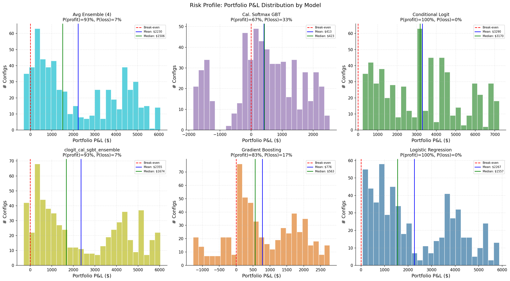

> Distribution of portfolio P&L across configs. Boxplots show median, IQR, and range by model.

The risk profile shows portfolio-level P&L distributions. All models are
right-skewed: the median is lower than the mean because a tail of
high-performing configs pulls the mean up.

---

## EV + Risk-Constrained Config Selection

Replaces the ad-hoc robustness score with principled EV + risk-constrained
optimization. For each config, we compute expected P&L (EV) by weighting
scenario outcomes with blend probabilities (average of model + market), and
bound downside risk using both worst-case P&L and CVaR-5% (conditional
value-at-risk via Monte Carlo with 100K samples). All metrics are
per-entry-point averages: sum across categories, then average across the 7
entry times. Bankroll = $1,000 per entry per category = $8,000 total per entry.

### Worst-Case Pareto Frontier

| L (%) | #Feasible | Best EV ($) | Worst ($) | Actual ($) | Deploy% | Config summary |
| ---: | ---: | ---: | ---: | ---: | ---: | :--- |
| 10 | 1262 | $445.37 | $-797.26 | $84.74 | 9.9% | lr/N/ind kf=0.35 e=0.15 |
| 15 | 1853 | $656.46 | $-1,199.99 | $647.87 | 14.8% | clogit/Y/multi kf=0.35 e=0.12 |
| 20 | 2315 | $846.77 | $-1,578.81 | $618.33 | 19.6% | clogit/A/ind kf=0.35 e=0.1 |
| 25 | 2888 | $1,267.20 | $-1,968.72 | $510.14 | 24.4% | clogit/N/multi kf=0.25 e=0.12 |
| 30 | 3289 | $1,476.46 | $-2,381.71 | $1,032.44 | 29.5% | clogit/A/multi kf=0.5 e=0.15 |
| 40 | 3500 | $1,572.95 | $-2,676.70 | $958.58 | 33.3% | clogit/A/multi kf=0.35 e=0.06 |
| 50 | 3528 | $1,572.95 | $-2,676.70 | $958.58 | 33.3% | clogit/A/multi kf=0.35 e=0.06 |
| 75 | 3528 | $1,572.95 | $-2,676.70 | $958.58 | 33.3% | clogit/A/multi kf=0.35 e=0.06 |
| 100 | 3528 | $1,572.95 | $-2,676.70 | $958.58 | 33.3% | clogit/A/multi kf=0.35 e=0.06 |

2024 is a harder year — lr appears at L=10% due to conservative positioning.
clogit takes over from L=15% onward. The frontier saturates above L=40%
($1,573 EV).


> Three EV variants (model, market, blend) vs worst-case P&L. Points on the Pareto frontier maximize EV at each risk level.

### CVaR-5% Pareto Frontier

| L (%) | #Feasible | Best EV ($) | CVaR-5% ($) | Worst ($) | Actual ($) | Config summary |
| ---: | ---: | ---: | ---: | ---: | ---: | :--- |
| 10 | 1492 | $612.73 | $-799.17 | $-1,179.96 | $446.33 | clogit/A/ind kf=0.25 e=0.05 |
| 15 | 2556 | $863.08 | $-1,123.74 | $-1,767.51 | $633.06 | clogit/A/ind kf=0.35 e=0.04 |
| 20 | 3136 | $1,409.64 | $-1,599.61 | $-2,344.13 | $731.58 | lr/A/multi kf=0.1 e=0.05 |
| 25 | 3528 | $1,572.95 | $-1,726.10 | $-2,676.70 | $958.58 | clogit/A/multi kf=0.35 e=0.06 |
| 30+ | 3528 | $1,572.95 | $-1,726.10 | $-2,676.70 | $958.58 | clogit/A/multi kf=0.35 e=0.06 |

CVaR-5% represents the average loss in the worst 5% of Monte Carlo scenarios.
Using CVaR instead of absolute worst-case opens 18% more configs at L=10%
(1,492 vs 1,262) with 38% higher best EV ($613 vs $445). The frontier saturates
above L=25%.


> CVaR-constrained Pareto frontiers at 5%, 10%, and 25% tail levels.


> Comparison of worst-case vs CVaR-5% constraints. CVaR allows access to higher-EV configs at each risk budget.

### Top Configs by Expected Value

| # | Model | KF | Edge | KM | Side | EV ($) | Worst ($) | CVaR-5% ($) | Actual ($) | Deploy% | ROI% |
| ---: | :--- | ---: | ---: | :--- | :--- | ---: | ---: | ---: | ---: | ---: | ---: |
| 1 | clogit | 0.35 | 0.06 | multi | A | $1,572.95 | $-2,676.70 | $-1,726.10 | $958.58 | 33.3% | 12.0% |
| 2 | clogit | 0.50 | 0.04 | multi | A | $1,570.31 | $-2,821.47 | $-1,721.84 | $993.39 | 35.9% | 12.4% |
| 3 | clogit | 0.35 | 0.04 | multi | A | $1,565.42 | $-2,885.87 | $-1,734.60 | $999.85 | 35.9% | 12.5% |
| 4 | clogit | 0.50 | 0.06 | multi | A | $1,564.82 | $-2,611.90 | $-1,709.41 | $967.53 | 33.3% | 12.1% |
| 5 | clogit | 0.50 | 0.05 | multi | A | $1,562.90 | $-2,630.07 | $-1,713.24 | $983.08 | 33.5% | 12.3% |
| 6 | clogit | 0.50 | 0.08 | multi | A | $1,560.80 | $-2,616.46 | $-1,706.83 | $962.97 | 32.4% | 12.0% |
| 7 | clogit | 0.35 | 0.05 | multi | A | $1,559.98 | $-2,696.06 | $-1,731.56 | $988.65 | 33.5% | 12.4% |
| 8 | clogit | 0.50 | 0.10 | multi | A | $1,552.09 | $-2,531.49 | $-1,703.23 | $963.94 | 31.3% | 12.0% |
| 9 | clogit | 0.35 | 0.08 | multi | A | $1,548.88 | $-2,616.97 | $-1,719.85 | $952.89 | 32.4% | 11.9% |
| 10 | clogit | 0.35 | 0.10 | multi | A | $1,540.22 | $-2,532.03 | $-1,717.10 | $953.83 | 31.3% | 11.9% |
| 11 | clogit | 0.50 | 0.12 | multi | A | $1,529.97 | $-2,486.86 | $-1,712.22 | $1,018.28 | 30.8% | 12.7% |
| 12 | clogit | 0.10 | 0.06 | multi | A | $1,519.69 | $-2,617.90 | $-1,717.17 | $964.25 | 33.4% | 12.1% |
| 13 | clogit | 0.15 | 0.06 | multi | A | $1,518.99 | $-2,612.98 | $-1,714.91 | $949.16 | 33.3% | 11.9% |
| 14 | clogit | 0.05 | 0.06 | multi | A | $1,518.45 | $-2,618.28 | $-1,711.42 | $963.29 | 33.4% | 12.0% |
| 15 | clogit | 0.35 | 0.12 | multi | A | $1,518.11 | $-2,487.40 | $-1,718.68 | $1,008.17 | 30.8% | 12.6% |

All top-15 configs are clogit with multi_outcome Kelly and side=all. These
maximize capital deployment (30–36%) but require high loss tolerance. The
actual P&L ($949–$1,018) tracks below EV ($1,519–$1,573), reflecting 2024's
narrower opportunities.

### MC Convergence Diagnostics


> CVaR-5% estimate convergence across MC sample sizes. All configs stabilize by N=10,000 (< 1% relative error). Production estimates use N=100,000.

---

## Parameter Sensitivity

### Fee Type

| Value | #Cfg | Mean P&L | Median P&L | % Prof |
| :--- | ---: | ---: | ---: | ---: |
| maker | 1764 | $964.84 | $711.74 | 89.3% |
| taker | 1764 | $804.39 | $589.79 | 89.3% |

The maker-taker spread is ~$160 at the mean — modest because BH makes so few
trades (31–60 per portfolio). Use maker (limit orders) where possible, but
the difference is not a dealbreaker.

### Kelly Fraction

| Value | #Cfg | Mean P&L | Median P&L | % Prof |
| :--- | ---: | ---: | ---: | ---: |
| 0.05 | 504 | $634.70 | $208.31 | 93.8% |
| 0.10 | 504 | $703.12 | $394.53 | 93.8% |
| 0.15 | 504 | $770.72 | $516.18 | 93.8% |
| 0.20 | 504 | $843.09 | $604.64 | 93.8% |
| 0.25 | 504 | $915.50 | $716.09 | 93.8% |
| 0.35 | 504 | $1,055.88 | $898.37 | 93.8% |
| 0.50 | 504 | $1,269.29 | $1,115.59 | 93.8% |

Monotonic increase in both mean and median. Profitability is identical at
93.8% across all fractions — confirming that in BH the edge threshold is the
binding constraint (whether to trade), not the fraction (how much). All top
P&L configs use kf=0.50.

### Edge Threshold

| Value | #Cfg | Mean P&L | Median P&L | % Prof |
| :--- | ---: | ---: | ---: | ---: |
| 0.04 | 504 | $766.89 | $532.64 | 88.9% |
| 0.05 | 504 | $780.51 | $568.50 | 91.7% |
| 0.06 | 504 | $794.44 | $582.42 | 93.1% |
| 0.08 | 504 | $875.36 | $654.59 | 94.4% |
| 0.10 | 504 | $972.62 | $715.60 | 95.8% |
| 0.12 | 504 | $990.58 | $787.61 | 97.2% |
| 0.15 | 504 | $1,011.90 | $804.46 | 95.8% |

Monotonic increase in mean P&L and near-monotonic in profitability rate.
Higher thresholds filter out marginal bets on already-efficient Oppenheimer
categories, concentrating capital on Actress Leading and Original Screenplay
where the edge is genuine. The 0.10–0.15 sweet spot is consistent with 2025.

### Kelly Mode

| Value | #Cfg | Mean P&L | Median P&L | % Prof |
| :--- | ---: | ---: | ---: | ---: |
| independent | 1764 | $648.02 | $448.46 | 94.4% |
| multi_outcome | 1764 | $1,121.21 | $974.01 | 84.1% |

Multi-outcome Kelly produces higher mean returns but only 84.1%
profitability vs 94.4% for independent. This is a key difference from 2025,
where both modes achieved near-100%. In 2024, multi-outcome concentrates
capital on the model's top pick in each category — when the model is wrong
(e.g., animated_feature for non-clogit models), the concentrated bet amplifies
losses. Independent Kelly distributes risk more evenly, achieving higher
profitability at the cost of lower upside.

### Trading Side

| Value | #Cfg | Mean P&L | Median P&L | % Prof |
| :--- | ---: | ---: | ---: | ---: |
| all | 1176 | $1,214.21 | $1,019.60 | 100.0% |
| no | 1176 | $318.71 | $254.61 | 67.9% |
| yes | 1176 | $1,120.92 | $916.01 | 100.0% |

Both `all` and `yes` achieve 100% profitability vs only 67.9% for `no`. Trading
both directions captures complementary signals — buying YES on Stone/Anatomy of
a Fall and NO on likely losers. The `no`-only strategy has limited edge because
it can't directly back the underpriced winners.

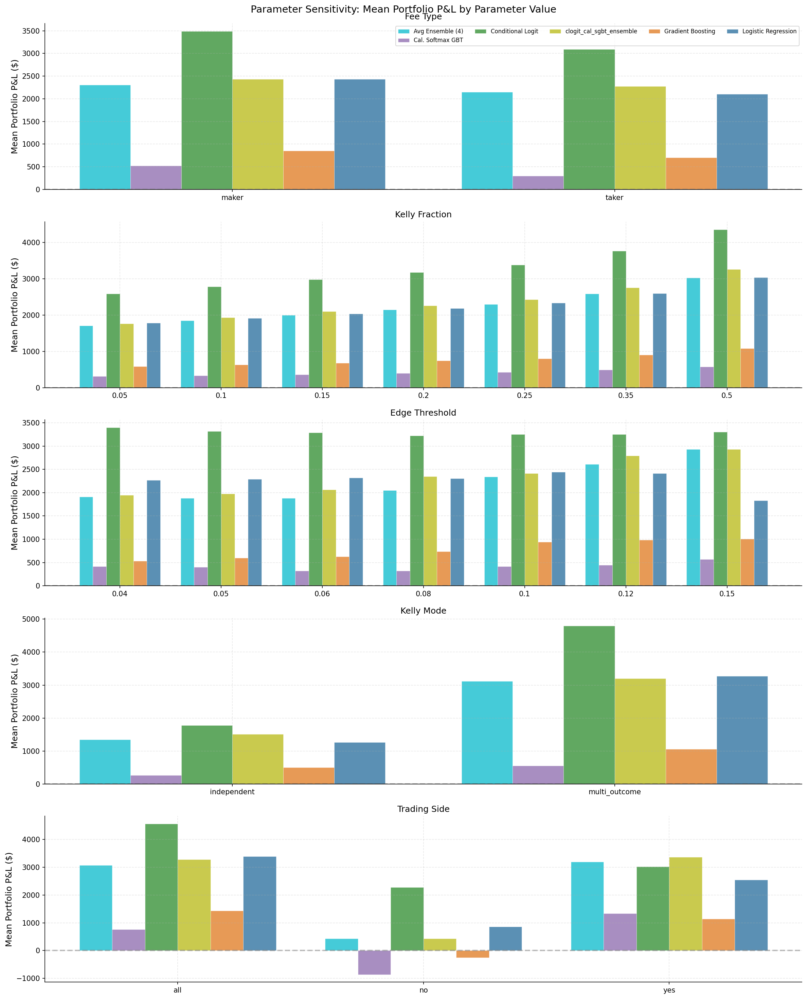

> Marginal effect of each parameter on portfolio P&L, averaging over all other parameters.

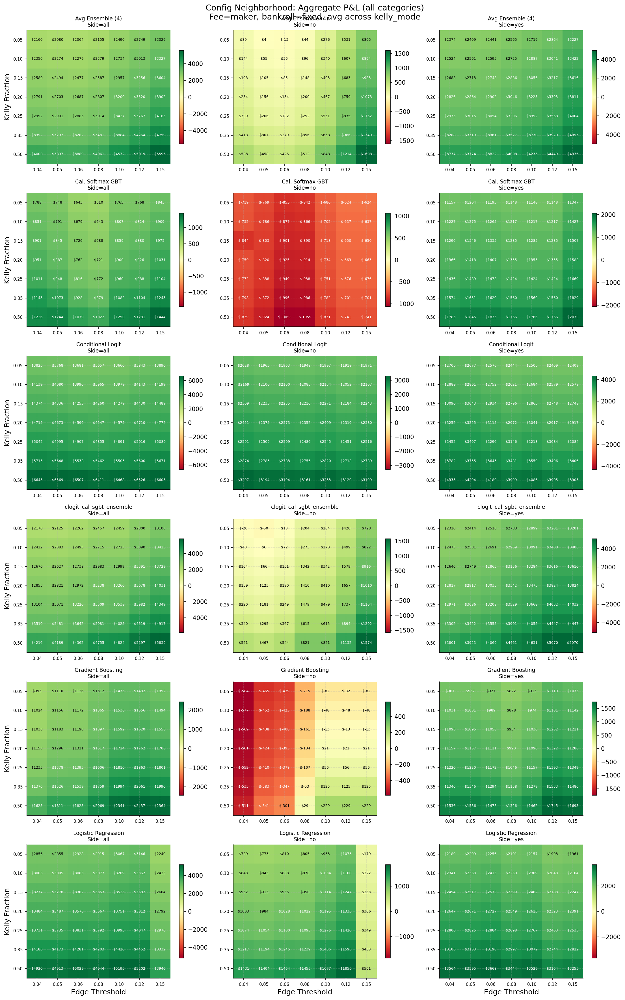

> Parameter interaction effects. Each cell shows mean portfolio P&L for a Kelly fraction × edge threshold combination.

The config neighborhood heatmap shows that edge=0.10–0.15 is robustly positive
across all models. The green band at higher thresholds extends across kelly
fractions, confirming the edge threshold is the dominant parameter.

---

## Entry Timing

Each row shows the **marginal portfolio P&L** contributed by that entry point —
i.e., across all 8 categories, how much did entering at this snapshot add to
the total?

| Entry Snapshot | Events | #Cfg | Mean P&L | Median | Best | % Prof |
| :--- | :--- | ---: | ---: | ---: | ---: | ---: |
| 2024-01-23_oscar_noms | 2024-01-23_oscar_noms | 3528 | $765.48 | $473.75 | $2,666.40 | 75.1% |
| 2024-02-10_dga | 2024-02-10_dga | 3528 | $-233.28 | $-146.23 | $330.51 | 13.0% |
| 2024-02-17_annie | 2024-02-17_annie | 3528 | $-279.15 | $-203.57 | $290.93 | 6.0% |
| 2024-02-18_bafta | 2024-02-18_bafta | 3528 | $405.45 | $323.79 | $1,536.38 | 95.2% |
| 2024-02-24_sag | 2024-02-24_sag | 3528 | $199.94 | $97.25 | $1,078.99 | 86.1% |
| 2024-02-25_pga | 2024-02-25_pga | 3528 | $422.03 | $344.77 | $1,501.73 | 100.0% |
| 2024-03-03_asc | 2024-03-03_asc | 3528 | $608.22 | $544.66 | $2,069.09 | 100.0% |

**Oscar nominations (Jan 23) has the highest mean P&L** (+$765) thanks to
the longest holding period capturing maximum price movement, though only 75.1%
of configs are profitable. **ASC (Mar 3, 7 days out) and PGA (Feb 25)
achieve 100% profitability** — the most reliable entries. Late entries
dominate in profitability rate because 2024's edge only crystallizes after
multiple late-season precursors confirm the underpriced winners.

**DGA (Feb 10) and Annie (Feb 17) are the worst entries** — negative mean P&L
and only 13%/6% profitable respectively. These mid-season entries lack
sufficient precursor data while prices have already partially adjusted.

**Contrast with 2025:** In 2025 the DGA/PGA/Annie cluster (~22 days out) was
optimal because a major underpricing (Sean Baker in Directing) was identified
early. In 2024, the pattern is bimodal: early entry (Oscar noms) captures
the most upside on cheap contracts, while late entry (ASC/PGA) offers the
safest window with 100% profitability.

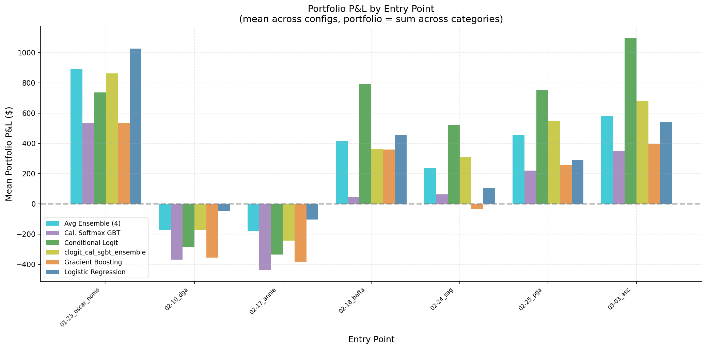

> Portfolio P&L distribution by entry point, showing which precursor events provide the best entry opportunities.

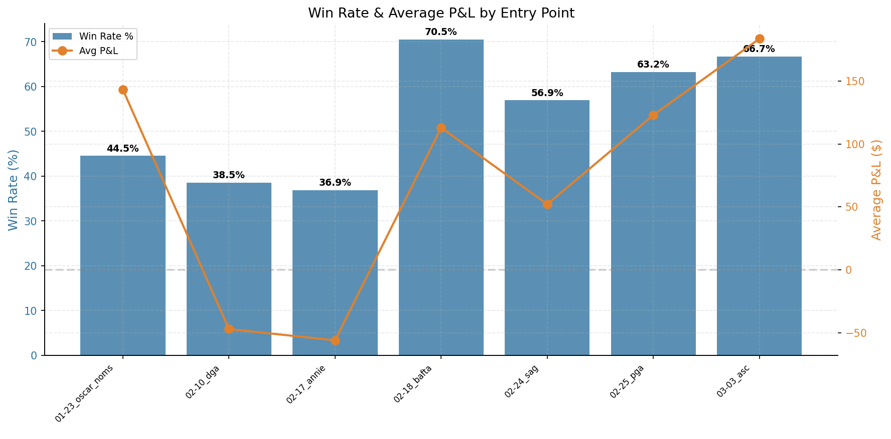

> Fraction of profitable configs by entry point.

### Entry &times; Category Heatmap

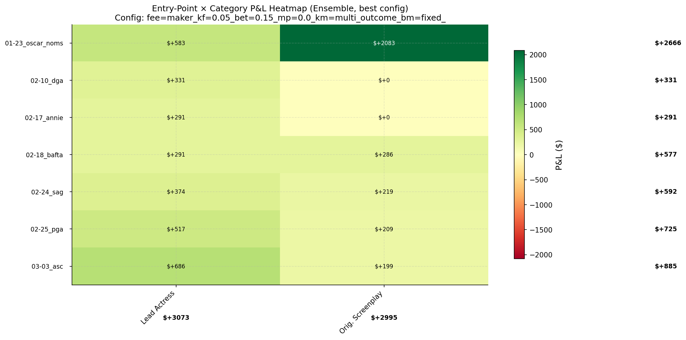

> Mean P&L heatmap by entry point × category, highlighting which categories drive profitability at each entry.

The heatmap shows P&L concentration in two columns:
- **Actress Leading:** Green across most entries (Feb 10 onward), with the
  deepest green at Mar 3. The model identifies Emma Stone's edge at multiple
  entry points.
- **Original Screenplay:** Green from BAFTA (Feb 18) onward. Anatomy of a
  Fall's signal solidifies mid-season.
- **Animated Feature:** Mixed — green for clogit, red for cal_sgbt. This is
  the most model-dependent category.

### Cumulative P&L by Entry

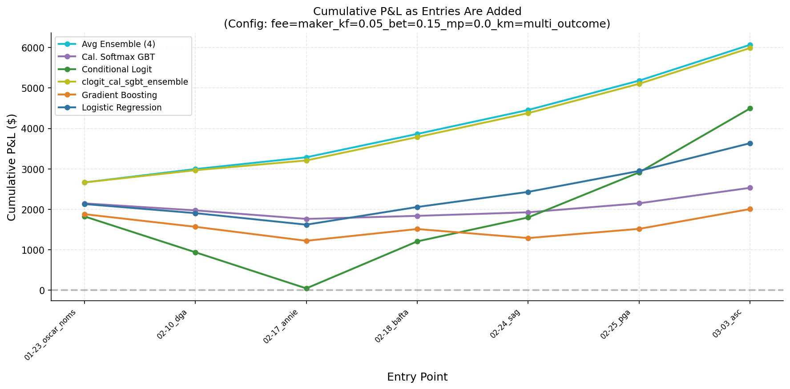

> Cumulative P&L as entries are added chronologically. Steeper slopes indicate higher-value entry points.

Returns build primarily from entry #4 (BAFTA) onward. Earlier entries
contribute marginally or negatively. The ASC entry (entry #7) produces the
single largest jump.

#### Marginal EV per Entry Point


> Marginal (non-cumulative) EV contribution from each entry point for the top 5 configs. Taller bars indicate more valuable entry points.

#### Cumulative EV Envelope


> Cumulative EV (solid line) with worst-case to best-case band (shading) for the top 3 configs. The dashed line shows actual realized P&L. Narrower bands indicate more predictable outcomes.

---

## Capital Deployment

How much of the $56,000 total bankroll (8 categories &times; 7 entries &times;
$1,000) is actually deployed?

### Per-Model Summary

| Model | Avg Deployed | Avg Bankroll | Util % | ROI Deployed | ROI Bankroll |
| :--- | ---: | ---: | ---: | ---: | ---: |
| avg_ens | $7,376.56 | $56,000.00 | 13.2% | 37.4% | 4.0% |
| cal_sgbt | $10,502.67 | $56,000.00 | 18.8% | 5.1% | 0.7% |
| clogit | $9,377.18 | $56,000.00 | 16.7% | 37.2% | 5.9% |
| clog_sgbt | $7,586.54 | $56,000.00 | 13.5% | 39.6% | 4.2% |
| gbt | $7,495.01 | $56,000.00 | 13.4% | 13.5% | 1.4% |
| lr | $8,320.67 | $56,000.00 | 14.9% | 31.3% | 4.0% |

> **Column legend:** **Avg Deployed** = mean capital spent on contracts across
> configs. **Avg Bankroll** = total budget (categories × entries × $1,000).
> **Util %** = deployed ÷ bankroll. **ROI Deployed** = P&L ÷ deployed capital
> (how efficiently deployed dollars generate returns). **ROI Bankroll** = P&L
> ÷ total bankroll (overall return on committed capital).

Only **13–19% of bankroll is deployed** — lower than 2025's 23–32%. The
Oppenheimer sweep means efficient markets in most categories, so fewer trades
pass the edge threshold. This is exactly how the system should behave: in a
high-consensus year with few mispricings, deploy less capital.

clog_sgbt has the highest deployed ROI (39.6%) despite moderate total P&L,
because it deploys relatively little capital — when it does trade, the
edge is real. cal_sgbt deploys the most capital (18.8%) but achieves the
lowest deployed ROI (5.1%), suggesting more marginal trades.

### Per-Entry ROI

| Entry | #Active | Mean ROI | Median ROI |
| :--- | ---: | ---: | ---: |
| 2024-01-23_oscar_noms | 14140 | -37.9% | 0.0% |
| 2024-02-10_dga | 15232 | -32.2% | -101.2% |
| 2024-02-17_annie | 14490 | -33.1% | 0.0% |
| 2024-02-18_bafta | 10542 | -9.1% | 0.0% |
| 2024-02-24_sag | 13216 | -9.0% | 41.1% |
| 2024-02-25_pga | 11774 | 14.4% | 40.2% |
| 2024-03-03_asc | 11662 | 33.6% | 35.7% |

The per-entry ROI table reveals that only the last two entries (PGA, ASC) have
positive mean ROI. ASC stands out with both positive mean (33.6%) and positive
median (35.7%) — the safest entry for individual-trade win rate. The DGA
entry has the worst median ROI (&minus;101.2%), indicating most individual
trades lose money at that point in the season.

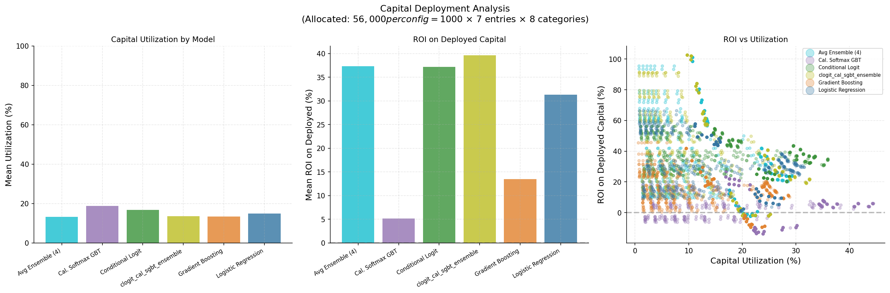

> Capital deployed and ROI by entry point.

---

## Where Does the Edge Come From?

### Category &times; Model P&L Matrix

Each cell shows the cherry-picked best-config P&L for that (model, category)
pair — the ceiling of what's achievable.

| Model | Actor Leadin | Actor Suppor | Actress Lead | Actress Supp | Animated Fea | Best Picture | Directing | Original Scr | TOTAL |
| :--- | ---: | ---: | ---: | ---: | ---: | ---: | ---: | ---: | ---: |
| avg_ens | $0.00 | $0.00 | $4,298.39 | $0.00 | $0.00 | $0.00 | $0.00 | $4,151.43 | $8,449.82 |
| cal_sgbt | $0.00 | $0.00 | $5,135.71 | $183.13 | $-290.24 | $64.90 | $0.00 | $4,253.12 | $9,346.62 |
| clogit | $-46.68 | $192.97 | $3,684.50 | $-62.75 | $4,242.71 | $0.00 | $0.00 | $4,008.36 | $12,019.11 |
| clog_sgbt | $0.00 | $57.04 | $4,392.60 | $0.00 | $0.00 | $0.00 | $0.00 | $4,336.71 | $8,786.35 |
| gbt | $-35.11 | $-18.72 | $4,051.72 | $0.00 | $-50.30 | $0.00 | $0.00 | $3,386.34 | $7,333.93 |
| lr | $-51.88 | $0.00 | $4,386.48 | $-44.74 | $2,434.65 | $0.00 | $0.00 | $3,878.81 | $10,603.32 |
| **TOTAL** | $-133.67 | $231.29 | $25,949.40 | $75.64 | $6,336.82 | $64.90 | $0.00 | $24,014.77 | **$56,539.15** |

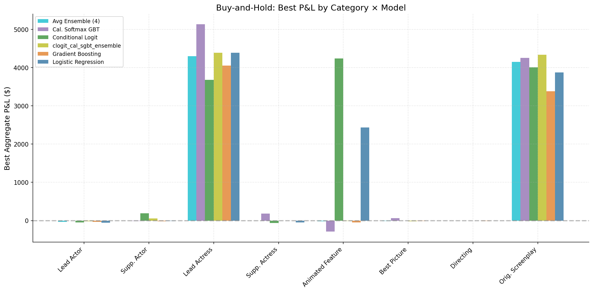

> P&L distribution by category across all configs.

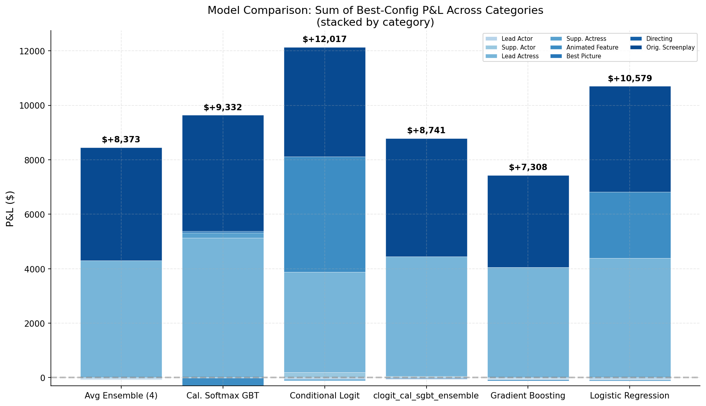

> Head-to-head model comparison: total P&L summed across categories.

**Actress Leading ($25.9k total) and Original Screenplay ($24.0k total)
dominate** — together ~88% of all P&L. All 6 models are profitable in both
categories, with Actress Leading ranging from $3,685 (clogit) to $5,136
(cal_sgbt). Emma Stone's surprise win over Lily Gladstone and Anatomy of a
Fall's consistent underpricing were the two big opportunities.

**clogit's Animated Feature edge (+$4,243) is the largest** — lr also earns
meaningful profit (+$2,435) in this category, but cal_sgbt *loses* money
(&minus;$290). The conditional logit model's competition-aware structure gives
it a unique advantage in modeling nominee field dynamics (The Boy and the Heron
vs Spider-Verse sequel). This category remains a key differentiator:
remove Animated Feature and cal_sgbt would lead instead.

**Directing has zero edge across all models.** Christopher Nolan was priced
at 95%+ for most of the season — no model-market divergence to exploit.
This contrasts sharply with 2025 Directing (Sean Baker), which generated
$17k–$18.7k per model.

**Best Picture, Lead Actor, Supporting Actor/Actress:** Essentially break-even.
The Oppenheimer-dominated categories were priced too efficiently.

---

## Model vs Market Divergence

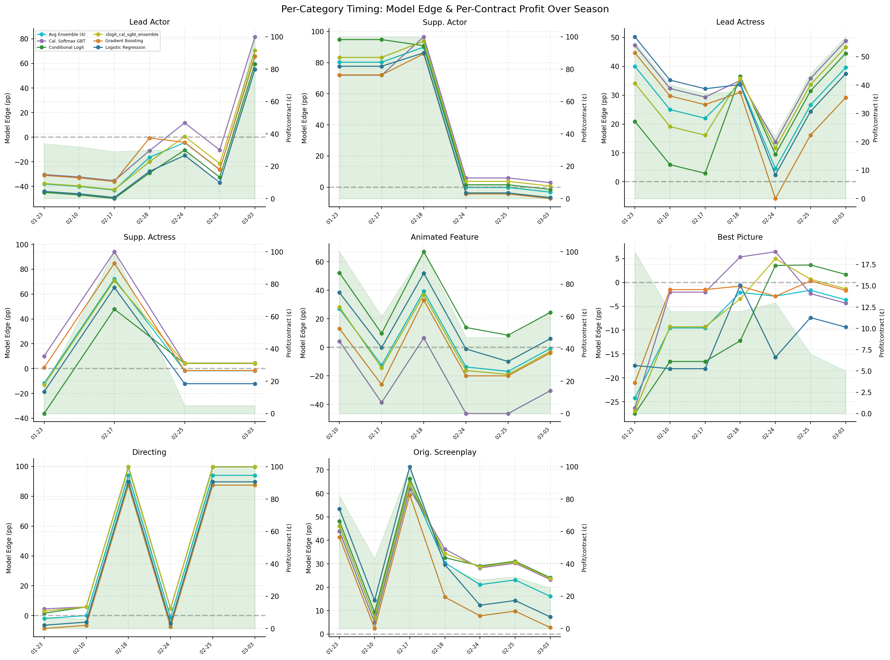

> Per-category model-market divergence over time, showing when and where the edge appears.

The per-category timing chart confirms the concentrated edge pattern. Mean
winner divergence (model_prob &minus; market_prob) is positive but smaller
than in 2025, consistent with fewer underpriced winners. The signal is
strongest for Actress Leading and Original Screenplay, where model-market
divergence is 5–15 pp throughout the season. Oppenheimer categories show
near-zero divergence because both models and markets agree on the outcomes.

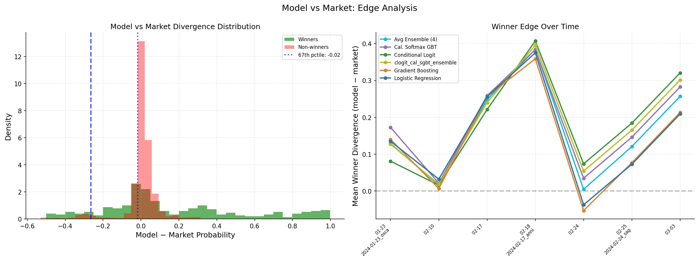

> Distribution of model-market probability divergence for winners vs non-winners.

The divergence histogram shows winners with positive model-market divergence,
confirming the core trading thesis that our models have genuine predictive edge
over market prices — even in a concentrated, consensus-driven year.

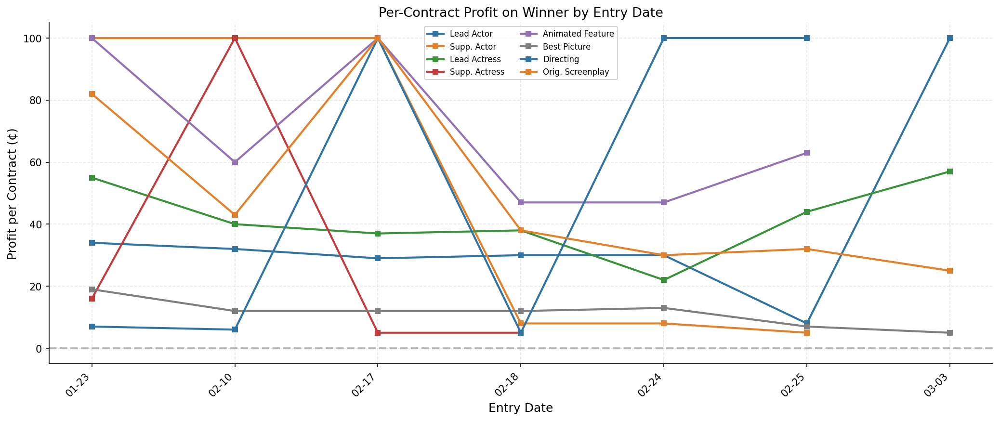

> Per-contract profit by entry date, showing the tradeoff between early entry (high upside) and late entry (high reliability).

Per-contract profit by entry date: the highest payoff is always at the
earliest entry (highest upside on cheap contracts), but combining with the
model edge analysis, the *risk-adjusted* best entry is late-season (PGA/ASC)
when the signal has been confirmed by multiple precursors.

---

## Key Takeaways

1. **clogit and lr achieve 100% profitability** — every single portfolio
   config makes money for these two models. The conditional logit model has
   the highest mean P&L ($3,290) and best single config ($7,227). Overall
   model profitability ranges from 66.7% (cal_sgbt) to 100%.

2. **P&L is concentrated in 2 categories** — Actress Leading ($25.9k total)
   and Original Screenplay ($24.0k total) account for ~88% of all profits.
   Oppenheimer-dominated categories offer zero edge.

3. **clogit's Animated Feature edge (+$4,243) is the largest,** with lr also
   earning +$2,435. Without Animated Feature, cal_sgbt would lead. This
   remains the most model-dependent category in the dataset.

4. **Entry timing is bimodal:** Oscar noms (Jan 23, 47 days out) has the
   highest mean P&L (+$765) thanks to the longest holding period, but only
   75% profitable. ASC (Mar 3, 7 days out) and PGA are 100% profitable.
   Contrasts with 2025 where mid-season DGA was optimal.

5. **EV + CVaR scoring replaces the ad-hoc robustness score.** The Pareto
   frontier tops out at $1,573 EV (clogit/A/multi, kf=0.35, edge=0.06),
   saturating at L=40%. CVaR-5% opens 18% more configs at L=10% (1,492 vs
   1,262) with 38% higher best EV ($613 vs $445).

6. **Independent Kelly achieves 94.4% profitability** vs 84.1% for
   multi-outcome. In a concentrated-edge year, independent Kelly's risk
   spreading is more robust than multi-outcome's capital concentration.

7. **Both `all` and `yes` trading achieve 100% profitability** vs 67.9% for
   `no`. The ability to buy YES on underpriced winners is crucial.

8. **Only 13–19% of bankroll is deployed** — lower than 2025's 23–32%.
   Efficient markets in most categories mean few trades pass the edge
   threshold. This is the right behavior.

9. **Market efficiency drives returns more than model quality.** The 2024
   P&L (~$413–$3,290 mean) is substantially lower than 2025
   (~$5,800–$10,200), not because models are worse, but because Oppenheimer
   left fewer mispricings. See [cross-year analysis](README.md) for the
   full comparison.

---

## How to Run

```bash
cd "$(git rev-parse --show-toplevel)"

# Full pipeline (backtests + scoring + analysis):
bash oscar_prediction_market/one_offs/d20260225_buy_hold_backtest/run.sh \
    2>&1 | tee storage/d20260225_buy_hold_backtest/run.log

# Or individual steps:
bash oscar_prediction_market/one_offs/d20260225_buy_hold_backtest/run_backtests.sh
bash oscar_prediction_market/one_offs/d20260225_buy_hold_backtest/run_scoring.sh
bash oscar_prediction_market/one_offs/d20260225_buy_hold_backtest/run_analysis.sh
```

## Output Structure

```
storage/d20260225_buy_hold_backtest/2024/
├── results/
│   ├── entry_pnl.csv            # Per (entry, cat, model, config) P&L
│   ├── aggregate_pnl.csv        # Summed across entries
│   ├── model_accuracy.csv       # Per-snapshot model accuracy
│   ├── model_vs_market.csv      # Model vs market divergence
│   ├── parameter_sensitivity.csv
│   ├── risk_profile.csv
│   ├── scenario_pnl.csv         # Per-scenario P&L for EV scoring
│   └── pareto_frontier_blend.csv # Pareto frontier configs
└── plots/
    ├── pnl_by_category.png
    ├── risk_profile.png
    ├── parameter_sensitivity.png
    ├── portfolio_pnl_by_entry.png
    ├── portfolio_capital_deployment.png
    ├── model_comparison.png
    ├── config_neighborhood_heatmap.png
    ├── win_rate_by_entry.png
    ├── entry_category_heatmap.png
    ├── cumulative_pnl_by_entry.png
    ├── per_category_timing.png
    ├── entry_date_profit.png
    ├── model_vs_market_divergence.png
    └── scenario/
        ├── pareto_frontier.png
        ├── cvar_pareto.png
        ├── pareto_comparison.png
        ├── mc_convergence.png
        ├── temporal_marginal_ev.png
        └── temporal_envelope.png
```
