# Buy-and-Hold Backtest: 2025 Oscar Season

**Storage:** `storage/d20260225_buy_hold_backtest/`

## Bug Fixes Applied (2026-02-28)

Three corrections were applied to the backtest engine and results were regenerated:

1. **Settlement universe bug (HIGH severity):** `_compute_settlements()` previously built the settlement universe from only the last snapshot's prices. If the actual winner was missing from the last snapshot's prices (no candle data), `settle(winner)` raised KeyError, and the try/except handler defaulted P&L to $0 even when positions were open. **Fix:** expanded universe to include all moments' prices + predictions + position outcomes.

2. **Fee cap bug (LOW severity):** `_cap_total_exposure()` previously summed `outlay_dollars` (= contracts × price) without fees. **Fix:** now sums `contracts × (price + fee)`.

3. **Forward-fill:** Added per-nominee backward price lookup when nominees are missing from a snapshot's prices (no Kalshi candle data at that timestamp). The forward-fill uses the most recent available daily close price.

---

Buy once at each precursor event entry point, hold all positions to ceremony
resolution. No rebalancing, no selling. This is the simplest possible trading
strategy and provides clean per-entry P&L attribution. Across 588 fixed-bankroll
configs per (model, category, entry), every single model achieves 100%
profitability — the worst config still makes money. The best portfolio-level
config (gbt, multi/all/maker, edge=0.15) returns **$27,431** on $81,000 bankroll
(34% ROI), while the median config returns ~$8,500.

Buy-and-hold is dramatically more profitable than rebalancing — **$202,434 vs
$11,895** across all best model&times;category configs. See
[README_bh_vs_rebalancing.md](README_bh_vs_rebalancing.md) for the full
comparison.

## Motivation

The [d20260220_backtest_strategies](../d20260220_backtest_strategies/) experiment
used a rebalancing engine that re-evaluates positions daily. Even with
`NEVER_SELL_THRESHOLD = -1.0`, Kelly rebalancing still fires when targets
decrease (edge shrinks as market price moves toward model price). This means
positions were opened, adjusted, and sometimes fully closed *before* settlement
— not the single-entry hold-to-resolution strategy we wanted to evaluate.

This experiment answers: **if you simply buy once and hold to resolution, what
are the returns?**

## Design: BacktestEngine with Single TradingMoment

Rather than building a separate buy-and-hold engine, we reuse the existing
`BacktestEngine` with a key simplification: **one TradingMoment per entry
point**. With exactly one moment, the engine buys and then has nothing left to
do — no rebalancing can fire. Positions are frozen until settlement.

```python
for entry_point in snapshot_entry_points:
    moment = TradingMoment(timestamp=entry_time, predictions=preds, prices=prices)
    engine = BacktestEngine(config)
    result = engine.run(moments=[moment])  # single moment = buy once
    settlement = result.settle(winner)     # hold to resolution
```

This is the cleanest possible code path — zero new trading infrastructure
needed, and the buy-and-hold property is guaranteed by construction.

## Setup

- **Ceremony year:** 2025
- **Bankroll:** $1,000 per entry per category (fixed only)
- **Signal delay:** Inferred lag +6h (entry at event end + 6 hours)
- **9 entry points** (one per post-nomination snapshot)
- **6 models:** cal_sgbt, clogit, gbt, lr, avg_ensemble, clogit_cal_sgbt_ensemble
- **9 categories:** all modeled Oscar categories
- **588 configs** (fixed grid only, no dynamic bankroll)

Total scenarios: 9 categories &times; 6 models &times; 9 entries &times; 588 configs = **285,768**

### Categories

| Category | Winner | Market Price Range |
|----------|--------|--------------------|
| directing | Sean Baker | Underpriced all season |
| best_picture | Anora | Strong frontrunner |
| animated_feature | Flow | Underdog upset |
| actress_supporting | Zoe Salda&ntilde;a | Clear favorite |
| actor_leading | Adrien Brody | Competitive field |
| cinematography | Anora | Crowded race |
| original_screenplay | Anora | Moderate favorite |
| actress_leading | Mikey Madison | Competitive field |
| actor_supporting | Kieran Culkin | Heavy favorite |

### Entry Points

| # | Snapshot | Events | Entry Timestamp (ET) |
|:-:|:---------|:-------|:--------------------:|
| 1 | 2025-01-23_oscar_noms | Oscar nominations | Jan 23 14:30 |
| 2 | 2025-02-07_critics_choice | Critics Choice | Feb 7 22:30 |
| 3 | 2025-02-08_annie | Annie Awards | Feb 9 00:30 |
| 4 | 2025-02-08_dga | DGA | Feb 9 01:30 |
| 5 | 2025-02-08_pga | PGA | Feb 9 02:30 |
| 6 | 2025-02-15_wga | WGA | Feb 16 01:00 |
| 7 | 2025-02-16_bafta | BAFTA | Feb 16 16:30 |
| 8 | 2025-02-23_asc | ASC | Feb 24 00:00 |
| 9 | 2025-02-23_sag | SAG | Feb 24 01:00 |

### Trading Config Grid

| Parameter | Values | Count |
|-----------|--------|------:|
| kelly_fraction | 0.05, 0.10, 0.15, 0.20, 0.25, 0.35, 0.50 | 7 |
| buy_edge_threshold | 0.04, 0.05, 0.06, 0.08, 0.10, 0.12, 0.15 | 7 |
| kelly_mode | independent, multi_outcome | 2 |
| fee_type | maker (0.56&cent;), taker (0.78&cent;) | 2 |
| trading_side | yes, no, all | 3 |
| bankroll_mode | fixed ($1,000) | 1 |

Total: 7 &times; 7 &times; 2 &times; 2 &times; 3 &times; 1 = **588 configs** per (model, category, entry).

> **Why `kelly_fraction` is a no-op in `multi_outcome` mode:**
> `multi_outcome` maximizes $E[\log W]$ numerically via SLSQP. `kelly_fraction`
> only enters as the starting guess for the optimizer — not in the objective
> or constraints — so the solver finds the same optimal allocation regardless
> of KF. In `independent` mode, KF directly scales position sizes: KF=0.50
> deploys 10× more than KF=0.05. In multi-outcome, all 7 KF values converge
> to an identical portfolio (verified by toy example: four different starting
> points all reach Anora=1,158c + Conclave=964c in a $1,000 bankroll scenario;
> see [README.md](README.md) for the full worked example). As a result the 588
> configs contain ~336 functionally distinct strategies; the 7 KF values in
> `multi_outcome` are near-duplicates.

---

## Portfolio-Level Results

The primary view: for each model, what is the total P&L distribution across
all 588 configs? This is what a trader sees — you deploy one model with one
config across all 9 categories.

| Model | #Cfg | Best P&L | Mean | Median | P10 | P90 | % Prof | Mean ROI | Util % |
| :--- | ---: | ---: | ---: | ---: | ---: | ---: | ---: | ---: | ---: |
| avg_ens | 588 | $24,512.86 | $9,482.91 | $8,474.85 | $1,955.14 | $19,135.51 | 100.0% | 54.6% | 26.8% |
| cal_sgbt | 588 | $26,294.40 | $11,697.78 | $11,335.77 | $2,424.85 | $23,532.61 | 100.0% | 49.6% | 32.5% |
| clogit | 588 | $13,609.15 | $5,106.08 | $5,149.69 | $1,324.76 | $9,095.20 | 100.0% | 24.4% | 32.2% |
| clog_sgbt | 588 | $21,579.18 | $8,836.88 | $8,597.27 | $1,881.60 | $17,872.01 | 100.0% | 42.7% | 30.2% |
| gbt | 588 | $27,430.73 | $10,910.12 | $11,443.68 | $2,011.89 | $21,919.25 | 100.0% | 51.8% | 29.0% |
| lr | 588 | $15,921.10 | $6,565.64 | $5,406.55 | $1,347.53 | $12,561.40 | 100.0% | 45.9% | 24.2% |

> **Column legend:** **#Cfg** = number of configs tested per model (588).
> **P10/P90** = 10th/90th percentile portfolio P&L across configs (P10 = worst
> 10% earn at least this). **% Prof** = percentage of configs with positive
> portfolio P&L. **Mean ROI** = mean return on deployed capital (P&L ÷ capital
> actually spent on contracts). **Util %** = capital utilization (deployed ÷
> bankroll). Low utilization means most bankroll sits idle because few trades
> pass the edge threshold.

**Every config is profitable across all models.** 100% profitability at the
portfolio level, even P10, is a strong signal that the edge is real — not
an artifact of cherry-picking configs. cal_sgbt has the highest mean P&L
($11,698), while gbt has the single best config ($27,431). Capital utilization
is 24–33%, meaning most bankroll sits idle — the edge threshold filters out
many potential trades, which is exactly how it should work.

Mean ROI on deployed capital ranges from 24% (clogit) to 55% (avg_ens). The
gap between ROI-on-deployed and ROI-on-bankroll reflects the utilization
efficiency: avg_ens deploys less capital but uses it more efficiently.

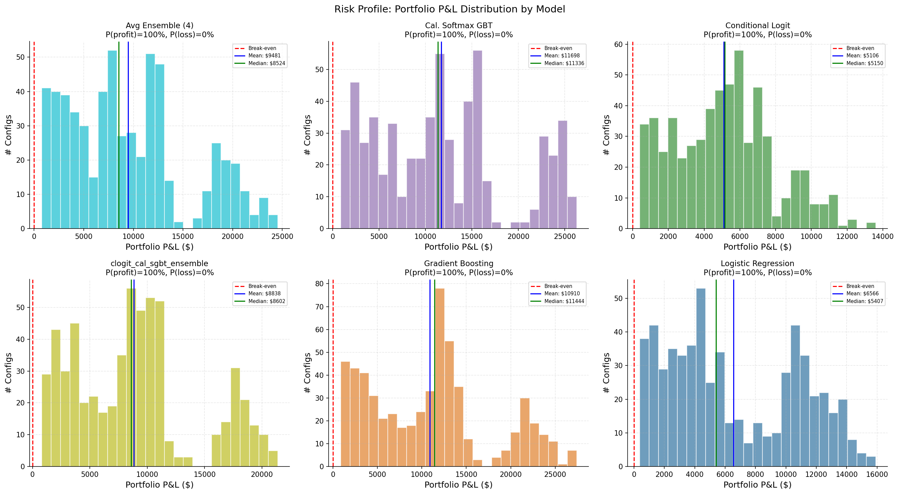

> Portfolio P&L distribution by model. Boxplots show the breadth of outcomes across 588 configs.

The risk profile shows portfolio-level P&L distributions. All models are
right-skewed: the median is lower than the mean because a tail of
high-performing configs pulls the mean up. Even P10 is positive for all models
— the worst 10% of configs still profit.

---

## EV + Risk-Constrained Config Selection

> Replaces the ad-hoc robustness score with principled EV + risk-constrained optimization.
> EV = blend probability-weighted PnL (average of model + market probabilities). Risk bounded
> by worst-case P&L and CVaR-5% (conditional value-at-risk, Monte Carlo with 100K samples).
> Per-entry-point averages: sum across 9 categories, average across 9 entry times.
> Bankroll = $1,000 per entry per category = $9,000 total per entry.

### Worst-Case Pareto Frontier

| L (%) | #Feasible | Best EV ($) | Worst ($) | Actual ($) | Deploy% | Config summary |
| ---: | ---: | ---: | ---: | ---: | ---: | :--- |
| 10 | 853 | $1,827.70 | $-851.20 | $444.69 | 9.3% | clogit/Y/ind kf=0.25 e=0.1 |
| 15 | 1196 | $2,627.45 | $-1,347.05 | $559.72 | 14.8% | clogit/Y/ind kf=0.35 e=0.05 |
| 20 | 1492 | $3,631.74 | $-1,694.97 | $838.92 | 18.6% | clogit/Y/ind kf=0.5 e=0.1 |
| 25 | 1803 | $4,930.64 | $-2,157.00 | $842.00 | 23.7% | clogit/Y/multi kf=0.25 e=0.15 |
| 30 | 2146 | $5,010.17 | $-2,503.79 | $751.43 | 27.5% | clogit/Y/multi kf=0.25 e=0.1 |
| 40 | 2912 | $5,223.31 | $-3,222.89 | $525.11 | 35.4% | clogit/Y/multi kf=0.05 e=0.04 |
| 50 | 3203 | $5,870.46 | $-4,484.18 | $1,259.82 | 51.8% | clogit/A/multi kf=0.15 e=0.15 |
| 75 | 3528 | $6,051.32 | $-5,457.20 | $974.92 | 67.0% | clogit/A/multi kf=0.1 e=0.05 |
| 100 | 3528 | $6,051.32 | $-5,457.20 | $974.92 | 67.0% | clogit/A/multi kf=0.1 e=0.05 |

clogit dominates the entire frontier. The 2025 season has much larger EV than
2024 (max EV $6,051 vs $1,573) due to stronger model-market divergence. The
conservative→aggressive transition follows the same pattern: independent
Kelly/YES-only → multi_outcome → side=all.

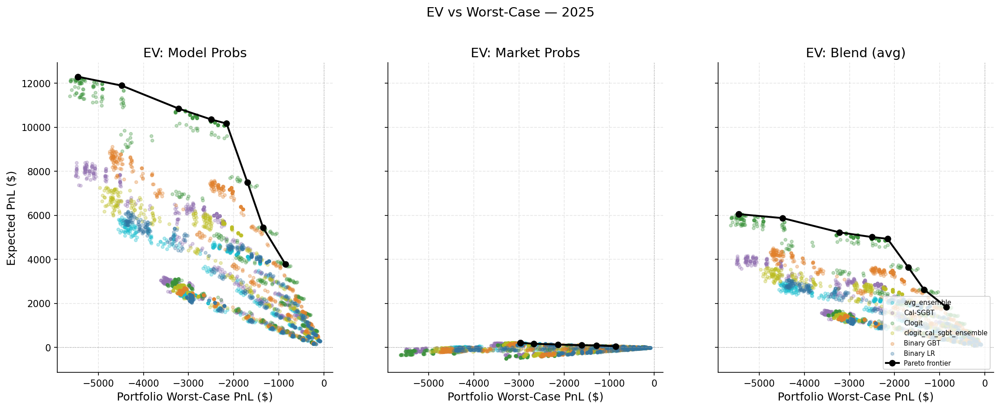

> EV vs worst-case P&L scatter with Pareto frontier overlay. Model, market, and blend EV variants shown in separate panels.

### CVaR-5% Pareto Frontier

| L (%) | #Feasible | Best EV ($) | CVaR-5% ($) | Worst ($) | Actual ($) | Config summary |
| ---: | ---: | ---: | ---: | ---: | ---: | :--- |
| 10 | 1410 | $2,518.12 | $-873.01 | $-1,045.90 | $668.43 | clogit/Y/ind kf=0.35 e=0.15 |
| 15 | 2174 | $3,729.45 | $-1,346.03 | $-1,916.83 | $748.62 | clogit/Y/ind kf=0.5 e=0.05 |
| 20 | 2676 | $4,652.90 | $-1,795.44 | $-2,148.87 | $850.13 | clogit/Y/multi kf=0.5 e=0.15 |
| 25 | 3489 | $6,051.32 | $-2,169.23 | $-5,457.20 | $974.92 | clogit/A/multi kf=0.1 e=0.05 |
| 30 | 3528 | $6,051.32 | $-2,169.23 | $-5,457.20 | $974.92 | clogit/A/multi kf=0.1 e=0.05 |
| 40 | 3528 | $6,051.32 | $-2,169.23 | $-5,457.20 | $974.92 | clogit/A/multi kf=0.1 e=0.05 |
| 50 | 3528 | $6,051.32 | $-2,169.23 | $-5,457.20 | $974.92 | clogit/A/multi kf=0.1 e=0.05 |
| 75 | 3528 | $6,051.32 | $-2,169.23 | $-5,457.20 | $974.92 | clogit/A/multi kf=0.1 e=0.05 |
| 100 | 3528 | $6,051.32 | $-2,169.23 | $-5,457.20 | $974.92 | clogit/A/multi kf=0.1 e=0.05 |

CVaR-5% constraint is less restrictive than worst-case, opening more configs
at each risk level. Notably, at L=10%, CVaR admits configs with nearly double
the EV ($2,518 vs $1,828).

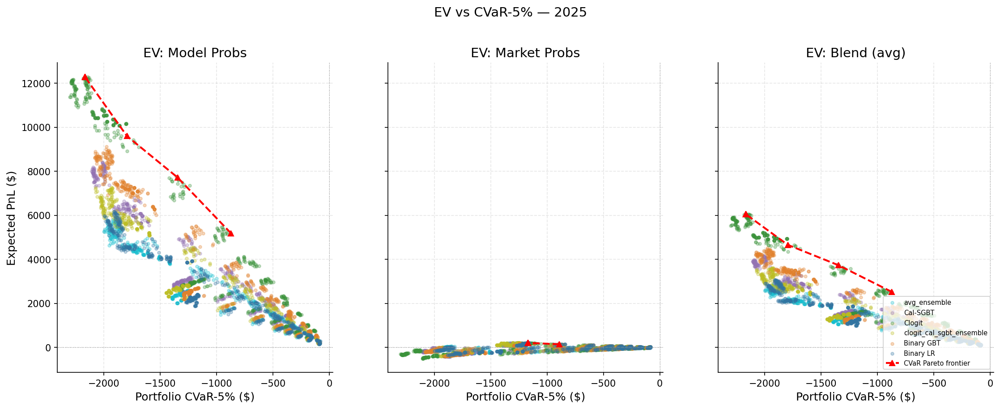

> CVaR-constrained Pareto frontiers at three tail levels.

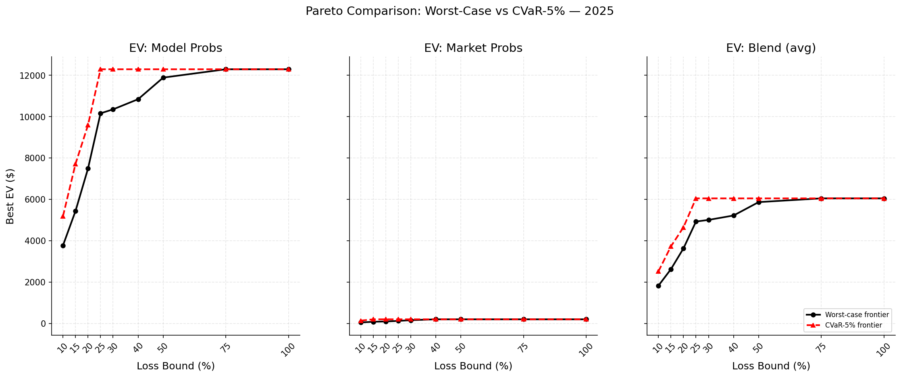

> Side-by-side comparison: worst-case vs CVaR-5% Pareto frontiers. CVaR provides access to higher-EV regions.

### Top Configs by Expected Value (Top 15)

| # | Model | KF | Edge | KM | Side | EV ($) | Worst ($) | CVaR-5% ($) | Actual ($) | Deploy% | ROI% |
| ---: | :--- | ---: | ---: | :--- | :--- | ---: | ---: | ---: | ---: | ---: | ---: |
| 1 | clogit | 0.10 | 0.05 | multi | A | $6,051.32 | $-5,457.20 | $-2,169.23 | $974.92 | 67.0% | 10.8% |
| 2 | clogit | 0.05 | 0.04 | multi | A | $6,051.11 | $-5,459.07 | $-2,145.16 | $988.26 | 70.5% | 11.0% |
| 3 | clogit | 0.25 | 0.05 | multi | A | $6,045.44 | $-5,455.46 | $-2,165.69 | $984.21 | 67.0% | 10.9% |
| 4 | clogit | 0.15 | 0.04 | multi | A | $6,030.59 | $-5,449.30 | $-2,131.67 | $1,103.93 | 70.1% | 12.3% |
| 5 | clogit | 0.05 | 0.05 | multi | A | $6,025.07 | $-5,408.35 | $-2,159.03 | $962.32 | 67.1% | 10.7% |
| 6 | clogit | 0.15 | 0.05 | multi | A | $6,024.02 | $-5,377.86 | $-2,144.73 | $1,053.36 | 67.1% | 11.7% |
| 7 | clogit | 0.10 | 0.06 | multi | A | $6,022.85 | $-5,384.73 | $-2,184.85 | $1,001.71 | 65.9% | 11.1% |
| 8 | clogit | 0.25 | 0.06 | multi | A | $6,022.83 | $-5,383.21 | $-2,170.92 | $1,006.12 | 65.9% | 11.2% |
| 9 | clogit | 0.25 | 0.08 | multi | A | $6,022.12 | $-5,368.84 | $-2,169.43 | $995.05 | 65.0% | 11.1% |
| 10 | clogit | 0.10 | 0.08 | multi | A | $6,007.93 | $-5,370.64 | $-2,165.64 | $987.69 | 65.0% | 11.0% |
| 11 | clogit | 0.25 | 0.04 | multi | A | $6,001.03 | $-5,524.02 | $-2,134.97 | $1,023.54 | 70.1% | 11.4% |
| 12 | clogit | 0.05 | 0.06 | multi | A | $5,997.95 | $-5,340.49 | $-2,174.72 | $990.62 | 66.1% | 11.0% |
| 13 | clogit | 0.05 | 0.08 | multi | A | $5,995.96 | $-5,322.22 | $-2,164.54 | $979.00 | 65.1% | 10.9% |
| 14 | clogit | 0.10 | 0.04 | multi | A | $5,990.61 | $-5,510.01 | $-2,135.86 | $1,009.10 | 70.0% | 11.2% |
| 15 | clogit | 0.15 | 0.06 | multi | A | $5,984.38 | $-5,314.30 | $-2,158.58 | $1,081.37 | 66.0% | 12.0% |

All top-15 configs use clogit with multi_outcome Kelly and side=all. Maximum
EV is $6,051 per entry, with 67% capital deployment. The gap between EV and
actual ($975) reflects the high variance of the 2025 season.

### MC Convergence Diagnostics

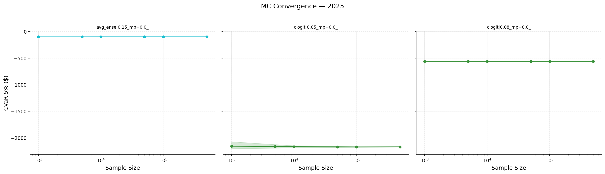

> CVaR-5% convergence by MC sample size. Estimates stabilize by N=10,000; production uses N=100,000.

---

## Parameter Sensitivity

### Fee Type

| Value | #Cfg | Mean P&L | Median P&L | % Prof |
| :--- | ---: | ---: | ---: | ---: |
| maker | 1764 | $8,333.31 | $7,772.17 | 100.0% |
| taker | 1764 | $7,730.37 | $7,320.80 | 100.0% |

The maker-taker difference is ~$600 at the mean — modest because BH makes so
few trades. Use maker (limit orders) where possible, but don't sacrifice
execution timing for fee savings.

### Kelly Fraction

| Value | #Cfg | Mean P&L | Median P&L | % Prof |
| :--- | ---: | ---: | ---: | ---: |
| 0.05 | 504 | $6,166.56 | $2,140.68 | 100.0% |
| 0.10 | 504 | $6,702.05 | $3,863.72 | 100.0% |
| 0.15 | 504 | $7,263.89 | $5,275.15 | 100.0% |
| 0.20 | 504 | $7,751.72 | $6,675.35 | 100.0% |
| 0.25 | 504 | $8,307.70 | $7,953.55 | 100.0% |
| 0.35 | 504 | $9,377.21 | $8,771.72 | 100.0% |
| 0.50 | 504 | $10,653.76 | $9,944.68 | 100.0% |

Monotonic increase in both mean and median. Higher fractions deploy more
capital per trade, which amplifies returns when the edge is real. The top
EV-optimal configs span kf=0.05 to kf=0.50, confirming that in BH the edge
threshold is the binding constraint (whether to trade), not the fraction (how
much). All fractions are 100% profitable.

### Edge Threshold

| Value | #Cfg | Mean P&L | Median P&L | % Prof |
| :--- | ---: | ---: | ---: | ---: |
| 0.04 | 504 | $7,482.52 | $6,949.30 | 100.0% |
| 0.05 | 504 | $7,539.45 | $6,970.09 | 100.0% |
| 0.06 | 504 | $7,709.81 | $6,943.41 | 100.0% |
| 0.08 | 504 | $7,936.57 | $7,406.64 | 100.0% |
| 0.10 | 504 | $8,008.79 | $7,250.08 | 100.0% |
| 0.12 | 504 | $8,569.93 | $8,604.24 | 100.0% |
| 0.15 | 504 | $8,975.82 | $8,747.18 | 100.0% |

Also monotonic — higher thresholds mean *fewer* trades but each trade has
higher conviction. edge=0.15 leads at both mean and median, and is selected by
every top EV config. Lower thresholds (0.04–0.06) trade too many
low-conviction entries, diluting returns with marginal bets. The fact that
100% of configs are profitable even at edge=0.04 confirms the edge is genuine;
the question is just how strictly to filter.

### Kelly Mode

| Value | #Cfg | Mean P&L | Median P&L | % Prof |
| :--- | ---: | ---: | ---: | ---: |
| independent | 1764 | $4,822.12 | $3,792.30 | 100.0% |
| multi_outcome | 1764 | $11,241.57 | $10,584.49 | 100.0% |

Multi-outcome Kelly produces **2.3&times; higher mean returns.** In
buy-and-hold, you fire a single bet per entry. Multi-outcome Kelly sizes
positions relative to the full probability simplex, concentrating capital on
the highest-edge nominees. Independent Kelly sizes each nominee in isolation,
leading to smaller bets and less capital deployment.

Both modes are 100% profitable at median, so the choice is primarily about
return magnitude vs worst-case exposure. Multi-outcome is the right default
unless you need conservative worst-case bounds.

### Trading Side

| Value | #Cfg | Mean P&L | Median P&L | % Prof |
| :--- | ---: | ---: | ---: | ---: |
| all | 1176 | $11,438.05 | $10,823.28 | 100.0% |
| no | 1176 | $5,055.92 | $4,474.68 | 100.0% |
| yes | 1176 | $7,601.55 | $8,839.28 | 100.0% |

Trading both YES and NO contracts (`all`) produces the highest mean return.
With binary contracts, buying YES on the winner and NO on likely losers are
complementary strategies. `all` captures both signal types, deploying more
capital across more contracts with different risk profiles. All three sides
are 100% profitable — the key differentiator is return magnitude.

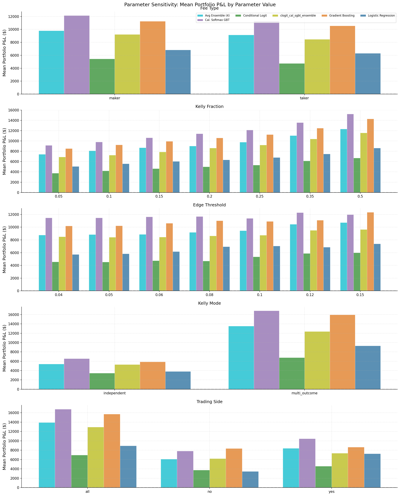

> Marginal parameter effects on portfolio P&L, averaged over all other parameters.

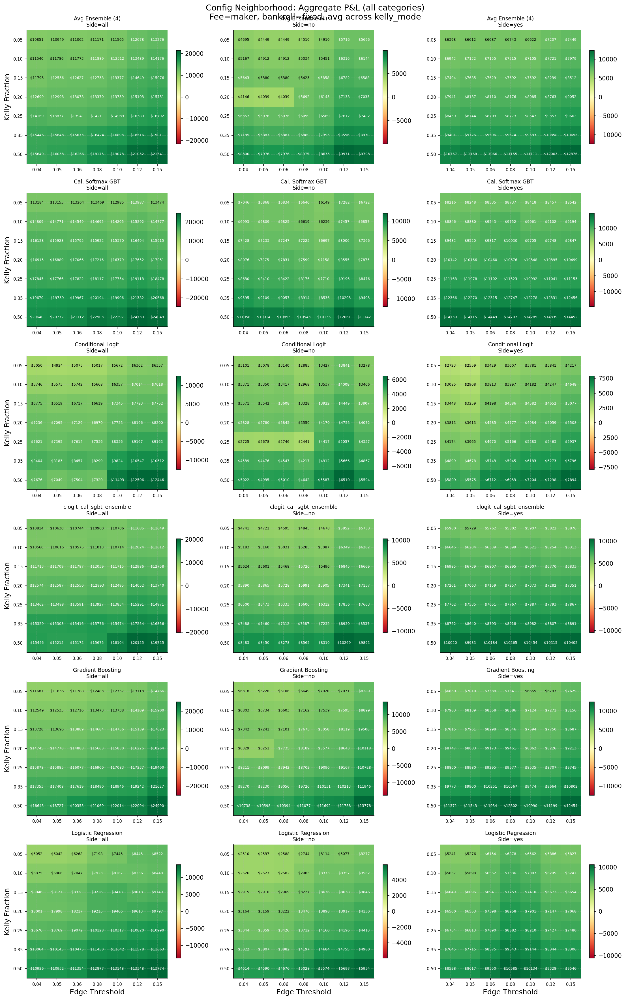

> Kelly fraction × edge threshold interaction. Warmer colors = higher mean P&L.

The config neighborhood heatmap shows that edge=0.15 is robustly positive
across all models and both trading sides. The green band at edge=0.15 extends
across all kelly fractions, confirming that the edge threshold — not the
position size — is the dominant parameter.

---

## Entry Timing

Each row shows the **marginal portfolio P&L** contributed by that entry point —
i.e., across all 9 categories, how much did entering at this snapshot add to
the total?

| Entry Snapshot | Events | #Cfg | Mean P&L | Median | Best | % Prof |
| :--- | :--- | ---: | ---: | ---: | ---: | ---: |
| 2025-01-23_oscar_noms | 2025-01-23_oscar_noms | 3528 | $536.07 | $336.63 | $3,538.85 | 83.5% |
| 2025-02-07_critics_choice | 2025-02-07_critics_choice | 3528 | $890.86 | $734.17 | $3,462.33 | 87.3% |
| 2025-02-08_annie | 2025-02-08_annie | 3528 | $2,095.43 | $1,630.32 | $5,326.60 | 99.7% |
| 2025-02-08_pga | 2025-02-08_pga | 3528 | $2,095.43 | $1,630.32 | $5,326.60 | 99.7% |
| 2025-02-08_dga | 2025-02-08_dga | 3528 | $2,095.43 | $1,630.32 | $5,326.60 | 99.7% |
| 2025-02-15_wga | 2025-02-15_wga | 3528 | $-23.17 | $-8.85 | $1,156.68 | 48.5% |
| 2025-02-16_bafta | 2025-02-16_bafta | 3528 | $662.82 | $448.75 | $2,582.12 | 92.0% |
| 2025-02-23_sag | 2025-02-23_sag | 3528 | $206.85 | $100.96 | $1,955.54 | 61.3% |
| 2025-02-23_asc | 2025-02-23_asc | 3528 | $206.85 | $100.96 | $1,955.54 | 61.3% |

**DGA/PGA/Annie (Feb 8) is by far the best entry** — mean +$2,095 and 99.7%
profitable. This is because:

1. **The DGA is the strongest directing precursor.** Sean Baker won the DGA,
   and our models incorporate this signal before the market fully prices it in.
   The 6-hour delay means we enter at ~1:30 AM after the ceremony ends,
   presumably before the market has had time to move.
2. **Three precursors fire simultaneously.** DGA + PGA + Annie provide
   correlated signals for directing, best_picture, and animated_feature — the
   three most profitable categories.
3. **Early enough for large payoffs.** There's still ~5 weeks to ceremony,
   so contracts on correct winners are still cheap (high upside).

**Oscar nominations (Jan 23) is now profitable** — mean +$536 and 83.5%
profitable (previously showed negative P&L due to the settlement universe
bug that defaulted missing-winner settlements to $0). With correct settlement
and price forward-fill, the models show genuine edge even at the earliest
entry, though returns are modest compared to later entries.

**Critics Choice (Feb 7) is the second-best** at +$891 mean and 87.3%
profitable. This precursor provides early signal before the DGA cluster.

**BAFTA (Feb 16) is a strong late entry** — 92.0% profitable with mean
+$663. By this point the market has incorporated most precursor information,
so the per-contract payoff is smaller, but the edge is more certain.

**WGA (Feb 15) is slightly negative** — mean −$23 and only 48.5% profitable.
The WGA ceremony doesn't inform our most profitable categories (directing,
best_picture, animated_feature).

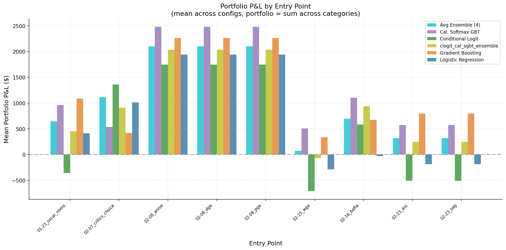

> Portfolio P&L by entry point. Later entries (post-DGA/PGA) tend to have higher mean returns.

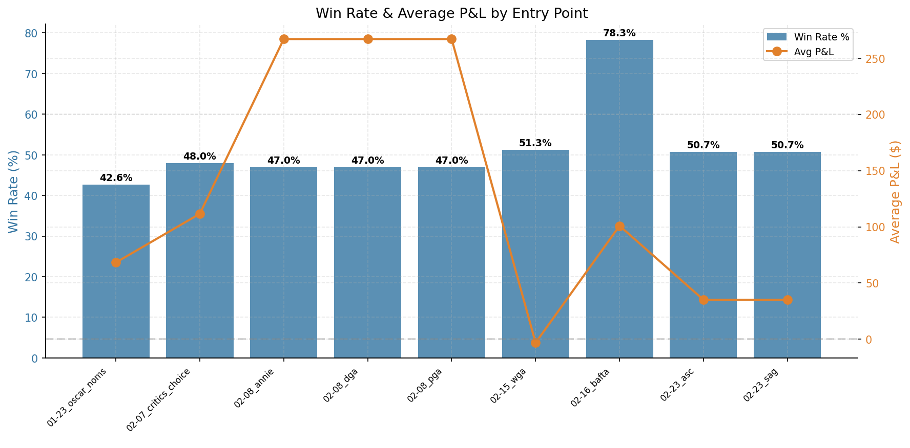

> Fraction of configs profitable at each entry point.

### Entry &times; Category Heatmap

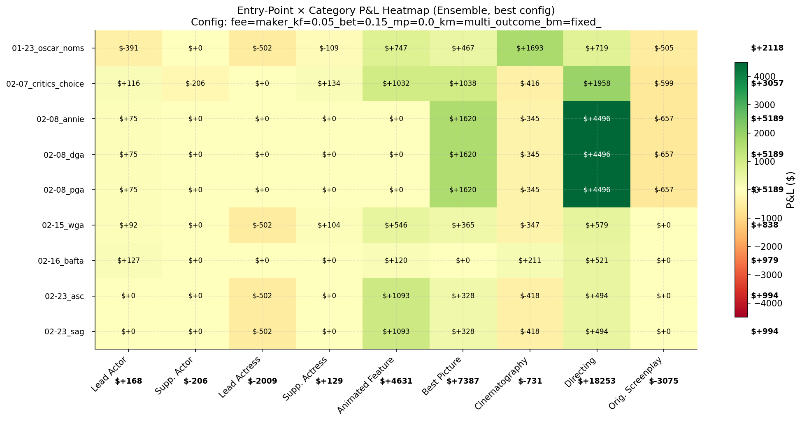

> Entry × category P&L heatmap. Directing dominates most entry points.

The heatmap reveals which entry &times; category combinations drive returns:

- **Directing + DGA entry (Feb 8):** The single brightest cell in the whole
  heatmap. The model's directing edge is strongest right after the DGA winner
  is announced.
- **Best Picture + Critics Choice (Feb 7):** Strong positive P&L from
  early identification of frontrunner status.
- **Animated Feature:** Profitable at late entries (SAG, BAFTA) when Flow's
  underdog signal becomes apparent.
- **Red zones:** actress_leading and original_screenplay are consistently
  negative regardless of entry timing — the model is simply wrong about these
  categories in 2025.

### Cumulative P&L by Entry

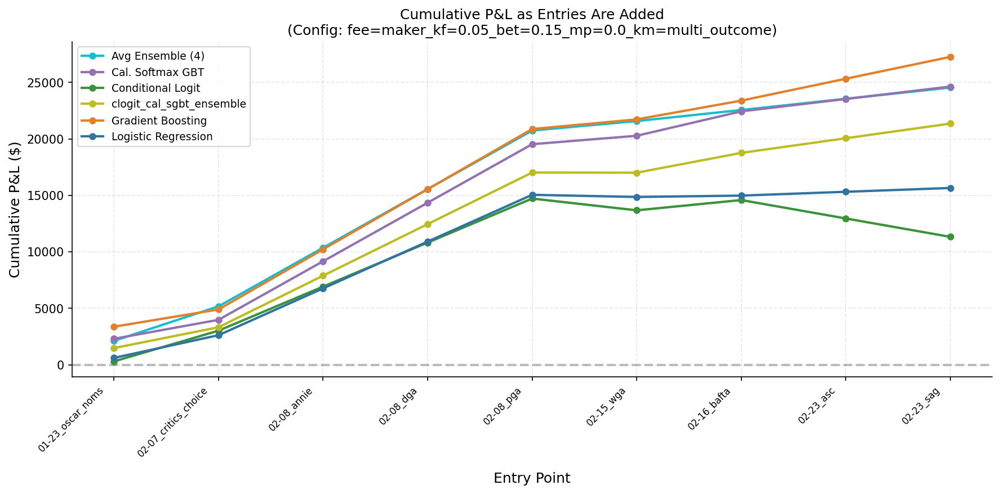

> Cumulative P&L across entry points. Steep jumps at DGA/PGA reflect strong precursor signals.

The cumulative P&L chart shows how returns accumulate as new entry points are
added. The steepest jump occurs at the DGA/PGA/Annie entry (entry #3),
adding ~$3,000–$5,000 depending on the model. Later entries contribute
marginally or sometimes negatively.

#### Marginal EV per Entry Point

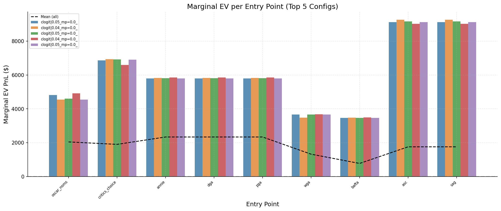

> Non-cumulative EV contribution per entry point for the top 5 configs. DGA/PGA entries provide the highest marginal EV.

#### Cumulative EV Envelope

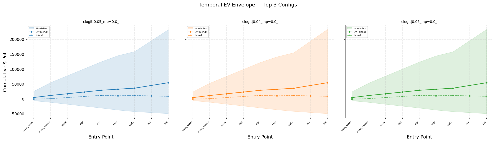

> Cumulative EV with worst-to-best-case bands for top 3 configs. Dashed line = actual realized P&L.

---

## Capital Deployment

How much of the $81,000 total bankroll (9 categories &times; 9 entries &times;
$1,000) is actually deployed?

### Per-Model Summary

| Model | Avg Deployed | Avg Bankroll | Util % | ROI Deployed | ROI Bankroll |
| :--- | ---: | ---: | ---: | ---: | ---: |
| avg_ens | $21,721.94 | $81,000.00 | 26.8% | 54.6% | 11.7% |
| cal_sgbt | $26,354.72 | $81,000.00 | 32.5% | 49.6% | 14.4% |
| clogit | $26,057.04 | $81,000.00 | 32.2% | 24.4% | 6.3% |
| clog_sgbt | $24,427.00 | $81,000.00 | 30.2% | 42.7% | 10.9% |
| gbt | $23,507.69 | $81,000.00 | 29.0% | 51.8% | 13.5% |
| lr | $19,587.54 | $81,000.00 | 24.2% | 45.9% | 8.1% |

> **Column legend:** **Avg Deployed** = mean capital spent on contracts across
> configs. **Avg Bankroll** = total budget (categories × entries × $1,000).
> **Util %** = deployed ÷ bankroll. **ROI Deployed** = P&L ÷ deployed capital
> (how efficiently deployed dollars generate returns). **ROI Bankroll** = P&L
> ÷ total bankroll (overall return on committed capital).

Only 24–33% of bankroll is deployed. The edge threshold is doing heavy
filtering — most entry × category × nominee combinations don't pass
the 4–15% edge bar, exactly as intended. ROI on deployed capital (24–55%) is
far more meaningful than ROI on total bankroll (6–14%), because the undeployed
capital was never at risk.

avg_ens has the highest deployed ROI (54.6%) despite not having the highest
P&L, because it deploys the *least* capital — its averaged probabilities are
more moderate, so fewer entries clear the edge threshold. When it does trade,
the edge is real.

### Per-Entry ROI

| Entry | #Active | Mean ROI | Median ROI |
| :--- | ---: | ---: | ---: |
| 2025-01-23_oscar_noms | 26446 | -22.1% | -11.4% |
| 2025-02-07_critics_choice | 27944 | 49.6% | -13.6% |
| 2025-02-08_annie | 27692 | 42.1% | -23.8% |
| 2025-02-08_dga | 27692 | 42.1% | -23.8% |
| 2025-02-08_pga | 27692 | 42.1% | -23.8% |
| 2025-02-15_wga | 25046 | -5.4% | 19.8% |
| 2025-02-16_bafta | 21098 | 23.0% | 24.4% |
| 2025-02-23_asc | 20258 | -8.2% | 14.7% |
| 2025-02-23_sag | 20258 | -8.2% | 14.7% |

The per-entry ROI table reveals an important nuance: entries with high mean ROI
often have negative median ROI (e.g., Critics Choice: mean 49.6%, median
&minus;13.6%). This is the right-skewed profile of edge-driven BH trading:
most individual trades lose money, but the winners more than compensate.

BAFTA stands out with both positive mean (23.0%) and positive median (24.4%)
ROI — the safest entry for individual-trade win rate.

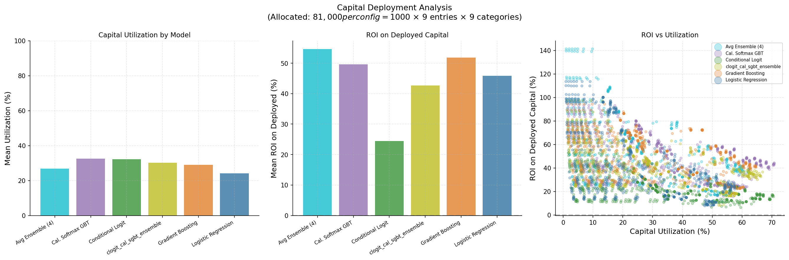

> Capital utilization and per-entry ROI by entry point.

---

## Where Does the Edge Come From?

### Category &times; Model P&L Matrix

Each cell shows the cherry-picked best-config P&L for that (model, category)
pair — the ceiling of what's achievable.

| Model | Actor Leadin | Actor Suppor | Actress Lead | Actress Supp | Animated Fea | Best Picture | Cinematograp | Directing | Original Scr | TOTAL |
| :--- | ---: | ---: | ---: | ---: | ---: | ---: | ---: | ---: | ---: | ---: |
| avg_ens | $1,005.25 | $0.00 | $0.00 | $808.11 | $6,216.36 | $7,537.28 | $610.80 | $18,569.30 | $-89.25 | $34,657.85 |
| cal_sgbt | $-3.23 | $0.00 | $-150.13 | $945.17 | $9,015.71 | $7,396.12 | $3,515.27 | $18,161.57 | $-109.87 | $38,770.61 |
| clogit | $501.33 | $95.88 | $-99.17 | $1,115.34 | $1,228.10 | $7,848.25 | $-315.73 | $19,775.24 | $-64.85 | $30,084.39 |
| clog_sgbt | $739.09 | $0.00 | $-110.04 | $1,049.21 | $6,339.68 | $7,360.36 | $-66.99 | $19,056.48 | $-82.25 | $34,285.54 |
| gbt | $310.80 | $75.44 | $116.80 | $440.97 | $7,501.21 | $7,074.08 | $2,911.91 | $17,692.98 | $-100.45 | $36,023.74 |
| lr | $1,076.34 | $0.00 | $-51.72 | $601.96 | $1,314.98 | $7,294.19 | $810.69 | $17,701.88 | $-136.09 | $28,612.23 |
| **TOTAL** | $3,629.58 | $171.32 | $-294.26 | $4,960.76 | $31,616.04 | $44,510.28 | $7,465.95 | $110,957.45 | $-582.76 | **$202,434.36** |

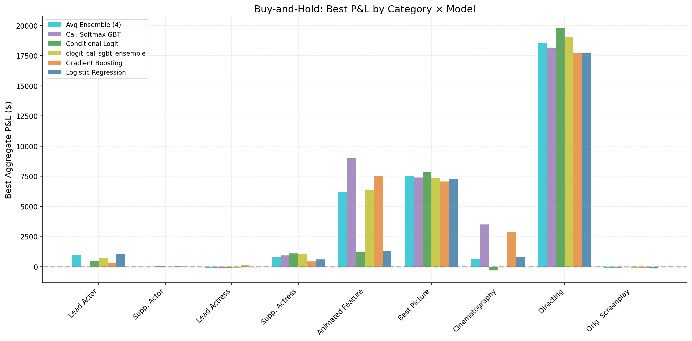

> P&L by category. Directing provides ~55% of total profits.

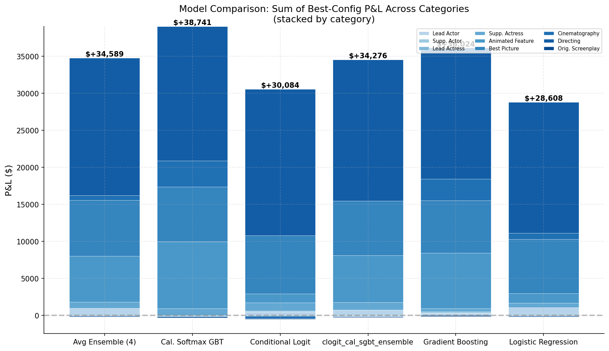

> Model comparison: total P&L across categories.

**Directing is the crown jewel** — $17,693 to $19,775 per model, accounting
for ~55% of total P&L. Sean Baker was consistently underpriced by the market
throughout the entire season. All models agree here, with a $2,082
spread. This is the strongest signal in the 2025 season.

**Best Picture is second** at $7,074–$7,848 per model, also with tight model
agreement (~$774 spread). Anora's frontrunner edge was real and sustained.

**Cinematography is notably more profitable after forward-fill** — the per-model
best-config range widened to $611–$3,515 (previously −$169 to $996, total
$7,466 vs $1,095). With correct price lookup for nominees missing from
snapshots, the model edge in this category is now properly captured.

**Animated Feature shows the widest model divergence** — from $1,228 (clogit)
to $9,016 (cal_sgbt). The tree-based models (cal_sgbt, gbt) identified Flow's
underdog opportunity early and with high confidence, while clogit distributes
probability more evenly across nominees. This is the category where model
choice matters most.

**Two categories are consistently weak:** actress_leading (&minus;$150 to
+$117) and original_screenplay (&minus;$136 to &minus;$65). The models
simply get the winner wrong in these categories in 2025. Losses are bounded
by position sizing — edge thresholds prevent large bets when model-market
divergence is minimal.

**Actress Supporting and Actor Leading** contribute moderate profits ($441–
$1,115 per model). Actor Supporting is near-zero — Culkin was a heavy favorite,
leaving little model edge to capture.

---

## Model vs Market Divergence

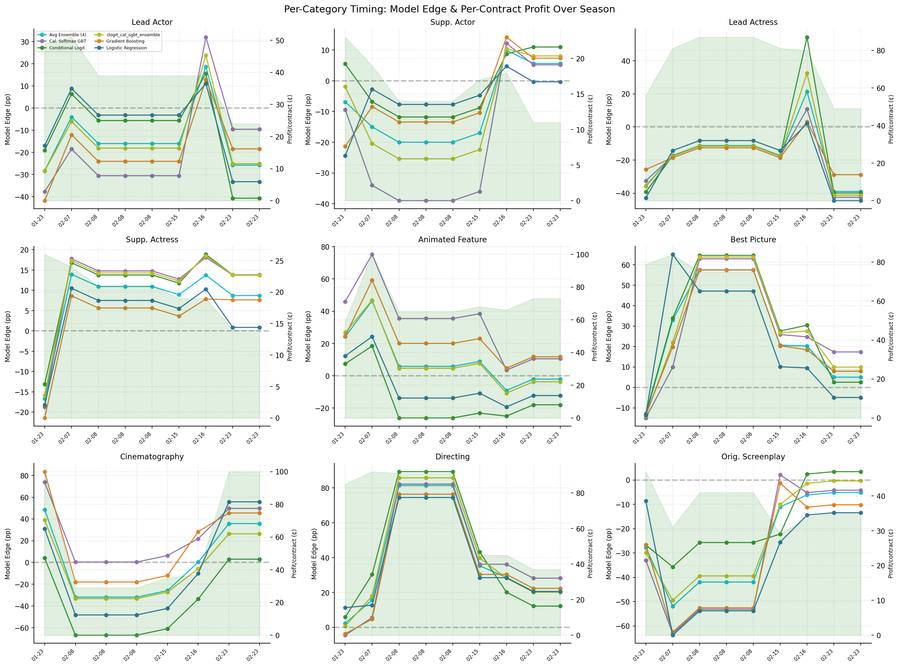

> Per-category model edge and per-contract profit over the season.

Each subplot shows model edge (model_prob &minus; market_prob) for the eventual
winner in each category, plotted over the six entry points. The green shaded
area represents per-contract profit (100 &minus; market_price).

**What this reveals:**
- **Directing:** All models have large, sustained edge (10–30 pp above market)
  from Feb 7 onward. The edge peaks at the DGA entry and slowly narrows as
  the market catches up. Even at the SAG entry (Feb 23), there's still 15+ pp
  edge remaining.
- **Best Picture:** Models agree early, with edge peaking around Critics Choice
  and declining steadily. The per-contract profit drops from ~40&cent; to
  ~15&cent; over the season.
- **Animated Feature:** Models disagree early, then converge on Flow after the
  Annie award. cal_sgbt and gbt catch it earliest.
- **Actress Leading:** Model edge is *negative* at most entry points — the
  models are wrong about the winner. This explains the consistent losses.

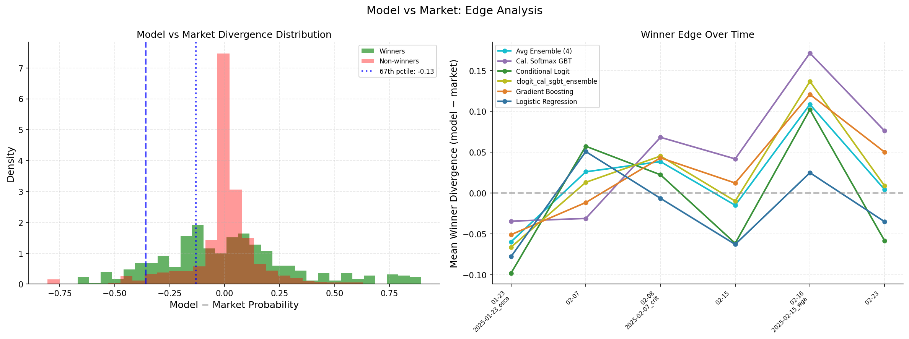

> Winner vs non-winner divergence distribution and mean winner divergence over time.

**Left panel (histogram):** The divergence distribution for winners (green)
vs non-winners (red) shows that winners tend to have *positive* model-market
divergence (model prices them higher than market). This is the signal we're
trading: buying contracts where the model says the probability is higher than
the market thinks.

**Right panel (time series):** Mean winner divergence over the season. All
models start with moderate positive divergence (~5–10 pp) that narrows as the
ceremony approaches. The divergence is largest at the DGA entry and smallest
at the SAG entry, consistent with the entry timing analysis above.

The fact that divergence is consistently positive for winners across all models
and all time points validates the core trading thesis: our models have genuine
predictive edge over market prices.

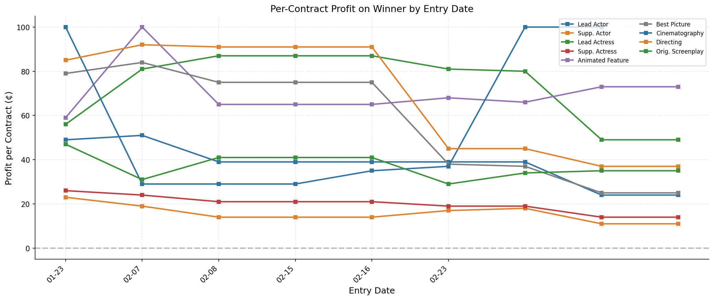

> Per-contract profit by entry date, independent of model.

Per-contract profit by entry date (model-independent, purely from market
pricing): the highest payoff is always at the earliest entry because the
market hasn't converged yet. But combining this with the model edge chart
above, the *risk-adjusted* best entry is the DGA window — not the earliest
possible.

---

## Key Takeaways

1. **100% of portfolio configs are profitable** across all 6 models. This is
   the strongest possible signal that the edge is real — even the worst config
   choice makes money at the portfolio level.

2. **Directing alone accounts for ~55% of total P&L.** The Sean Baker
   underpricing was the single biggest opportunity in 2025. Without directing,
   portfolio P&L drops by roughly half — still profitable, but concentrated.

3. **The DGA/PGA/Annie entry (Feb 8) is optimal** — mean +$2,095 and 99.7%
   profitable. Three precursors firing simultaneously for the three most
   profitable categories creates a unique information advantage.

4. **clogit dominates the EV frontier.** All top-15 configs by expected value
   use clogit with multi_outcome Kelly and side=all. Maximum EV is $6,051 per
   entry with 67% capital deployment.

5. **multi_outcome Kelly produces 2.3&times; higher returns** than independent
   Kelly by concentrating capital on the highest-edge nominees in each
   category. Both modes are 100% profitable.

6. **The conservative→aggressive EV frontier** follows the pattern:
   independent Kelly/YES-only → multi_outcome → side=all. At L=10% risk
   budget, best EV is $1,828; at L=50%, it reaches $5,870.

7. **Only 24–33% of bankroll is deployed.** ROI on deployed capital (24–55%)
   is the more meaningful metric. The edge threshold aggressively filters
   trades, which is the right behavior.

8. **Model choice matters less than config choice.** All 6 models produce
   portfolio-level profits, though mean P&L varies ~2× across models. Config
   choice (edge, kelly mode, trading side) swings returns from ~$1,300 to
   $27,400.

9. **Two categories are weak in 2025:** actress_leading and
   original_screenplay show consistent losses. These should be excluded from
   live trading unless 2026 models show clear edge improvements.

10. **Fee sensitivity is minimal** — maker beats taker by ~$600 at the mean.
    With ~90 trades per portfolio, the per-trade fee difference barely matters.

---

## How to Run

```bash
cd "$(git rev-parse --show-toplevel)"

# Full pipeline (backtests + scoring + analysis)
bash oscar_prediction_market/one_offs/\
d20260225_buy_hold_backtest/run.sh 2>&1 \
  | tee storage/d20260225_buy_hold_backtest/run.log

# Or run individual steps:

# Step 1: Backtests only
bash oscar_prediction_market/one_offs/\
d20260225_buy_hold_backtest/run_backtests.sh

# Step 2: EV + CVaR scoring
bash oscar_prediction_market/one_offs/\
d20260225_buy_hold_backtest/run_scoring.sh

# Step 3: Plots, tables, asset sync
bash oscar_prediction_market/one_offs/\
d20260225_buy_hold_backtest/run_analysis.sh
```

## Output Structure

```
storage/d20260225_buy_hold_backtest/
├── 2025/
│   ├── results/
│   │   ├── entry_pnl.csv            # Per (entry, cat, model, config) P&L
│   │   ├── aggregate_pnl.csv        # Summed across entries
│   │   ├── model_accuracy.csv       # Per-snapshot model accuracy
│   │   ├── model_vs_market.csv      # Model vs market divergence
│   │   ├── parameter_sensitivity.csv
│   │   ├── risk_profile.csv
│   │   ├── scenario_pnl.csv         # Scenario-weighted P&L for EV scoring
│   │   ├── pareto_frontier_worst.csv
│   │   ├── pareto_frontier_cvar.csv
│   │   └── pareto_frontier_blend.csv
│   └── plots/
│       ├── pnl_by_category.png
│       ├── risk_profile.png
│       ├── parameter_sensitivity.png
│       ├── portfolio_pnl_by_entry.png
│       ├── portfolio_capital_deployment.png
│       ├── model_comparison.png
│       ├── config_neighborhood_heatmap.png
│       ├── win_rate_by_entry.png
│       ├── entry_category_heatmap.png
│       ├── cumulative_pnl_by_entry.png
│       ├── per_category_timing.png
│       ├── entry_date_profit.png
│       ├── model_vs_market_divergence.png
│       └── scenario/
│           ├── pareto_frontier.png
│           ├── cvar_pareto.png
│           ├── pareto_comparison.png
│           ├── mc_convergence.png
│           ├── temporal_marginal_ev.png
│           └── temporal_envelope.png
└── run.log
```
