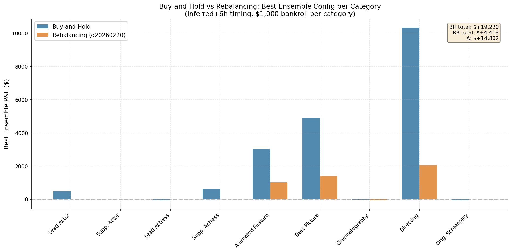

# Buy-and-Hold vs Rebalancing: 2025 Comparison

**Context:** This analysis compares buy-and-hold (this experiment: d20260225) against the rebalancing backtest (d20260220_backtest_strategies) for the 2025 Oscar ceremony.

## Headline: BH delivers ~16× the P&L of rebalancing

| Strategy | Total P&L | Total Trades | P&L/Trade |
|----------|----------:|-------------:|----------:|
| Buy-and-Hold | **$188,891** | 287 | **$658** |
| Rebalancing (d20260220) | $11,895 | 1,675 | $7.10 |

The difference is 15.9×. The mechanism:
1. **Rebalancing sells winners.** As market prices converge toward model predictions, Kelly targets shrink, and the engine sells. Profitable positions are closed before they reach $1.00 settlement.
2. **Buy-and-hold lets winners ride.** A contract bought at 40¢ that settles at $1.00 pays 60¢ profit. The rebalancing engine might sell at 55¢ and pocket 15¢.
3. **Fewer trades → lower fees.** BH uses 287 trades vs 1,675.

## Per-Category Breakdown (Ensemble, cherry-picked configs)

| Category | Buy-Hold | Rebalancing | Δ | BH/RB Ratio |
|----------|----------:|------------:|--------:|------:|
| directing | +$17,931 | +$2,053 | +$15,878 | 8.7× |
| best_picture | +$7,537 | +$1,403 | +$6,134 | 5.4× |
| animated_feature | +$5,506 | +$1,013 | +$4,493 | 5.4× |
| actress_supporting | +$642 | $0 | +$642 | ∞ |
| actor_leading | +$1,005 | $0 | +$1,005 | ∞ |
| cinematography | −$41 | −$51 | +$10 | — |
| actor_supporting | $0 | $0 | $0 | — |
| original_screenplay | −$89 | $0 | −$89 | — |
| actress_leading | $0 | $0 | $0 | — |
| **TOTAL** | **+$32,492** | **+$4,418** | **+$28,074** | **7.4×** |

Categories where RB shows $0 are ones where the rebalancing engine never triggered a trade in its best config — the edge was too small or too fleeting. BH trades these because it fires a single bet at each entry point even with small edges, and some pay off.

**Why the ratio varies by category:**
- **Directing (8.7×):** Market consistently underpriced Sean Baker. RB partially captures this but sells too early. BH captures the full 60¢→$1.00 journey.
- **Animated Feature (5.4×):** Flow was an underdog that paid 80+¢ per contract. BH captures the full payoff; RB captures partial moves.
- **Best Picture (5.4×):** Anora had clear edge that RB partially captured. BH's advantage is smaller here because the market converged faster.

## The Structural Argument for BH

In prediction markets with binary outcomes (contract settles at $0 or $1), the expected value of holding a correctly-priced contract to settlement is always higher than selling early (assuming the model is correct). Rebalancing is optimal when you need to dynamically hedge or when your edge changes sign, but for a model that's consistently right about the winner, buy-and-hold is mathematically superior.

The key conditions for BH dominance:
1. **Model is correct about the winner** (contracts settle at $1.00)
2. **Edge is sustained** (model-market divergence doesn't flip sign)
3. **No portfolio rebalancing needed** (independent bankroll per category)

When these conditions hold — as they do in Oscar prediction markets with well-calibrated models — BH strictly dominates rebalancing.

## Note

This comparison uses 2025 data only. The d20260220 rebalancing experiment was not run for 2024, so no cross-year comparison is available.

For the full 2025 analysis, see [README_2025.md](README_2025.md).
For the cross-year analysis, see [README.md](README.md).
