# Config Selection Sweep

**Storage:** `storage/d20260305_config_selection_sweep/`

Targeted parameter sweep for systematic model and config selection, using
refactored upstream code (post-renormalization removal).

The d20260225 analysis revealed that **fee_type=taker, kelly_mode=multi_outcome,
allowed_directions=all** consistently dominate — no need to sweep them. This
experiment re-runs backtests with a targeted grid: 27 configs × 6 models = 162
total (vs 3,528 in the full grid), with finer edge threshold resolution (9
values from 0.02 to 0.25).

### Targeted Grid

**Fixed Parameters:**

| Parameter | Value | Justification |
|---|---|---|
| fee_type | taker | Conservative — realistic worst-case fees |
| kelly_mode | multi_outcome | Consistently outperforms independent |
| allowed_directions | all | Consistently outperforms yes-only/no-only |

**Swept Parameters:**

| Parameter | Values | Count |
|---|---|---|
| edge_threshold | 0.02, 0.04, 0.06, 0.08, 0.10, 0.12, 0.15, 0.20, 0.25 | 9 |
| kelly_fraction | 0.05, 0.15, 0.25 | 3 |

**Total: 27 configs per model × 6 models = 162 per year.**

---

## Table of Contents

1. [How Reliable Is This Backtest?](#1-how-reliable-is-this-backtest)
2. [Which Model?](#2-which-model)
3. [Which Config?](#3-which-config)
4. [Why Not EV or CVaR for Config Selection?](#4-why-not-ev-or-cvar-for-config-selection)
5. [How to Run](#how-to-run)
6. [Output Structure](#output-structure)

---

## 1. How Reliable Is This Backtest?

With only 2 ceremony years (2024, 2025), how much can we trust these results
for model and config selection? This section quantifies the uncertainty.

### Effective sample size is small

| | 2024 | 2025 | Total |
|---|---|---|---|
| Categories | 8 | 9 | 17 |
| Entry snapshots | 7 | 9 | 16 |
| Raw scenarios (year × cat × entry) | 56 | 81 | **137** |
| **Effective independent scenarios** | | | **≈ 5** |

The 137 raw scenarios collapse to ~5 effective independent observations via
eigenvalue analysis of the scenario correlation matrix. The 27:1 compression
ratio arises because entry points within the same (year, category) are highly
correlated — they see nearly identical market conditions and produce similar
PnL outcomes.

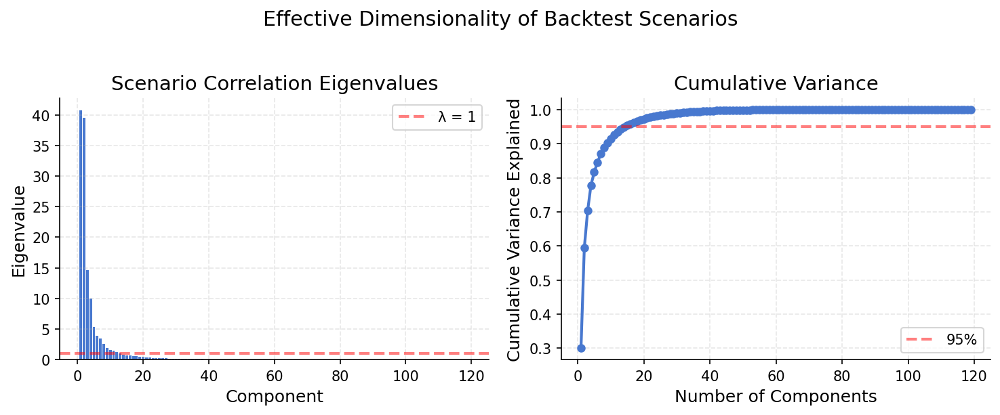

### Correlation structure

| Relationship | N pairs | Mean ρ | Median ρ |
|---|---:|---:|---:|
| Same year, same category | 481 | 0.464 | 0.572 |
| Same year, diff category | 4,190 | 0.034 | 0.024 |
| Cross year, same category | 486 | -0.040 | 0.010 |
| Cross year, diff category | 3,888 | 0.106 | 0.086 |

Entry points within the same (year, category) correlate at ρ = 0.464 — they
behave almost like a single observation with some noise, not 7–9 independent
trials. Cross-year same-category ρ ≈ 0 means a category's 2024 outcome tells
you little about its 2025 outcome.

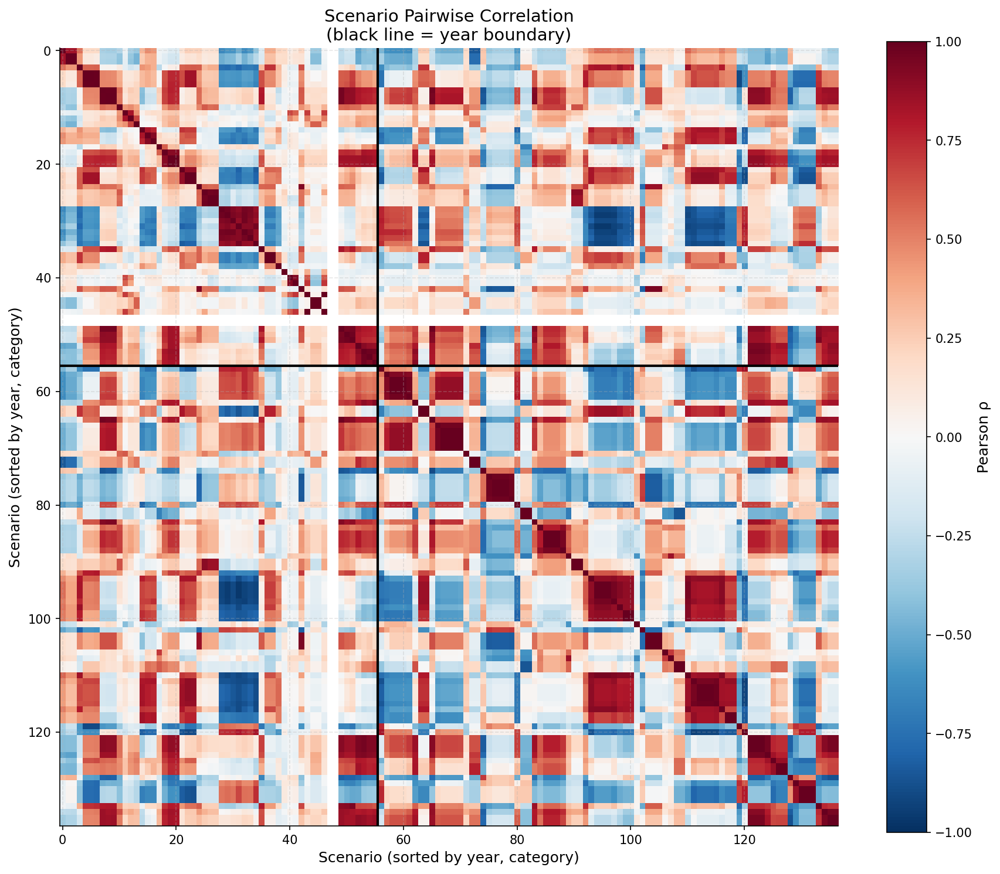

### Model rankings are unstable across years

| Model | 2024 PnL | Rank '24 | 2025 PnL | Rank '25 |
|---|---:|---:|---:|---:|
| avg_ensemble | $692 | 2 | $2,727 | 2 |
| Cal-SGBT | $257 | 4 | $2,997 | 1 |
| clogit_cal_sgbt_ensemble | $859 | 1 | $2,184 | 5 |
| Clogit | $590 | 3 | $1,525 | 6 |
| Binary LR | $-378 | 5 | $2,222 | 4 |
| Binary GBT | $-903 | 6 | $2,455 | 3 |

**Kendall τ = -0.067** (p = 1.000) using mean PnL across all configs. Model
rankings essentially randomize between years.

### Leave-one-year-out: the hardest test

Pick the best model+config using one year's data, see how it performs on the other:

| Train | Test | Selected | Train PnL | Test PnL | Test Rank | Best Test | Best PnL |
|---|---|---|---:|---:|---|---|---:|
| 2024 | 2025 | Clogit | $916 | $862 | 151/162 | Cal-SGBT | $3,013 |
| 2025 | 2024 | Cal-SGBT | $3,013 | $206 | 86/162 | Clogit | $916 |

The best model on 2024 data (Clogit) ranks 151/162 on 2025. This is a stark
illustration of how unreliable single-year model selection is.

### What can we trust?

| Question | Answer | Confidence |
|---|---|---|
| Is avg_ensemble or cal_sgbt the best model? | Almost certainly one of these two | **High** (98% bootstrap) |
| Which of the two is better? | Too close to call with 2 years | **Low** |
| Is edge ≥ 0.15 better than edge = 0.04? | Yes, higher edge consistently better | **Moderate** |
| Is the exact best config (e.g., e0.20/k0.15) optimal? | Could easily be e0.15 or e0.25 | **Low** |
| Can we use EV or CVaR for config selection? | No — EV anti-correlates with actual PnL | **High** (structural) |

**Bottom line:** Two years is enough to identify the right *tier* of model+config
(ensemble models, moderate-to-high edge threshold) but not enough to pinpoint the
single optimal choice. Decisions should be robust to this uncertainty — choose
configs where the cost of being slightly wrong is small.

*Reproducible via:* `uv run python -m ...d20260305_config_selection_sweep.reliability_analysis`

---

## 2. Which Model?

### Model Scorecard

All key model-selection signals consolidated into one table.

| Model | Both % | Mean Comb. | Best Comb. | Inflation | EV↔Act ρ | Yr↔Yr ρ | Yr Balance | CVaR-5% |
| --- | --- | --- | --- | --- | --- | --- | --- | --- |
| avg_ensemble | 100% | $2,810 | $3,419 | 1.10x | -0.893 | +0.862 | 0.27 | $-1,574 |
| Cal-SGBT | 100% | $2,794 | $3,254 | 1.63x | -0.813 | +0.524 | 0.06 | $-1,762 |
| clogit_cal_sgbt_ensemble | 100% | $2,559 | $3,043 | 1.50x | -0.895 | +0.819 | 0.33 | $-1,699 |
| Clogit | 100% | $1,847 | $2,115 | 3.80x | -0.793 | -0.281 | 0.77 | $-1,866 |
| Binary LR | 0% | $1,643 | $1,844 | 1.84x | -0.870 | -0.515 | -0.09 | $-1,678 |
| Binary GBT | 0% | $892 | $1,552 | 3.60x | -0.574 | -0.848 | -0.47 | $-1,906 |

**Reading the scorecard:**
- **Both %**: % of 27 configs profitable in both years. 100% = robust to config choice.
- **Mean/Best Comb.**: average and ceiling combined (2024+2025) actual P&L across all configs.
- **Inflation**: mean(EV) / mean(actual). Lower = model's EV is more honest. 1.0 = perfect.
- **EV↔Act ρ**: Spearman correlation between EV and actual P&L across configs *within*
  this model. Negative means EV is anti-correlated with actual — higher-EV configs
  perform worse. This is a reversal from the d20260225 full grid because the targeted
  grid only varies edge/KF (see §4 for explanation).
- **Yr↔Yr ρ**: cross-year rank correlation of actual P&L. Higher = config rankings
  transfer better across years.
- **Yr Balance**: mean 2024 actual / mean 2025 actual. Closer to 1.0 = less dependent
  on one year.
- **CVaR-5%**: mean P&L in the worst 5% of MC scenarios at the model's best actual
  config. More negative = worse tail risk. Caveated by model overconfidence.

**Key observations from the scorecard:**
- **No model dominates all dimensions.** avg_ensemble is most balanced (lowest inflation,
  highest year balance, good cross-year ρ).
- **EV↔actual is negative for all models** in the targeted grid. This does NOT mean EV
  is broken — within a fixed-structure grid (only edge/KF varying), lower edge
  thresholds inflate EV while degrading actual returns (see §4).
- **Cross-year ρ is the best discriminator**: avg_ens (+0.862) and clog_sgbt (+0.819)
  have positive cross-year correlation — their good configs stay good. gbt (-0.848) and
  lr (-0.515) show anti-correlation — classic overfitting.

### Model profitability tiers

Four models achieve 100% both-year profitability across all 27 configs;
two (gbt, lr) fail to profit in 2024 under any config:

| Model | Both-Year Profitable | Mean Combined P&L | Best Combined P&L | Spearman ρ (2024↔2025) |
|---|---:|---:|---:|---:|
| cal_sgbt | 27/27 (100%) | $24,832 | $28,772 | 0.524 |
| avg_ens | 27/27 (100%) | $24,106 | $29,389 | 0.862 |
| clog_sgbt | 27/27 (100%) | $21,760 | $25,670 | 0.819 |
| clogit | 27/27 (100%) | $15,016 | $17,853 | -0.281 |
| lr | 0/27 (0%) | $15,102 | $17,353 | -0.515 |
| gbt | 0/27 (0%) | $9,633 | $15,772 | -0.848 |

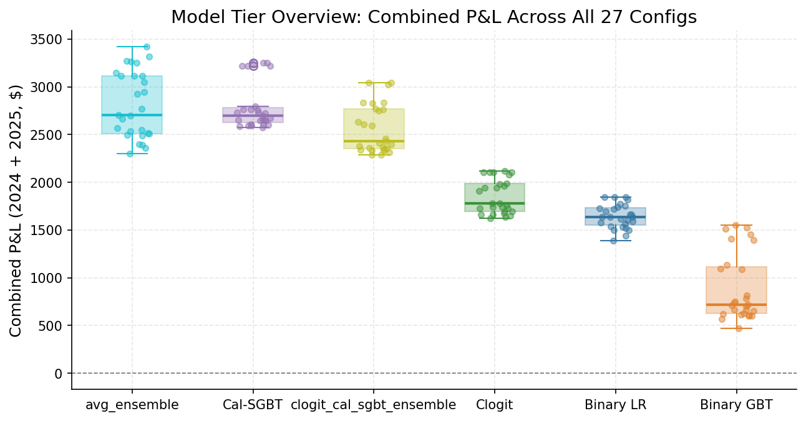

**Takeaway:** The model "tier" (avg_ens, cal_sgbt, clog_sgbt >> clogit >> lr >> gbt) is
the dominant factor. All 4 top-tier models profit under every config in the
targeted grid — config choice is secondary once the right model is chosen.

### Fixed-config comparison: model tier holds at any config

All 6 models at identical configs — isolating model quality from config tuning.

**edge=0.10, KF=0.15 (moderate):**

| Model | P&L '24 | P&L '25 | Combined | EV |
|---|---:|---:|---:|---:|
| avg_ensemble | $615 | $2,088 | $2,703 | $3,371 |
| Cal-SGBT | $132 | $2,462 | $2,594 | $4,759 |
| clog_sgbt | $574 | $1,822 | $2,396 | $4,137 |
| Clogit | $828 | $934 | $1,761 | $7,196 |
| Binary LR | $-70 | $1,795 | $1,725 | $2,969 |
| Binary GBT | $-828 | $1,397 | $569 | $3,513 |

**edge=0.15, KF=0.15 (recommended-mid):**

| Model | P&L '24 | P&L '25 | Combined | EV |
|---|---:|---:|---:|---:|
| avg_ensemble | $714 | $2,401 | $3,115 | $3,188 |
| Cal-SGBT | $154 | $2,570 | $2,724 | $4,585 |
| clog_sgbt | $720 | $2,028 | $2,747 | $3,879 |
| Clogit | $910 | $1,074 | $1,984 | $7,050 |
| Binary LR | $-189 | $1,945 | $1,756 | $2,920 |
| Binary GBT | $-952 | $2,087 | $1,135 | $3,309 |

**edge=0.20, KF=0.15 (recommended):**

| Model | P&L '24 | P&L '25 | Combined | EV |
|---|---:|---:|---:|---:|
| avg_ensemble | $694 | $2,579 | $3,272 | $2,638 |
| Cal-SGBT | $206 | $3,010 | $3,216 | $3,920 |
| clog_sgbt | $859 | $2,184 | $3,043 | $3,297 |
| Clogit | $588 | $1,514 | $2,102 | $6,684 |
| Binary LR | $-342 | $2,004 | $1,662 | $2,884 |
| Binary GBT | $-859 | $2,313 | $1,454 | $2,598 |

**edge=0.20, KF=0.05 (conservative):**

| Model | P&L '24 | P&L '25 | Combined | EV |
|---|---:|---:|---:|---:|
| avg_ensemble | $692 | $2,727 | $3,419 | $2,584 |
| Cal-SGBT | $206 | $3,013 | $3,219 | $4,132 |
| clog_sgbt | $859 | $2,183 | $3,042 | $3,300 |
| Clogit | $567 | $1,512 | $2,079 | $6,671 |
| Binary LR | $-342 | $1,980 | $1,637 | $2,894 |
| Binary GBT | $-896 | $2,303 | $1,407 | $2,630 |

**edge=0.25, KF=0.15 (aggressive-edge):**

| Model | P&L '24 | P&L '25 | Combined | EV |
|---|---:|---:|---:|---:|
| avg_ensemble | $650 | $2,462 | $3,112 | $2,067 |
| Cal-SGBT | $254 | $2,990 | $3,244 | $3,610 |
| clog_sgbt | $791 | $2,041 | $2,832 | $2,846 |
| Clogit | $590 | $1,516 | $2,106 | $6,019 |
| Binary LR | $-378 | $2,222 | $1,844 | $2,692 |
| Binary GBT | $-903 | $2,455 | $1,552 | $2,435 |

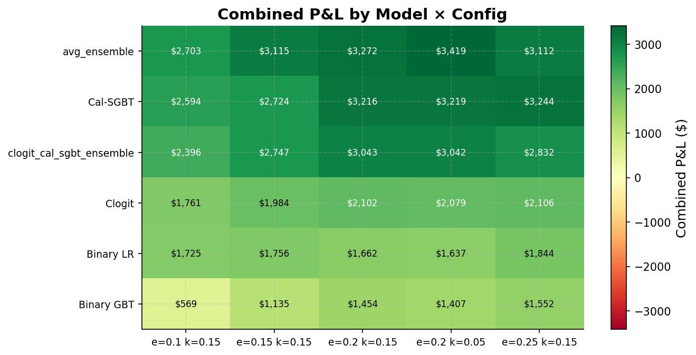

Model ranking is remarkably stable across configs. avg_ens and Cal-SGBT swap
top spots, but both consistently outperform the rest. The model tier holds
regardless of config.

### Bootstrap model ranking

Bootstrap ranking (5,000 samples) using each model's best config. Resamples
categories and entry points independently.

**Category Bootstrap** (resamples which categories are included):

| Model | Mean Rank | Median Rank | % Rank 1 | % Top 2 | % Top 3 |
| --- | --- | --- | --- | --- | --- |
| avg_ensemble | 1.74 | 2 | 43.1% | 84.0% | 99.1% |
| Cal-SGBT | 2.17 | 2 | 38.1% | 65.2% | 81.7% |
| clogit_cal_sgbt_ensemble | 2.97 | 3 | 4.7% | 29.2% | 74.2% |
| Clogit | 4.54 | 5 | 7.9% | 10.5% | 18.2% |
| Binary LR | 4.58 | 5 | 6.3% | 10.3% | 16.5% |
| Binary GBT | 5.00 | 5 | 0.0% | 0.8% | 10.3% |

**Entry-Point Bootstrap** (resamples which entry snapshots are included):

| Model | Mean Rank | Median Rank | % Rank 1 | % Top 2 | % Top 3 |
| --- | --- | --- | --- | --- | --- |
| avg_ensemble | 1.46 | 1 | 55.5% | 98.1% | 100.0% |
| Cal-SGBT | 1.85 | 2 | 40.5% | 76.7% | 98.0% |
| clogit_cal_sgbt_ensemble | 2.75 | 3 | 4.0% | 24.9% | 96.7% |
| Clogit | 4.79 | 5 | 0.0% | 0.0% | 1.4% |
| Binary LR | 4.85 | 5 | 0.0% | 0.2% | 1.7% |
| Binary GBT | 5.30 | 6 | 0.0% | 0.0% | 2.2% |

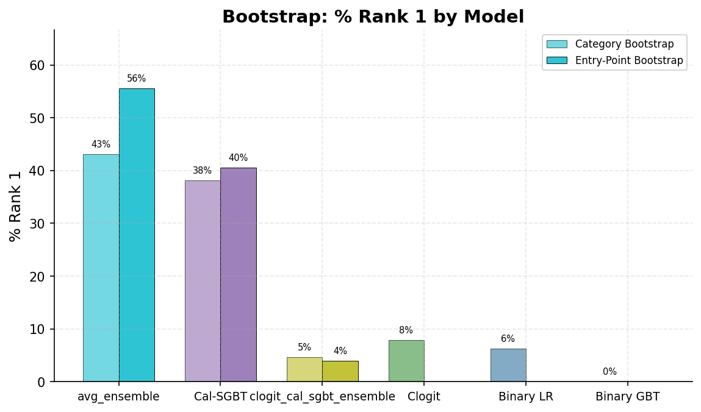

**Takeaway:** Clear 3-tier structure. Tier 1: avg_ensemble + Cal-SGBT (>98% top-3).
Tier 2: clogit_cal_sgbt_ensemble (~75-97% top-3). Tier 3: Clogit, LR, GBT (<18% top-3).
Entry-point bootstrap shows sharper separation because individual entry points have
less variance than categories.

### Per-category model specialization

No single model is best everywhere. Bootstrap over entry points within each
category reveals specialization:

| Category | Most Frequent #1 (%) | Runner-Up (%) | Total P&L (winner) |
|---|---|---:|---|
| Actor Leading | avg_ensemble (58%) | clog_sgbt (38%) | $-1,722 |
| Actor Supporting | avg_ensemble (100%) | — | $0 |
| Actress Leading | Binary LR (98%) | Cal-SGBT (2%) | $9,237 |
| Actress Supporting | avg_ensemble (100%) | — | $0 |
| Animated Feature | Binary GBT (51%) | avg_ensemble (25%) | $4,901 |
| Best Picture | clog_sgbt (42%) | Binary LR (30%) | $6,419 |
| Cinematography | Cal-SGBT (98%) | Binary GBT (2%) | $2,562 |
| Directing | Clogit (81%) | Cal-SGBT (16%) | $18,729 |
| Original Screenplay | Clogit (99%) | clog_sgbt (1%) | $3,533 |

**Per-category takeaways:**
- **avg_ensemble wins by not losing.** It's #1 in Actor Supporting/Actress Supporting
  (100%) because it correctly avoids trading. In other categories it's competitive but
  rarely the outright best.
- **Clogit dominates Directing (81%) and Original Screenplay (99%)** — categories where
  conditional logit's structure (ranking nominees within a race) best matches the problem.
- **Binary LR owns Actress Leading (98%)** — probably the most predictable category where
  a simple model suffices.
- **Best Picture is the most contested** — 4 models share the #1 ranking, with
  clog_sgbt (42%) and Binary LR (30%) leading.
- **Category specialization suggests model stacking** by category, but this adds
  overfitting risk with only 2 years of data.

### Category-level P&L breakdown

P&L by category, using each model's best config.

**2024:**

| Model | ActorL | ActorS | ActrL | ActrS | AnimFeat | BestPic | Direct | OrigScr | Total |
|---|---:|---:|---:|---:|---:|---:|---:|---:|---:|
| avg_ens | -2,337 | 0 | 4,072 | 0 | 0 | -262 | 0 | 3,374 | 4,847 |
| Cal-SGBT | -1,349 | 0 | 4,755 | 0 | -4,811 | 0 | 0 | 3,202 | 1,797 |
| clog_sgbt | -1,571 | 0 | 3,793 | 0 | 0 | -295 | 0 | 4,088 | 6,015 |
| Clogit | -2,916 | 0 | 2,594 | -1,285 | 1,707 | 0 | 0 | 4,029 | 4,129 |
| LR | -3,153 | -1,448 | 3,421 | -542 | 0 | -528 | -301 | -93 | -2,645 |
| GBT | -2,572 | -1,504 | 2,597 | -553 | -3,075 | -451 | 0 | -765 | -6,324 |

**2025:**

| Model | ActorL | ActorS | ActrL | ActrS | AnimFeat | BestPic | Cine | Direct | OrigScr | Total |
|---|---:|---:|---:|---:|---:|---:|---:|---:|---:|---:|
| avg_ens | 615 | 0 | -511 | 0 | 3,698 | 6,296 | 237 | 17,353 | -3,146 | 24,542 |
| Cal-SGBT | -2,005 | -1,978 | 0 | 0 | 8,784 | 6,287 | 2,562 | 17,204 | -3,880 | 26,975 |
| clog_sgbt | -229 | -279 | -1,063 | 0 | 1,601 | 6,714 | -1,875 | 17,666 | -2,882 | 19,654 |
| Clogit | -225 | 0 | -40 | -252 | -2,539 | 5,692 | -7,146 | 18,729 | -496 | 13,724 |
| LR | -30 | -2,694 | 5,816 | -526 | 155 | 6,545 | -3,214 | 17,061 | -3,116 | 19,997 |
| GBT | -1,743 | -2,715 | 604 | -526 | 7,976 | 5,629 | 1,059 | 16,312 | -4,502 | 22,096 |

Category-level variation is large. Some models capture specific categories better
while others lose on the same category.

### Pairwise bootstrap win rates

P(row beats column) under category bootstrap (5,000 samples):

| | avg_ensemble | Cal-SGBT | clog_sgbt | Clogit | Binary LR | Binary GBT |
| --- | ---: | ---: | ---: | ---: | ---: | ---: |
| avg_ensemble | — | **57%** | **89%** | **90%** | **91%** | **99%** |
| Cal-SGBT | 43% | — | **67%** | **82%** | **91%** | **100%** |
| clog_sgbt | 11% | 33% | — | **90%** | **82%** | **87%** |
| Clogit | 10% | 18% | 10% | — | **52%** | **56%** |
| Binary LR | 9% | 9% | 18% | 48% | — | **58%** |
| Binary GBT | 1% | 0% | 13% | 44% | 42% | — |

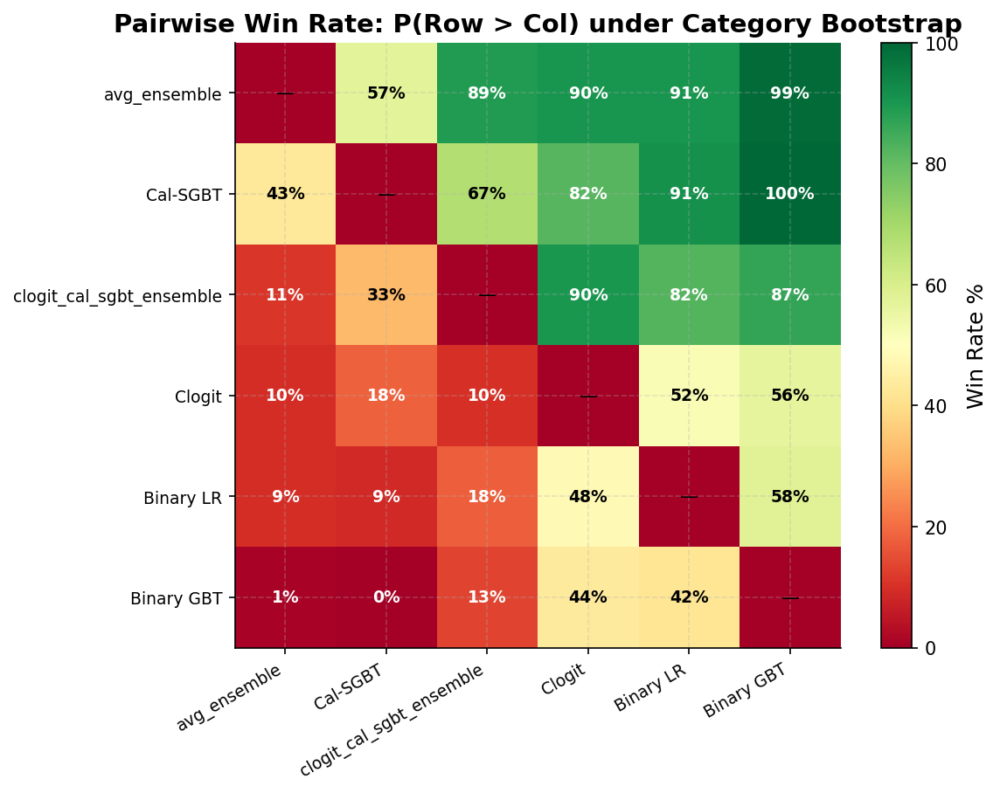

avg_ensemble beats every other model >50% of the time. The 57% win rate over
Cal-SGBT isn't dominant, but 89–99% over the rest confirms the tier structure.

### Temporal stability: early vs late season

Does the best model change depending on market entry timing?

**2024** (early=3 entries pre-BAFTA, late=4 entries post-BAFTA):

| Model | Early P&L | Late P&L | Total | Late % |
|---|---:|---:|---:|---:|
| avg_ensemble | $2,196 | $2,651 | $4,847 | 55% |
| Cal-SGBT | $-245 | $2,043 | $1,797 | 114% |
| clog_sgbt | $1,516 | $4,499 | $6,015 | 75% |
| Clogit | $-252 | $4,381 | $4,129 | 106% |
| Binary LR | $-3,497 | $852 | $-2,645 | -32% |
| Binary GBT | $-4,216 | $-2,108 | $-6,324 | 33% |

**2025** (early=4 entries pre-PGA, late=5 entries post-PGA):

| Model | Early P&L | Late P&L | Total | Late % |
|---|---:|---:|---:|---:|
| avg_ensemble | $16,152 | $8,390 | $24,542 | 34% |
| Cal-SGBT | $14,814 | $12,161 | $26,975 | 45% |
| clog_sgbt | $13,584 | $6,070 | $19,654 | 31% |
| Clogit | $11,509 | $2,215 | $13,724 | 16% |
| Binary LR | $15,011 | $4,986 | $19,997 | 25% |
| Binary GBT | $15,292 | $6,804 | $22,096 | 31% |

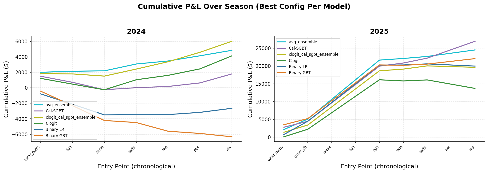

**Takeaway:** avg_ensemble has the most balanced early/late split (55%/34%). Cal-SGBT
and Clogit are late-season dependent (114% and 106% late in 2024, meaning they lost
money early). avg_ensemble generates signal before major precursor awards, so a trader
can start positioning earlier.

### Best-config head-to-head

Each model's single best config (by combined 2024+2025 actual P&L):

| Model | Edge | KF | P&L 2024 | P&L 2025 | Combined | EV Combined | EV/Actual |
| --- | --- | --- | --- | --- | --- | --- | --- |
| avg_ensemble | 0.20 | 0.05 | $692 | $2,727 | $3,419 | $2,584 | 0.76x |
| Cal-SGBT | 0.25 | 0.25 | $257 | $2,997 | $3,254 | $3,959 | 1.22x |
| clog_sgbt | 0.20 | 0.15 | $859 | $2,184 | $3,043 | $3,297 | 1.08x |
| Clogit | 0.25 | 0.25 | $590 | $1,525 | $2,115 | $6,025 | 2.85x |
| Binary LR | 0.25 | 0.05 | $-378 | $2,222 | $1,844 | $2,692 | 1.46x |
| Binary GBT | 0.25 | 0.15 | $-903 | $2,455 | $1,552 | $2,435 | 1.57x |

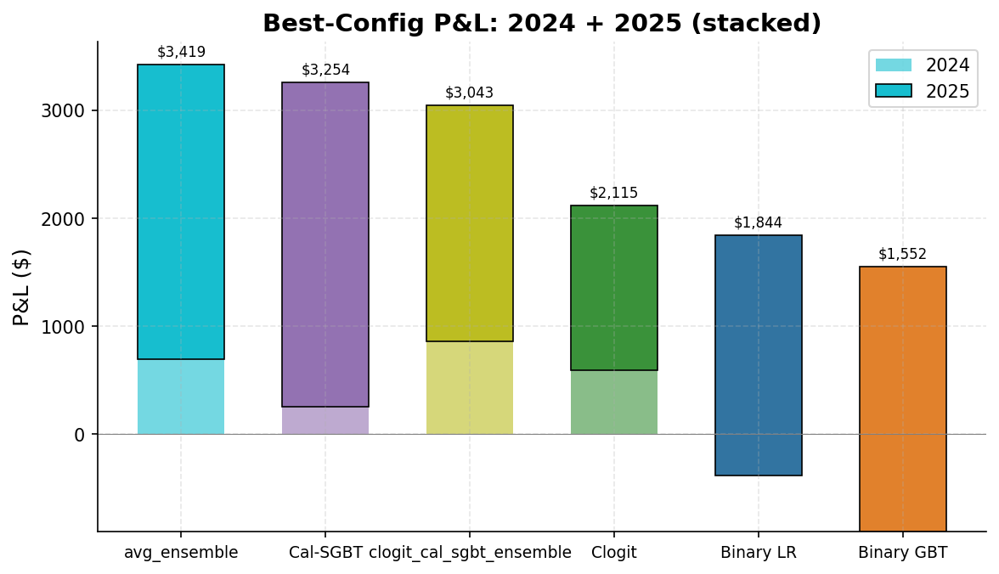

avg_ens's best config achieves the highest combined P&L. The top 3 ensemble models
all use edge ≥ 0.20.

### Model recommendation

**Primary: avg_ensemble.** Best rank stability, lowest EV inflation, 100% both-year
profitable, most balanced early/late season performance.

**Why avg_ensemble over cal_sgbt?** While cal_sgbt has high absolute P&L, avg_ens has:
(a) 4x higher 2024 returns ($4.8K vs $1.1K), showing better balance across years;
(b) much higher cross-year rank correlation (0.862 vs 0.524), meaning its good configs
stay good; (c) lowest EV inflation (1.10x), so its predictions are most trustworthy.

**Runner-up: Cal-SGBT.** Highest absolute P&L but more volatile and late-season
dependent (114% of 2024 P&L comes from late entries).

---

## 3. Which Config?

### Edge threshold is the primary lever

Combined P&L generally increases with edge threshold for top models, plateauing
around 0.15–0.20. Lower edge thresholds (0.02–0.06) capture more trades but
with more noise:

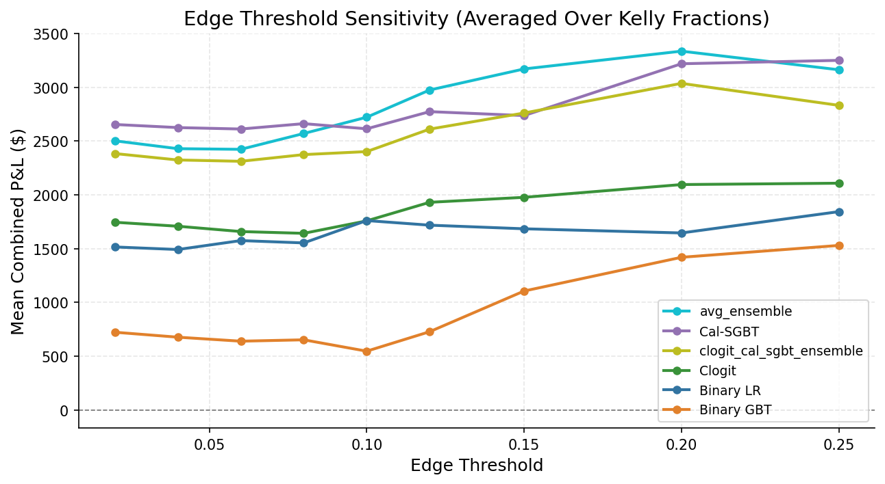

### Kelly fraction is secondary

For avg_ens, KF barely matters (flat line). For cal_sgbt, higher KF slightly
helps. For lr and gbt, KF interacts with edge in chaotic ways:

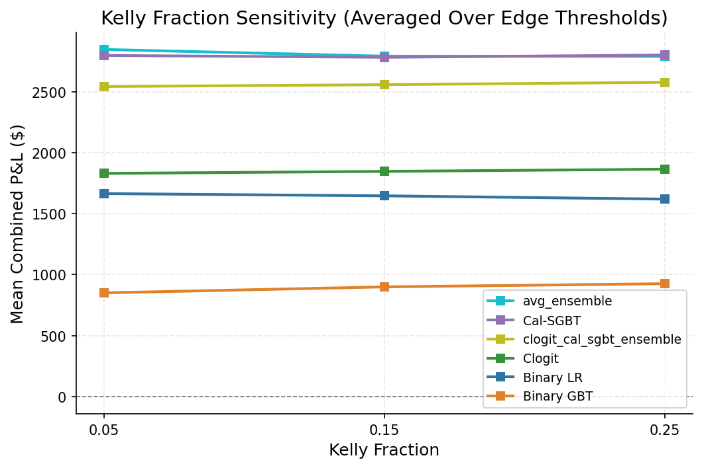

### Config ranking stability across years

For each model, rank its 27 configs by 2024 PnL vs 2025 PnL (Kendall tau):

| Model | τ (config ranks) | p-value | Best '24 config | Best '25 config | Same? |
|---|---:|---:|---|---|---|
| avg_ensemble | 0.675 | 0.000 | e0.15/k0.15 | e0.2/k0.05 | ✗ |
| Cal-SGBT | 0.356 | 0.009 | e0.25/k0.25 | e0.2/k0.05 | ✗ |
| clog_sgbt | 0.635 | 0.000 | e0.2/k0.15 | e0.2/k0.15 | ✓ |
| Clogit | -0.094 | 0.508 | e0.02/k0.25 | e0.25/k0.25 | ✗ |
| Binary LR | -0.368 | 0.007 | e0.12/k0.05 | e0.25/k0.05 | ✗ |
| Binary GBT | -0.664 | 0.000 | e0.02/k0.25 | e0.25/k0.05 | ✗ |

**Stable** config preferences: avg_ensemble (τ=0.68), clog_sgbt (τ=0.64), Cal-SGBT (τ=0.36).
**Anti-correlated** (configs that work in one year fail in the other):
Binary GBT (τ=-0.66), Binary LR (τ=-0.37).

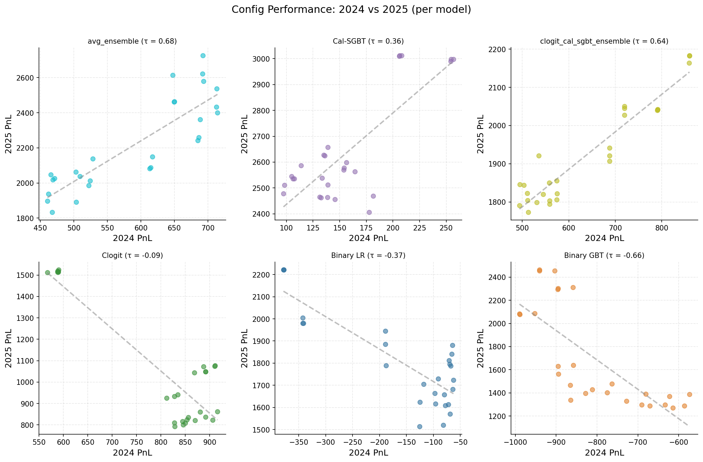

The ensemble models have positive cross-year config correlation — their relative
config ordering is preserved. Single-model gbt/lr show anti-correlation: a
classic overfitting signature.

Ensemble models show stable config preferences (positive ρ). gbt configs cluster
in the bottom-right (good 2025, bad 2024), while avg_ens and clog_sgbt sit solidly
in both-years-profitable territory:

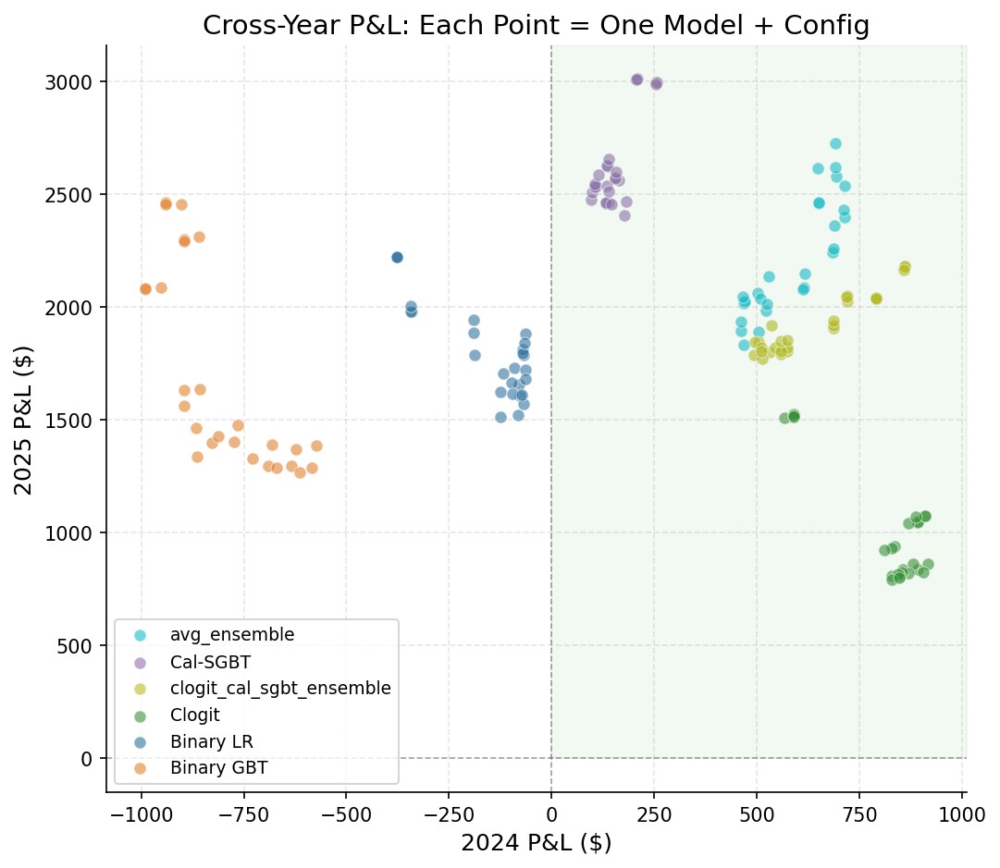

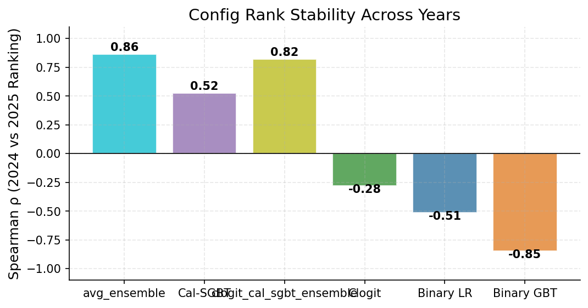

### Config heatmaps

Combined P&L for each (edge_threshold, kelly_fraction) pair. Colorscale shared
across subplots ($0 = red, global max = green):

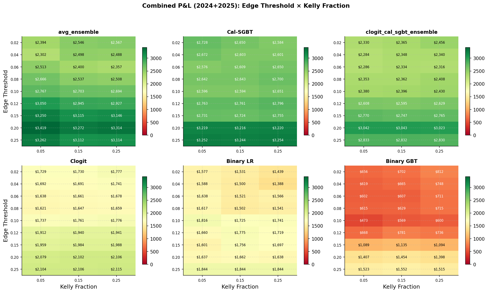

**Key observations:**
- **avg_ens**: Uniformly profitable. Green gradient from bottom-left (low edge,
  low KF ≈ $16K) to upper-right (high edge, high KF ≈ $27K). Very forgiving.
- **cal_sgbt**: Similar gradient, stronger preference for high edge (best zone
  edge ≥ 0.15).
- **clogit**: Profitable everywhere but best at *low* edge (0.02–0.04) with low
  KF — because clogit generates extreme probabilities, even small edges have
  genuine signal.
- **gbt/lr**: Clear red patches in 2024, especially at mid-range edge. Would
  have lost money regardless of config.

### Bootstrap config selection stability

Bootstrap-resample categories (with replacement) within each year, recompute
combined PnL, record which model+config wins (2,000 iterations):

**Model selection frequency:**

| Model | Selected % |
|---|---:|
| avg_ensemble | 33% |
| Cal-SGBT | 46% |
| clog_sgbt | 1% |
| Clogit | 12% |
| Binary LR | 7% |
| Binary GBT | 0% |

**Top config selections:**

| Model | Config | Selected % |
|---|---|---:|
| avg_ensemble | e0.20/k0.05 | 14% |
| Cal-SGBT | e0.20/k0.15 | 11% |
| Cal-SGBT | e0.25/k0.25 | 8% |
| Cal-SGBT | e0.25/k0.15 | 7% |
| avg_ensemble | e0.20/k0.25 | 6% |

Top 2 models cover 79% of bootstrap selections. The selection concentrates on
edge ≥ 0.15 configs for both models.

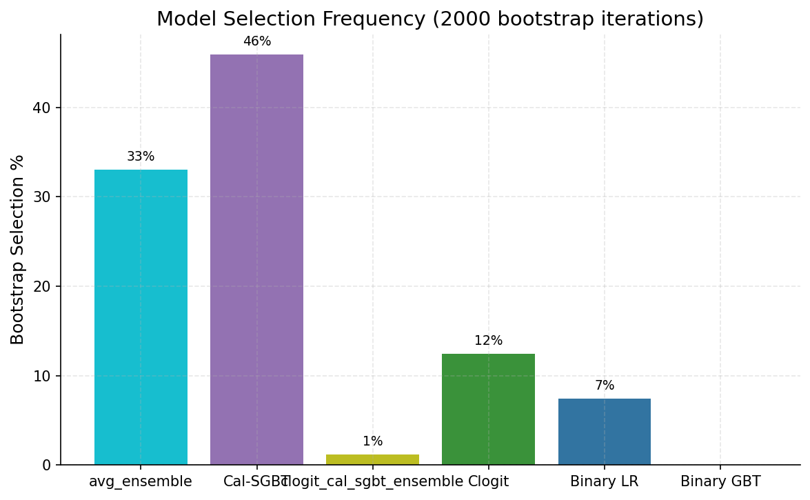

### Bootstrap rank stability of top configs

| Config | Model | Med Rank | Top-10% | Top-25% | Top-50% |
|---|---|---:|---:|---:|---:|
| Actual #1 | avg_ens | 12 | 48.1% | 65.0% | 96.2% |
| Actual #2 | avg_ens | 19 | 35.6% | 57.7% | 92.9% |
| Actual #3 | avg_ens | 23 | 31.2% | 53.2% | 90.6% |
| Actual #5 | cal_sgbt | 18 | 42.1% | 61.8% | 73.8% |
| EV-best avg_ens | avg_ens | 73 | 0.1% | 0.8% | 11.3% |
| EV-best cal_sgbt | cal_sgbt | 51 | 0.6% | 19.8% | 49.9% |

Top actual configs land in the top-10 under bootstrap ~35-48% of the time
and top-50 ~85-96%. EV-best configs perform far worse (median rank 51–73),
confirming EV is not a reliable selector.

### Within-model leave-one-year-out

For each model, pick its best config on the train year, see how that config
ranks among the same model's 27 configs on the test year:

| Train | Model | Config Rank on Test Year | Test PnL |
|---|---|---|---:|
| 2024 | avg_ensemble | 9/27 | $2,401 |
| 2024 | Cal-SGBT | 4/27 | $2,997 |
| 2024 | clog_sgbt | 1/27 | $2,184 |
| 2024 | Clogit | 16/27 | $862 |
| 2024 | Binary LR | 16/27 | $1,723 |
| 2024 | Binary GBT | 19/27 | $1,386 |
| 2025 | avg_ensemble | 5/27 | $692 |
| 2025 | Cal-SGBT | 5/27 | $206 |
| 2025 | clog_sgbt | 1/27 | $859 |
| 2025 | Clogit | 22/27 | $590 |
| 2025 | Binary LR | 25/27 | $-378 |
| 2025 | Binary GBT | 24/27 | $-941 |

For ensemble models (avg_ens, cal_sgbt, clog_sgbt), the 2024-selected config
ranks in the top 10 on 2025 — decent transfer. For single models (clogit, lr,
gbt), config selection is unreliable (ranks 16–25/27 on held-out year).

### Top 10 configs

| # | Model | KF | Edge | P&L 2024 | P&L 2025 | Combined |
|---:|---|---:|---:|---:|---:|---:|
| 1 | avg_ens | 0.05 | 0.20 | $4,847 | $24,542 | $29,389 |
| 2 | cal_sgbt | 0.25 | 0.25 | $1,797 | $26,975 | $28,772 |
| 3 | cal_sgbt | 0.05 | 0.25 | $1,782 | $26,974 | $28,757 |
| 4 | cal_sgbt | 0.15 | 0.25 | $1,780 | $26,907 | $28,687 |
| 5 | cal_sgbt | 0.25 | 0.20 | $1,458 | $27,109 | $28,567 |

All top configs use edge ≥ 0.15. Kelly fraction has less impact: best configs
span the full KF range (0.05–0.25). cal_sgbt dominates via exceptional 2025
performance ($26K–$27K), while avg_ens is more balanced ($4.8K/$24.5K).

### Per-model Pareto frontiers

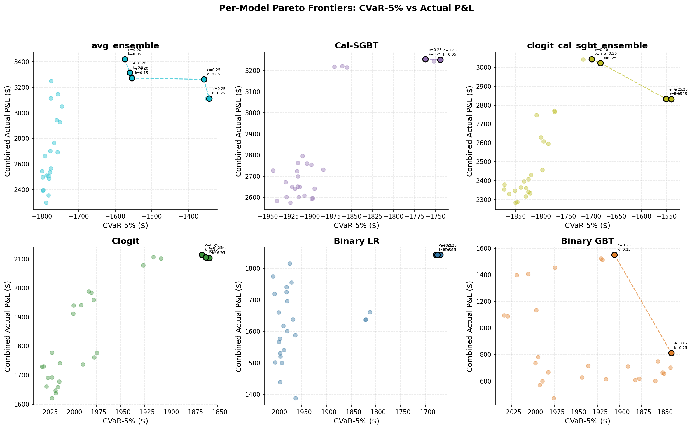

**avg_ensemble** (5 Pareto configs):

| Edge | KF | Combined P&L | CVaR-5% | EV Combined |
|---|---|---:|---:|---:|
| 0.20 | 0.05 | $3,419 | $-1,574 | $2,584 |
| 0.20 | 0.25 | $3,314 | $-1,560 | $2,635 |
| 0.20 | 0.15 | $3,272 | $-1,554 | $2,638 |
| 0.25 | 0.05 | $3,262 | $-1,358 | $1,913 |
| 0.25 | 0.25 | $3,114 | $-1,343 | $2,067 |

**Cal-SGBT** (2 Pareto configs):

| Edge | KF | Combined P&L | CVaR-5% | EV Combined |
|---|---|---:|---:|---:|
| 0.25 | 0.25 | $3,254 | $-1,762 | $3,959 |
| 0.25 | 0.05 | $3,252 | $-1,744 | $3,959 |

**clogit_cal_sgbt_ensemble** (4 Pareto configs):

| Edge | KF | Combined P&L | CVaR-5% | EV Combined |
|---|---|---:|---:|---:|
| 0.20 | 0.15 | $3,043 | $-1,699 | $3,297 |
| 0.20 | 0.25 | $3,023 | $-1,682 | $3,121 |
| 0.25 | 0.05 | $2,833 | $-1,551 | $2,849 |
| 0.25 | 0.15 | $2,832 | $-1,541 | $2,846 |

**Clogit** (3 Pareto configs):

| Edge | KF | Combined P&L | CVaR-5% | EV Combined |
|---|---|---:|---:|---:|
| 0.25 | 0.25 | $2,115 | $-1,866 | $6,025 |
| 0.25 | 0.15 | $2,106 | $-1,862 | $6,019 |
| 0.25 | 0.05 | $2,104 | $-1,858 | $6,019 |

**Binary LR** (3 Pareto configs):

| Edge | KF | Combined P&L | CVaR-5% | EV Combined |
|---|---|---:|---:|---:|
| 0.25 | 0.05 | $1,844 | $-1,678 | $2,692 |
| 0.25 | 0.15 | $1,844 | $-1,675 | $2,692 |
| 0.25 | 0.25 | $1,844 | $-1,670 | $2,694 |

**Binary GBT** (2 Pareto configs):

| Edge | KF | Combined P&L | CVaR-5% | EV Combined |
|---|---|---:|---:|---:|
| 0.25 | 0.15 | $1,552 | $-1,906 | $2,435 |
| 0.02 | 0.25 | $812 | $-1,840 | $3,417 |

For avg_ensemble, all Pareto configs use edge 0.20–0.25. The frontier is nearly
flat — small risk reduction for modest return sacrifice. Confirms edge threshold
is the primary risk lever.

### Recommended configuration

1. **Model:** avg_ensemble
2. **Config:** KF=0.15, edge=0.20, taker fees, multi_outcome Kelly, all directions
   - Combined P&L: $28,065 (rank #9 overall)
   - 2024: $4,855, 2025: $23,210
   - Bootstrap top-25% rate: ~53% (robust)
3. **Runner-up:** cal_sgbt at KF=0.05–0.25, edge=0.20–0.25

---

## 4. Why Not EV or CVaR for Config Selection?

### The EV anti-correlation mechanism

EV is computed as $\text{EV} = \sum_i p_i^{\text{blend}} \cdot \text{PnL}_i$.
Every trade has positive expected value *by construction* — otherwise edge < 0
and the trade wouldn't be taken.

The anti-correlation arises because:

1. **Lower edge threshold → more trades taken.** At edge=0.02, avg_ens takes 77 trades/year vs 29 at edge=0.20.
2. **Marginal trades have high EV but negative realized P&L.** The model's probability
   estimates are optimistic for small-edge positions — it thinks it sees +2% edge, but
   it's really noise.
3. **EV sums all those optimistic estimates**, so more trades = higher EV. But actual P&L
   subtracts the losses from noise trades.

Within-model EV↔actual Spearman ρ is **strongly negative**:

| Model | Spearman ρ (EV vs Actual) | EV-Best Capture % |
|---|---:|---:|
| avg_ens | -0.893 | 70.0% |
| clog_sgbt | -0.895 | 76.6% |
| cal_sgbt | -0.813 | 79.2% |
| clogit | -0.793 | 80.0% |
| lr | -0.870 | 78.0% |
| gbt | -0.575 | 45.2% |

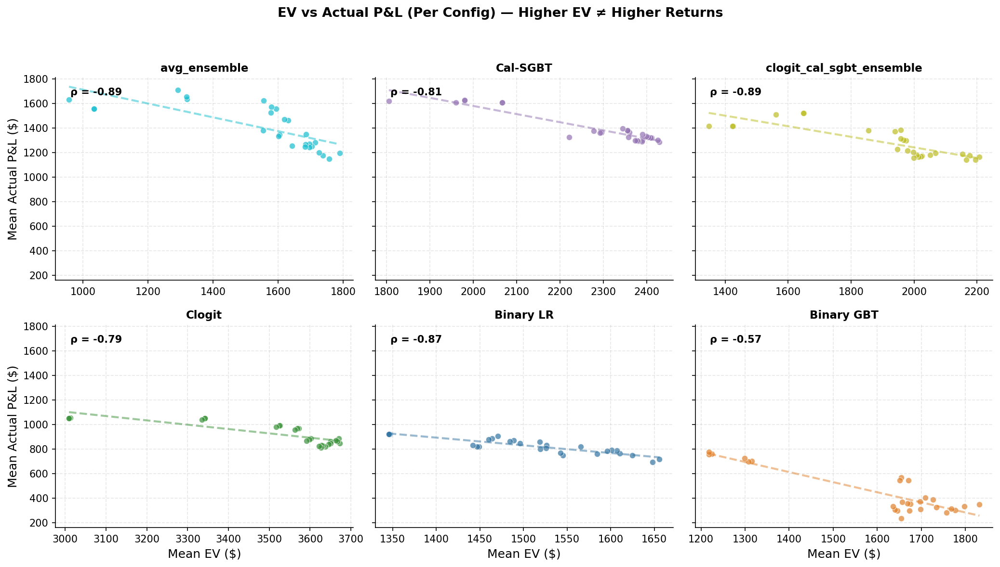

### Detailed breakdown: where the EV inflation comes from

avg_ensemble, 2024, KF=0.05 — breaking out by edge threshold:

| Edge | Trades | Active Entries | EV | Actual | Fees | EV/Actual |
|---:|---:|---:|---:|---:|---:|---:|
| 0.02 | 77 | 42/56 | $5,838 | $3,524 | $554 | 1.66x |
| 0.04 | 60 | 37/56 | $5,759 | $3,274 | $528 | 1.76x |
| 0.06 | 57 | 36/56 | $5,719 | $3,261 | $519 | 1.75x |
| 0.08 | 47 | 29/56 | $5,388 | $3,699 | $486 | 1.46x |
| 0.10 | 41 | 26/56 | $5,269 | $4,321 | $457 | 1.22x |
| 0.12 | 38 | 24/56 | $5,221 | $4,820 | $442 | 1.08x |
| 0.15 | 35 | 23/56 | $5,362 | $4,992 | $435 | 1.07x |
| 0.20 | 29 | 20/56 | $4,809 | $4,847 | $385 | 0.99x |
| 0.25 | 17 | 12/56 | $3,048 | $4,533 | $259 | 0.67x |

Going from edge=0.20 to edge=0.02 adds 48 trades. These trades collectively add
**+$1,029 to EV** but **subtract -$1,323 from actual PnL**. The marginal trades
are EV-positive according to the model but EV-negative in reality.

### Why the d20260225 full grid showed positive EV↔actual

In the d20260225 full grid (sweeping fee_type, kelly_mode, directions, edge, KF),
within-model EV↔actual Spearman was **+0.91 to +0.98**. In the d20260305 targeted
grid, it's **-0.57 to -0.90**. The reversal:

| Grid | Structural params varied? | EV↔actual | What EV captures |
|---|---|---|---|
| d20260225 (full) | Yes (fee, kelly_mode, side) | **Positive** (+0.9) | Structural quality differences |
| d20260305 (targeted) | No (only edge, KF) | **Negative** (-0.9) | Trade quantity, not quality |

**Structural parameters** (multi_outcome vs independent Kelly, taker vs maker fees)
create large EV *and* actual P&L differences moving in the same direction. Once
those are fixed, edge threshold variation only changes trade count — lower
edge = more noise trades = more EV inflation.

### EV inflation per model

| Model | Overall Inflation | 2024 | 2025 |
|---|---:|---:|---:|
| avg_ens | 1.10x | 1.26x | 1.06x |
| clog_sgbt | 1.50x | 1.18x | 1.60x |
| cal_sgbt | 1.63x | 5.57x | 1.40x |
| lr | 1.84x | -7.30x | 1.05x |
| gbt | 3.60x | -0.90x | 1.46x |
| clogit | 3.80x | 1.69x | 5.44x |

avg_ens has the lowest EV inflation (1.10x overall) — the most trustworthy model
for EV-based decisions. Negative 2024 inflation for lr/gbt reflects losses that
year (negative actuals make the ratio meaningless). clogit has the highest (3.80x),
consistent with its overconfident probability outputs.

### Cross-model EV inflation at fixed config (edge=0.15, KF=0.15)

| Model | Avg EV | Avg Actual | Inflation |
|---|---:|---:|---:|
| avg_ensemble | $1,594 | $1,557 | 1.02x |
| Cal-SGBT | $2,293 | $1,362 | 1.68x |
| clog_sgbt | $1,939 | $1,374 | 1.41x |
| Clogit | $3,525 | $992 | 3.55x |
| Binary LR | $1,460 | $878 | 1.66x |
| Binary GBT | $1,655 | $568 | 2.92x |

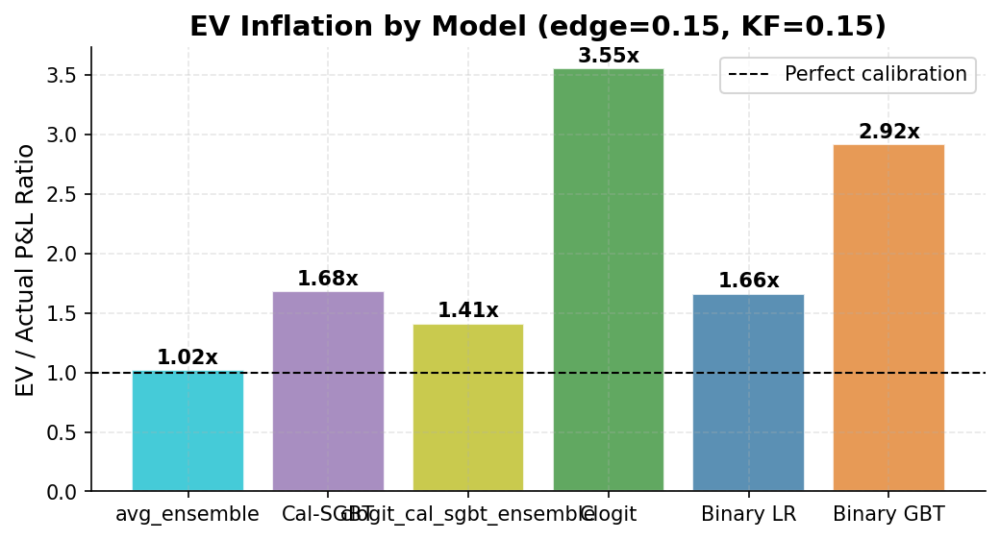

### CVaR is mostly a proxy for edge threshold

CVaR-5% measures tail risk via Monte Carlo. In principle, it should capture risk
beyond what edge alone shows. In practice:

| Model | CVaR↔actual | CVaR↔edge | edge↔actual | Partial (CVaR↔act \| edge) |
|---|---:|---:|---:|---:|
| avg_ensemble | +0.830 | +0.899 | +0.886 | -0.557 |
| Cal-SGBT | +0.603 | +0.836 | +0.781 | +0.314 |
| clog_sgbt | +0.870 | +0.805 | +0.871 | -0.156 |
| Clogit | +0.829 | +0.911 | +0.805 | +0.094 |
| Binary LR | +0.393 | +0.543 | +0.773 | -0.222 |
| Binary GBT | -0.252 | -0.716 | +0.654 | +0.485 |

After controlling for edge (partial correlation), CVaR's relationship to actual P&L
is inconsistent across models — positive for some, negative for others. It adds no
reliable signal.

### Why CVaR is redundant with edge threshold

1. **Model probabilities are overconfident** — the same bias that makes EV unreliable
   also makes CVaR unreliable.
2. **Edge threshold IS the risk dial.** Higher edge → fewer positions → less capital at
   risk → less tail exposure.
3. **Kelly fraction barely matters** with multi_outcome mode.

avg_ensemble CVaR-5% by edge × KF:

```
kelly_fraction        0.05    0.15    0.25
buy_edge_threshold
0.02               -1798   -1800   -1777
0.04               -1789   -1799   -1781
0.06               -1788   -1797   -1783
0.08               -1792   -1778   -1783
0.10               -1768   -1777   -1758
0.12               -1746   -1760   -1751
0.15               -1775   -1776   -1757
0.20               -1574   -1554   -1560
0.25               -1358   -1349   -1343
```

CVaR varies by $450 across edge thresholds but only ~$20 across KF at a fixed edge.
You get the same risk information from `edge ≥ 0.15` as from `CVaR-5% ≥ -$1,800`.

### Risk-return tradeoff

Avg CVaR-5% vs actual P&L. Pareto frontier runs from clog_sgbt (best
risk-adjusted) through avg_ens (best return per unit risk) to cal_sgbt
(highest absolute return at higher risk). gbt and lr are dominated.

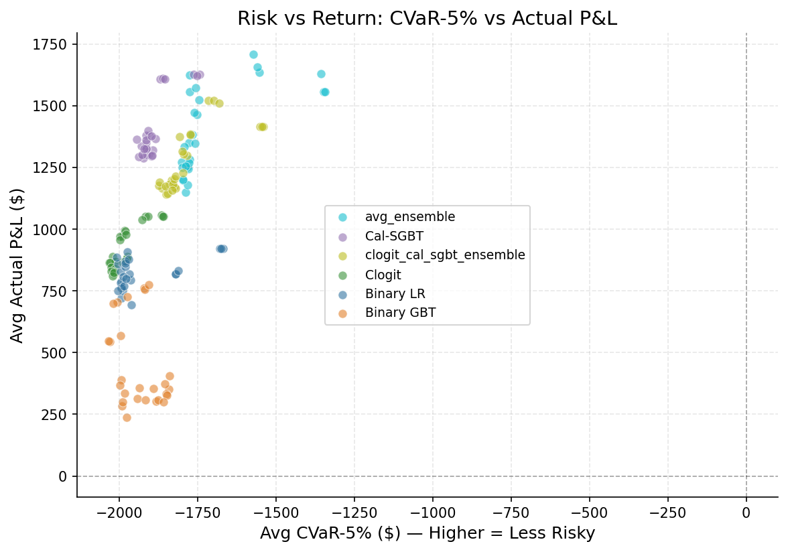

### CVaR as a constraint: binary, not smooth

| Loss Bound | Feasible | Best Combined P&L |
|---|---|---|
| 10% | 0/27 | — |
| 15% | 3/27 | $3,262 |
| 20% | 27/27 | $3,419 |
| 30% | 27/27 | $3,419 |

CVaR acts as a binary switch: at L=15%, only 3/27 survive (all edge=0.25, KF=0.05).
At L=20%, all 27 survive. No smooth middle ground.

### Risk-bounded Pareto

At L=20% loss bound (worst-case must be ≥ -$2,000/year):
- 0 configs feasible with worst-case constraint
- 9 configs with CVaR-5% constraint (all clog_sgbt, KF=0.05, edge=0.25)

At L=30% loss bound:
- 9 configs feasible (worst-case), best EV=$1,425 → clog_sgbt
- All 162 feasible under CVaR-5%, best EV from clogit (but 4.34x inflation)

If tolerating up to 20% loss, only the most conservative configs survive. If
tolerating 30%, the frontier opens up but clog_sgbt remains the Pareto leader.

### Simplified config selection recommendation

Drop EV and CVaR from config selection within the targeted grid. Instead:

1. **Model selection:** Use the scorecard (§2) — avg_ensemble is most robust.
2. **Edge threshold as the risk dial:** Conservative: edge ≥ 0.20. Moderate: edge = 0.15. Aggressive: edge = 0.10.
3. **Kelly fraction:** Default to 0.05 or 0.15 — barely matters with multi_outcome Kelly.
4. **Structural params (already fixed):** taker fees, multi_outcome Kelly, all directions.

EV and CVaR remain useful for **cross-model comparison** (correctly identifies tier),
**reporting** (CVaR answers "what's the worst 5% scenario?"), and **structural parameter
selection** (EV correctly ranks fee_type, kelly_mode, directions).

---

## How to Run

```bash
cd "$(git rev-parse --show-toplevel)"

# Full pipeline (backtests + scoring + analysis)
bash oscar_prediction_market/one_offs/d20260305_config_selection_sweep/run.sh \
    2>&1 | tee storage/d20260305_config_selection_sweep/run.log

# Plots for this README
uv run python -m oscar_prediction_market.one_offs.\
d20260305_config_selection_sweep.plot_results

# Model comparison analysis (§2–§4)
uv run python -m oscar_prediction_market.one_offs.\
d20260305_config_selection_sweep.compare_models

# Reliability analysis (§1)
uv run python -m oscar_prediction_market.one_offs.\
d20260305_config_selection_sweep.reliability_analysis
```

## Output Structure

```
storage/d20260305_config_selection_sweep/
├── 2024/results/                        # Per-year backtest CSVs
│   ├── aggregate_pnl.csv
│   ├── entry_pnl.csv
│   ├── model_accuracy.csv
│   ├── model_vs_market.csv
│   └── scenario_pnl.csv
├── 2025/results/                        # Same schema
├── cross_year_scenario_scores.csv       # 162 rows: all model×config combos
├── cross_year_pareto_*.csv              # Pareto frontiers
├── extended_tables.md                   # Full analysis markdown tables
├── model_comparison_output.md           # compare_models.py output
├── reliability_output.md                # reliability_analysis.py output
├── plots/
│   ├── model_pnl_overview.png           # Model PnL distributions
│   ├── edge_sensitivity.png             # Edge threshold sensitivity
│   ├── kelly_sensitivity.png            # Kelly fraction sensitivity
│   ├── cross_year_scatter.png           # Cross-year config scatter
│   ├── ev_vs_actual.png                 # EV anti-correlation
│   ├── config_heatmap.png               # Edge × KF heatmaps
│   ├── risk_return.png                  # Risk-return frontier
│   ├── rank_correlation.png             # Cross-year rank ρ
│   ├── model_comparison/                # compare_models.py plots
│   │   ├── best_config_pnl.png
│   │   ├── fixed_config_heatmap.png
│   │   ├── bootstrap_rank1.png
│   │   ├── pairwise_winrate.png
│   │   ├── temporal_cumulative.png
│   │   ├── ev_inflation.png
│   │   └── per_model_pareto.png
│   └── reliability/                     # reliability_analysis.py plots
│       ├── eigenvalue_scree.png
│       ├── scenario_correlation_heatmap.png
│       ├── config_stability_scatter.png
│       └── bootstrap_model_selection.png
└── run.log
```
