# Category Allocation: EV-Proportional Bankroll Sizing Across Oscar Categories

**Storage:** `storage/d20260305_portfolio_kelly/`

Should we reallocate bankroll across Oscar award categories based on predicted
opportunity quality, instead of the current uniform $1,000/category? This
investigation evaluates 39 allocation strategies across 6 signal families,
using 2 years × 27 configs × 6 models from the config_selection_sweep.

## Bottom Line

**Yes — reallocation captures 2–4× the P&L of uniform**, but only 2 years of data
make fine-grained strategy distinctions unreliable (N_eff ≈ 1.1). All six signal
families at 100% aggressiveness substantially beat uniform.

Because 2025 has ~5× the absolute P&L of 2024, combined P&L is dominated by a
single year. We use **avg_rank** (mean of per-year ranks) as the primary metric —
it treats each year equally and better measures cross-year robustness. Combined P&L
is reported as a secondary metric showing upside magnitude.

**Strategy Card** (9 strategies at rec config: avg_ensemble, edge=0.20, KF=0.05):

| Strategy | Avg Rank | Worst Rank | Rank '24 | Rank '25 | Combined P&L | P&L '24 | P&L '25 | Boot Top-1% | Win Rate | Noise σ=1 |
|:---------|:--------:|:----------:|:--------:|:--------:|:------------:|--------:|--------:|:------------|:---------|----------:|
| oracle | — | — | — | — | $179,596 | $37,803 | $141,793 | — | — | — |
| maxedge_100 | **3.5** | 6 | 1 | 6 | $98,445 | $22,227 | $76,218 | 5.8% | 85.5% | $88,538 |
| maxabsedge_100 | **6.0** | 8 | 8 | 4 | $96,680 | $18,927 | $77,753 | 1.4% | 83.0% | $87,004 |
| capital_100 | **6.0** | 10 | 2 | 10 | $86,112 | $21,096 | $65,016 | 0.3% | 60.9% | $78,640 |
| edge_100 | **7.0** | 8 | 6 | 8 | $92,591 | $19,400 | $73,191 | 0.8% | 68.9% | $82,614 |
| npos_100 | **11.5** | 20 | 3 | 20 | $78,888 | $20,739 | $58,148 | 0.0% | 48.5% | $72,893 |
| ev_100 | **14.5** | 28 | 28 | 1 | $114,809 | $11,213 | $103,595 | 86.4% | 97.6% | $103,356 |
| equal_active | **20.5** | 25 | 16 | 25 | $67,293 | $13,707 | $53,586 | 0.0% | 34.5% | $67,293 |
| uniform | **38.0** | 38 | 38 | 38 | $29,389 | $4,847 | $24,542 | 0.0% | 0.0% | $29,389 |

Column definitions: **Avg Rank** = mean of per-year ranks (primary year-balanced metric, lower = better); **Worst Rank** = worst single-year rank; **Rank 'YY** = strategy rank within that year; **Combined P&L** = sum of both years; **Boot Top-1%** = % of 2,000 bootstrap iterations where strategy ranked #1 on combined P&L; **Win Rate** = mean pairwise bootstrap win rate; **Noise σ=1** = combined P&L with multiplicative lognormal noise injected.

**Key insight:** maxedge_100 is the most year-balanced strategy (avg_rank 3.5, top-6
in both years). ev_100 has the highest combined P&L ($115K) but ranks 28th in 2024 —
its dominance comes entirely from 2025. maxabsedge_100 (both-direction edge) ties
capital_100 at avg_rank 6.0 but with worse worst-rank (8 vs 10), confirming
YES-only edge is the better allocation signal. With N_eff ≈ 1.1, fine strategy
distinctions are near the noise floor. **Default recommendation: maxedge_100** for
robustness; ev_100 only if you believe 2025's signal magnitude is representative.

## Table of Contents

1. [Motivation](#1-motivation)
2. [Setup](#2-setup)
3. [Findings](#3-findings)
   - 3.1 [P&L is extremely concentrated](#31-pl-is-extremely-concentrated)
   - 3.2 [Signal scorecard: ev leads on combined P&L, maxedge leads on rank](#32-signal-scorecard-ev-leads-on-combined-pl-maxedge-leads-on-rank)
   - 3.3 [Strategy differences are mostly noise](#33-strategy-differences-are-mostly-noise-n_eff--11)
   - 3.4 [Cross-year rankings favor maxedge](#34-cross-year-rankings-favor-maxedge-ρ--049)
   - 3.5 [Bootstrap and pairwise analysis (combined-P&L-driven)](#35-bootstrap-and-pairwise-analysis-combined-pl-driven)
   - 3.6 [All signal strategies are noise-robust](#36-all-signal-strategies-are-noise-robust)
   - 3.7 [Entry-point robustness](#37-entry-point-robustness)
   - 3.8 [Leave-one-year-out transfer](#38-leave-one-year-out-transfer)
   - 3.9 [Config entanglement](#39-config-entanglement)
   - 3.10 [Model interactions](#310-model-interactions)
   - 3.11 [Pareto frontier](#311-pareto-frontier-reallocation-dominates-uniform)
4. [Recommendations](#4-recommendations)
5. [Caveats](#5-caveats)
6. [How to Run](#6-how-to-run)
7. [Follow-up: Both-direction edge vs YES-only edge](#follow-up-both-direction-edge-vs-yes-only-edge-for-allocation-2025-03-09)
8. [Scripts](#7-scripts)
9. [Output Structure](#8-output-structure)

## 1. Motivation

The current system gives each of 8–9 categories its own $1,000 bankroll and runs
Kelly sizing independently per category. No mechanism exists to say "allocate more
to high-edge categories." This creates two inefficiencies:

1. **Idle bankroll**: At edge=0.20, ~47% of category bankrolls go unused (no trades
   pass the threshold).
2. **Equal weighting of unequal opportunities**: P&L varies dramatically across
   categories (CV ~ 2–3). A few categories generate nearly all profit while others
   lose money or sit idle.

*Per-category P&L under uniform allocation at rec config:*

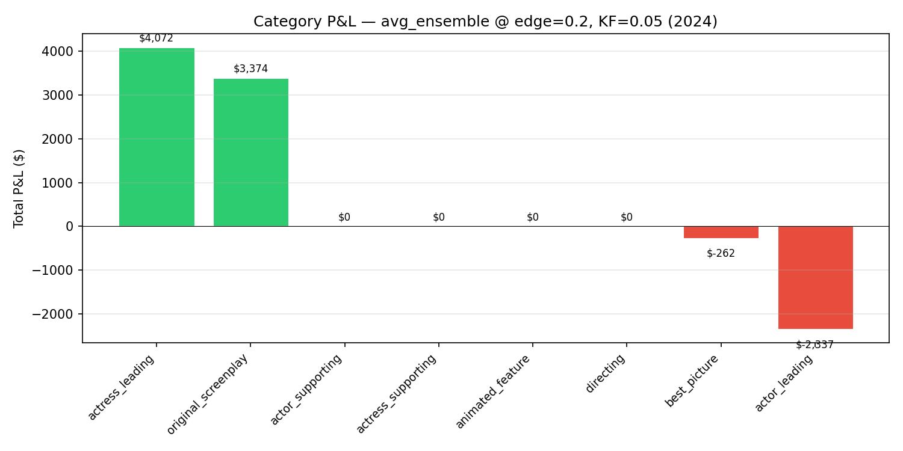
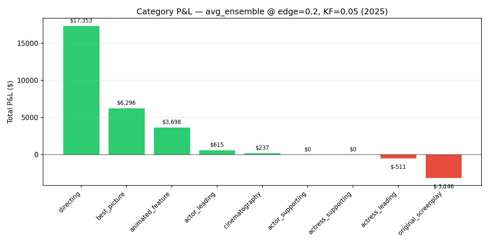

**Oracle allocation** (hindsight-optimal, giving all capital to profitable categories)
achieves $179,596 vs. uniform's $29,389 — a 6.1× gap.

*Oracle decomposition — nearly all capital concentrates on the top 2–3 categories:*

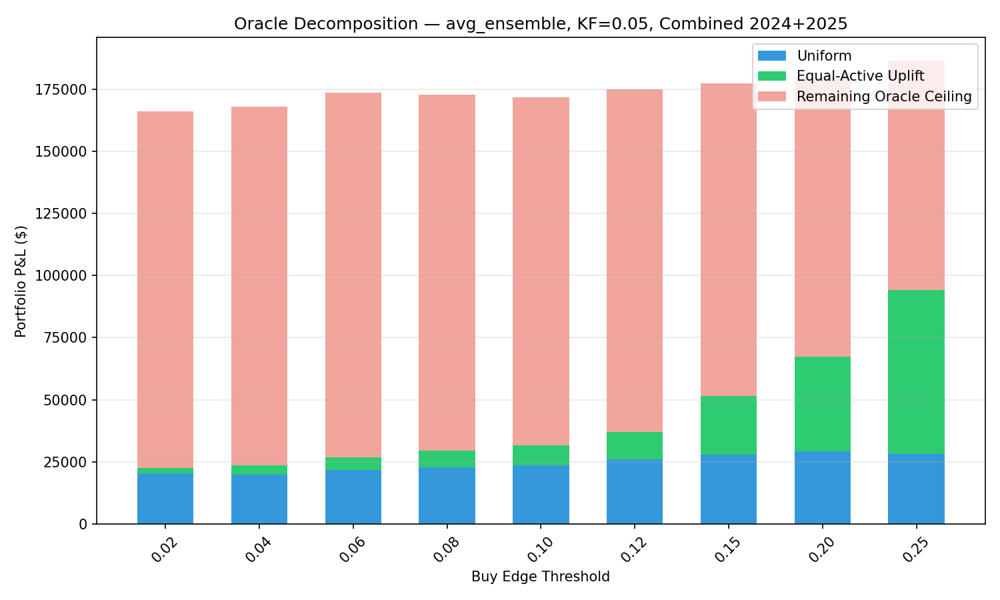

## 2. Setup

**Data source**: `storage/d20260305_config_selection_sweep/` (targeted grid, post-refactor)
- 27 configs (9 edge thresholds × 3 Kelly fractions) × 6 models = 162 combos/year
- Fixed: fee=taker, kelly_mode=multi_outcome, allowed_directions=all
- 2024: 8 categories, 7 entry snapshots; 2025: 9 categories, 9 entry snapshots

**Signal families** (5 signals × aggressiveness/cap variants = 33 strategies):

| Signal | Formula | Intuition |
|--------|---------|----------|
| `ev_pnl_blend` | `Σᵢ wᵢ · pnlᵢ` where `wᵢ = max(ev_pnl_blendᵢ, 0) / Σⱼ max(ev_pnl_blendⱼ, 0)`, restricted to active categories | Bet more capital on categories where our model expects higher P&L |
| `mean_edge` | `ē_c = mean(\|p_model − p_market\|)` of traded nominees in category `c` | Categories where we disagree more with the market on average |
| `max_edge` | `max(p_model − p_market)` across all nominees in category `c` (including untradeable) | Categories with the single largest buy-side opportunity |
| `capital_deployed` | Total capital committed to category | Categories where Kelly sizing allocated more capital |
| `n_positions` | Count of positions taken in category | Categories with more traded nominees (breadth proxy) |

#### Weight Pipeline

All signal-proportional strategies convert raw signals to category weights in 3 steps:

1. **Normalize**: `n = |categories|`. `raw_c = max(signal_c, 0) · 1[active_c] / Σⱼ max(signalⱼ, 0) · 1[activeⱼ] × n`. Active categories get signal-proportional weight; inactive get 0.

2. **Blend toward uniform** (aggressiveness `α`): `w_c = (1 − α) · 1 + α · raw_c`. At `α=0` → uniform; at `α=1` → fully signal-driven.

3. **Cap/clip**: Iteratively clip any `w_c > cap · n`, redistribute excess equally to uncapped categories.

Each signal is tested at 4 aggressiveness levels (25%, 50%, 75%, 100%) and 2 cap
levels (30%, 50%), producing ~30 prospective strategies plus `uniform`, `equal_active`
(equal weight to categories with trades), and `oracle` (hindsight) baselines.

## 3. Findings

### 3.1 P&L is extremely concentrated

| Metric | Value |
|--------|-------|
| P&L coefficient of variation | ~2–3 across years |
| Idle bankroll at edge=0.20 | ~47% of categories get zero trades |
| Oracle P&L (combined) | $179,596 |
| Uniform P&L (combined) | $29,389 |

In 2024, Best Picture alone generates ~60% of profit. In 2025, the top 3 categories
account for >80%. Idle categories are pure deadweight — they receive $1K but generate
zero trades.

*Fraction of categories with zero trades at each edge threshold:*

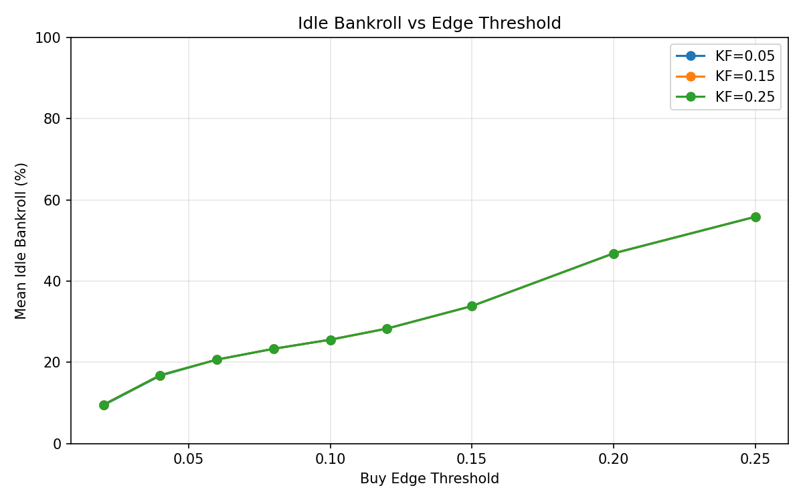

Pairwise Spearman correlations among the 5 signals are moderate (~0.5), confirming
they carry partially independent information.

*Signal correlation matrix:*

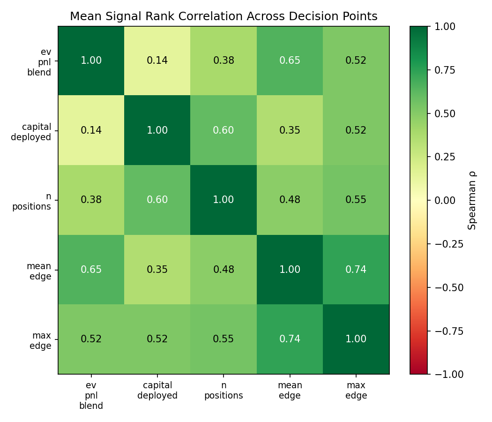

### 3.2 Signal scorecard: ev leads on combined P&L, maxedge leads on rank

For each of the 33 strategies we compute portfolio P&L at every (model × config ×
entry_snapshot × year) combination. The two views below show the tension between
combined P&L and year-balanced ranking.

**Combined P&L view** (top 5 by mean uplift across all 6 models):

| Strategy | Mean uplift (all models) | Mean uplift (avg_ens) | Best combined P&L |
|----------|------------------------:|----------------------:|-------------------:|
| ev_100 | $54K | $76K | $145K |
| maxedge_100 | $40K | $55K | $114K |
| maxabsedge_100 | $37K | $53K | $115K |
| edge_100 | $32K | $47K | $116K |
| ev_75 | $40K | $57K | $116K |
| capital_100 | $18K | $34K | $104K |

**Year-balanced rank view** (top 6 by avg_rank at rec config):

| Strategy | Rank '24 | Rank '25 | Avg Rank | Worst Rank | Combined P&L |
|:---------|:--------:|:--------:|:--------:|:----------:|:------------:|
| maxedge_100 | 1 | 6 | **3.5** | 6 | $98,445 |
| maxabsedge_100 | 8 | 4 | **6.0** | 8 | $96,680 |
| capital_100 | 2 | 10 | **6.0** | 10 | $86,112 |
| edge_100 | 6 | 8 | **7.0** | 8 | $92,591 |
| npos_100 | 3 | 20 | **11.5** | 20 | $78,888 |
| ev_100 | 28 | 1 | **14.5** | 28 | $114,809 |

**Key observations:**
- **ev_100 tops combined P&L but ranks 14.5th by avg_rank.** Its combined-P&L lead comes
  from 2025 where it ranks 1st ($104K), but it ranks 28th in 2024 ($11K) — worst
  among signal strategies.
- **maxedge_100 is the rank leader** (avg_rank 3.5, top-6 both years) with $16K less
  combined P&L. This is the year-balanced choice.
- **maxabsedge_100 (both-direction edge) ties capital_100** at avg_rank 6.0 but can't
  match maxedge. YES-only edge is the better allocation signal.
- **Higher aggressiveness strictly dominates** (100% > 75% > 50% > 25%) — blending
  toward uniform dilutes signal value. No overfitting penalty.
- **Capping hurts** — cap variants always rank below their uncapped counterpart.

*Scorecard heatmap (mean combined P&L by strategy × model):*

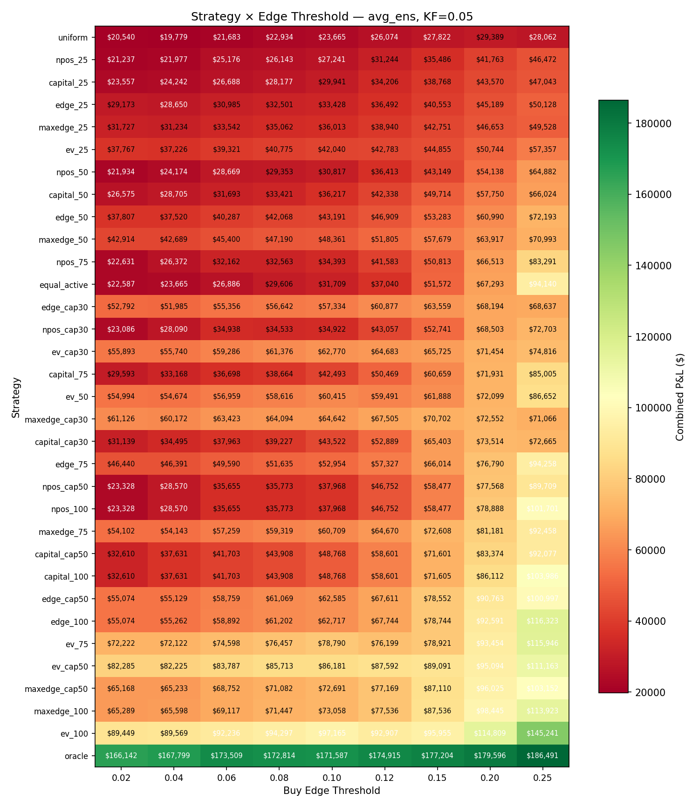

### 3.3 Strategy differences are mostly noise (N_eff = 1.1)

We decompose the strategy × scenario P&L matrix via PCA. If PC1 explains almost all
variance, strategies are essentially interchangeable. `N_eff = (Σλ)² / Σλ²`:

| N_eff variant | Value | Meaning |
|---------------|------:|---------|
| All 33 strategies | **1.1** | PC1 explains 95.7% of variance — strategies are nearly collinear |
| 5 signals at agg=100 | **1.1** | Even the most-different families are correlated |
| 324 scenarios | **1.5** | Changing model/config barely affects which allocation wins |

All strategies upweight the same "good" categories and downweight the same "bad" ones.
Market structure (few profitable categories, many idle) dominates signal choice.

**Implication**: Fine-grained strategy distinctions are unreliable. Pick from the
"roughly right" family (uncapped, high aggressiveness) rather than optimizing the
exact signal.

*Scree plot — PC1 alone accounts for 95.7%:*

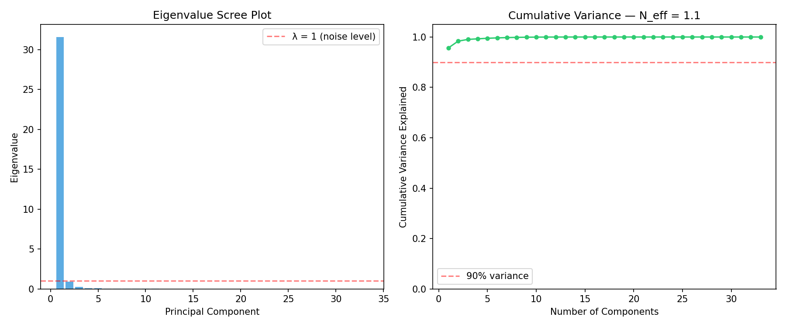

### 3.4 Cross-year rankings favor maxedge (ρ = 0.49)

We rank all 32 prospective strategies by P&L independently in each year (at rec
config), then measure Spearman ρ between the rank vectors.

| Metric | Value |
|--------|-------|
| Spearman ρ (strategy rankings, 2024 vs. 2025, rec config) | 0.487 |
| Spearman ρ (across all configs, avg_ensemble) | 0.485 |

Moderate ρ — some strategies transfer, but substantial re-ordering occurs.

*Year-specific ranks for the 6 signal strategies at agg=100:*

| Strategy | Rank '24 | Rank '25 | Avg Rank | Worst Rank |
|:---------|:--------:|:--------:|:--------:|:----------:|
| maxedge_100 | 1 | 6 | **3.5** | 6 |
| maxabsedge_100 | 8 | 4 | **6.0** | 8 |
| capital_100 | 2 | 10 | **6.0** | 10 |
| edge_100 | 6 | 8 | **7.0** | 8 |
| npos_100 | 3 | 20 | **11.5** | 20 |
| ev_100 | 28 | 1 | **14.5** | 28 |

*Scatter of 2024 rank vs. 2025 rank for all 38 strategies:*

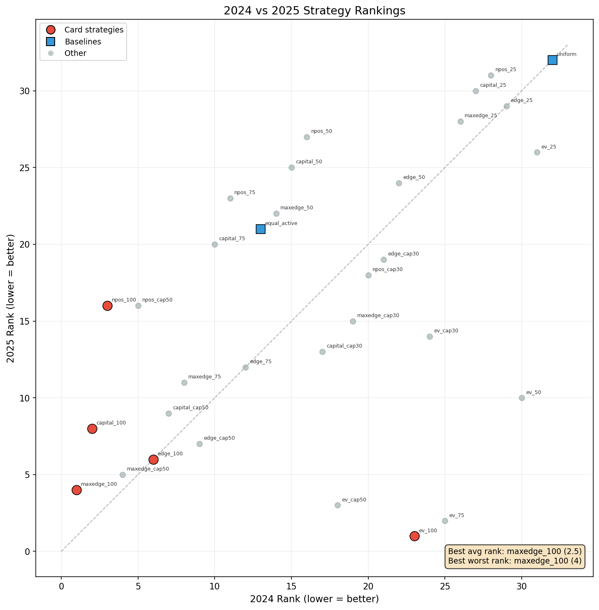

**The ev_100 vs. maxedge_100 tension:**
- **maxedge_100 is the only strategy ranking top-4 in both years.** Avg_rank resolves
  in its favor (2.5 vs. 12.0).
- **ev_100 ranks 23rd in 2024 but 1st in 2025.** Combined-year analysis favors ev_100
  only because 2025 has 5× the absolute P&L.
- **edge_100 is the most year-balanced** among top signals (rank 6 in both years).
- **Why does ev_100 do so poorly in 2024?** With 8 categories, the EV signal
  concentrates on Best Picture. Best Picture was the top category but not by enough
  to offset starving others. max_edge spreads weight more evenly — better in 2024's
  more-balanced landscape.

### 3.5 Bootstrap and pairwise analysis (combined-P&L-driven)

**Important caveat:** Bootstrap resamples categories and sums P&L across both years,
so results are dominated by 2025's ~5× larger magnitude. These analyses measure
"who has the highest combined P&L under resampling" — not year-balanced robustness.

#### Category-bootstrap rank distributions

For each of 2,000 iterations, we resample categories within each entry snapshot,
re-rank all strategies, and record the winner.

| Bootstrap type | ev_100 rank-1% | ev_100 mean rank | maxedge_100 rank-1% | maxedge_100 mean rank |
|----------------|:--------------:|:----------------:|:-------------------:|:---------------------:|
| Category resample | 86.6% | 1.4 | 6.9% | 2.9 |
| Entry-point resample | 84.0% | 2.2 | 12.9% | 2.5 |

ev_100's dominance here reflects 2025's large effect size swamping 2024's contrary
signal. In the ~14% of entry-point iterations where ev_100 doesn't rank first,
maxedge_100 typically does.

*Bootstrap rank-1 probability for the top 15 strategies:*

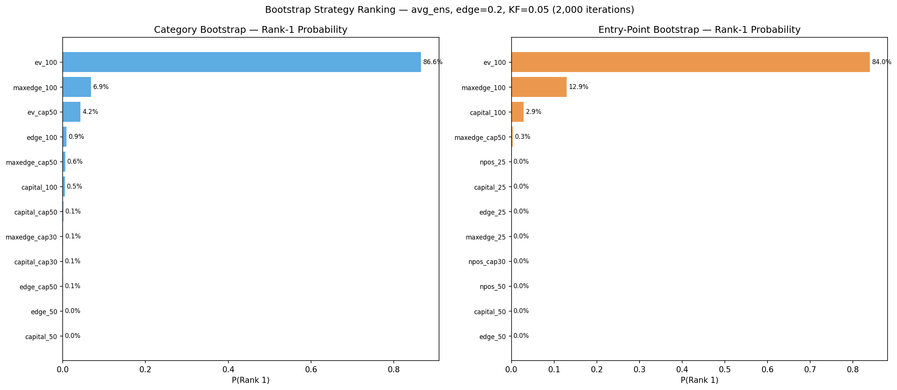

#### Pairwise win rates

For each pair of strategies we count what fraction of 2,000 bootstrap iterations
the first achieves higher combined P&L.

| Strategy | Mean win rate | vs. maxedge | vs. edge | vs. capital | vs. npos |
|:---------|:------------:|:-----------:|:--------:|:-----------:|:--------:|
| ev_100 | 98.0% | 92% | 97% | 96% | 98% |
| maxedge_100 | 88.2% | — | 88% | 99% | 100% |
| edge_100 | 75.2% | 12% | — | 78% | 92% |
| capital_100 | 67.6% | 1% | 22% | — | 96% |
| npos_100 | 53.8% | 0% | 8% | 4% | — |

Pairwise dominance mirrors the combined-P&L ordering, driven by 2025. **These
results do not override the avg_rank analysis** — maxedge_100 beats ev_100 in 8%
of iterations (those where 2024's signal dominates via category resampling).

*Pairwise win-rate heatmap:*

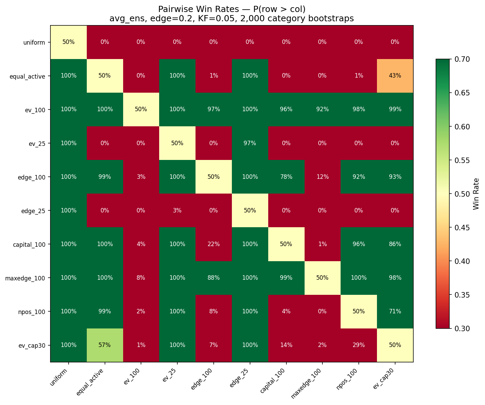

### 3.6 All signal strategies are noise-robust

We inject multiplicative lognormal noise into the raw signal before computing
weights: `s'_c = s_c · exp(ε)`, `ε ~ N(0, σ²)`. At σ=2.0 the signal is scrambled
beyond recognition. We average over 50 noise trials at rec config.

| Strategy | σ=0 | σ=0.5 | σ=1.0 | σ=2.0 | Survives σ=2? |
|:---------|----:|------:|------:|------:|:--------:|
| ev_100 | $114,809 | $110,426 | $103,356 | $90,251 | ✓ ($90K) |
| maxedge_100 | $98,445 | $94,390 | $88,538 | $79,548 | ✓ ($80K) |
| edge_100 | $92,591 | $88,333 | $82,614 | $74,638 | ✓ ($75K) |
| capital_100 | $86,112 | $82,889 | $78,640 | $72,570 | ✓ ($73K) |
| npos_100 | $78,888 | $76,023 | $72,893 | $68,841 | ✓ ($69K) |
| equal_active | $67,293 | $67,293 | $67,293 | $67,293 | baseline |
| uniform | $29,389 | $29,389 | $29,389 | $29,389 | baseline |

All 5 strategies survive complete signal scrambling and stay above equal_active.
Most of the reallocation benefit comes from **not wasting bankroll on idle
categories** ($38K over uniform) — incremental signal-based weighting adds another
$23K (ev_100 at σ=2.0 vs. equal_active).

*Noise sensitivity curves:*

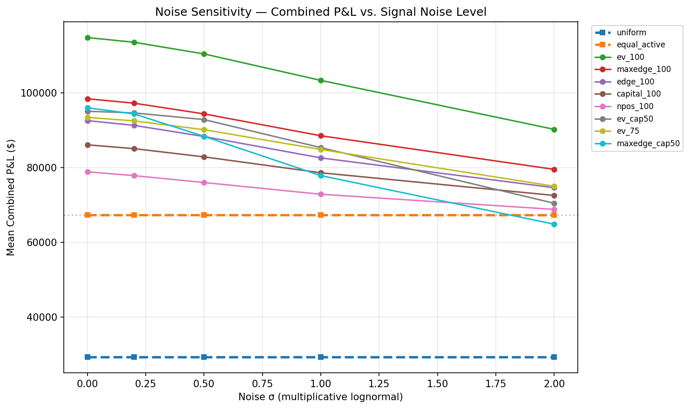

### 3.7 Entry-point robustness

Each year has multiple entry snapshots (7 in 2024, 9 in 2025). For each strategy
and entry, we compute uplift = strategy P&L − uniform P&L.

| Strategy | % entries positive | Mean uplift/entry | 2024 mean | 2025 mean |
|:---------|:------------------:|:-----------------:|:---------:|:---------:|
| ev_100 | 81% | $5,339 | $910 | $8,784 |
| maxedge_100 | 94% | $4,316 | $2,483 | $5,742 |
| edge_100 | 88% | $3,950 | $2,079 | $5,405 |
| capital_100 | 100% | $3,545 | $2,321 | $4,497 |
| npos_100 | 100% | $3,094 | $2,270 | $3,688 |

- **capital_100 and npos_100** are positive at every entry point in both years —
  the most timing-consistent strategies.
- **ev_100** has negative entries in 2024 (3 of 7) but dominates 2025.
  maxedge_100 is positive at all 7 entries in 2024 with $2,483 mean — reinforcing
  its year-balanced advantage.

*Entry-point uplift distribution by year:*

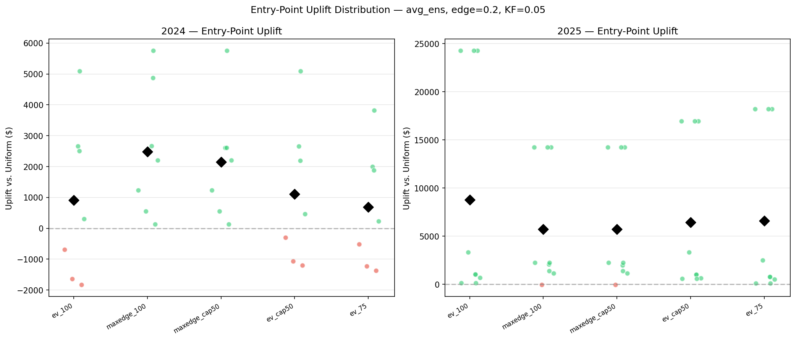

### 3.8 Leave-one-year-out transfer

We select the best strategy in year A, then evaluate on year B. "Regret" = best
possible test-year P&L − transferred strategy P&L.

| Train year | Selected (by P&L) | Test P&L | Best possible | Regret | Uplift vs. uniform |
|:----------:|:------------------:|:--------:|:-------------:|:------:|:------------------:|
| 2024 | maxedge_100 | $76,218 | $103,595 (ev_100) | $27,378 | +$51,676 |
| 2025 | ev_100 | $11,213 | $22,227 (maxedge_100) | $11,014 | +$6,367 |

Average regret: $19,196. Average uplift vs. uniform: $29,021.

**The "wrong" strategy still beats uniform** substantially — the cost of
misselection is moderate, not catastrophic. Regret is asymmetric: train-on-2024
incurs more ($27K) because ev_100's 2025 advantage is much larger than
maxedge_100's 2024 advantage.

Note that if we select by **avg_rank** instead of combined P&L, maxedge_100 would
be chosen in both directions — producing consistent (though not always P&L-maximal)
out-of-sample performance.

### 3.9 Config entanglement

Rather than fixing config first and then choosing allocation, we jointly optimize
over (edge_threshold × kelly_fraction × allocation_strategy).

| Setting | Uniform optimal | Reallocation optimal (by P&L) | Reallocation optimal (by avg_rank) |
|---------|:-:|:-:|:-:|
| Edge threshold | 0.20 | **0.25** | **0.20** |
| Kelly fraction | 0.05 | 0.05 | 0.05 |
| Best strategy | — | ev_100 | maxedge_100 |
| Combined P&L | $29K | **$145K** | $98K |
| Avg Rank | 32.0 | 4.5 | **2.5** |

- **By combined P&L**: Best triple is avg_ensemble + ev_100 + edge=0.25, KF=0.05 →
  $145K. The edge shift from 0.20 → 0.25 occurs because reallocation redirects
  bankroll from categories losing their trades to remaining active ones.
- **By avg_rank**: Best triple is avg_ensemble + maxedge_100 + edge=0.20, KF=0.05 →
  avg_rank 2.5. No config change needed — the existing edge=0.20 is already optimal.
- **29/32 prospective strategies** have a different optimal config vs. uniform.

*Heatmap of combined P&L by (edge threshold × strategy):*

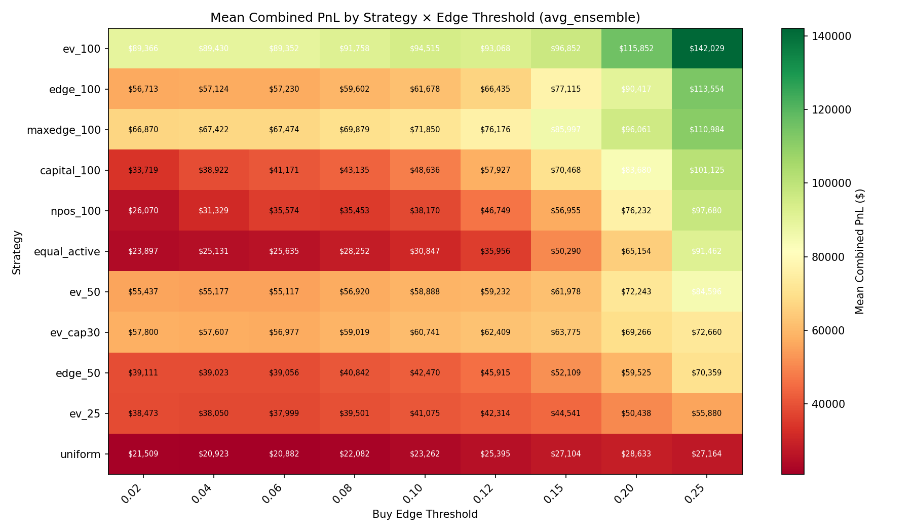

*Aggressiveness vs. optimal edge threshold — more aggressive allocation → higher
optimal edge:*

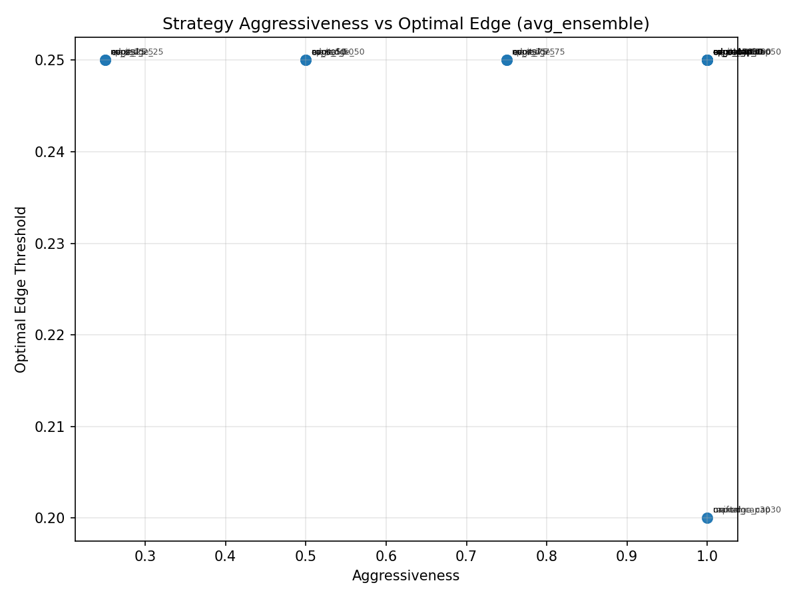

### 3.10 Model interactions

We check whether optimal allocation depends on model choice. For each model, we
find its best config under uniform allocation, then test all strategies at that
config. Results are based on combined P&L.

- **ev_100 is the best allocation for every model except clogit** (which prefers
  maxedge_100).
- **Disagreement comes entirely from clogit** — the weakest individual model with
  different category-level rankings than the ensemble.
- **For avg_ensemble, ev_100 is best by combined P&L.** By avg_rank, maxedge_100
  leads for the ensemble as well (consistent with §3.2 and §3.4).

*Model ranking shift under reallocation:*

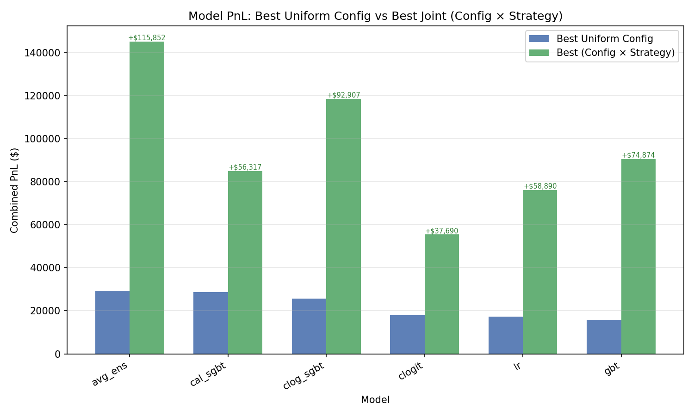

### 3.11 Pareto frontier: reallocation dominates uniform

We plot every (config × strategy) on a P&L-vs-risk plane. Risk = **MC CVaR-5%**:
for each combo, 10,000 Monte Carlo draws of Oscar-night outcomes, then the mean
P&L of the worst 5%.

**Pareto-optimal points** (14 of 270 total):

| Point | Strategy | Combined P&L | MC CVaR-5% | Avg Rank |
|-------|----------|:------------:|:----------:|:--------:|
| Safest Pareto | ev_cap30 (edge=0.08) | $58K | **$16.7K** | 16.0 |
| Best risk-adjusted | maxedge_100 (edge=0.20) | $98K | $14.4K | **2.5** |
| Best uniform | uniform | $29K | $5.8K | 32.0 |
| Highest P&L | ev_100 (edge=0.25) | **$145K** | $5.2K | 4.5 |

- **221 of 270 reallocation points dominate the best uniform** — higher P&L
  *and* higher CVaR simultaneously.
- **maxedge_100 at edge=0.20 is the best risk-adjusted pick** — best avg_rank (2.5)
  with CVaR $14.4K (2.8× ev_100's tail protection) at $98K P&L.
- **ev_100 at edge=0.25 maximizes P&L ($145K) but has the lowest frontier CVaR
  ($5.2K)** — heavy concentration means bad Oscar-night draws hit harder.
- **Moving from ev_100 → maxedge_100** trades ~$47K P&L for ~3× better tail
  protection and much better avg_rank (2.5 vs. 4.5).

*P&L vs. MC CVaR-5% for 270 points (Pareto frontier circled):*

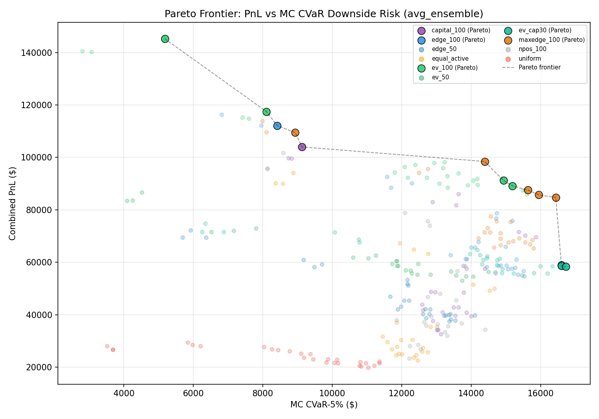

*Avg Rank vs. MC CVaR-5% for Pareto-optimal points — maxedge_100 clusters in
the top-left (best rank + good CVaR):*

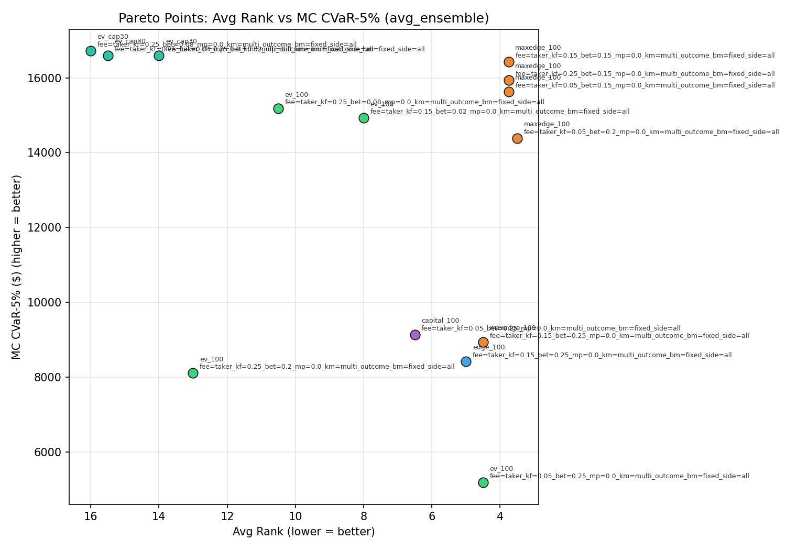

## 4. Recommendations

Three deployment options reflecting different risk appetites. **We recommend
the Robust option as the default** — it has the best year-balanced ranking,
requires no config changes, and N_eff ≈ 1.1 means fine-grained strategy
distinctions are unreliable.

### 4.1 Robust (recommended): maxedge_100 at existing config

- **Config**: avg_ensemble, edge=0.20, KF=0.05, maxedge_100 allocation
- **Performance**: $98,445 combined (3.3× uniform), avg_rank **3.5**, worst_rank 6
- **Rationale**: Best avg_rank, ranked top-6 in both years. No
  config change required. Captures 55% of the oracle gap with the best
  year-balanced robustness among all strategies. Best risk-adjusted Pareto point
  (CVaR $14.4K).
- **Risk**: $16K less combined P&L than ev_100. Lower bootstrap rank-1 (6%) —
  but bootstrap is combined-P&L-driven and 2025-dominated.

### 4.2 Aggressive: ev_100 at jointly-optimal config

- **Config**: avg_ensemble, edge=0.25, KF=0.05, ev_100 allocation
- **Performance**: $145,241 combined (4.9× uniform), avg_rank 14.5, worst_rank 28
- **Rationale**: Maximizes combined P&L. Bootstrap rank-1 86%, pairwise win rate
  98%. Best when you trust 2025's signal magnitude as representative.
- **Risk**: Rank 28 in 2024 (worst among signal strategies). Config entanglement
  (edge shifted 0.20 → 0.25). N_eff = 1.1 — the ev vs. maxedge distinction
  is near the noise floor.

### 4.3 Conservative: equal_active at existing config

- **Config**: avg_ensemble, edge=0.20, KF=0.05, equal_active allocation
- **Performance**: $67,293 combined (2.3× uniform), avg_rank 20.5
- **Rationale**: No signal computation needed — just redistribute bankroll equally
  among categories with active trades. Captures the idle-bankroll inefficiency
  without allocation model risk.
- **Risk**: Leaves substantial money on the table — all 6 agg=100 signals beat it
  even at σ=2.0 noise.

### 4.4 Implementation

Post-hoc scaling — no changes to the Kelly optimizer:

```python
# Allocate proportional to signal, restricted to active categories
signal_scores = {cat: max(signal[cat], 0) for cat in active_categories}
total_signal = sum(signal_scores.values())
n = len(all_categories)
for cat in all_categories:
    weight = (signal_scores.get(cat, 0) / total_signal) * n if total_signal > 0 else 1.0
    bankroll[cat] = base_bankroll * weight
```

## 5. Caveats

1. **Only 2 years of data** (N_eff ≈ 1.1). Fine-grained strategy distinctions are
   noise. The ev_100 vs. maxedge_100 choice is fundamentally underdetermined.

2. **Cross-year ranking flip**: maxedge_100 wins 2024, ev_100 wins 2025. Combined
   P&L is dominated by 2025's 5× larger magnitude. Avg_rank treats years equally.

3. **Config entanglement**: Optimal edge shifts 0.20 → 0.25 under reallocation
   (when optimizing for combined P&L). The existing config is safer.

4. **Bootstrap and pairwise metrics are combined-P&L-based** and therefore
   2025-dominated. They confirm ev_100's P&L leadership but don't address
   year-balanced robustness.

## 6. How to Run

```bash
cd "$(git rev-parse --show-toplevel)"

# Analysis 1: Category heterogeneity, idle bankroll, oracle decomposition
uv run python -m oscar_prediction_market.one_offs.d20260305_portfolio_kelly.analyze_categories

# Analysis 2+3: Strategy scorecard, effective N, noise sensitivity
uv run python -m oscar_prediction_market.one_offs.d20260305_portfolio_kelly.compare_signals

# Analysis 5+6: Cross-year stability, bootstrap, pairwise, LOO, entry robustness
uv run python -m oscar_prediction_market.one_offs.d20260305_portfolio_kelly.strategy_robustness

# Analysis 4: Joint config × allocation optimization, Pareto frontier
uv run python -m oscar_prediction_market.one_offs.d20260305_portfolio_kelly.joint_optimization
```

**Prerequisites**: Requires `storage/d20260305_config_selection_sweep/` with results
for both 2024 and 2025 (from config_selection_sweep one-off).

## Follow-up: Both-direction edge vs YES-only edge for allocation (2025-03-09)

**Question:** Should `max_edge` (YES-only: `model_prob - market_prob`) be replaced
by `max_abs_edge` (both directions: `max(|model_prob - market_prob|)`) as the
signal for category allocation weights? Both-direction picks up NO-side
opportunities that YES-only misses.

**Method:** Added `max_abs_edge` as a new signal in `shared.py` and reran the full
analysis pipeline (compare_signals + strategy_robustness). The new
`maxabsedge_*` strategies use `max(|model_prob - market_prob|)` per category.

### Findings: maxedge (YES-only) wins on avg_rank, the primary metric

**Strategy card comparison** (avg_ensemble, edge=0.20, KF=0.05):

| Metric | maxedge_100 | maxabsedge_100 | Winner |
|--------|:-----------:|:--------------:|--------|
| **Avg Rank** | **3.5** | 6.0 | maxedge |
| Rank 2024 | 1 | 8 | maxedge |
| Rank 2025 | 6 | 4 | maxabsedge |
| Worst Rank | 6 | 8 | maxedge |
| Combined P&L | $98,445 | $96,680 | maxedge |
| P&L 2024 | $22,227 | $18,927 | maxedge |
| P&L 2025 | $76,218 | $77,753 | maxabsedge |
| Boot Rank-1% | 5.8% | 1.4% | maxedge |
| Boot Top-3% | 60.4% | 49.1% | maxedge |
| Mean Win Rate | 85.5% | 83.0% | maxedge |
| % Entries Positive | 94% | 88% | maxedge |
| Noise σ=1.0 | $88,538 | $87,004 | ~tied |

**Scorecard comparison** (all models, 162 configs):

| Metric | maxedge_100 | maxabsedge_100 | Winner |
|--------|:-----------:|:--------------:|--------|
| Mean uplift (all models) | $40,081 | $36,722 | maxedge |
| Mean uplift (avg_ensemble) | $55,084 | $52,784 | maxedge |
| Best combined P&L | $113,923 | $114,589 | ~tied |
| Cross-year ρ (avg_ensemble) | 0.88 | 0.91 | maxabsedge |
| both_positive_pct | 100% | 100% | tied |

**Summary:** maxedge_100 beats maxabsedge_100 on the primary metric (avg_rank 3.5
vs 6.0) and on nearly every secondary metric. The gap is driven by 2024 where
maxedge ranks 1st vs maxabsedge's 8th. maxabsedge has a slight edge in 2025
(rank 4 vs 6) and cross-year ρ (0.91 vs 0.88), but these don't overcome the
2024 deficit.

At the combined P&L level the difference is only $1,765 — firmly in the
N_eff ≈ 1.1 noise floor. But avg_rank separates them by 2.5 positions,
suggesting maxedge's 2024 advantage is meaningful: YES-only edge better
identifies the *most promising* categories (which tend to have YES-side
mispricing in our data).

**Decision:** Keep `maxedge_100` (YES-only) as the recommended allocation signal.
The both-direction variant loses on avg_rank and all bootstrap/pairwise metrics.
The both-direction `max_abs_edge` is still valuable for the `Edge` model's
per-outcome analysis (which uses direction-aware edges), but for portfolio-level
category allocation, YES-only `max(model_prob - market_prob)` suffices.

## 7. Scripts

| Script | Role |
|--------|------|
| `shared.py` | Foundation: data loading, signal computation, strategy registry, portfolio evaluation |
| `analyze_categories.py` | Analysis 1: category heterogeneity, idle bankroll, oracle decomposition |
| `compare_signals.py` | Analysis 2+3: strategy scorecard, effective N (3 variants + PC1), noise sensitivity |
| `strategy_robustness.py` | Analysis 5+6: cross-year stability, bootstrap, pairwise, LOO, entry-point robustness, strategy card |
| `joint_optimization.py` | Analysis 4: joint config × allocation optimization, edge interaction, Pareto frontier |

## 8. Output Structure

```
storage/d20260305_portfolio_kelly/
├── category_heterogeneity.csv        # Per-category P&L stats, idle bankroll
├── signal_correlations.csv           # Cross-signal correlation matrix
├── signal_scorecard.csv              # Full scorecard across all strategies
├── effective_n.csv                   # Eigenvalue-based N_eff
├── noise_sensitivity.csv             # Uplift vs. noise level (10 strategies)
├── cross_year_stability.csv          # Strategy ranks + avg_rank + worst_rank
├── bootstrap_ranking.csv             # Bootstrap rank distributions
├── pairwise_winrates.csv             # Strategy vs. strategy win rates
├── leave_one_year_out.csv            # Leave-one-year-out transfer results
├── entry_point_robustness.csv        # Per-entry uplift (12 strategies)
├── model_interaction.csv             # Per-model best strategy
├── strategy_card.csv                 # 8-row summary card
└── plots/
    ├── categories/
    │   ├── category_pnl_2024.png
    │   ├── category_pnl_2025.png
    │   ├── idle_bankroll_by_edge.png
    │   ├── oracle_decomposition.png
    │   └── signal_correlations.png
    ├── signals/
    │   ├── scorecard_heatmap.png
    │   ├── effective_n_scree.png
    │   └── noise_sensitivity.png
    ├── robustness/
    │   ├── worst_rank_scatter.png
    │   ├── bootstrap_rank1.png
    │   ├── pairwise_winrate.png
    │   └── entry_uplift.png
    └── joint/
        ├── edge_strategy_heatmap.png
        ├── aggressiveness_vs_edge.png
        ├── model_ranking_shift.png
        ├── pareto_frontier.png
        └── pareto_avg_rank_vs_cvar.png
```
